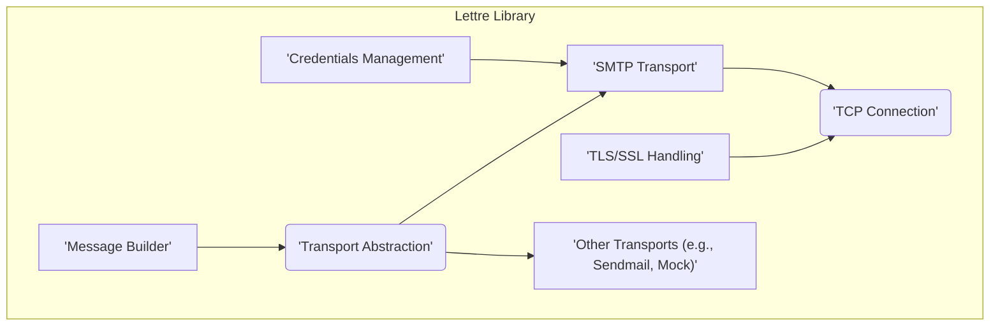
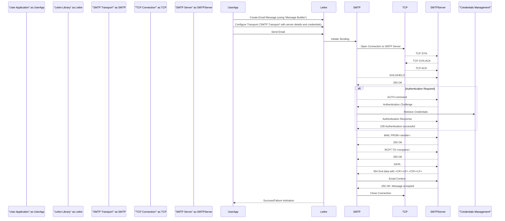

## Project Design Document: Lettre Email Library

**Version:** 1.1
**Date:** October 26, 2023
**Prepared By:** AI Software Architect

### 1. Project Overview

The `lettre` library is a Rust crate designed to facilitate email sending functionality within applications. It provides an abstraction layer over various email transmission protocols, primarily focusing on the Simple Mail Transfer Protocol (SMTP). This library aims to offer a secure, reliable, and developer-friendly interface for constructing and dispatching emails. This design document details the architectural components, data flow, and key considerations of `lettre`, serving as a foundation for subsequent threat modeling and security analysis.

### 2. Goals and Objectives

* **Reliable Email Delivery:** Ensure emails are successfully transmitted to the intended recipient's mail server, handling network interruptions and temporary failures gracefully.
* **Simplified Email Composition:** Offer an intuitive and expressive API for building email messages with various content types, headers, and attachments.
* **Secure Communication:** Implement robust security measures, including TLS/SSL encryption and secure credential handling, to protect sensitive email data during transmission.
* **Extensible Transport Mechanisms:** Provide a flexible architecture that allows for the integration of different email transport protocols beyond SMTP (e.g., Sendmail, cloud-based email services).
* **Developer-Friendly Integration:** Offer a well-documented and easy-to-use API that seamlessly integrates into existing Rust projects.
* **Maintainable and Testable Codebase:** Adhere to high coding standards and implement comprehensive testing to ensure the library's stability and maintainability.

### 3. Target Audience

This document is intended for individuals involved in the development, security, and maintenance of systems utilizing the `lettre` library. This includes:

* **Security Engineers:** To understand the library's internal workings for identifying potential security vulnerabilities and designing mitigation strategies.
* **Software Developers:** To gain a deeper understanding of the library's architecture and how to effectively utilize its components within their applications.
* **System Architects:** To evaluate the library's suitability for integration into larger systems and understand its dependencies and interactions.
* **Maintainers and Contributors:** To have a comprehensive reference for understanding the codebase and facilitating future development and bug fixes.

### 4. System Architecture

The `lettre` library employs a modular architecture, separating concerns related to message building, transport management, and security. The core components and their relationships are illustrated below:

**Components:**

* **'Message Builder':** This component provides the functionality to construct email messages programmatically. It allows setting headers (To, From, Cc, Bcc, Subject, etc.), adding content (plain text, HTML), and attaching files.
* **'Transport Abstraction':** This defines a common interface (`Transport` trait) for different email sending mechanisms. It allows users to interact with the library without being tightly coupled to a specific transport implementation.
* **'SMTP Transport':** This component implements the Simple Mail Transfer Protocol (SMTP) for sending emails over a network. It handles connection establishment, authentication, and message transmission according to the SMTP specification.
* **'TCP Connection':** This component manages the underlying Transmission Control Protocol (TCP) connection to the SMTP server. It handles socket creation, connection management, and data transfer.
* **'Credentials Management':** This component is responsible for handling SMTP authentication credentials (username and password). It provides mechanisms for securely storing and retrieving these credentials during the authentication process.
* **'TLS/SSL Handling':** This component implements Transport Layer Security (TLS) and Secure Sockets Layer (SSL) to encrypt communication with the SMTP server, protecting sensitive data from eavesdropping and tampering.
* **'Other Transports (e.g., Sendmail, Mock)':** This encompasses alternative transport implementations.
    * **'Sendmail Transport':**  Leverages the local `sendmail` executable to send emails.
    * **'Mock Transport':**  A transport implementation primarily used for testing purposes, which simulates email sending without actually transmitting emails.

### 5. Key Components and their Functionality

* **'Message Builder':**
    * Provides methods to set standard email headers like `To`, `From`, `Cc`, `Bcc`, `Subject`, and `Reply-To`.
    * Offers functionality to add email body content in various formats, including plain text and HTML.
    * Supports adding attachments with specified content types and filenames.
    * Encodes the email message according to the Multipurpose Internet Mail Extensions (MIME) standard, ensuring proper formatting and handling of different content types.
* **'Transport Abstraction':**
    * Defines the `Transport` trait with a `send` method, which takes an email message as input and attempts to deliver it.
    * Enables the creation of custom transport implementations, allowing for integration with diverse email sending services or protocols.
    * Promotes loose coupling, allowing users to switch between different transport mechanisms (e.g., from SMTP to a mock transport for testing) with minimal code changes.
* **'SMTP Transport':**
    * Establishes a TCP connection to the specified SMTP server using the provided hostname and port.
    * Initiates the SMTP handshake by sending the `EHLO` or `HELO` command and processing the server's response.
    * Implements various SMTP authentication mechanisms, such as `PLAIN`, `LOGIN`, and `CRAM-MD5`, using the provided credentials.
    * Sends the email message by issuing the `MAIL FROM`, `RCPT TO`, and `DATA` commands, adhering to the SMTP protocol sequence.
    * Handles SMTP server responses, including success codes and error codes, and propagates errors to the user.
    * Supports secure connections using TLS/SSL by delegating to the `'TLS/SSL Handling'` component.
    * Closes the TCP connection after the email has been sent or an error has occurred.
* **'TCP Connection':**
    * Creates and manages TCP sockets for communication with the SMTP server.
    * Handles connection timeouts and potential network errors during connection establishment and data transfer.
    * Provides an interface for sending and receiving data over the established TCP connection.
* **'Credentials Management':**
    * Allows users to provide SMTP server credentials (username and password) through various means, such as directly in code or via configuration.
    * May offer mechanisms for retrieving credentials from secure storage or environment variables.
    * The library itself should not persist credentials; this responsibility lies with the application using the library.
* **'TLS/SSL Handling':**
    * Negotiates a secure TLS or SSL connection with the SMTP server before transmitting any sensitive data.
    * Utilizes external crates like `rustls` or `native-tls` to handle the complexities of TLS/SSL implementation.
    * Performs server certificate verification to prevent man-in-the-middle attacks, ensuring that the client is connecting to the legitimate SMTP server.
    * Encrypts all communication between the client and the server, protecting the confidentiality of email content and credentials.
* **'Other Transports':**
    * **'Sendmail Transport':** Executes the local `sendmail` binary with the constructed email message as input. This relies on the system's `sendmail` configuration.
    * **'Mock Transport':**  Provides a way to simulate email sending without actually sending emails. This is useful for testing purposes, allowing developers to verify that the email construction and sending logic is correct without relying on an actual SMTP server.

### 6. Data Flow

The typical sequence of operations when sending an email using `lettre` follows this data flow:

**Detailed Steps:**

1. The **User Application** utilizes the `'Message Builder'` component within the **Lettre Library** to construct the email message, including headers, recipients, and content.
2. The **User Application** configures the desired transport mechanism, typically the `'SMTP Transport'`, providing necessary details such as the SMTP server address, port, and authentication credentials.
3. The **User Application** initiates the email sending process by calling a `send` method on the configured transport.
4. The **Lettre Library** delegates the sending operation to the `'SMTP Transport'` component.
5. The `'SMTP Transport'` utilizes the `'TCP Connection'` component to establish a TCP connection with the specified **SMTP Server**. This involves the standard TCP three-way handshake.
6. The `'SMTP Transport'` initiates the SMTP handshake by sending either the `EHLO` or `HELO` command to the **SMTP Server**.
7. The **SMTP Server** responds with a success code (typically 250 OK).
8. If authentication is required, the `'SMTP Transport'` sends an `AUTH` command to the **SMTP Server**.
9. The **SMTP Server** responds with an authentication challenge.
10. The `'SMTP Transport'` retrieves the necessary credentials from the `'Credentials Management'` mechanism (provided by the user application).
11. The `'SMTP Transport'` sends the authentication response to the **SMTP Server**.
12. The **SMTP Server** confirms successful authentication with a 235 success code.
13. The `'SMTP Transport'` sends the sender's email address using the `MAIL FROM` command.
14. The **SMTP Server** acknowledges the sender with a 250 OK.
15. The `'SMTP Transport'` sends each recipient's email address using the `RCPT TO` command.
16. The **SMTP Server** acknowledges each recipient with a 250 OK.
17. The `'SMTP Transport'` initiates the email data transfer with the `DATA` command.
18. The **SMTP Server** indicates it's ready to receive the email content with a 354 response.
19. The `'SMTP Transport'` sends the complete email content to the **SMTP Server**.
20. The **SMTP Server** confirms successful receipt of the email with a 250 OK message accepted code.
21. The `'SMTP Transport'` instructs the `'TCP Connection'` to close the connection to the **SMTP Server**.
22. The **Lettre Library** returns an indication of success or failure to the **User Application**.

### 7. Security Considerations (Initial)

This section outlines initial security considerations for the `lettre` library. A comprehensive threat model will build upon these points.

* **Credential Management:**
    * **Storage:** How does the application using `lettre` store SMTP credentials?  `lettre` itself should not persist credentials. The application should utilize secure storage mechanisms (e.g., password managers, encrypted configuration files).
    * **Transmission:** Ensure credentials are only transmitted over secure channels (TLS/SSL).
    * **Exposure:** Prevent accidental logging or exposure of credentials in error messages or debugging output.
* **TLS/SSL Implementation:**
    * **Protocol Version:** Enforce the use of modern and secure TLS protocol versions (TLS 1.2 or higher).
    * **Cipher Suites:**  Utilize strong and secure cipher suites.
    * **Certificate Validation:**  Strictly validate the SMTP server's certificate to prevent man-in-the-middle attacks. This includes hostname verification.
    * **Secure Defaults:** Ensure secure defaults are configured for TLS/SSL settings.
* **Input Validation:**
    * **Email Addresses:** Validate email addresses to prevent injection attacks or unexpected behavior.
    * **Headers:** Sanitize email headers to prevent SMTP header injection vulnerabilities.
    * **Content:** Be mindful of potential vulnerabilities in the email content itself, especially when handling user-provided content.
* **Dependency Management:**
    * **Vulnerability Scanning:** Regularly scan dependencies for known security vulnerabilities.
    * **Supply Chain Security:** Ensure dependencies are sourced from trusted repositories.
    * **Minimal Dependencies:** Keep the number of dependencies to a minimum to reduce the attack surface.
* **Error Handling:**
    * **Information Disclosure:** Avoid exposing sensitive information (e.g., credentials, internal paths) in error messages.
    * **Denial of Service:** Implement measures to prevent denial-of-service attacks through malformed input or excessive requests.
* **Transport Security:**
    * **Opportunistic TLS:** Consider supporting opportunistic TLS (STARTTLS) where available, but ensure proper fallback mechanisms if it's not supported.
    * **Secure Transport Selection:** Guide users on selecting secure transport configurations.
* **Code Security:**
    * **Memory Safety:** Rust's memory safety features help mitigate certain classes of vulnerabilities.
    * **Regular Audits:** Conduct regular code audits to identify potential security flaws.

### 8. Deployment Considerations

When deploying applications utilizing the `lettre` library, consider the following:

* **Configuration Management:** Securely manage SMTP server details, credentials, and other configuration parameters. Avoid hardcoding sensitive information.
* **Runtime Environment:** Ensure the runtime environment has the necessary libraries and configurations for TLS/SSL support.
* **Network Security:** Secure the network communication between the application and the SMTP server.
* **Permissions:**  Ensure the application has the necessary permissions to establish network connections.
* **Rate Limiting:** Be aware of and adhere to any rate limits imposed by the SMTP server.
* **Logging:** Implement secure logging practices, avoiding the logging of sensitive information.
* **Monitoring:** Monitor email sending operations for errors and potential issues.

### 9. Dependencies

`lettre` relies on several external crates for its functionality. Key dependencies include:

* **`tokio` (or another asynchronous runtime):** For asynchronous network operations, crucial for non-blocking email sending.
* **`rustls` or `native-tls`:** For providing TLS/SSL encryption and secure communication. The choice often depends on the desired level of control and platform compatibility.
* **`mail-send` (or similar):**  For parsing and serializing email messages according to relevant standards.
* **`base64`:** For encoding data, particularly for authentication mechanisms.
* **`thiserror` or similar:** For simplifying error handling and propagation.

It is crucial to regularly review the dependencies listed in the `Cargo.toml` file for security vulnerabilities and ensure they are kept up-to-date.

### 10. Future Considerations

* **Support for more advanced authentication mechanisms:** Implementing support for newer and more secure authentication methods as they become prevalent.
* **Improved error handling and diagnostics:** Providing more granular and informative error messages to aid in debugging.
* **Integration with cloud-based email sending services:** Offering built-in transport implementations for popular services like SendGrid, Mailgun, and AWS SES.
* **Enhanced security features:** Continuously evaluating and incorporating new security best practices and mitigations. This could include features like DKIM signing or SPF record validation.
* **Metrics and monitoring capabilities:**  Adding features to expose metrics related to email sending success and failures.

This improved design document provides a more detailed and comprehensive overview of the `lettre` email library's architecture, functionality, and security considerations. This enhanced understanding will be beneficial for conducting a thorough threat model and ensuring the secure and reliable operation of systems utilizing this library.