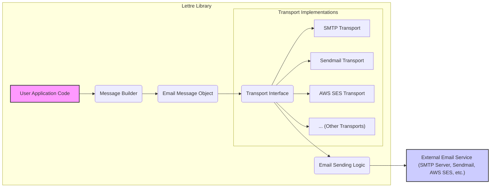
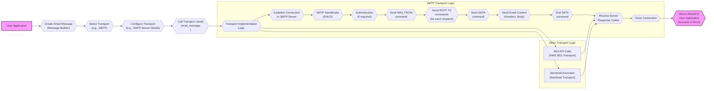

# Project Design Document: Lettre - Email Sending Library

## 1. Project Overview

### 1.1. Project Name
Lettre

### 1.2. Project Description
Lettre is a robust and versatile email sending library for the Rust programming language. It is designed to simplify the process of sending emails from Rust applications by providing a modular and extensible architecture. Lettre supports various email transport protocols and offers a user-friendly API for constructing complex and feature-rich emails.

### 1.3. Project Goals
* To provide a comprehensive, production-ready email sending solution for Rust developers.
* To support a wide range of email transport methods, including SMTP, Sendmail, and cloud-based services like AWS SES.
* To offer an intuitive and ergonomic API for building emails with rich content, attachments, and headers.
* To prioritize security best practices in email handling, transmission, and configuration.
* To maintain a highly modular design that allows for easy extension and integration of new transports and features.
* To ensure cross-platform compatibility and performance.

### 1.4. Target Audience
Rust software developers who need to integrate email sending functionality into their applications. This includes developers working on:
* Web applications and services
* Command-line tools and utilities
* Background task processors and daemons
* Libraries and frameworks that require email notification capabilities

## 2. System Architecture

### 2.1. High-Level Architecture Diagram



### 2.2. Component Description

* **User Application Code**: This represents the Rust application that utilizes the Lettre library. It interacts with Lettre's API to define email content, choose a transport method, configure transport settings, and initiate the email sending process.
* **Message Builder**: This component provides a fluent and type-safe API for constructing `EmailMessage` objects. It allows users to easily specify email attributes such as sender, recipients, subject, body (plain text and HTML), attachments, custom headers, and more.
* **Email Message Object**: This object encapsulates all the data and metadata of an email message. It is the central data structure within Lettre, holding information about the sender, recipients, content, and various email properties, ready to be processed by a transport.
* **Transport Interface**: This is defined by the `Transport` trait in Lettre. It acts as an abstraction layer, defining a common interface for all email sending mechanisms. This allows the user application to interact with different transports (SMTP, Sendmail, SES, etc.) in a uniform way.
* **Transport Implementations**: These are concrete implementations of the `Transport` interface, each responsible for sending emails using a specific protocol or service.
    * **SMTP Transport**: Implements email sending via the Simple Mail Transfer Protocol (SMTP). It handles connection management, SMTP handshake, authentication, command execution, and secure communication (TLS/SSL).
    * **Sendmail Transport**: Leverages the local system's `sendmail` binary (or a compatible mail transfer agent) to send emails. It provides a simple interface to utilize the system's configured mail infrastructure.
    * **AWS SES Transport**: Integrates with Amazon Simple Email Service (SES) to send emails through AWS's cloud-based email service. It handles authentication and interaction with the AWS SES API.
    * **... (Other Transports)**:  This indicates the extensibility of Lettre to support additional transport mechanisms in the future, such as Postfix direct submission, Exim, or integrations with other cloud email providers.
* **Email Sending Logic**: This refers to the core logic within each transport implementation that manages the actual process of sending an email. It includes tasks like message serialization, network communication, protocol-specific command sequences, error handling, and response processing.
* **External Email Service**: This represents the external system or service responsible for the final delivery of the email. It could be an SMTP server operated by a mail provider, the local `sendmail` program, or a cloud email service like AWS SES. Lettre interacts with these services to relay the email for delivery.

### 2.3. Key Modules

* **`transport`**: Contains the `Transport` trait definition and implementations for various email sending methods (e.g., `smtp`, `sendmail`, `ses`, `file`). This module is responsible for the core email delivery abstractions.
* **`message`**: Defines the `EmailMessage` struct, representing an email, and related structures for email parts, attachments, and headers. It also includes the `MessageBuilder` for constructing emails.
* **`address`**: Handles parsing, validating, and representing email addresses according to RFC standards. Ensures correct handling of sender and recipient addresses.
* **`smtp`**: Specifically for the SMTP transport implementation. Includes modules for connection management, session handling, authentication mechanisms (PLAIN, LOGIN, CRAM-MD5), and SMTP command processing.
* **`sendmail`**: Implements the Sendmail transport, focusing on interaction with the local `sendmail` executable.
* **`ses`**: Provides the AWS SES transport implementation, handling API interactions with Amazon SES.
* **`error`**: Defines custom error types used throughout the library for consistent and informative error reporting.
* **`builder`**: Contains the `MessageBuilder` struct and its methods, offering a fluent interface for email construction.
* **`header`**: Deals with email header manipulation, parsing, and construction, adhering to email header standards.
* **`mime`**: Handles MIME (Multipurpose Internet Mail Extensions) related operations, including MIME type detection, encoding, and handling of multipart emails and attachments.
* **`file_transport`**: (Potentially) Includes transports that involve file system operations, such as saving emails to files instead of sending them over a network.

## 3. Data Flow

### 3.1. Email Sending Process Flowchart



### 3.2. Data Flow Description

1. **Email Creation**: The process begins with the user application utilizing the `MessageBuilder` API to construct an `EmailMessage` object. This involves defining all aspects of the email, such as sender and recipient addresses, subject line, email body (both plain text and HTML versions can be included), attachments, and any custom headers required.
2. **Transport Selection and Configuration**: The application then selects an appropriate `Transport` implementation based on the desired email sending method. This could be `SmtpTransport` for sending via an SMTP server, `SendmailTransport` for using the local `sendmail` utility, or `SesTransport` for leveraging AWS SES. The chosen transport is configured with necessary details. For example, `SmtpTransport` requires SMTP server address, port, and potentially authentication credentials. `SesTransport` needs AWS credentials and region information.
3. **Email Sending Initiation**: The user application initiates the email sending process by calling the `send()` method on the configured `Transport` instance, passing the constructed `EmailMessage` object as an argument.
4. **Transport Logic Execution**: The selected transport implementation takes control and executes the specific logic for sending the email.
    * **SMTP Transport Logic**:
        * **Connection Establishment**: Establishes a network connection to the configured SMTP server, potentially using TLS/SSL for secure communication.
        * **SMTP Handshake**: Initiates an SMTP handshake with the server using the `EHLO` command to identify itself and negotiate capabilities.
        * **Authentication**: If required by the SMTP server, performs authentication using configured credentials and a supported authentication mechanism (e.g., PLAIN, LOGIN, CRAM-MD5).
        * **Recipient and Sender Declaration**: Sends SMTP commands to declare the sender (`MAIL FROM`) and recipients (`RCPT TO`) of the email.
        * **Data Transmission**: Initiates the email data transmission phase with the `DATA` command. Then, it sends the serialized email content, including headers and body, according to SMTP protocol specifications.
        * **Data Termination**: Signals the end of the email data with the appropriate SMTP sequence (e.g., `<CRLF>.<CRLF>`).
        * **Response Handling**: Receives and processes SMTP response codes from the server to determine the success or failure of each command and the overall sending operation.
        * **Connection Closure**: Closes the connection to the SMTP server.
    * **Other Transport Logic (Sendmail, SES, etc.)**:
        * **Sendmail Transport**: Executes the `sendmail` command, passing the serialized email message as input, relying on the system's `sendmail` configuration for delivery.
        * **SES Transport**: Uses the AWS SDK to make API calls to AWS SES, providing email content and recipient information for sending via the SES service.
5. **Result Handling**: Finally, the transport implementation returns a `Result` to the user application. This `Result` indicates whether the email was sent successfully or if an error occurred during the process. In case of success, it might include a `MessageId` if provided by the transport. The user application can then handle this result, for example, by logging success or error messages, retrying sending in case of transient errors, or informing the user about the outcome.

## 4. Key Components in Detail

### 4.1. `Transport` Trait

* **Purpose**: Defines the core interface for all email transport implementations within Lettre. It provides an abstraction layer that allows users to send emails using different methods without changing their core application logic.
* **Key Methods**:
    * `send(&self, message: &EmailMessage) -> Result<MessageId, Error>`: This is the primary method defined by the `Transport` trait. It is responsible for sending an `EmailMessage`.
        * Takes a reference to an `EmailMessage` as input, representing the email to be sent.
        * Returns a `Result` to indicate the outcome of the sending operation.
            * On success, it returns `Ok(MessageId)`, where `MessageId` is an optional identifier for the sent message (if provided by the transport).
            * On failure, it returns `Err(Error)`, containing an `Error` enum that describes the reason for failure.
* **Benefits**:
    * **Abstraction**: Decouples the user application from specific email sending protocols or services. Users can switch between transports (e.g., from SMTP to SES) by simply changing the transport implementation used, without modifying the email construction or sending initiation code.
    * **Extensibility**: Makes it easy to add support for new email transport methods. Developers can create new transport implementations by implementing the `Transport` trait.
    * **Testability**: Facilitates unit and integration testing. Transport implementations can be easily mocked or stubbed for testing purposes, allowing developers to test email sending logic in isolation.

### 4.2. `SmtpTransport`

* **Purpose**: Implements the `Transport` trait to enable sending emails via the Simple Mail Transfer Protocol (SMTP). It is designed to interact with standard SMTP servers for email delivery.
* **Functionality**:
    * **Connection Management**: Establishes and manages connections to SMTP servers, including handling connection pooling (if implemented) and reconnection logic.
    * **Secure Connections**: Supports secure connections using TLS/SSL, ensuring confidentiality and integrity of email transmission over the network. Supports both implicit TLS (connecting directly to a TLS-enabled port) and STARTTLS (upgrading an insecure connection to a secure one).
    * **SMTP Authentication**: Implements various SMTP authentication mechanisms, including PLAIN, LOGIN, and CRAM-MD5, allowing Lettre to authenticate with SMTP servers that require user credentials.
    * **SMTP Command Handling**: Handles the sequence of SMTP commands required for email delivery, including `EHLO`, `MAIL FROM`, `RCPT TO`, `DATA`, and `QUIT`.
    * **Error Handling**: Robustly handles SMTP server responses and errors, providing informative error messages to the user application.
    * **STARTTLS Support**: Supports the STARTTLS extension to upgrade an initially insecure connection to a secure TLS connection, if supported by the SMTP server.
* **Configuration**: Requires configuration parameters such as:
    * SMTP server address (hostname or IP address).
    * Port number (typically 25, 465 for SMTPS, or 587 for STARTTLS).
    * Authentication credentials (username and password), if required by the server.
    * Security settings (TLS/SSL mode, STARTTLS preference).

### 4.3. `SendmailTransport`

* **Purpose**: Provides a `Transport` implementation that utilizes the local system's `sendmail` binary (or a compatible Mail Transfer Agent) to send emails. This is often used in Unix-like environments where `sendmail` is pre-configured.
* **Functionality**:
    * **Process Execution**: Executes the `sendmail` command-line utility as a separate process.
    * **Message Piping**: Pipes the serialized email message to the standard input of the `sendmail` process.
    * **Simplified Delivery**: Relies on the system's `sendmail` configuration for email routing, delivery, and queue management. Lettre itself does not handle SMTP protocol details or server interactions in this transport.
* **Configuration**: Typically requires minimal configuration, often just the path to the `sendmail` executable if it's not in the system's PATH environment variable. It leverages the existing `sendmail` setup on the system.

### 4.4. `SesTransport`

* **Purpose**: Implements the `Transport` trait for sending emails using Amazon Simple Email Service (SES). This allows users to leverage AWS's scalable and reliable cloud-based email sending service.
* **Functionality**:
    * **AWS API Interaction**: Interacts with the AWS SES API using the AWS SDK for Rust. Handles API requests and responses for sending emails.
    * **Authentication**: Authenticates with AWS using configured AWS credentials (access keys, IAM roles, etc.).
    * **SES Sending**: Uses the SES API to send emails, managing recipient lists, email content, and SES-specific features like sending quotas and bounce handling (though bounce handling might be external to Lettre itself).
    * **Error Handling**: Handles errors returned by the AWS SES API and provides informative error messages.
* **Configuration**: Requires AWS configuration, including:
    * AWS credentials (access key ID, secret access key, or IAM role configuration).
    * AWS region where SES is configured.
    * Potentially SES-specific settings like sending region or configuration sets.

### 4.5. `MessageBuilder`

* **Purpose**: Provides a fluent and user-friendly API for constructing `EmailMessage` objects. It simplifies the process of creating emails with various components and ensures that emails are correctly formatted.
* **Functionality**:
    * **Fluent Interface**: Offers a chainable method-calling style for setting email attributes, making email construction readable and intuitive.
    * **Email Attribute Setting**: Provides methods to set all essential email attributes:
        * `from()`: Sets the sender address.
        * `to()`, `cc()`, `bcc()`: Sets recipient addresses (To, Cc, and Bcc).
        * `subject()`: Sets the email subject.
        * `body()`: Sets the plain text body of the email.
        * `html_body()`: Sets the HTML body of the email.
        * `attachment()`: Adds attachments to the email.
        * `header()`: Adds custom email headers.
        * ... and more methods for various email properties.
    * **Email Structure Enforcement**: Helps enforce correct email structure and MIME type handling.
    * **Validation**: May include basic validation of email addresses and other email components during the building process.
    * **`build()` Method**: Provides a `build()` method that finalizes the email construction and returns an `EmailMessage` object, or an error if the email construction fails (e.g., due to missing required fields).
* **Example Usage**:
    ```rust
    use lettre::message::MessageBuilder;
    use lettre::address::Mailbox;

    let email = MessageBuilder::new()
        .from(Mailbox::new(None, "sender".parse().unwrap()))
        .to(Mailbox::new(None, "recipient".parse().unwrap()))
        .subject("Test Email from Lettre")
        .body("This is a test email sent using Lettre.")
        .build()
        .unwrap();
    ```

## 5. Dependencies

### 5.1. Core Dependencies
These dependencies are fundamental to Lettre's core functionality and are generally required regardless of the specific transport used.

* **`tokio`**: Provides an asynchronous runtime for Rust. Lettre leverages `tokio` for asynchronous network operations, which is crucial for non-blocking email sending, especially with SMTP and other network-based transports.
* **`native-tls` or `rustls`**: These are TLS/SSL libraries used for establishing secure connections. Lettre uses one of these to enable secure email transmission over TLS/SSL, essential for protecting email confidentiality and integrity. The choice between `native-tls` and `rustls` might be configurable via feature flags.
* **`base64`**: A library for Base64 encoding and decoding. Base64 encoding is used in various aspects of email protocols, including SMTP authentication and encoding of email headers and content as per MIME standards.
* **`mime`**: A library for handling MIME types and MIME-related operations. MIME is crucial for structuring emails, especially those with attachments or multipart content (HTML and plain text versions). This library helps Lettre manage MIME types, parse MIME headers, and encode/decode MIME content.
* **`uuid`**: A library for generating universally unique identifiers (UUIDs). UUIDs can be used for generating unique Message-ID headers for emails, which is important for email tracking and de-duplication.
* **`time`**: A library for date and time handling in Rust. Email headers often include date and time information, and this library is used for generating and formatting timestamps according to email standards.

### 5.2. Transport-Specific Dependencies
These dependencies are only required when specific transport implementations are used.

* **`openssl` (potentially via `native-tls` feature)**: The `openssl` library, often accessed through the `native-tls` crate, might be required for certain TLS/SSL configurations or specific SMTP authentication methods that rely on OpenSSL.
* **`aws-sdk-sesv2` (or similar AWS SDK crates)**: To use the `SesTransport`, a suitable AWS SDK crate (like `aws-sdk-sesv2` or a lower-level AWS API client) is necessary to interact with the AWS SES API. This dependency is only needed when the `SesTransport` feature is enabled and used.
* **System libraries (for `SendmailTransport`)**: The `SendmailTransport` relies on the presence of a `sendmail` compatible binary on the system where the application is running. This is a system-level dependency rather than a Rust crate dependency.

### 5.3. Dependency Management
Lettre uses `Cargo`, Rust's package manager and build tool, for dependency management. Dependencies are declared in the `Cargo.toml` file. Feature flags are likely used to conditionally include transport-specific dependencies, allowing users to only include the dependencies for the transports they actually use, reducing binary size and compilation time for projects that don't need all transports.

## 6. Deployment Model

### 6.1. Library Deployment

Lettre is distributed as a Rust library (crate) through crates.io, the official Rust package registry. Developers can easily include Lettre in their Rust projects by adding it as a dependency in their `Cargo.toml` file.

### 6.2. Application Integration

* **Dependency Declaration**: Developers add `lettre` to the `[dependencies]` section of their `Cargo.toml` file. They can also specify feature flags to select specific transports or features they need.
* **Code Integration**: Developers import and use Lettre's API in their Rust application code to construct and send emails. This typically involves:
    * Creating an `EmailMessage` using `MessageBuilder`.
    * Choosing and configuring a `Transport` implementation (e.g., `SmtpTransport`, `SesTransport`).
    * Calling the `send()` method on the transport to send the email.
    * Handling the `Result` returned by the `send()` method to check for success or errors.
* **Application Build and Deployment**: The application, now incorporating Lettre, is built using `cargo build` or `cargo build --release`. The resulting executable or library can then be deployed according to the application's deployment strategy (e.g., deployed to a server, distributed as a command-line tool, embedded in another system).
* **Configuration Provisioning**:  Applications need to provide configuration for the chosen transport. This might involve:
    * Setting environment variables for SMTP server details, AWS credentials, etc.
    * Using configuration files to store transport settings.
    * Obtaining configuration from a configuration management system.

### 6.3. Runtime Environment

The runtime environment for applications using Lettre must meet the following requirements:

* **Rust Runtime**: A compatible Rust runtime environment must be installed.
* **Network Connectivity**: Network access is required for network-based transports like `SmtpTransport` and `SesTransport`. The application must be able to reach the configured SMTP server or AWS SES endpoint.
* **System Dependencies (for `SendmailTransport`)**: For `SendmailTransport`, a `sendmail` compatible binary must be installed and correctly configured on the operating system.
* **TLS/SSL Libraries**:  System-level TLS/SSL libraries (like OpenSSL or system-provided TLS libraries) are needed for secure connections if using `native-tls` or if the underlying TLS implementation requires them.
* **AWS Credentials (for `SesTransport`)**: For `SesTransport`, valid AWS credentials must be configured in the environment where the application runs (e.g., environment variables, IAM roles if running on EC2 or ECS).

## 7. Security Considerations (For Threat Modeling)

This section outlines security considerations relevant to Lettre and applications using it, intended to inform threat modeling activities.

### 7.1. Confidentiality

* **Threat**: **Email Content Exposure in Transit**. Email content, if transmitted without encryption, can be intercepted and read by unauthorized parties during network transit, especially over public networks.
    * **Mitigation**:
        * **Enforce TLS/SSL for SMTP**: Lettre's `SmtpTransport` supports TLS/SSL. Applications should be configured to always use secure SMTP connections (e.g., SMTPS on port 465 or STARTTLS on port 587) to encrypt email content during transmission.
        * **Secure Connection Verification**: Ensure that TLS/SSL connections are properly verified to prevent man-in-the-middle attacks. Lettre likely relies on the underlying TLS library for certificate verification.
* **Threat**: **Exposure of Sensitive Configuration Data**. SMTP server credentials (usernames, passwords), AWS SES access keys, and other configuration secrets, if not handled securely, can be exposed, leading to unauthorized email sending or access to email infrastructure.
    * **Mitigation**:
        * **Secure Credential Storage**: Store sensitive configuration data securely. Avoid hardcoding credentials in application code. Use environment variables, secure configuration files with restricted permissions, or dedicated secrets management systems (like HashiCorp Vault, AWS Secrets Manager).
        * **Principle of Least Privilege**: Grant only necessary permissions to AWS IAM roles or access keys used for `SesTransport`.

### 7.2. Integrity

* **Threat**: **Email Content Tampering in Transit**. Without integrity protection, email content could be modified maliciously during transmission, leading to recipients receiving altered or fraudulent emails.
    * **Mitigation**:
        * **TLS/SSL for Integrity**: TLS/SSL, when properly implemented, provides both confidentiality and integrity. Using secure SMTP connections with TLS/SSL helps ensure that email content is not tampered with during transit.
        * **DKIM Signing (Future Consideration)**: While not currently a core feature of Lettre, DKIM (DomainKeys Identified Mail) signing could be considered for future enhancement. DKIM adds a digital signature to emails, allowing recipients to verify that the email originated from the claimed sender and that the content has not been altered in transit. Applications might need to implement DKIM signing externally if required.
* **Threat**: **Dependency Vulnerabilities**. Vulnerabilities in Lettre's dependencies could be exploited to compromise the library's functionality or security, potentially affecting email integrity.
    * **Mitigation**:
        * **Regular Dependency Audits**: Regularly audit and update Lettre's dependencies to patch known vulnerabilities. Use tools like `cargo audit` to check for security vulnerabilities in dependencies.
        * **Dependency Pinning**: Consider pinning dependency versions in `Cargo.toml` to ensure consistent builds and to have more control over dependency updates, while still regularly checking for updates.

### 7.3. Authentication and Authorization

* **Threat**: **SMTP Authentication Weaknesses**. Weak or misconfigured SMTP authentication can allow unauthorized users or systems to send emails through an SMTP server, potentially for spamming or phishing.
    * **Mitigation**:
        * **Strong SMTP Authentication Mechanisms**: Use strong SMTP authentication mechanisms supported by Lettre and the SMTP server (e.g., CRAM-MD5, LOGIN with TLS). Avoid weaker mechanisms like PLAIN authentication over unencrypted connections.
        * **Secure Credential Management**: Securely manage SMTP credentials and avoid sharing them unnecessarily.
* **Threat**: **Unauthorized Use of AWS SES**. If AWS SES credentials are compromised or IAM permissions are misconfigured, unauthorized entities could use AWS SES to send emails, potentially leading to abuse and cost implications.
    * **Mitigation**:
        * **AWS IAM Least Privilege**: Apply the principle of least privilege when configuring IAM roles or access keys for AWS SES. Grant only the necessary permissions for sending emails and avoid granting broader AWS access.
        * **Credential Rotation**: Regularly rotate AWS access keys used for `SesTransport`.
* **Threat**: **Application-Level Authorization Bypass**. If the application using Lettre lacks proper authorization controls, unauthorized users might be able to trigger email sending functionality, potentially leading to misuse.
    * **Mitigation**:
        * **Implement Application Authorization**: Implement robust authorization mechanisms within the application to control who can initiate email sending operations. Verify user permissions before allowing email sending actions.

### 7.4. Availability

* **Threat**: **Dependency on External Email Services Outages**. Lettre's functionality relies on external services like SMTP servers or AWS SES. Outages or unavailability of these services can disrupt email sending capabilities.
    * **Mitigation**:
        * **Error Handling and Retries**: Implement robust error handling and retry mechanisms in the application to gracefully handle transient errors and temporary outages of external email services.
        * **Fallback Transports (Consideration)**: For critical applications, consider implementing logic to fall back to alternative transport methods or email services if the primary one becomes unavailable.
        * **Monitoring and Alerting**: Monitor the availability and performance of external email services and set up alerts to detect and respond to outages promptly.
* **Threat**: **Denial of Service (DoS) Attacks**. Applications using Lettre could be targeted by DoS attacks aimed at overwhelming email sending functionality or the underlying infrastructure.
    * **Mitigation**:
        * **Rate Limiting**: Implement rate limiting on email sending operations at the application level to prevent abuse and DoS attacks.
        * **Input Validation and Sanitization**: Validate and sanitize email inputs (addresses, content, headers) to prevent injection attacks and other forms of abuse that could lead to DoS.
        * **Infrastructure Protection**: Implement standard infrastructure security measures (firewalls, intrusion detection/prevention systems) to protect the application and its environment from DoS attacks.

### 7.5. Input Validation

* **Threat**: **Email Address Validation Issues**. Improper email address validation could lead to emails being sent to invalid addresses, bounce issues, or potential injection vulnerabilities if email addresses are not correctly parsed and sanitized.
    * **Mitigation**:
        * **Strict Email Address Validation**: Lettre and the application should perform strict validation of email addresses to ensure they conform to email address standards and to catch potential errors early. Use Lettre's address parsing and validation capabilities.
* **Threat**: **Header Injection Attacks**. If user-controlled data is directly inserted into email headers without proper sanitization, it could lead to header injection vulnerabilities, allowing attackers to manipulate email headers for malicious purposes (e.g., bypassing spam filters, spoofing sender addresses).
    * **Mitigation**:
        * **Header Sanitization and Encoding**: Lettre should sanitize or properly encode email headers to prevent header injection attacks.
        * **Use Lettre's API for Headers**: Applications should primarily use Lettre's `MessageBuilder` API for setting headers, which should handle header encoding and sanitization correctly. Avoid directly manipulating raw email header strings with user-provided data.

This improved design document provides a more detailed and structured foundation for threat modeling the Lettre library and applications that utilize it. It expands on security considerations, categorizes them, and provides more specific threat examples and mitigation strategies.