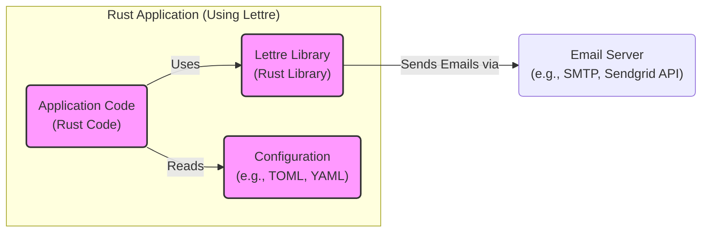
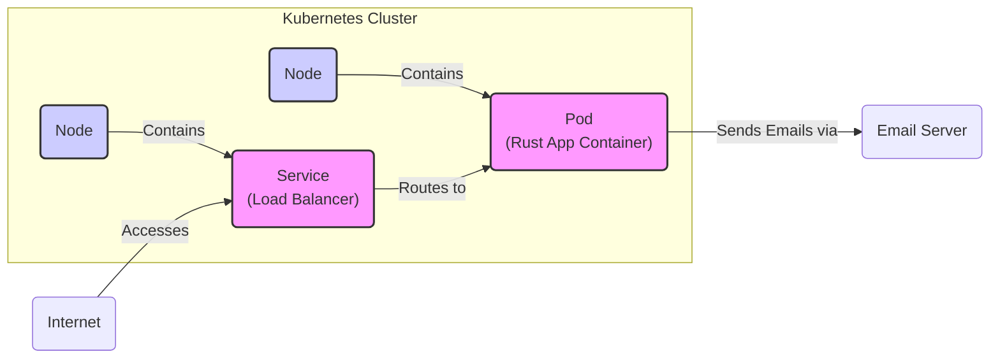
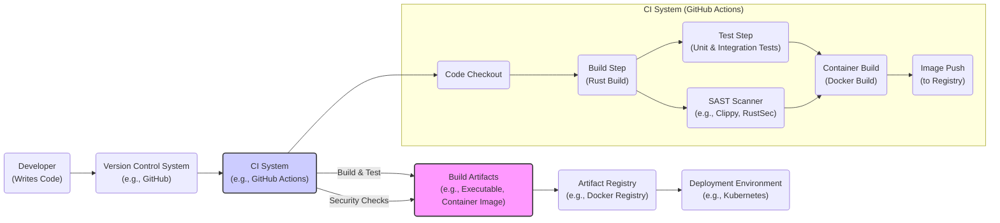

# BUSINESS POSTURE

- Business Priorities and Goals:
  - Enable Rust developers to easily integrate email sending functionality into their applications.
  - Provide a reliable and efficient email sending library.
  - Offer flexibility and customization options for different email sending scenarios.
  - Support various email transport mechanisms.
  - Maintain a well-documented and easy-to-use API.

- Business Risks:
  - Reputation damage if the library is unreliable or insecure, leading to email delivery failures or security vulnerabilities in applications using lettre.
  - Lack of adoption if the library is difficult to use or lacks essential features.
  - Security vulnerabilities in the library itself could be exploited by malicious actors to send spam or phishing emails through applications using lettre.
  - Dependency on external email services or infrastructure, which could introduce availability and performance risks.

# SECURITY POSTURE

- Existing Security Controls:
  - security control: Usage of Rust's memory safety features to prevent common vulnerabilities like buffer overflows. (Implemented in: Rust language itself)
  - security control: Code review process through pull requests on GitHub. (Implemented in: GitHub workflow)
  - security control: Open-source nature allows for community review and contributions to identify and fix security issues. (Implemented in: Open-source development model)
  - security control: Dependency management using Cargo, which helps in managing and updating dependencies, including security updates. (Implemented in: Cargo build system)
  - accepted risk: Reliance on third-party email services for actual email delivery, inheriting their security posture and potential vulnerabilities.
  - accepted risk: Security vulnerabilities in dependencies that are not immediately patched.

- Recommended Security Controls:
  - security control: Implement automated security scanning (SAST/DAST) in the CI/CD pipeline to detect potential vulnerabilities in the code.
  - security control: Regularly audit dependencies for known vulnerabilities and update them promptly.
  - security control: Provide clear security guidelines and best practices for developers using lettre in their applications, especially regarding handling sensitive data in emails.
  - security control: Implement input validation and sanitization within lettre to prevent injection attacks if lettre processes any user-provided data (though it primarily constructs emails based on application logic).
  - security control: Consider providing examples and documentation on secure configuration and usage of lettre with different email transport mechanisms, including TLS/SSL encryption.

- Security Requirements:
  - Authentication:
    - Requirement: Lettre itself does not handle user authentication as it's a library. Applications using lettre are responsible for authenticating users and controlling email sending permissions.
    - Requirement: When configuring email transport mechanisms that require authentication (e.g., SMTP with username/password), lettre should support secure storage and handling of credentials, ideally relying on environment variables or secure configuration management rather than hardcoding.
  - Authorization:
    - Requirement: Lettre does not handle authorization. Applications using lettre must implement authorization logic to ensure only authorized users or processes can send emails.
    - Requirement:  Lettre should provide clear documentation on how to securely integrate with authorization mechanisms in the application context.
  - Input Validation:
    - Requirement: Lettre should perform input validation on email addresses, headers, and body content to prevent common injection attacks (e.g., email header injection).
    - Requirement:  Validation should be applied to all inputs that are used to construct email messages, even if they originate from within the application, to prevent unexpected behavior or vulnerabilities due to incorrect data types or formats.
  - Cryptography:
    - Requirement: Lettre must support TLS/SSL encryption for secure communication with SMTP servers and other email transport mechanisms to protect email content in transit.
    - Requirement:  Lettre should encourage and default to using TLS/SSL for all network communication where sensitive data (email content, credentials) is transmitted.
    - Requirement: If lettre handles any sensitive data at rest (which is unlikely for a sending library, but consider configuration files), appropriate encryption mechanisms should be considered.

# DESIGN

## C4 CONTEXT

```mermaid
graph LR
    subgraph "Email Users"
        UserA("User A")
        UserB("User B")
    end
    RustApp("Rust Application\n(Using Lettre)")
    EmailServer("Email Server\n(e.g., SMTP, Sendgrid API)")
    Internet("Internet")

    UserA -- Uses --> RustApp
    UserB -- Uses --> RustApp
    RustApp -- Sends Emails via --> EmailServer
    EmailServer -- Delivers Emails via --> Internet
    Internet -- Delivers Emails to --> Email Users
    style RustApp fill:#f9f,stroke:#333,stroke-width:2px
```

- Context Diagram Elements:
  - - Name: User A, User B
    - Type: Person
    - Description: Individuals who interact with the Rust Application, potentially triggering email sending functionality.
    - Responsibilities: Initiate actions within the Rust Application that may result in emails being sent.
    - Security controls: User authentication and authorization within the Rust Application (not directly related to lettre, but important in the overall system).
  - - Name: Rust Application (Using Lettre)
    - Type: Software System
    - Description: A Rust application that utilizes the lettre library to send emails. This is the system being designed from a lettre perspective.
    - Responsibilities: Construct email messages using lettre, configure email transport, send emails via configured transport.
    - Security controls: Input validation of email content, secure handling of email sending credentials, TLS/SSL encryption for email transmission (implemented by lettre and application configuration).
  - - Name: Email Server (e.g., SMTP, Sendgrid API)
    - Type: External System
    - Description: An external email server or service responsible for relaying and delivering emails to recipients.
    - Responsibilities: Receive emails from the Rust Application, route emails to recipient mail servers, handle email delivery and queuing.
    - Security controls: SMTP server security configurations (TLS/SSL, authentication mechanisms), API security (API keys, authentication), spam filtering, DKIM/SPF/DMARC configurations (managed by the email server provider).
  - - Name: Internet
    - Type: Environment
    - Description: The public network used for communication between the Rust Application, Email Server, and Email Users' mail servers.
    - Responsibilities: Provide network connectivity for email transmission.
    - Security controls: Network security protocols (TLS/SSL encryption for email transmission), general internet security best practices.

## C4 CONTAINER



- Container Diagram Elements:
  - - Name: Lettre Library
    - Type: Library
    - Description: The lettre Rust library itself, providing the core email sending functionalities.
    - Responsibilities: Email message construction, transport configuration, email sending logic, handling different transport protocols (SMTP, Sendgrid, etc.), input validation, TLS/SSL encryption.
    - Security controls: Rust's memory safety, input validation within the library, TLS/SSL implementation, secure handling of credentials (through configuration interfaces, not direct storage).
  - - Name: Application Code
    - Type: Application Component
    - Description: The Rust application code that integrates and utilizes the lettre library.
    - Responsibilities: Application logic, user interaction, triggering email sending, configuring lettre with transport details and email content, handling errors and responses from lettre.
    - Security controls: Application-level authentication and authorization, secure configuration management, proper error handling, input sanitization before passing data to lettre (though lettre also performs validation).
  - - Name: Configuration
    - Type: Configuration File
    - Description: Configuration files (e.g., TOML, YAML) or environment variables used to configure lettre and the application, including email server details, credentials, and other settings.
    - Responsibilities: Store configuration parameters for lettre and the application.
    - Security controls: Secure storage of configuration files (file system permissions), secure handling of sensitive data like email server credentials (encryption at rest if necessary, avoid hardcoding, use environment variables or secrets management).
  - - Name: Email Server
    - Type: External System
    - Description: Same as in the Context Diagram - the external email server or service.
    - Responsibilities: Same as in the Context Diagram - relaying and delivering emails.
    - Security controls: Same as in the Context Diagram - server-side security controls.

## DEPLOYMENT

- Deployment Options:
  - Option 1: Standalone Application Deployment: The Rust application using lettre is deployed as a standalone executable on a server or container.
  - Option 2: Serverless Function Deployment: The Rust application using lettre is deployed as a serverless function (e.g., AWS Lambda, Google Cloud Functions).
  - Option 3: Containerized Deployment: The Rust application using lettre is containerized (e.g., Docker) and deployed in a container orchestration platform (e.g., Kubernetes).

- Detailed Deployment (Option 3: Containerized Deployment - Kubernetes):



- Deployment Diagram Elements:
  - - Name: Kubernetes Cluster
    - Type: Infrastructure
    - Description: A Kubernetes cluster providing the runtime environment for the application.
    - Responsibilities: Container orchestration, resource management, service discovery, scalability, high availability.
    - Security controls: Kubernetes security features (RBAC, network policies, pod security policies), infrastructure security of the Kubernetes nodes.
  - - Name: Node A, Node B
    - Type: Infrastructure Component (Compute Instance)
    - Description: Worker nodes within the Kubernetes cluster, providing compute resources.
    - Responsibilities: Run application containers, provide compute and memory resources.
    - Security controls: Operating system security hardening, security patching, access control, network security (firewalls, security groups).
  - - Name: Pod (Rust App Container)
    - Type: Container
    - Description: A Kubernetes Pod containing the Docker containerized Rust application that uses lettre.
    - Responsibilities: Run the Rust application, execute application logic, use lettre to send emails.
    - Security controls: Container image security (base image vulnerability scanning, minimal image), application security controls within the container, resource limits, network policies to restrict container network access.
  - - Name: Service (Load Balancer)
    - Type: Infrastructure Component (Load Balancer)
    - Description: A Kubernetes Service of type LoadBalancer, providing external access to the application.
    - Responsibilities: Expose the application to the internet, load balancing traffic across Pods.
    - Security controls: Load balancer security features (TLS termination, DDoS protection), network security rules to control access to the service.
  - - Name: Internet
    - Type: Environment
    - Description: The public internet.
    - Responsibilities: Provide external network access.
    - Security controls: General internet security considerations.
  - - Name: Email Server
    - Type: External System
    - Description: External email server, same as in previous diagrams.
    - Responsibilities: Same as in previous diagrams - email delivery.
    - Security controls: Same as in previous diagrams - server-side security controls.

## BUILD



- Build Process:
  - Developer writes code and commits changes to a Version Control System (VCS) like GitHub.
  - Changes to the VCS trigger a Continuous Integration (CI) system, such as GitHub Actions.
  - CI System performs the following steps:
    - Code Checkout: Retrieves the latest code from the VCS.
    - Build Step: Compiles the Rust code using Cargo.
    - Test Step: Executes unit and integration tests to ensure code quality and functionality.
    - SAST Scanner: Runs Static Application Security Testing (SAST) tools like Clippy and RustSec to identify potential security vulnerabilities and code quality issues.
    - Container Build (Optional): Builds a Docker container image if containerized deployment is used.
    - Image Push (Optional): Pushes the built container image to an Artifact Registry (e.g., Docker Registry).
  - Build Artifacts are generated, which could be executables, libraries, or container images.
  - Build Artifacts are stored in an Artifact Registry.
  - Deployment Environment retrieves artifacts from the registry for deployment.

- Build Security Controls:
  - security control: Secure coding practices by developers. (Implemented by: Developer training and guidelines)
  - security control: Code review process on pull requests before merging code. (Implemented by: GitHub workflow)
  - security control: Automated testing (unit and integration tests) to catch functional defects early. (Implemented by: CI system - Test Step)
  - security control: Static Application Security Testing (SAST) tools (e.g., Clippy, RustSec) to identify potential vulnerabilities in the code. (Implemented by: CI system - SAST Scanner)
  - security control: Dependency scanning to identify vulnerabilities in dependencies. (Can be integrated into CI system)
  - security control: Container image scanning for vulnerabilities if using containerized deployment. (Can be integrated into CI system or registry)
  - security control: Secure storage and access control for build artifacts in the Artifact Registry. (Implemented by: Artifact Registry security features)
  - security control: Principle of least privilege for CI system access and credentials. (Implemented by: CI system configuration)
  - security control: Audit logging of build process and CI system activities. (Implemented by: CI system and registry logging)
  - security control: Supply chain security - verifying integrity of dependencies and build tools. (Implemented by: Cargo's checksum verification, using trusted build environments)

# RISK ASSESSMENT

- Critical Business Processes:
  - Sending transactional emails (e.g., password resets, order confirmations) that are essential for user interaction and business operations.
  - Sending marketing or notification emails to engage users and promote products/services.
  - Any business process that relies on timely and reliable email communication.

- Data Sensitivity:
  - Email addresses of users and recipients (Personally Identifiable Information - PII).
  - Email content, which may contain sensitive business information, personal data, or confidential communications depending on the application's use case.
  - Email sending credentials (if stored or handled by the application - should be treated as highly sensitive secrets).
  - Metadata related to email sending (timestamps, recipient information, etc.) which could be considered sensitive depending on privacy regulations and business context.

# QUESTIONS & ASSUMPTIONS

- Questions:
  - What type of applications will be using lettre? (e.g., web applications, backend services, command-line tools). This will influence the deployment and security considerations.
  - What are the specific email sending requirements in terms of volume, frequency, and delivery guarantees?
  - What email transport mechanisms will be primarily used (SMTP, Sendgrid, other APIs)?
  - Are there any specific compliance requirements (e.g., GDPR, HIPAA) that need to be considered?
  - What is the organization's risk appetite regarding security vulnerabilities in open-source libraries?

- Assumptions:
  - Lettre is primarily used in server-side applications to send emails programmatically, not directly exposed to end-users.
  - The application using lettre is responsible for user authentication and authorization.
  - Email sending credentials will be managed securely outside of the lettre library itself (e.g., environment variables, secrets management).
  - TLS/SSL encryption will be used for all email transmissions over the internet.
  - The application developers using lettre have a basic understanding of secure coding practices and email security principles.
  - The deployment environment provides basic security controls like network firewalls and access control.