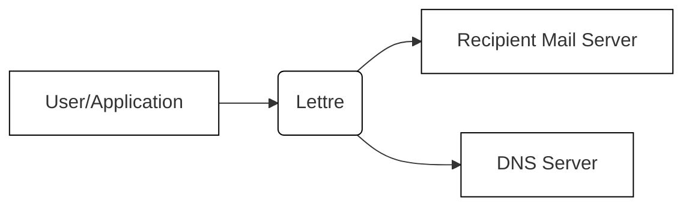
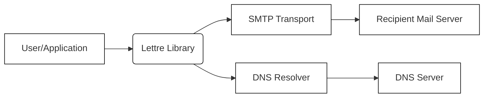
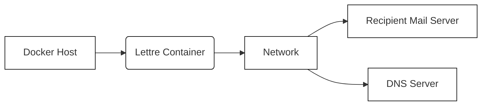

Okay, let's create a design document for the Lettre project, focusing on aspects relevant for threat modeling.

# BUSINESS POSTURE

Lettre is an open-source, lightweight mail transfer agent (MTA) written in Rust.  It appears to be targeted at developers and small-scale deployments, rather than large enterprises.  The project prioritizes simplicity, security, and modern email standards.

Business Priorities:

*   Provide a reliable and secure email sending library.
*   Offer a simpler alternative to more complex MTAs.
*   Enable developers to easily integrate email functionality into their applications.
*   Support modern email standards and security practices.
*   Maintain a small codebase that is easy to audit and maintain.

Business Goals:

*   Gain adoption among developers for small to medium-sized projects.
*   Establish a reputation for security and reliability.
*   Provide a well-documented and easy-to-use API.

Most Important Business Risks:

*   Vulnerabilities that could allow attackers to compromise the server or relay spam.
*   Lack of support for critical email security standards, leading to deliverability issues or spoofing.
*   Complexity or difficulty of use that hinders adoption.
*   Inability to scale to meet the needs of growing projects.
*   Lack of maintainability, leading to unaddressed bugs and security issues.

# SECURITY POSTURE

Existing Security Controls:

*   security control: The project is written in Rust, a memory-safe language, which inherently mitigates many common vulnerabilities like buffer overflows. (Source: GitHub repository, language choice)
*   security control: The project emphasizes secure coding practices and aims to follow modern email standards. (Source: GitHub README)
*   security control: Supports TLS encryption for secure communication. (Source: GitHub README and code)
*   security control: Includes features for DKIM signing and SPF checks (mentioned in documentation, needs verification in code).
*   security control: Actively developed and maintained, suggesting ongoing security review and updates. (Source: GitHub activity)

Accepted Risks:

*   accepted risk: The project is relatively new, so it may have undiscovered vulnerabilities.
*   accepted risk: The focus on simplicity may mean that some advanced security features found in larger MTAs are not implemented.
*   accepted risk: Relies on external libraries (dependencies) which could introduce vulnerabilities.
*   accepted risk: The default configuration may not be fully secure for all deployment scenarios, requiring careful configuration by the user.

Recommended Security Controls:

*   Implement comprehensive input validation and sanitization to prevent injection attacks.
*   Integrate regular security audits and penetration testing into the development lifecycle.
*   Provide clear and detailed security documentation, including recommended configurations and best practices.
*   Implement a robust mechanism for reporting and handling security vulnerabilities.
*   Consider adding support for DANE and MTA-STS to enhance security.
*   Implement automated dependency vulnerability scanning.

Security Requirements:

*   Authentication:
    *   The system must support secure authentication mechanisms for users sending emails (e.g., SMTP AUTH with TLS).
    *   Authentication credentials must be stored securely (if applicable).
*   Authorization:
    *   The system should enforce authorization controls to restrict access to specific features or resources (e.g., limiting relaying to authorized users).
*   Input Validation:
    *   All input from external sources (e.g., email headers, body, sender/recipient addresses) must be rigorously validated and sanitized to prevent injection attacks and other vulnerabilities.
*   Cryptography:
    *   TLS must be used for all communication with other mail servers.
    *   Strong cryptographic algorithms and key lengths must be used for TLS and other security features (e.g., DKIM).
    *   Cryptographic keys must be managed securely.
*   Other:
    *   Implement logging and monitoring to detect and respond to security incidents.
    *   Regularly update dependencies to address known vulnerabilities.

# DESIGN

## C4 CONTEXT

Context Diagram Element List:

*   Element:
    *   Name: User/Application
    *   Type: External Entity (User or Application)
    *   Description: The user or application that is using Lettre to send emails.
    *   Responsibilities: Provides the email content (headers, body, attachments) and recipient information to Lettre.
    *   Security controls: Authentication to Lettre (if required), secure handling of email content.

*   Element:
    *   Name: Lettre
    *   Type: System
    *   Description: The Lettre mail transfer agent.
    *   Responsibilities: Receives email from the user/application, processes it, and delivers it to the recipient's mail server.
    *   Security controls: Input validation, TLS encryption, DKIM signing, SPF checks, authentication (if required), authorization.

*   Element:
    *   Name: Recipient Mail Server
    *   Type: External System
    *   Description: The mail server responsible for receiving emails for the recipient's domain.
    *   Responsibilities: Receives email from Lettre, performs spam filtering, and delivers the email to the recipient's mailbox.
    *   Security controls: Standard mail server security controls (e.g., spam filtering, authentication, TLS).

*   Element:
    *   Name: DNS Server
    *   Type: External System
    *   Description: The Domain Name System server used to resolve domain names to IP addresses.
    *   Responsibilities: Provides IP address information for recipient mail servers (MX records) and other DNS records (SPF, DKIM, DMARC).
    *   Security controls: Standard DNS server security controls (e.g., DNSSEC).

## C4 CONTAINER

Container Diagram Element List:

*   Element:
    *   Name: User/Application
    *   Type: External Entity
    *   Description: The user or application utilizing the Lettre library.
    *   Responsibilities: Integrates with the Lettre library to send emails.
    *   Security controls: Secure handling of email content and credentials.

*   Element:
    *   Name: Lettre Library
    *   Type: Container (Library)
    *   Description: The core Lettre library, providing email sending functionality.
    *   Responsibilities: Provides an API for creating and sending emails, handling email formatting, and interacting with the SMTP transport.
    *   Security controls: Input validation, secure email construction, API security.

*   Element:
    *   Name: SMTP Transport
    *   Type: Container (Component)
    *   Description: The component responsible for communicating with SMTP servers.
    *   Responsibilities: Establishes connections with SMTP servers, sends email data, handles TLS encryption.
    *   Security controls: TLS configuration, secure connection management.

*   Element:
    *   Name: Recipient Mail Server
    *   Type: External System
    *   Description: The mail server for the recipient's domain.
    *   Responsibilities: Receives and processes emails from Lettre.
    *   Security controls: Standard mail server security.

*   Element:
    *   Name: DNS Resolver
    *   Type: Container (Component/Library)
    *   Description: Component responsible for resolving DNS records.
    *   Responsibilities: Queries DNS servers for MX, SPF, DKIM, and other records.
    *   Security controls: Secure DNS resolution (e.g., using a trusted resolver).

*   Element:
    *   Name: DNS Server
    *   Type: External System
    *   Description: The DNS server used for domain name resolution.
    *   Responsibilities: Provides DNS records to the DNS Resolver.
    *   Security controls: Standard DNS server security.

## DEPLOYMENT

Possible Deployment Solutions:

1.  **Standalone Server:** Lettre can be deployed as a standalone service on a dedicated server or virtual machine.
2.  **Containerized (Docker):** Lettre can be packaged into a Docker container for easy deployment and management.
3.  **Embedded within an Application:** Lettre can be directly integrated into an application as a library, eliminating the need for a separate deployment.
4.  **Serverless (e.g., AWS Lambda):** While less common for MTAs, Lettre's lightweight nature might make it suitable for serverless deployments in some scenarios.

Chosen Deployment Solution (for detailed description): Containerized (Docker)

Deployment Diagram Element List:

*   Element:
    *   Name: Docker Host
    *   Type: Infrastructure Node (Server/VM)
    *   Description: The physical or virtual server running the Docker engine.
    *   Responsibilities: Hosts and manages the Lettre Docker container.
    *   Security controls: Operating system security, Docker security best practices, network security.

*   Element:
    *   Name: Lettre Container
    *   Type: Container (Docker)
    *   Description: The Docker container running the Lettre application.
    *   Responsibilities: Executes the Lettre code and handles email processing.
    *   Security controls: Container security best practices (e.g., minimal base image, non-root user), application-level security controls.

*   Element:
    *   Name: Network
    *   Type: Infrastructure Node (Network)
    *   Description: The network connecting the Docker host to the internet.
    *   Responsibilities: Facilitates communication between the Lettre container and external systems.
    *   Security controls: Firewall rules, network segmentation, intrusion detection/prevention systems.

*   Element:
    *   Name: Recipient Mail Server
    *   Type: External System
    *   Description: The mail server for the recipient's domain.
    *   Responsibilities: Receives and processes emails from Lettre.
    *   Security controls: Standard mail server security.

*   Element:
    *   Name: DNS Server
    *   Type: External System
    *   Description: The DNS server used for domain name resolution.
    *   Responsibilities: Provides DNS records.
    *   Security controls: Standard DNS server security.

## BUILD

The Lettre project uses Rust's `cargo` build system.  A typical build process would involve the following steps:

1.  **Developer:** Writes code and commits changes to the Git repository.
2.  **Continuous Integration (CI) System (e.g., GitHub Actions):**  A CI system (likely GitHub Actions, given the project's location) is triggered by the commit.
3.  **Fetch Dependencies:** `cargo` fetches the project's dependencies (crates) from crates.io.
4.  **Compile Code:** `cargo` compiles the Rust code into an executable.
5.  **Run Tests:** `cargo test` runs the project's unit and integration tests.
6.  **Linting (Clippy):**  Rust's linter, Clippy, is likely used to check for code style and potential errors.
7.  **Security Audit (cargo-audit):** It's highly recommended to integrate `cargo-audit` to check for vulnerabilities in dependencies.
8.  **Build Docker Image (Optional):** If the deployment uses Docker, a Dockerfile is used to build a container image.
9.  **Publish Artifacts:** The compiled executable or Docker image is published (e.g., to a container registry).

```mermaid
graph LR
    A[Developer] --> B[Git Repository];
    B --> C[CI System];
    C --> D[Fetch Dependencies];
    D --> E[Compile Code];
    E --> F[Run Tests];
    F --> G[Linting];
    G --> H[Security Audit];
    H --> I[Build Docker Image];
    I --> J[Publish Artifacts];
        classDef default fill:#fff,stroke:#000,stroke-width:1px;
```

Build Process Security Controls:

*   Use a CI/CD system (e.g., GitHub Actions) to automate the build process.
*   Implement dependency vulnerability scanning (e.g., `cargo-audit`).
*   Use Rust's built-in safety features and Clippy to catch potential errors.
*   Sign releases and container images to ensure integrity.
*   Use a minimal base image for Docker containers.
*   Regularly update the CI/CD system and build tools.

# RISK ASSESSMENT

Critical Business Processes:

*   Reliable email delivery: Ensuring that emails sent through Lettre reach their intended recipients without being marked as spam or rejected.
*   Maintaining the integrity and confidentiality of email content: Preventing unauthorized access to or modification of email data.
*   Preventing abuse of the system: Ensuring that Lettre is not used for sending spam or phishing emails.

Data Sensitivity:

*   Email Content:  Can range from low sensitivity (e.g., automated notifications) to high sensitivity (e.g., confidential business communications, personal information).  Lettre itself doesn't store emails persistently, but it handles them in transit.
*   Sender/Recipient Addresses:  Can be considered personally identifiable information (PII) in some cases.
*   Authentication Credentials (if used):  Highly sensitive and must be protected.
*   Configuration Data: May contain sensitive information like API keys or passwords.

# QUESTIONS & ASSUMPTIONS

Questions:

*   What are the specific threat actors that are most relevant to Lettre's use cases (e.g., spammers, nation-state actors, script kiddies)?
*   What are the expected email volumes and traffic patterns?
*   Are there any specific regulatory requirements that apply to Lettre's users (e.g., GDPR, HIPAA)?
*   What level of logging and auditing is required?
*   What are the specific mechanisms used for DKIM signing and SPF checks?
*   What is the process for handling reported security vulnerabilities?
*   Are there any plans to support DANE or MTA-STS?

Assumptions:

*   BUSINESS POSTURE: The primary use case is for sending transactional emails from applications, not for acting as a general-purpose mail relay.
*   SECURITY POSTURE: Users are responsible for configuring Lettre securely and for implementing appropriate security controls in their own applications.
*   DESIGN: Lettre will be deployed in a secure environment with appropriate network security measures in place. The underlying operating system and Docker (if used) are properly secured. Dependencies are regularly updated.