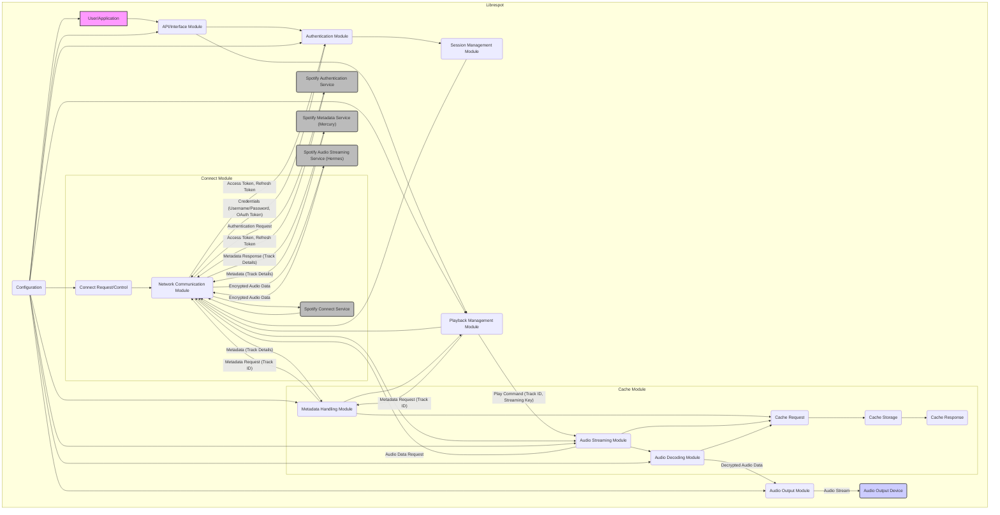

# Project Design Document: Librespot

**Version:** 1.1
**Date:** October 26, 2023
**Author:** AI Software Architect

## 1. Introduction

This document provides a detailed architectural design of the Librespot project, an open-source client library for Spotify. This document aims to clearly outline the system's components, their interactions, and data flows. It will serve as the foundation for subsequent threat modeling activities.

### 1.1. Purpose

The primary purpose of this document is to provide a comprehensive understanding of the Librespot architecture for security analysis and threat modeling. It details the key components, their responsibilities, and how they interact with each other and external services. This detailed view is crucial for identifying potential attack surfaces and vulnerabilities.

### 1.2. Scope

This document covers the core architectural components of Librespot, focusing on the logical structure and data flows relevant to its functionality as a Spotify client. It includes:

*   Detailed descriptions of core modules and their specific responsibilities.
*   In-depth explanations of interactions between internal components, including data formats and protocols where relevant.
*   Comprehensive overview of communication with external services (Spotify), specifying the types of interactions.
*   Detailed description of data storage and handling mechanisms, including sensitive data.
*   Elaboration on key functionalities like authentication, playback initiation, audio streaming, caching, and remote control.

This document does not cover:

*   Fine-grained implementation details within individual modules (e.g., specific algorithms used).
*   Exact code-level analysis or line-by-line code reviews.
*   Highly specific deployment configurations or environment-specific settings.

### 1.3. Target Audience

This document is intended for:

*   Security engineers and architects responsible for threat modeling, security assessments, and penetration testing of systems utilizing Librespot.
*   Developers actively contributing to the Librespot project, requiring a deep understanding of the system's architecture.
*   Individuals seeking a thorough understanding of Librespot's internal workings for research or integration purposes.

## 2. System Overview

Librespot is a reverse-engineered, open-source client library for the Spotify service. It allows users to connect to Spotify's backend and stream music without relying on the official Spotify client. Its design emphasizes being lightweight and embeddable, making it suitable for integration into various platforms and resource-constrained devices.

### 2.1. Key Features

*   **Spotify Connect Support:** Enables Librespot to appear as a controllable device within the official Spotify ecosystem, allowing seamless handoff and remote control.
*   **Audio Playback Management:** Handles the entire lifecycle of audio streaming, from requesting data to decoding and outputting sound.
*   **Robust User Authentication:** Implements the necessary protocols to securely authenticate users with Spotify accounts.
*   **Configurable Caching Mechanisms:** Provides options for caching metadata and audio data to optimize performance and potentially enable offline scenarios.
*   **Remote Control Capabilities:** Facilitates control of playback and device status from other Spotify clients on the same network or associated with the same account.
*   **Cross-Platform Design:** Engineered for portability across a wide range of operating systems and hardware architectures.

## 3. Architectural Design

The Librespot architecture is structured around several interconnected modules, each responsible for a specific aspect of its functionality.

### 3.1. Components

*   **Network Communication Module:**
    *   Manages all network interactions with Spotify's infrastructure.
    *   Establishes and maintains persistent TCP connections.
    *   Implements TLS encryption for secure communication.
    *   Handles HTTP requests for various API endpoints.
    *   Implements protocol-specific communication for Spotify's internal protocols like Mercury (for metadata) and Hermes (for audio streaming and control).
*   **Authentication Module:**
    *   Orchestrates the user authentication flow with Spotify's authentication servers.
    *   Handles the exchange of user credentials (username/password or OAuth tokens) for short-lived access tokens.
    *   May implement secure storage and retrieval of refresh tokens for persistent sessions.
    *   Manages device authentication and registration with Spotify.
*   **Session Management Module:**
    *   Maintains the active session with Spotify, including managing the lifecycle of access tokens.
    *   Handles token refresh mechanisms to maintain continuous connectivity.
    *   Stores and manages session-related data, such as the current user ID and device ID.
    *   Provides session context to other modules requiring authenticated access.
*   **Metadata Handling Module:**
    *   Responsible for fetching and parsing metadata related to music content (tracks, albums, artists, playlists, etc.) from Spotify's metadata services.
    *   Implements caching strategies for metadata to reduce network requests and improve performance.
    *   Handles different metadata formats and protocols used by Spotify.
*   **Playback Management Module:**
    *   Controls the overall playback state, including starting, pausing, stopping, seeking, and shuffling.
    *   Manages the playback queue and track selection logic.
    *   Interacts with the **Metadata Handling Module** to retrieve track information.
    *   Communicates with the **Audio Decoding and Playback Module** to initiate and control audio streaming.
*   **Audio Streaming Module:** *(Refined Component Name)*
    *   Requests and receives encrypted audio data streams from Spotify's audio delivery network (Hermes).
    *   Manages the buffering and synchronization of audio data.
    *   Passes the encrypted audio data to the **Audio Decoding Module**.
*   **Audio Decoding Module:** *(Refined Component Name)*
    *   Decrypts the received audio stream using keys obtained during the session setup.
    *   Decodes the audio data (typically in Vorbis or Opus format).
    *   Handles audio format conversion if necessary.
    *   Provides the decoded audio data to the **Audio Output Module**.
*   **Audio Output Module:** *(New Component)*
    *   Interfaces with the underlying operating system's audio subsystem.
    *   Handles the output of decoded audio to the designated audio device.
    *   Manages volume control and potentially other audio output settings.
*   **Cache Module:**
    *   Provides a persistent storage mechanism for various types of data.
    *   Can be configured to cache metadata, audio data chunks, or other relevant information.
    *   Implements cache eviction policies to manage storage space.
    *   May offer different caching strategies (e.g., in-memory, disk-based).
*   **Connect Module:**
    *   Implements the Spotify Connect protocol, allowing Librespot to act as a Spotify Connect device.
    *   Handles device registration, discovery, and control messages.
    *   Manages communication with Spotify's Connect service for device synchronization and control.
*   **Configuration Module:**
    *   Loads and manages configuration settings for Librespot from various sources (e.g., configuration files, command-line arguments).
    *   Provides configuration parameters to other modules.
    *   Handles validation and error checking of configuration settings.
*   **API/Interface Module:**
    *   Provides an interface for external applications or users to interact with Librespot's functionalities.
    *   This could be a command-line interface (CLI), a library API with defined functions and data structures, or a network-based API (e.g., REST).

### 3.2. Interactions

The following list describes key interactions between the components, providing more detail on the data exchanged:

*   The **Authentication Module** initiates communication with the **Network Communication Module** to send authentication requests containing user credentials to Spotify's authentication endpoints. It receives authentication responses, including access and refresh tokens.
*   The **Session Management Module** utilizes the **Authentication Module** to obtain initial access tokens and subsequently uses the **Network Communication Module** to refresh tokens when they expire, maintaining an active session.
*   The **Metadata Handling Module** sends metadata requests (e.g., for track details, album information) through the **Network Communication Module** to Spotify's metadata services (Mercury). It receives metadata responses in specific data formats (e.g., protobuf).
*   The **Playback Management Module** instructs the **Audio Streaming Module** to request audio data for a specific track. It provides track IDs and streaming keys.
*   The **Audio Streaming Module** uses the **Network Communication Module** to establish audio streaming sessions with Spotify's Hermes service, receiving encrypted audio data packets.
*   The **Audio Streaming Module** forwards the encrypted audio data to the **Audio Decoding Module**.
*   The **Audio Decoding Module** receives decryption keys from the **Session Management Module** or **Playback Management Module** and decrypts the audio data. It then decodes the audio stream and sends the raw audio data to the **Audio Output Module**.
*   The **Audio Output Module** receives decoded audio data from the **Audio Decoding Module** and uses the operating system's audio APIs (e.g., ALSA, CoreAudio, WASAPI) to output the sound.
*   The **Cache Module** is accessed by the **Metadata Handling Module** to store and retrieve metadata, and by the **Audio Streaming Module** or **Audio Decoding Module** to cache audio data chunks. It receives requests for data and returns cached data or indicates a cache miss.
*   The **Connect Module** communicates with Spotify's Connect service through the **Network Communication Module**, exchanging messages related to device registration, capabilities, and playback control.
*   The **API/Interface Module** receives commands from external applications or users and translates them into calls to the appropriate internal modules (e.g., **Playback Management Module**, **Metadata Handling Module**). It returns responses or status updates.
*   The **Configuration Module** provides configuration parameters (e.g., audio output device, cache settings, authentication details) to various modules during their initialization phase.

### 3.3. Data Flow

**Data Flow Description:**

*   A **User/Application** initiates actions through the **API/Interface Module**.
*   Authentication starts with the **API/Interface Module** potentially passing user credentials to the **Authentication Module**.
*   The **Authentication Module** uses the **Network Communication Module** to send authentication requests to the **Spotify Authentication Service**.
*   Upon successful authentication, the **Spotify Authentication Service** returns access and refresh tokens.
*   The **Network Communication Module** passes these tokens back to the **Authentication Module**, which then provides them to the **Session Management Module**.
*   For playback, the **API/Interface Module** instructs the **Playback Management Module**.
*   The **Playback Management Module** requests metadata for the selected track from the **Metadata Handling Module**.
*   The **Metadata Handling Module** fetches metadata from the **Spotify Metadata Service (Mercury)** via the **Network Communication Module**.
*   Once metadata is retrieved, the **Playback Management Module** instructs the **Audio Streaming Module** to request audio data.
*   The **Audio Streaming Module** uses the **Network Communication Module** to stream encrypted audio data from the **Spotify Audio Streaming Service (Hermes)**.
*   The **Audio Streaming Module** forwards the encrypted data to the **Audio Decoding Module**.
*   The **Audio Decoding Module** decrypts and decodes the audio before sending it to the **Audio Output Module**.
*   The **Audio Output Module** sends the decoded audio stream to the **Audio Output Device**.
*   The **Cache Module** can be utilized by the **Metadata Handling Module**, **Audio Streaming Module**, and **Audio Decoding Module** to store and retrieve data, optimizing performance.
*   The **Connect Module** communicates with the **Spotify Connect Service** to enable remote control functionality.
*   The **Configuration** settings influence the behavior of various modules.

## 4. Security Considerations (More Specific)

This section elaborates on potential security considerations, providing more specific examples and potential attack vectors.

*   **Authentication and Authorization:**
    *   **Credential Theft/Exposure:** Risk of user credentials being compromised if transmitted over unencrypted channels (though TLS mitigates this) or stored insecurely within Librespot's configuration or memory.
    *   **Token Hijacking:** Access tokens, if intercepted, could allow an attacker to impersonate the user. Secure storage and handling of tokens are crucial.
    *   **Replay Attacks:**  Stolen or intercepted authentication requests could potentially be replayed to gain unauthorized access.
    *   **Insufficient Credential Validation:** Weak or missing validation of user-provided credentials could lead to bypasses or account compromise.
*   **Network Communication:**
    *   **Man-in-the-Middle (MITM) Attacks:** If TLS is not correctly implemented or if certificate validation is bypassed, attackers could intercept and modify communication with Spotify's servers.
    *   **Downgrade Attacks:** Attackers might try to force the use of older, less secure TLS versions.
    *   **Data Injection/Tampering:** Vulnerabilities in handling network protocols could allow attackers to inject malicious data or tamper with legitimate communication.
*   **Data Storage (Cache):**
    *   **Unauthorized Access to Cache:** If the cache is not properly protected, sensitive data like metadata or even decrypted audio chunks could be accessed by unauthorized users or processes.
    *   **Cache Poisoning:** Attackers might try to inject malicious data into the cache, leading to incorrect information being presented or unexpected behavior.
    *   **Information Disclosure:** Cached data might reveal sensitive information about user listening habits or preferences.
*   **API Security:**
    *   **Injection Attacks (e.g., Command Injection):** If the API/Interface Module processes external input without proper sanitization, attackers could inject malicious commands.
    *   **Authorization Bypass:** Vulnerabilities in the API's authorization mechanisms could allow unauthorized access to functionalities.
    *   **Denial of Service (DoS):**  Malicious actors could overload the API with requests, making Librespot unavailable.
*   **Dependency Management:**
    *   **Exploiting Known Vulnerabilities:** Using outdated or vulnerable third-party libraries could expose Librespot to known security flaws.
    *   **Supply Chain Attacks:** Compromised dependencies could introduce malicious code into Librespot.
*   **Memory Safety:**
    *   **Buffer Overflows/Underflows:** Although Rust's memory safety features mitigate many such issues, unsafe code blocks or incorrect usage of external libraries could still introduce vulnerabilities.
    *   **Use-After-Free:**  Improper memory management could lead to use-after-free vulnerabilities.
*   **Connect Protocol Security:**
    *   **Spoofing Connect Devices:** Attackers might try to impersonate legitimate Spotify Connect devices to gain control over Librespot.
    *   **Unauthorized Control:** Vulnerabilities in the Connect protocol implementation could allow unauthorized remote control of playback or device settings.

## 5. Deployment Scenarios

Librespot's deployment context significantly impacts its security profile:

*   **Standalone Application on a Personal Computer:**
    *   **Threats:** Primarily local attacks, such as malware accessing cached data or exploiting vulnerabilities to gain control of the system. Network attacks are also possible.
    *   **Considerations:** Secure storage of configuration and cached data is important. The application should follow secure coding practices to prevent local privilege escalation.
*   **Embedded Systems (e.g., Smart Speakers):**
    *   **Threats:** Physical access to the device, network attacks targeting the device's limited resources, and potential vulnerabilities in the embedded operating system.
    *   **Considerations:**  Security hardening of the embedded system is crucial. Secure boot processes and limited network exposure are important. Secure storage of credentials and keys within the device is paramount.
*   **Library Integration within Another Application:**
    *   **Threats:** Vulnerabilities in the integrating application could expose Librespot, and vice versa. Data shared between the application and Librespot needs careful consideration.
    *   **Considerations:** Clear boundaries and secure communication channels between Librespot and the host application are necessary. The integrating application's security posture directly impacts Librespot's security.

## 6. Technologies Used

*   **Primary Programming Language:** Rust (known for its memory safety features).
*   **Networking Libraries:**  Likely utilizes libraries like `tokio` or `async-std` for asynchronous networking, and `rustls` or `native-tls` for TLS implementation. HTTP handling might involve libraries like `reqwest` or `hyper`.
*   **Audio Decoding Libraries:**  Uses libraries like `libvorbis` and `libopus` (or Rust wrappers around them) for decoding audio in Vorbis and Opus formats respectively.
*   **Operating System Compatibility:** Designed for broad compatibility across Linux, macOS, Windows, and potentially other platforms.

## 7. Future Considerations

*   **Enhanced Security Audits:** Regular and thorough security audits, including penetration testing, are crucial for identifying and addressing potential vulnerabilities.
*   **Secure Credential Management:** Implementing more robust mechanisms for securely storing and managing user credentials and access tokens, potentially leveraging system-level keychains or secure enclaves.
*   **Improved Input Validation and Sanitization:** Implementing comprehensive input validation and sanitization across all modules, especially in the API/Interface Module, to prevent injection attacks.
*   **Regular Dependency Updates:** Maintaining up-to-date dependencies to patch known security vulnerabilities.
*   **Consideration of Sandboxing/Isolation:** Exploring techniques like sandboxing or process isolation to limit the impact of potential security breaches.

This document provides a more detailed and refined understanding of the Librespot architecture, serving as a solid foundation for conducting a comprehensive threat model and implementing appropriate security measures.
