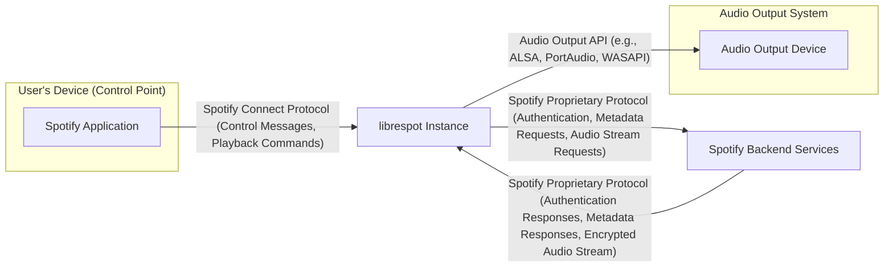
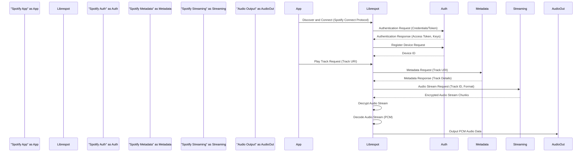

# Project Design Document: librespot

**Version:** 1.1
**Date:** October 26, 2023
**Author:** Gemini (AI Language Model)

## 1. Introduction

This document provides an enhanced design overview of the librespot project, an open-source client library for Spotify. The primary objective of this document is to detail the architectural components, data flows, and security considerations of librespot to serve as a robust foundation for subsequent threat modeling activities. This document aims to provide sufficient detail for security architects and engineers to understand the system's intricacies and identify potential vulnerabilities.

## 2. Goals and Non-Goals

### 2.1. Goals

*   Present a clear and comprehensive architectural blueprint of librespot's functionalities.
*   Identify and describe the key internal components of librespot and their interactions.
*   Thoroughly detail the data flow within the librespot instance and its communication with external services, including protocols and data formats.
*   Explicitly highlight potential security considerations, trust boundaries, and attack surfaces within the librespot architecture.
*   Establish a solid and well-defined basis for conducting detailed threat modeling exercises, including identifying assets, threats, and vulnerabilities.

### 2.2. Non-Goals

*   Provide a line-by-line code review or an exhaustive analysis of every code module within librespot.
*   Document every possible configuration parameter or handle obscure edge cases.
*   Delve into the internal implementation details of third-party libraries used by librespot beyond their general function and potential security implications.
*   Execute a formal threat modeling process or produce a list of specific threats and mitigations within this document (this document *prepares* for that).

## 3. High-Level Architecture

librespot functions as a Spotify Connect client, enabling devices running it to appear as selectable playback destinations within official Spotify applications. It interacts with Spotify's backend services for authentication, content browsing, and audio streaming, adhering to Spotify's proprietary protocols.

*   **Spotify Application (Control Point):** The official Spotify application running on a user's device (e.g., smartphone, desktop). It acts as the controller, initiating playback, managing the librespot instance's state, and sending commands.
*   **librespot Instance:** The core of the project, typically running as a standalone process or embedded within another application. It implements the Spotify Connect protocol, handles authentication, communicates with Spotify's backend, decrypts audio streams, and manages audio playback.
*   **Spotify Backend Services:** Spotify's proprietary infrastructure responsible for user authentication, account management, content catalog management, metadata provision, and audio stream delivery. This is a trusted external entity.
*   **Audio Output Device:** The physical hardware where the audio is rendered (e.g., speakers, headphones, sound card). librespot interacts with the operating system's audio subsystem to output the decoded audio.

## 4. Component Breakdown

librespot is composed of several interconnected components, each with specific responsibilities:

*   **Session Management & Authentication:**
    *   Responsible for user authentication with Spotify's servers, typically using username/password or refresh tokens.
    *   Handles the initial device registration and subsequent connection management with Spotify Connect.
    *   Securely stores and manages session-related information, including authentication tokens and device identifiers.
    *   Implements logic for token refresh and session recovery.
*   **Network Communication:**
    *   Manages persistent and secure connections to Spotify's backend services over the internet.
    *   Implements the low-level details of the Spotify proprietary protocol, including message framing, encryption, and decryption.
    *   Handles network errors, connection retries, and potential network disruptions.
*   **Metadata Handling & Caching:**
    *   Fetches metadata for tracks, albums, artists, playlists, and other content from Spotify's servers upon request.
    *   Implements caching mechanisms (in-memory or on-disk) to reduce redundant network requests and improve performance.
    *   Manages cache invalidation and updates.
*   **Playback Control & State Management:**
    *   Receives and interprets playback commands (play, pause, skip, seek, volume control) from the connected Spotify application (control point).
    *   Maintains the current playback state, including track position, playback status, and volume level.
    *   Communicates playback status updates back to the control point.
*   **Audio Streaming & Decoding:**
    *   Initiates and manages the download of encrypted audio streams from Spotify's servers.
    *   Handles the decryption of the audio stream using keys negotiated during the authentication process.
    *   Decodes the audio data, typically in Ogg Vorbis or AAC format, into raw PCM audio.
*   **Audio Output Backend:**
    *   Provides an abstraction layer for interacting with different operating system audio subsystems (e.g., ALSA on Linux, PortAudio cross-platform, WASAPI on Windows).
    *   Handles the buffering and output of decoded PCM audio to the selected audio output device.
    *   Manages audio format conversion and sample rate adjustments if necessary.
*   **Cache Subsystem:**
    *   Provides a persistent storage mechanism for downloaded audio chunks and metadata.
    *   Implements logic for managing cache size, eviction policies, and data integrity.
    *   May be configurable to use different storage backends (e.g., file system, in-memory).
*   **Configuration Management:**
    *   Handles the loading and management of librespot's configuration settings, including audio output device selection, bitrate preferences, and caching parameters.
    *   May support configuration via command-line arguments, configuration files, or environment variables.

## 5. Data Flow

The process of playing a song with librespot involves the following data flow:

1. **Authentication Data Exchange:**
    *   librespot sends authentication requests containing user credentials or refresh tokens to Spotify's authentication endpoints.
    *   Spotify's backend validates the credentials and returns access tokens and other session-related data.
2. **Device Registration Data:**
    *   librespot sends device registration information (device name, type, capabilities) to Spotify's servers.
    *   Spotify's backend assigns a unique device ID to the librespot instance.
3. **Control Command Data:**
    *   The Spotify application sends control commands (e.g., `play`, `pause`, `load URI`) to librespot over the Spotify Connect protocol. These commands specify the desired playback actions.
4. **Metadata Request/Response:**
    *   When a track is selected for playback, librespot may request metadata (track name, artist, album art URLs) from Spotify's metadata APIs.
    *   Spotify's backend responds with the requested metadata in a structured format (e.g., JSON).
5. **Audio Stream Request/Response:**
    *   Upon receiving a `play` command, librespot requests the encrypted audio stream for the selected track from Spotify's streaming servers.
    *   Spotify's backend streams the encrypted audio data (typically in chunks) to librespot.
6. **Decrypted Audio Data:**
    *   librespot decrypts the received audio stream chunks using session-specific decryption keys.
7. **Raw PCM Audio Data:**
    *   The decrypted audio data is then decoded into raw PCM audio samples.
8. **Audio Output Data:**
    *   librespot sends the raw PCM audio data to the configured audio output device via the operating system's audio APIs.

## 6. Security Considerations

This section details potential security considerations relevant for threat modeling librespot.

*   **Authentication and Authorization Vulnerabilities:**
    *   **Credential Compromise:** If user credentials used by librespot are compromised, attackers could gain unauthorized access to the user's Spotify account.
    *   **Token Theft/Abuse:**  Stolen or improperly stored authentication tokens could allow attackers to impersonate the user or control the librespot instance.
    *   **Insufficient Session Management:** Weak session management could lead to session hijacking or replay attacks.
*   **Network Security Risks:**
    *   **Man-in-the-Middle (MITM) Attacks:** If communication between librespot and Spotify's servers is not properly secured (e.g., using outdated TLS versions), attackers could intercept and potentially modify data.
    *   **Spotify Connect Protocol Exploits:** Vulnerabilities in the Spotify Connect protocol itself could be exploited to gain unauthorized control over librespot instances.
    *   **Exposure of Control Interface:** If the librespot control interface is exposed without proper authentication or authorization, unauthorized devices could control playback.
*   **Data Privacy Concerns:**
    *   **Exposure of Listening History:**  If librespot logs or stores listening history insecurely, this data could be exposed.
    *   **Cache Security:**  If the audio or metadata cache is not properly secured, sensitive information could be accessed by unauthorized users.
*   **Dependency Vulnerabilities:**
    *   **Third-Party Library Exploits:** Vulnerabilities in the third-party libraries used by librespot (e.g., for networking, audio decoding) could be exploited to compromise the application.
*   **Memory Safety and Code Integrity:**
    *   **Buffer Overflows/Underflows:** While Rust's memory safety features mitigate many such issues, potential vulnerabilities in `unsafe` code blocks or FFI interfaces could exist.
    *   **Logic Errors:** Flaws in the application logic could lead to unexpected behavior or security vulnerabilities.
*   **Input Validation Failures:**
    *   **Command Injection:** Improper validation of commands received from the control point could allow attackers to execute arbitrary commands on the system running librespot.
    *   **Data Injection:**  Vulnerabilities in how librespot handles data received from Spotify's servers could lead to unexpected behavior or security issues.
*   **Audio Processing Vulnerabilities:**
    *   **Exploits in Audio Decoding Libraries:** Vulnerabilities in the audio decoding libraries could potentially be exploited by malicious audio streams.
*   **Local Security Posture:**
    *   **Insecure Permissions:** If librespot runs with excessive privileges, a compromise could have broader system impact.
    *   **File System Vulnerabilities:**  Insecure file system permissions for configuration files or the cache directory could lead to unauthorized access or modification.

## 7. Deployment Considerations

The security posture of a librespot deployment can be significantly influenced by the environment in which it operates:

*   **Embedded Systems (e.g., Raspberry Pi):**
    *   **Physical Access:** Increased risk of physical access to the device, potentially allowing for direct manipulation or data extraction.
    *   **Resource Constraints:** Limited resources may hinder the implementation of robust security measures.
    *   **Supply Chain Security:**  The security of the underlying operating system and hardware is crucial.
*   **Servers (Headless Environments):**
    *   **Network Exposure:**  Increased attack surface due to network connectivity. Proper firewall configuration and network segmentation are essential.
    *   **Remote Management Security:** Secure remote access mechanisms are critical to prevent unauthorized control.
*   **Desktop Computers:**
    *   **User Account Security:**  The security of the user account running librespot is a primary factor.
    *   **Operating System Security:** The overall security posture of the desktop operating system impacts librespot's security.
    *   **Software Conflicts:** Potential conflicts with other software on the system could introduce vulnerabilities.

## 8. Future Considerations

*   **Enhanced Security Auditing and Logging:** Implementing more comprehensive logging of security-relevant events for monitoring and incident response.
*   **Improved Input Sanitization and Validation:** Strengthening input validation across all interfaces to prevent injection attacks.
*   **Regular Security Scans and Penetration Testing:** Proactively identifying potential vulnerabilities through security assessments.
*   **Consideration of Secure Enclaves or Hardware Security Modules (HSMs):** For more sensitive deployments, exploring the use of secure hardware for storing cryptographic keys.
*   **Further Modularization with Security Boundaries:**  Designing components with clear security boundaries to limit the impact of potential compromises.

This enhanced design document provides a more detailed and security-focused overview of librespot, intended to be a valuable resource for subsequent threat modeling activities.