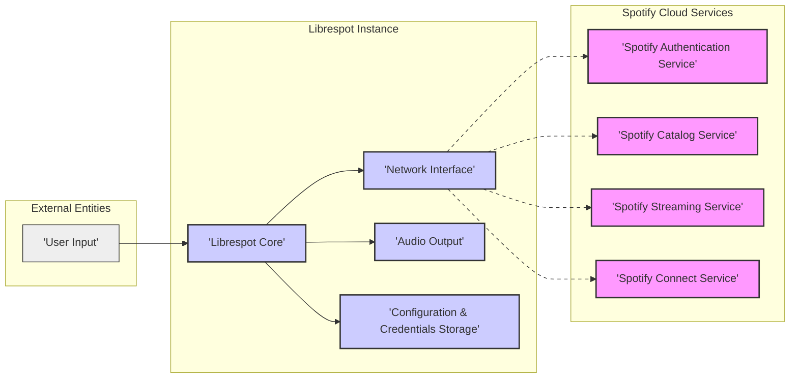

## Project Design Document: Librespot - Open Source Spotify Client

**Project Name:** Librespot

**Project Repository:** [https://github.com/librespot-org/librespot](https://github.com/librespot-org/librespot)

**Document Version:** 1.1

**Date:** 2023-10-27

**Author:** Gemini (AI Assistant)

### 1. Introduction

This document provides an enhanced and more detailed design overview of the Librespot project, building upon the previous version. Librespot is an open-source client library for Spotify, written in Rust. It implements the Spotify Connect protocol, enabling devices running Librespot to appear as Spotify Connect devices, allowing users to stream music from their Spotify accounts to these devices. This document aims to provide a comprehensive understanding of the architecture, components, data flow, and security considerations of Librespot, specifically tailored for use in threat modelling activities. This document will serve as the basis for identifying potential threats and vulnerabilities within the Librespot system.

### 2. Project Goals and Scope

*   **Goal:** To provide a functional, efficient, and secure open-source Spotify Connect client library.
*   **Scope:** This document covers the core architecture and components of Librespot as a software system, with a strong focus on security aspects relevant for threat modelling. It details the logical and physical components involved in streaming music from Spotify to a device running Librespot. While it does not delve into the fine-grained implementation details of the Rust code, it provides sufficient technical context for security analysis. The scope includes consideration of different deployment models and their security implications.

### 3. System Architecture

Librespot operates as a client application that interacts with Spotify's backend services. The architecture emphasizes the interaction points and data flows relevant for security analysis.



**Description of Components:**

*   **External Entities:**
    *   **User Input:** Represents the user interacting with the Librespot instance. This interaction can be through command-line arguments, configuration files, external control applications (e.g., Spotify mobile app via Spotify Connect), or potentially a web interface. This is the initial point of interaction and potential attack surface from a user perspective.
*   **Spotify Cloud Services:** These are the backend services provided and managed by Spotify.
    *   **Spotify Authentication Service:** Handles user authentication, authorization, and session management for Spotify accounts.
    *   **Spotify Catalog Service:** Provides access to Spotify's music catalog, metadata, search functionalities, and recommendations.
    *   **Spotify Streaming Service:**  Responsible for streaming encoded audio content to authorized clients.
    *   **Spotify Connect Service:** Manages Spotify Connect devices, enabling device discovery, control, and synchronization across different Spotify clients.
*   **Librespot Instance:** This represents a running instance of the Librespot software on a device.
    *   **Librespot Core:** The central and most critical component of Librespot. It is responsible for:
        *   Implementing the Spotify proprietary protocols (authentication, streaming, Connect).
        *   Managing the Spotify session lifecycle.
        *   Handling communication with all relevant Spotify cloud services.
        *   Decoding audio streams (e.g., Vorbis, Opus).
        *   Implementing playback control logic (play, pause, volume, seek, etc.).
        *   Managing device registration and discovery for Spotify Connect.
    *   **Network Interface:** Manages all network-related operations for Librespot. This includes:
        *   Establishing and maintaining secure network connections (TLS/SSL) to Spotify services.
        *   Handling network protocols (TCP/IP, UDP for audio streaming).
        *   Performing DNS resolution to locate Spotify services.
        *   Implementing network discovery protocols (mDNS/Bonjour for Spotify Connect device advertisement).
    *   **Audio Output:**  Provides an abstraction layer for audio playback on the local device. It interfaces with different audio subsystems and drivers, such as:
        *   ALSA (Advanced Linux Sound Architecture)
        *   PulseAudio
        *   PortAudio (cross-platform audio I/O library)
        *   Operating system specific audio APIs (e.g., WASAPI on Windows, CoreAudio on macOS).
    *   **Configuration & Credentials Storage:** Manages persistent storage for sensitive and configuration data:
        *   User credentials (Spotify username, password, or, ideally, refresh tokens obtained via OAuth-like flows).
        *   Device-specific configuration settings (device name, audio output format, bitrate preferences, Spotify Connect device type, etc.).

### 4. Component Details

#### 4.1. Spotify Cloud Services

*   **Functionality:** Provides the core backend infrastructure for Spotify's music streaming platform. This includes user account management, music catalog management, content delivery, and device management.
*   **Inputs:** Authentication requests (username/password, tokens), API requests for catalog data (track IDs, artist information, search queries), streaming requests (session keys, track identifiers), device control commands (volume changes, playback control).
*   **Outputs:** Authentication responses (success/failure, session tokens), catalog data (JSON/protobuf responses), audio streams (encoded audio data), device status updates (device online/offline, playback state).
*   **Technologies:**  Proprietary Spotify infrastructure, likely built on a combination of cloud technologies (AWS, GCP, Azure), large-scale databases, content delivery networks (CDNs), and custom streaming protocols. Security measures are assumed to be in place, but details are opaque to Librespot developers and users.
*   **Security Considerations:**
    *   **Spotify's Responsibility:** Security of these services is entirely Spotify's responsibility. Librespot must rely on the security of Spotify's APIs and protocols.
    *   **API Security:** Librespot is vulnerable to any vulnerabilities in Spotify's APIs (e.g., API authentication bypass, injection flaws in API endpoints).
    *   **Rate Limiting and Abuse Prevention:** Spotify likely implements rate limiting and abuse prevention mechanisms to protect its infrastructure. Librespot should respect these limits to avoid service disruption or account suspension.

#### 4.2. Librespot Core

*   **Functionality:** Implements the core Spotify client logic. It orchestrates all interactions with Spotify services, manages the Spotify session, handles audio decoding, and controls audio playback. It is the central processing unit of Librespot.
*   **Inputs:** User credentials (from Configuration & Credentials Storage or user input), configuration settings (from Configuration & Credentials Storage), network data from Spotify services (audio streams, API responses), control commands from external sources (Spotify Connect clients, local control interfaces).
*   **Outputs:** Audio data (decoded audio samples) to the Audio Output component, network requests to Spotify services, status updates (playback state, device status), device information for Spotify Connect advertisement.
*   **Technologies:**
    *   **Rust Programming Language:** Provides memory safety and performance.
    *   **Asynchronous Runtime (e.g., `tokio`):** For efficient network I/O and concurrent operations.
    *   **Cryptography Libraries (e.g., `ring`, `rustls`):** For secure communication (TLS/SSL) and cryptographic operations required by Spotify protocols.
    *   **Audio Decoding Libraries (e.g., `libvorbis`, `libopus`, Rust-based decoders):** For decoding Spotify's audio codecs.
    *   **Spotify Protocol Implementation (Reverse-engineered):**  Librespot implements the proprietary Spotify protocols, which are likely reverse-engineered and require ongoing maintenance to adapt to Spotify's changes.
*   **Security Considerations:**
    *   **Authentication Handling:** Securely manages user credentials and authentication tokens in memory during runtime. Avoids logging or exposing credentials unnecessarily.
    *   **Spotify Protocol Security:**  Correctly and securely implements the Spotify protocol, mitigating potential vulnerabilities arising from protocol weaknesses or implementation errors. Requires careful parsing and handling of network messages.
    *   **Input Validation:**  Strictly validates all data received from Spotify services (API responses, audio streams, control messages) to prevent injection attacks (e.g., command injection, format string bugs) or unexpected behavior due to malformed data.
    *   **Memory Safety:** Rust's memory safety features significantly reduce the risk of memory-related vulnerabilities (buffer overflows, use-after-free). However, logic errors can still lead to vulnerabilities.
    *   **Dependency Management:** Securely manages dependencies and keeps them updated to patch known vulnerabilities in libraries used by Librespot.
    *   **Error Handling:** Robust error handling to prevent crashes or unexpected behavior that could be exploited. Avoids exposing sensitive information in error messages.

#### 4.3. Network Interface

*   **Functionality:** Manages all network communication for Librespot, ensuring secure and reliable communication with Spotify services.
*   **Inputs:** Network requests from Librespot Core (API requests, streaming requests), network configuration (interface to use, proxy settings).
*   **Outputs:** Network data to Librespot Core (API responses, audio streams), network connections to Spotify services (TLS/SSL encrypted connections).
*   **Technologies:**
    *   **TCP/IP and UDP Sockets:** Standard network protocols for communication.
    *   **TLS/SSL Libraries (e.g., `rustls`, `native-tls`):** For establishing secure, encrypted connections to Spotify services, protecting data in transit.
    *   **DNS Resolution:** For resolving Spotify service hostnames to IP addresses.
    *   **mDNS/Bonjour Libraries:** For implementing Spotify Connect device discovery and advertisement on local networks.
*   **Security Considerations:**
    *   **Secure Communication (TLS/SSL):**  Enforces TLS/SSL for all communication with Spotify services to protect confidentiality and integrity of data in transit, especially user credentials and audio streams. Proper certificate validation is crucial to prevent man-in-the-middle attacks.
    *   **Network Protocol Vulnerabilities:**  Mitigates potential vulnerabilities in network protocols by using well-maintained and secure libraries.
    *   **Firewall Considerations:**  Requires outbound network access to Spotify services (specific ports and hostnames need to be allowed through firewalls).
    *   **Proxy Support:**  If proxy support is implemented, it needs to be handled securely to avoid leaking credentials or routing traffic through insecure proxies.
    *   **DNS Security:** Relies on the security of DNS resolution. DNS spoofing or poisoning could potentially redirect Librespot to malicious Spotify service replicas. DNSSEC validation could mitigate this risk, if implemented.

#### 4.4. Audio Output

*   **Functionality:**  Handles the final stage of audio playback, converting decoded audio data into audible sound through the device's audio hardware. It abstracts away the complexities of different audio subsystems.
*   **Inputs:** Decoded audio data (raw audio samples) from Librespot Core, audio output configuration (device selection, volume level).
*   **Outputs:** Audio signals to speakers or headphones via the selected audio output device.
*   **Technologies:**
    *   **Operating System Audio APIs (ALSA, PulseAudio, PortAudio, WASAPI, CoreAudio):**  Platform-specific APIs for interacting with audio hardware.
    *   **Audio Device Drivers:** Underlying drivers that control the audio hardware.
*   **Security Considerations:**
    *   **Output Sanitization (Less Relevant):**  In typical audio output scenarios, output sanitization is less of a security concern. However, in very specific hardware or driver interactions, vulnerabilities might theoretically exist.
    *   **Access Control (Device Permissions):**  Requires appropriate permissions to access the audio output device. In some systems, this might require specific user privileges or group memberships.
    *   **Resource Exhaustion (Denial of Service):**  Maliciously crafted audio streams (if input validation is weak in Librespot Core) could potentially cause resource exhaustion in the audio output subsystem, leading to denial of service. This is less likely but worth considering.
    *   **Privacy (Audio Recording):**  While not directly a vulnerability in Librespot itself, if the device running Librespot is compromised, the audio output could potentially be intercepted and recorded. This is a broader system security concern.

#### 4.5. Configuration & Credentials Storage

*   **Functionality:**  Provides persistent storage for user credentials and configuration settings, allowing Librespot to retain user preferences and authentication state across sessions.
*   **Inputs:** User-provided credentials (during initial setup or login), configuration settings (via configuration files, command-line arguments, or potentially a UI).
*   **Outputs:** Credentials and configuration settings to Librespot Core when starting up or when configuration changes are needed.
*   **Technologies:**
    *   **File System:** Typically uses the local file system for storing configuration files and credential data.
    *   **Configuration File Formats (e.g., TOML, YAML, INI):**  Human-readable formats for configuration files.
    *   **Potentially OS-Level Secure Storage Mechanisms (e.g., Keychain on macOS, Credential Manager on Windows, Secret Service API on Linux):**  For more secure storage of sensitive credentials, although Librespot might not currently utilize these directly.
*   **Security Considerations:**
    *   **Credential Storage Security (Critical):**  Securely storing user credentials is of paramount importance.
        *   **Encryption at Rest:** Credentials should be encrypted at rest using strong encryption algorithms. Consider using OS-level secure storage mechanisms or dedicated encryption libraries.
        *   **Permissions and Access Control:**  Restrict file system permissions on configuration and credential files to only allow access by the Librespot process and the user running it.
        *   **Avoid Plaintext Storage:** Never store passwords or sensitive tokens in plaintext in configuration files.
    *   **Configuration Integrity:**  Protect configuration settings from unauthorized modification. Tampering with configuration could lead to unexpected behavior or security vulnerabilities. File integrity monitoring could be considered.
    *   **Backup and Recovery:**  Consider secure backup and recovery mechanisms for configuration and credential data.
    *   **Credential Rotation:**  If refresh tokens or similar mechanisms are used, implement proper token rotation and revocation procedures to limit the impact of compromised credentials.

### 5. Data Flow Diagram (Detailed)

This diagram provides a more granular view of data flow, highlighting sensitive data paths and interactions between components.

```mermaid
graph LR
    A["'User Input'"] --> B["'Librespot Core'"]
    B --> C["'Configuration & Credentials Storage'"]
    C --> B  "(Credentials, Configuration)"
    B --> D["'Network Interface'"]
    D --> E["'Spotify Authentication Service'"]
    E --> D "(Authentication Token)"
    D --> B "(Authentication Token)"
    B --> D
    D --> F["'Spotify Catalog Service'"]
    F --> D "(Catalog Data)"
    D --> B "(Catalog Data)"
    B --> D
    D --> G["'Spotify Streaming Service'"]
    G --> D "(Audio Stream)"
    D --> B "(Audio Stream)"
    B --> H["'Audio Decoder'"]
    H --> I["'Audio Output'"]
    B --> J["'Spotify Connect Service'"]
    J --> D "(Connect Data)"
    D --> B "(Connect Data)"

    style A fill:#eee,stroke:#333,stroke-width:1px
    style B fill:#ccf,stroke:#333,stroke-width:2px
    style C fill:#ccf,stroke:#333,stroke-width:1px
    style D fill:#ccf,stroke:#333,stroke-width:1px
    style E fill:#f9f,stroke:#333,stroke-width:1px
    style F fill:#f9f,stroke:#333,stroke-width:1px
    style G fill:#f9f,stroke:#333,stroke-width:1px
    style H fill:#ccf,stroke:#333,stroke-width:1px
    style I fill:#ccf,stroke:#333,stroke-width:1px
    style J fill:#f9f,stroke:#333,stroke-width:1px

    linkStyle 0 stroke-dasharray: 1 1;
    linkStyle 1,3,5,7,9,11,13,15,17,19 stroke-dasharray: 1 1;
    linkStyle 2,4,6,8,10,12,14,16,18,20 stroke-dasharray: 5 5;
```

**Detailed Data Flow Description:**

1. **User Input:** User provides input (credentials, configuration, playback commands) to Librespot Core.
2. **Configuration & Credentials Loading:** Librespot Core loads configuration and credentials from the Configuration & Credentials Storage component.
3. **Authentication:** Librespot Core uses the Network Interface to communicate with the Spotify Authentication Service, sending credentials and receiving an authentication token.
4. **Token Storage (in Memory):** The authentication token is stored in memory within Librespot Core for subsequent API requests.
5. **Catalog Access:** Librespot Core uses the Network Interface to query the Spotify Catalog Service for music metadata, using the authentication token for authorization.
6. **Catalog Data Retrieval:** The Spotify Catalog Service returns catalog data (track metadata, artist information) to Librespot Core via the Network Interface.
7. **Streaming Request:** When playback is initiated, Librespot Core uses the Network Interface to request an audio stream from the Spotify Streaming Service, again using the authentication token.
8. **Audio Stream Delivery:** The Spotify Streaming Service streams encoded audio data to Librespot Core via the Network Interface.
9. **Audio Decoding:** Librespot Core uses the Audio Decoder component to decode the audio stream into raw audio samples.
10. **Audio Output:** The decoded audio samples are sent to the Audio Output component for playback.
11. **Spotify Connect Interaction:** Librespot Core interacts with the Spotify Connect Service via the Network Interface to register as a Spotify Connect device, advertise its presence, and handle control commands from Spotify Connect clients.

**Sensitive Data Flow (Detailed):**

*   **User Credentials:** Flow from User Input to Librespot Core, then to Configuration & Credentials Storage for persistent storage, and then used by Librespot Core to authenticate with Spotify Authentication Service via Network Interface. This is the most sensitive data flow.
*   **Authentication Token:** Flows from Spotify Authentication Service to Network Interface, then to Librespot Core for authorization in subsequent API requests. Needs to be protected in memory.
*   **Audio Stream:** Flows from Spotify Streaming Service to Network Interface, then to Librespot Core, and finally to Audio Output. While the audio content itself might be less sensitive in terms of confidentiality, its integrity and availability are crucial.

### 6. Deployment Model (Security Implications)

Librespot's deployment model significantly impacts its security posture.

*   **Embedded Systems (e.g., Raspberry Pi):**
    *   **Security Challenges:** Often resource-constrained, making it harder to implement robust security measures (e.g., full disk encryption). Physical security is also a concern if the device is easily accessible. Software updates might be less frequent or more challenging to manage, leading to potential vulnerability accumulation. Default credentials on the OS or device itself can be a risk.
    *   **Security Considerations:** Emphasize minimal OS installations, strong passwords, regular security updates, and potentially read-only file systems for the OS partition to enhance security. Physical security of the device is important.
*   **Linux Servers (Headless):**
    *   **Security Advantages:** Servers typically have more resources for security measures. Standard server security practices can be applied (firewalling, intrusion detection, regular security audits, robust access control).
    *   **Security Considerations:** Follow standard server hardening practices. Secure configuration of SSH access. Regularly apply security updates to the OS and Librespot dependencies. Network segmentation can limit the impact of a potential compromise.
*   **Desktop Computers (Linux, macOS, Windows):**
    *   **Security Context:** Operates within the user's desktop environment. Security relies on the overall security of the desktop OS and user practices.
    *   **Security Considerations:**  User account security is paramount. Ensure the user account running Librespot has appropriate privileges (least privilege principle). Rely on desktop OS security features (firewall, antivirus). Be mindful of other applications running on the same desktop that could potentially interact with or compromise Librespot.
*   **Docker Containers:**
    *   **Security Benefits:** Containerization provides isolation, limiting the impact of a potential compromise within the container. Easier to manage updates and deployments.
    *   **Security Considerations:** Secure Docker image creation and management. Follow Docker security best practices (least privilege containers, security scanning of images, resource limits). Container runtime security is also important. Network security for containers needs to be configured appropriately.

### 7. Assumptions and Constraints (Security Focused)

*   **Spotify API Security:** Assumes Spotify's APIs and protocols are reasonably secure and that Spotify maintains the security of their backend services. Librespot's security is inherently tied to Spotify's security.
*   **Underlying OS Security:** Assumes the underlying operating system provides basic security features and is reasonably secure. Vulnerabilities in the OS can directly impact Librespot's security. Regular OS security updates are crucial.
*   **User Security Practices:** Assumes users will choose strong passwords for their Spotify accounts and take basic security precautions for the devices running Librespot. Weak user passwords or compromised user accounts are outside of Librespot's control but can lead to security breaches.
*   **Network Security:** Assumes a reasonably secure network environment. Man-in-the-middle attacks are mitigated by TLS/SSL, but network-level attacks (e.g., ARP spoofing, DNS spoofing) could still pose risks depending on the network environment.
*   **Resource Availability:** Assumes sufficient resources (CPU, memory, storage) are available for Librespot to operate securely and efficiently. Resource exhaustion can lead to denial of service or make security measures less effective.
*   **No Malicious Modifications to Librespot Code:** Assumes the Librespot codebase itself is not intentionally backdoored or modified with malicious code. Users should obtain Librespot from trusted sources (official GitHub repository, reputable package managers).

### 8. Security Considerations (Detailed)

*   **Authentication and Authorization:**
    *   **Threats:** Credential theft, weak passwords, session hijacking, unauthorized access to Spotify accounts.
    *   **Mitigations:**
        *   **Secure Credential Storage (Encryption at Rest).**
        *   **Enforce Strong Password Policies (User Education - outside Librespot's scope).**
        *   **Use of Refresh Tokens (if implemented by Spotify API) to minimize long-term exposure of passwords.**
        *   **TLS/SSL for all communication to protect credentials in transit.**
        *   **Rate limiting and account lockout mechanisms (Spotify side) to prevent brute-force attacks.**
*   **Data in Transit Protection:**
    *   **Threats:** Man-in-the-middle attacks, eavesdropping on network traffic, interception of credentials or audio streams.
    *   **Mitigations:**
        *   **Mandatory TLS/SSL for all communication with Spotify services.**
        *   **Proper certificate validation to prevent MITM attacks.**
        *   **Consideration of end-to-end encryption for audio streams if Spotify API allows and Librespot implements it.**
*   **Data at Rest Protection:**
    *   **Threats:** Unauthorized access to configuration files, credential theft from storage, data breaches if storage media is compromised.
    *   **Mitigations:**
        *   **Encryption at Rest for credential storage.**
        *   **Restrict file system permissions on configuration and credential files.**
        *   **Consider using OS-level secure storage mechanisms.**
        *   **Regular security audits of storage mechanisms.**
*   **Input Validation and Output Sanitization:**
    *   **Threats:** Injection attacks (command injection, format string bugs), buffer overflows, denial of service due to malformed data.
    *   **Mitigations:**
        *   **Strict input validation for all data received from Spotify services (API responses, audio streams, control messages).**
        *   **Use of memory-safe programming languages (Rust) to mitigate buffer overflows.**
        *   **Robust error handling to prevent crashes and unexpected behavior.**
        *   **Output sanitization (though less critical for audio output, still good practice in general).**
*   **Network Security:**
    *   **Threats:** Network-based attacks (ARP spoofing, DNS spoofing, network sniffing), unauthorized network access to Librespot instance.
    *   **Mitigations:**
        *   **Firewall configurations to restrict network access to Librespot instance.**
        *   **Use of secure network protocols (TLS/SSL).**
        *   **Network segmentation to limit the impact of a compromise.**
        *   **Regular network security audits.**
*   **Software Updates and Patching:**
    *   **Threats:** Exploitation of known vulnerabilities in Librespot or its dependencies if software is not kept up-to-date.
    *   **Mitigations:**
        *   **Regularly update Librespot and its dependencies to patch security vulnerabilities.**
        *   **Implement an update mechanism or provide clear instructions for users to update.**
        *   **Monitor security advisories for Librespot and its dependencies.**
*   **Access Control (Librespot Instance):**
    *   **Threats:** Unauthorized access to the Librespot instance itself, allowing malicious control or modification.
    *   **Mitigations:**
        *   **Restrict access to the device running Librespot.**
        *   **Use strong passwords for user accounts on the device.**
        *   **Implement access control mechanisms for any local control interfaces (if implemented).**
        *   **Follow the principle of least privilege when configuring user accounts and permissions.**

This improved design document provides a more detailed and security-focused foundation for threat modelling Librespot. The next step is to use this document to systematically identify potential threats, vulnerabilities, and risks associated with each component and data flow, and then to develop and implement appropriate mitigation strategies.