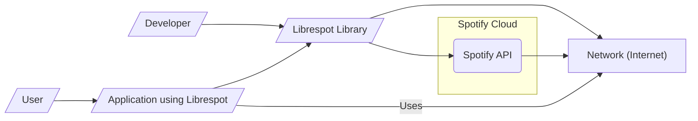
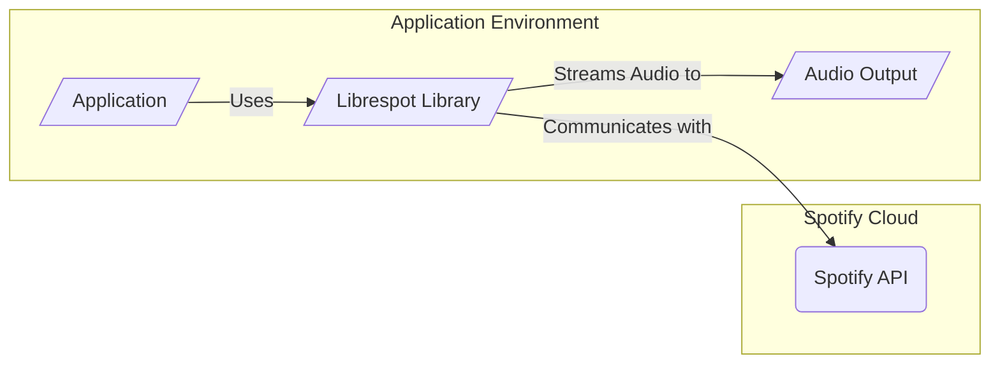
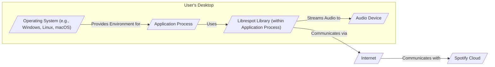
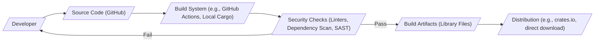

# BUSINESS POSTURE

- Business Priorities and Goals:
 - Provide an open-source library for interacting with the Spotify Connect protocol.
 - Enable developers to build custom Spotify clients and integrations.
 - Offer an alternative to the official Spotify client, potentially with different features or platform support.
 - Foster a community around reverse engineering and understanding the Spotify Connect protocol.
- Business Risks:
 - Legal risks associated with reverse engineering and interacting with Spotify's proprietary protocol and API.
 - Risk of Spotify changing their protocol or API, rendering librespot incompatible or broken.
 - Security vulnerabilities in librespot could expose users' Spotify accounts or devices to attacks.
 - Lack of official support and maintenance could lead to stagnation or security issues over time.
 - Potential misuse of the library for unauthorized access or distribution of copyrighted content.

# SECURITY POSTURE

- Existing Security Controls:
 - security control: Open source project with public code repository on GitHub (https://github.com/librespot-org/librespot).
 - security control: Utilizes Rust programming language, known for memory safety features.
 - security control: Relies on Spotify's authentication and authorization mechanisms.
- Accepted Risks:
 - accepted risk: Reverse engineering of Spotify's proprietary protocol carries inherent risks of instability and potential legal challenges.
 - accepted risk: Dependence on Spotify's API and infrastructure means changes on Spotify's side can impact librespot's functionality and security.
 - accepted risk: As a community-driven open-source project, the speed and responsiveness to security vulnerabilities may vary.
- Recommended Security Controls:
 - recommended security control: Implement automated vulnerability scanning and dependency checking in the build process.
 - recommended security control: Establish a clear process for reporting and addressing security vulnerabilities.
 - recommended security control: Provide guidelines and best practices for developers using librespot to build secure applications.
 - recommended security control: Conduct regular security audits and code reviews, especially for critical components like networking and protocol handling.
- Security Requirements:
 - Authentication:
  - Requirement: Securely authenticate with Spotify's service using user credentials or device keys.
  - Requirement: Handle Spotify's authentication protocols (e.g., username/password, OAuth, device authentication).
  - Existing control: Relies on Spotify's authentication mechanisms, implementation details within librespot code.
 - Authorization:
  - Requirement: Enforce Spotify's authorization policies to ensure users only access allowed content and features.
  - Requirement: Properly handle Spotify's access tokens and permissions.
  - Existing control: Relies on Spotify's authorization mechanisms, implementation details within librespot code.
 - Input Validation:
  - Requirement: Validate all input received from the network (Spotify protocol messages) to prevent injection attacks and protocol manipulation.
  - Requirement: Sanitize any user input if the library exposes any user-facing interfaces (though primarily a library).
  - Existing control: Input validation practices within the codebase need to be reviewed and strengthened.
 - Cryptography:
  - Requirement: Securely implement cryptographic algorithms for communication with Spotify's servers (e.g., TLS, encryption of sensitive data).
  - Requirement: Properly manage and protect cryptographic keys if any are handled locally.
  - Existing control: Likely uses standard Rust crypto libraries, needs verification of correct implementation and usage.

# DESIGN

- C4 CONTEXT

- C4 CONTEXT Elements:
 - - Name: User
   - Type: Person
   - Description: End-user who wants to listen to Spotify music through an application built with librespot.
   - Responsibilities: Interacts with the application to control music playback. Provides Spotify credentials to the application.
   - Security controls: User is responsible for the security of their Spotify credentials. Application should guide users on secure password practices.
 - - Name: Developer
   - Type: Person
   - Description: Software developer who uses the librespot library to build applications.
   - Responsibilities: Integrates librespot into their applications. Responsible for the security of the application they build, including proper use of librespot and handling of user data.
   - Security controls: Developers are responsible for following secure coding practices and using librespot securely.
 - - Name: Librespot Library
   - Type: Software System
   - Description: Open-source library written in Rust that implements the Spotify Connect protocol. Allows applications to connect to Spotify and stream music.
   - Responsibilities: Handles Spotify authentication, communication with Spotify API, audio streaming, and protocol implementation.
   - Security controls: Input validation, secure communication (TLS), secure coding practices in Rust, vulnerability scanning (recommended).
 - - Name: Application using Librespot
   - Type: Software System
   - Description: Application built by developers that utilizes the librespot library to provide Spotify functionality to users. Examples could be command-line players, integrations with smart home systems, etc.
   - Responsibilities: Provides user interface, manages user interactions, uses librespot to interact with Spotify, handles audio output.
   - Security controls: Depends on the application's design and implementation. Should include secure handling of user credentials, secure communication, input validation, and protection of user data.
 - - Name: Spotify API
   - Type: External System
   - Description: Spotify's proprietary API and backend services that librespot interacts with to authenticate, retrieve music metadata, and stream audio.
   - Responsibilities: Provides Spotify's music catalog, user account management, authentication services, and streaming infrastructure.
   - Security controls: Spotify's security controls for their API and infrastructure. Librespot relies on the security of Spotify's API.
 - - Name: Network (Internet)
   - Type: Infrastructure
   - Description: The internet network that connects the user's application, librespot, and Spotify's servers.
   - Responsibilities: Provides communication channel between all components.
   - Security controls: Network security is assumed to be in place (e.g., firewalls, network monitoring). Librespot uses TLS for communication over the network.

- C4 CONTAINER

- C4 CONTAINER Elements:
 - - Name: Application
   - Type: Container (Process)
   - Description: The main application process that is built by a developer and uses the librespot library. This could be a desktop application, a command-line tool, or an embedded system application.
   - Responsibilities: User interface, application logic, managing librespot instance, handling user input, controlling audio output.
   - Security controls: Application-specific security controls. Should securely manage any user data, handle authentication flows, and interact with librespot securely.
 - - Name: Librespot Library
   - Type: Container (Library)
   - Description: The core librespot library, linked into the application. Contains modules for networking, Spotify protocol handling, audio decoding, and device management.
   - Responsibilities: Spotify authentication, protocol implementation, communication with Spotify API, audio streaming and decoding, device registration and management.
   - Security controls: Input validation within protocol handling, secure network communication (TLS), memory safety provided by Rust, vulnerability scanning during development (recommended).
 - - Name: Audio Output
   - Type: Container (System Interface)
   - Description: The system's audio output interface (e.g., sound card, audio device) that receives the decoded audio stream from librespot and plays it to the user.
   - Responsibilities: Playback of audio stream.
   - Security controls: Operating system and hardware level security controls for audio output. Librespot should not directly interact with audio output in a way that introduces security risks beyond potential audio vulnerabilities in underlying systems.
 - - Name: Spotify API
   - Type: External System
   - Description: Spotify's API, as described in the Context Diagram.
   - Responsibilities: Same as in Context Diagram.
   - Security controls: Same as in Context Diagram.

- DEPLOYMENT

- Deployment Options:
 - Option 1: As a library embedded within a desktop application (e.g., command-line player).
 - Option 2: As a library used in a server-side application (e.g., music streaming server).
 - Option 3: As a library embedded in an embedded system (e.g., smart speaker).

- Detailed Deployment (Example: Desktop Application):

- DEPLOYMENT Elements (Desktop Application Example):
 - - Name: User's Desktop
   - Type: Environment
   - Description: The user's personal computer or laptop where the application is installed and run.
   - Responsibilities: Provides the execution environment for the application and librespot. Provides audio output capabilities.
   - Security controls: User's desktop security controls (operating system security, antivirus, firewall). User is responsible for maintaining the security of their desktop environment.
 - - Name: Operating System (e.g., Windows, Linux, macOS)
   - Type: Infrastructure Software
   - Description: The operating system running on the user's desktop.
   - Responsibilities: Provides system resources, manages processes, provides security features, handles audio output drivers.
   - Security controls: Operating system security features (user access control, process isolation, security updates).
 - - Name: Application Process
   - Type: Software Process
   - Description: The running instance of the application that uses librespot.
   - Responsibilities: Application logic, user interface, managing librespot, handling user input, controlling audio output.
   - Security controls: Application-specific security controls. Process isolation provided by the operating system.
 - - Name: Librespot Library (within Application Process)
   - Type: Software Component
   - Description: The librespot library loaded into the application process.
   - Responsibilities: Spotify communication, protocol handling, audio streaming, as described in Container Diagram.
   - Security controls: Same as in Container Diagram (input validation, secure communication, Rust memory safety).
 - - Name: Audio Device
   - Type: Hardware
   - Description: The audio output device connected to the user's desktop (e.g., speakers, headphones).
   - Responsibilities: Audio playback.
   - Security controls: Hardware and driver level security controls.
 - - Name: Internet
   - Type: Network
   - Description: The internet network.
   - Responsibilities: Network communication.
   - Security controls: Network security controls.
 - - Name: Spotify Cloud
   - Type: External System
   - Description: Spotify's cloud infrastructure.
   - Responsibilities: Spotify services.
   - Security controls: Spotify's cloud security controls.

- BUILD

- BUILD Elements:
 - - Name: Developer
   - Type: Person
   - Description: Software developer contributing to the librespot project.
   - Responsibilities: Writing code, committing code to the repository, fixing bugs, implementing features.
   - Security controls: Developer's secure coding practices, code review process (if any).
 - - Name: Source Code (GitHub)
   - Type: Code Repository
   - Description: The GitHub repository hosting the librespot source code (https://github.com/librespot-org/librespot).
   - Responsibilities: Version control, source code management, collaboration platform.
   - Security controls: GitHub's security controls (access control, vulnerability scanning, audit logs).
 - - Name: Build System (e.g., GitHub Actions, Local Cargo)
   - Type: Automation System
   - Description: System used to automate the build process, compile the Rust code, and create distributable artifacts. Could be GitHub Actions, local Cargo build, or other CI/CD systems.
   - Responsibilities: Automated build process, compilation, testing, packaging.
   - Security controls: Access control to build system, secure configuration of build pipelines, logging and monitoring of build processes.
 - - Name: Security Checks (Linters, Dependency Scan, SAST)
   - Type: Security Tooling
   - Description: Automated security checks integrated into the build process. Includes linters, dependency vulnerability scanners, and Static Application Security Testing (SAST) tools.
   - Responsibilities: Identify potential security vulnerabilities and code quality issues early in the development lifecycle.
   - Security controls: Configuration and maintenance of security scanning tools, ensuring tools are up-to-date and effective.
 - - Name: Build Artifacts (Library Files)
   - Type: Software Artifact
   - Description: The compiled library files (e.g., `.rlib`, `.so`, `.dll`) produced by the build process.
   - Responsibilities: Distributable library components.
   - Security controls: Integrity checks (e.g., checksums) for build artifacts. Secure storage of build artifacts before distribution.
 - - Name: Distribution (e.g., crates.io, direct download)
   - Type: Distribution Channel
   - Description: Mechanisms for distributing the built librespot library to developers and users. Could be crates.io (Rust package registry), direct downloads from GitHub releases, or other distribution methods.
   - Responsibilities: Making the library available to users.
   - Security controls: Secure distribution channels (HTTPS), integrity checks for distributed artifacts (signatures, checksums).

# RISK ASSESSMENT

- Critical Business Processes to Protect:
 - For librespot as a library: Providing core Spotify Connect functionality reliably and securely. Maintaining compatibility with Spotify's protocol.
 - For applications using librespot: Audio streaming, Spotify account access, user experience.
- Data to Protect and Sensitivity:
 - Spotify Credentials (username/password, device keys): Highly sensitive. Compromise could lead to unauthorized access to Spotify accounts.
 - Spotify Access Tokens: Sensitive. Used for authorization to Spotify services.
 - Audio Streams: Moderately sensitive. Copyrighted content, but less sensitive than credentials.
 - User Data (depending on application using librespot): Sensitivity varies depending on what data the application collects and stores. Librespot itself should not handle user data beyond Spotify interaction.

# QUESTIONS & ASSUMPTIONS

- Questions:
 - What are the primary use cases and target applications for librespot? (e.g., embedded systems, desktop clients, server-side integrations).
 - Are there specific security compliance requirements or industry standards that need to be considered?
 - What is the expected lifespan and maintenance plan for the librespot project?
 - What are the community's expectations regarding security and vulnerability management?
 - Are there any specific deployment environments or constraints that need to be considered for security?
- Assumptions:
 - BUSINESS POSTURE: The primary goal is to provide a functional and open-source Spotify Connect library for developers and enthusiasts. Legal and Spotify API compatibility risks are acknowledged but accepted.
 - SECURITY POSTURE: Security is important, but the project is community-driven and may have resource limitations for extensive security measures. Focus is on core security principles and addressing critical vulnerabilities. Secure Software Development Lifecycle practices are encouraged but may not be fully formalized.
 - DESIGN: The design is centered around a library architecture that applications can integrate. Deployment scenarios are varied, depending on the application using librespot. Build process utilizes standard Rust tooling and can be enhanced with security checks.