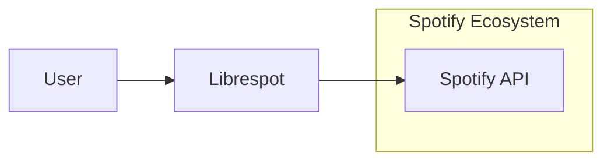
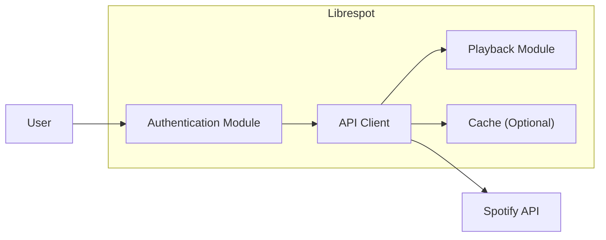
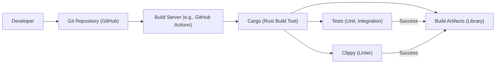

# Project Design Document: Librespot

## BUSINESS POSTURE

Librespot is an open-source project aiming to provide a reverse-engineered, lightweight Spotify client library. This allows users to stream music from Spotify without using the official client. The primary business goals are:

*   Provide a free and open-source alternative to the official Spotify client.
*   Enable integration with Spotify on platforms or devices where the official client is unavailable or undesirable.
*   Offer a lightweight and customizable solution for developers and hobbyists.
*   Maintain compatibility with Spotify's evolving API (to the extent possible without violating terms of service).

The most important business risks that need to be addressed are:

*   Legal action from Spotify: Since Librespot is a reverse-engineered client, there's a risk of legal challenges from Spotify, including cease and desist orders.
*   API changes breaking functionality: Spotify frequently updates its API, which can break Librespot's functionality, requiring constant maintenance and updates.
*   Account suspensions: Users of Librespot *might* face account suspensions from Spotify, although this is less likely than legal action against the project itself.
*   Reputational damage: If Librespot is used for malicious purposes (which is beyond the project's control), it could damage the project's reputation.
*   Maintainer burnout: As an open-source project, it relies on volunteer maintainers. The constant effort to keep up with Spotify's changes can lead to maintainer burnout.

## SECURITY POSTURE

Librespot, by its nature, interacts with a proprietary, closed-source system (Spotify). This inherently limits the extent to which security can be fully controlled. The project's security posture is largely reactive, adapting to changes in Spotify's security measures.

Existing security controls:

*   security control: Reverse engineering best practices: The project attempts to understand and replicate Spotify's communication protocols securely.
*   security control: Community code review: Being open-source allows for community scrutiny of the codebase, potentially identifying vulnerabilities.
*   security control: Use of Rust: Rust, as a memory-safe language, helps prevent common vulnerabilities like buffer overflows.

Accepted risks:

*   accepted risk: Reliance on Spotify's security: Librespot inherently relies on the security of Spotify's API and infrastructure. Vulnerabilities in Spotify's systems could impact Librespot users.
*   accepted risk: Potential for misuse: The library *could* be used in ways that violate Spotify's terms of service, although the project itself does not endorse such use.
*   accepted risk: Limited control over data in transit: While Librespot likely uses encrypted communication (HTTPS), the specifics of Spotify's protocol are not fully known, so there's a degree of reliance on Spotify's implementation.
*   accepted risk: No formal security audits: As a community-driven project, Librespot likely lacks the resources for regular, professional security audits.

Recommended security controls:

*   security control: Static analysis: Integrate static analysis tools (e.g., Clippy for Rust) into the build process to catch potential vulnerabilities early.
*   security control: Fuzz testing: Implement fuzz testing to identify potential vulnerabilities related to unexpected input.
*   security control: Dependency management: Regularly review and update dependencies to address known vulnerabilities in third-party libraries.
*   security control: Document security considerations: Provide clear documentation for users about the security implications of using Librespot, including the risks involved.

Security Requirements:

*   Authentication:
    *   Librespot must securely handle Spotify credentials (username/password or API tokens).
    *   Credentials should never be stored in plain text within the application or its configuration.
    *   Support for OAuth 2.0 or other secure authentication mechanisms should be prioritized if Spotify provides such options.

*   Authorization:
    *   Librespot should only access Spotify resources that the authenticated user is authorized to access.
    *   The principle of least privilege should be followed, requesting only the necessary permissions from the Spotify API.

*   Input Validation:
    *   All input received from the Spotify API should be treated as untrusted and validated appropriately.
    *   This includes data related to track metadata, playlists, and user information.
    *   Invalid input should be handled gracefully without causing crashes or security vulnerabilities.

*   Cryptography:
    *   Librespot should use strong, industry-standard cryptographic algorithms and protocols for all communication with Spotify's servers (HTTPS).
    *   Any locally stored data (e.g., cached metadata) should be encrypted if it contains sensitive information.
    *   Cryptographic keys (if any) should be managed securely.

## DESIGN

### C4 CONTEXT



Element Descriptions:

*   Element:
    *   Name: User
    *   Type: Person
    *   Description: A person who wants to listen to music from Spotify.
    *   Responsibilities: Provides Spotify credentials, interacts with Librespot to play music.
    *   Security controls: Strong password practices, awareness of phishing attempts.

*   Element:
    *   Name: Librespot
    *   Type: Software System
    *   Description: An open-source Spotify client library.
    *   Responsibilities: Authenticates with Spotify, fetches music data, provides an API for playback.
    *   Security controls: Secure handling of credentials, input validation, use of HTTPS.

*   Element:
    *   Name: Spotify API
    *   Type: Software System
    *   Description: Spotify's official API for accessing music data and playback.
    *   Responsibilities: Provides music data, manages user accounts, enforces access control.
    *   Security controls: Authentication, authorization, rate limiting, encryption (HTTPS).

### C4 CONTAINER



Element Descriptions:

*   Element:
    *   Name: Authentication Module
    *   Type: Container
    *   Description: Handles user authentication with Spotify.
    *   Responsibilities: Manages user credentials, obtains access tokens.
    *   Security controls: Secure storage of credentials (if applicable), use of secure authentication protocols.

*   Element:
    *   Name: API Client
    *   Type: Container
    *   Description: Interacts with the Spotify API.
    *   Responsibilities: Sends requests to the Spotify API, parses responses.
    *   Security controls: Input validation, HTTPS communication.

*   Element:
    *   Name: Playback Module
    *   Type: Container
    *   Description: Handles audio playback.
    *   Responsibilities: Decodes audio streams, manages playback controls.
    *   Security controls: Secure handling of audio data.

*   Element:
    *   Name: Cache (Optional)
    *   Type: Container
    *   Description: Caches data from the Spotify API (e.g., metadata).
    *   Responsibilities: Stores and retrieves cached data.
    *   Security controls: Encryption of sensitive cached data (if applicable).

*   Element:
    *   Name: User
    *   Type: Person
    *   Description: A person who wants to listen to music from Spotify.
    *   Responsibilities: Provides Spotify credentials, interacts with Librespot to play music.
    *   Security controls: Strong password practices, awareness of phishing attempts.

*   Element:
    *   Name: Spotify API
    *   Type: Software System
    *   Description: Spotify's official API for accessing music data and playback.
    *   Responsibilities: Provides music data, manages user accounts, enforces access control.
    *   Security controls: Authentication, authorization, rate limiting, encryption (HTTPS).

### DEPLOYMENT

Librespot is a library, not a standalone application with a traditional deployment model. However, it can be integrated into various applications and deployed in different environments. Here are some possible deployment scenarios:

1.  **Embedded System:** Librespot can be embedded in devices like Raspberry Pi or other single-board computers to create custom Spotify players.
2.  **Desktop Application:** Librespot can be used as a backend for a desktop application, providing Spotify functionality.
3.  **Server Application:** Librespot could be part of a server application, for example, a music streaming service for a local network.
4.  **Mobile Application:** While less common due to mobile platform restrictions, Librespot *could* potentially be integrated into a mobile application.

We will describe deployment to Embedded System, specifically Raspberry Pi:

```mermaid
graph LR
    subgraph Raspberry Pi
        subgraph OS (e.g., Raspbian)
            LibrespotApp["Librespot-based Application"]
            LibrespotLib["Librespot Library"]
            AudioOutput["Audio Output (e.g., ALSA)"]

            LibrespotApp --> LibrespotLib
            LibrespotLib --> AudioOutput
        end
    end

    LibrespotApp --> SpotifyAPI["Spotify API"]

```

Element Descriptions:

*   Element:
    *   Name: Raspberry Pi
    *   Type: Hardware
    *   Description: A single-board computer.
    *   Responsibilities: Runs the operating system and the Librespot-based application.
    *   Security controls: Secure boot (if supported), OS hardening, firewall.

*   Element:
    *   Name: OS (e.g., Raspbian)
    *   Type: Software
    *   Description: The operating system running on the Raspberry Pi.
    *   Responsibilities: Provides system services, manages hardware resources.
    *   Security controls: Regular security updates, user account management, access control.

*   Element:
    *   Name: Librespot-based Application
    *   Type: Software
    *   Description: An application built using the Librespot library.
    *   Responsibilities: Provides the user interface and controls for interacting with Spotify.
    *   Security controls: Input validation, secure handling of user input.

*   Element:
    *   Name: Librespot Library
    *   Type: Software
    *   Description: The Librespot library itself.
    *   Responsibilities: Handles communication with Spotify, manages audio playback.
    *   Security controls: As described in previous sections.

*   Element:
    *   Name: Audio Output (e.g., ALSA)
    *   Type: Software
    *   Description: The system's audio output interface.
    *   Responsibilities: Plays audio data.
    *   Security controls: Access control to audio devices.

*   Element:
    *   Name: Spotify API
    *   Type: Software System
    *   Description: Spotify's official API for accessing music data and playback.
    *   Responsibilities: Provides music data, manages user accounts, enforces access control.
    *   Security controls: Authentication, authorization, rate limiting, encryption (HTTPS).

### BUILD

Librespot uses a typical Rust build process, leveraging Cargo, Rust's package manager and build tool.



Build Process Description:

1.  **Developer:** A developer writes code and pushes it to the Git repository hosted on GitHub.
2.  **Git Repository (GitHub):** The central repository for the Librespot source code.
3.  **Build Server (e.g., GitHub Actions):** A continuous integration (CI) service (like GitHub Actions) is triggered by pushes to the repository.
4.  **Cargo (Rust Build Tool):** Cargo is used to manage dependencies, compile the code, and run tests.
5.  **Tests (Unit, Integration):** Cargo executes unit and integration tests to ensure code quality and functionality.
6.  **Clippy (Linter):** Clippy, a Rust linter, is used to check for code style issues and potential errors.
7.  **Build Artifacts (Library):** If the build, tests, and linting are successful, Cargo produces the Librespot library as the build artifact.

Security Controls in Build Process:

*   security control: **Continuous Integration (CI):** GitHub Actions (or similar) automates the build and testing process, ensuring consistent and repeatable builds.
*   security control: **Automated Testing:** Unit and integration tests are run automatically on every build, catching bugs and regressions early.
*   security control: **Static Analysis (Clippy):** Clippy helps identify potential code quality and security issues.
*   security control: **Dependency Management (Cargo):** Cargo manages dependencies, making it easier to track and update them.  Regular audits of `Cargo.lock` should be performed.
*   security control: **Signed Commits (Recommended):** Developers should sign their Git commits to ensure the integrity and authenticity of the code.

## RISK ASSESSMENT

*   **Critical Business Processes:**
    *   Providing access to Spotify music streaming through an alternative client.
    *   Maintaining compatibility with Spotify's API.
    *   Ensuring the library is functional and reliable.

*   **Data Protection:**
    *   **User Credentials (High Sensitivity):** Librespot handles Spotify user credentials (username/password or tokens). This is the most sensitive data handled by the library. Compromise of credentials could lead to unauthorized access to a user's Spotify account.
    *   **Music Metadata (Low Sensitivity):** Librespot accesses and potentially caches music metadata (track titles, artist names, album art, etc.). This data is generally considered public, but excessive caching could raise privacy concerns.
    *   **Playback Data (Medium Sensitivity):** Data related to what a user is listening to could be considered sensitive, especially if aggregated over time. Librespot should minimize the collection and storage of this data.
    *   **API Communication (Medium Sensitivity):** The communication between Librespot and Spotify's API should be protected, as it may contain access tokens and other sensitive information.

## QUESTIONS & ASSUMPTIONS

*   **Questions:**
    *   What specific mechanisms does Librespot use to handle Spotify credentials? (e.g., direct username/password, OAuth tokens, etc.)
    *   Does Librespot implement any form of caching, and if so, what data is cached and for how long?
    *   What are the specific Spotify API endpoints that Librespot interacts with?
    *   Are there any plans to support alternative authentication methods (e.g., OAuth) if Spotify makes them available?
    *   How does Librespot handle API rate limiting imposed by Spotify?
    *   What measures are in place to prevent or mitigate potential denial-of-service attacks against Librespot or the Spotify API?
    *   How are errors and exceptions handled within Librespot, particularly those related to network communication and API responses?
    *   Does the project have a defined process for handling security vulnerabilities reported by the community?

*   **Assumptions:**
    *   **BUSINESS POSTURE:** We assume that the primary goal of Librespot is to provide a functional and legal alternative to the official Spotify client, not to circumvent Spotify's business model or terms of service.
    *   **SECURITY POSTURE:** We assume that Librespot uses HTTPS for all communication with Spotify's API. We assume that the project follows basic secure coding practices, but may lack formal security audits.
    *   **DESIGN:** We assume that Librespot's architecture is relatively simple, with modules for authentication, API communication, and playback. We assume that the build process uses standard Rust tools and CI/CD practices. We assume that deployment scenarios are diverse, ranging from embedded systems to desktop applications.