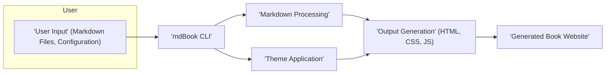
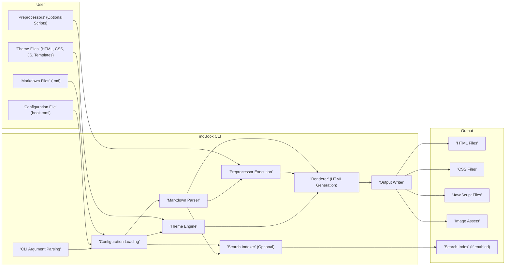

## Project Design Document: mdBook

**Version:** 1.1
**Date:** October 26, 2023
**Author:** AI Software Architect

### 1. Introduction

This document provides an enhanced design overview of mdBook, a command-line tool developed in Rust for efficiently generating static websites from Markdown files. This detailed description of the system's architecture, components, data flow, and core functionalities is intended to serve as a robust foundation for subsequent threat modeling activities.

### 2. Goals and Objectives

The primary goals of mdBook are:

*   To offer a straightforward and efficient method for generating static websites tailored for book-like content authored in Markdown.
*   To enable a customizable user experience through the implementation of theming and preprocessor capabilities.
*   To ensure ease of installation and usability across diverse operating system platforms.
*   To provide support for standard book features, including table of contents generation, cross-referencing, and search functionality.

### 3. System Architecture

mdBook employs a command-line interface (CLI) architecture. The central operation involves processing user-provided Markdown files and a configuration file to produce a static website.

#### 3.1. High-Level Architecture

*   **User Input:** The user provides the source material for the book, consisting of Markdown files that contain the book's content, and a configuration file (`book.toml`) that dictates the book's structure and settings.
*   **mdBook CLI:** This is the core executable that orchestrates the entire book generation process, acting as the central control point.
*   **Markdown Processing:** This stage involves parsing the input Markdown files, interpreting their syntax, and transforming them into an internal representation suitable for further processing.
*   **Theme Application:**  Here, the chosen theme is applied to the processed content. This involves using templates and stylesheets to define the visual presentation and layout of the final website.
*   **Output Generation:** This step takes the themed content and generates the final static website files, including HTML for the content structure, CSS for styling, and potentially JavaScript for interactive elements.
*   **Generated Book Website:** The final output is a collection of static files that constitute the complete book website, ready to be hosted on any standard web server.

#### 3.2. Detailed Architecture

*   **User Components:**
    *   **Markdown Files (.md):** These files contain the core content of the book, written using Markdown syntax.
    *   **Configuration File (book.toml):** This file, written in TOML format, specifies crucial book metadata (title, author), the book's structure (table of contents), theme selection, preprocessor configurations, and other settings.
    *   **Theme Files (HTML, CSS, JS, Templates):** These files define the visual appearance and interactive behavior of the generated book. They include HTML templates that structure the pages, CSS stylesheets for styling, JavaScript for dynamic elements, and potentially other asset files.
    *   **Preprocessors (Optional Scripts):** These are external, user-defined scripts that can be configured to modify the Markdown content before it is rendered into HTML. They allow for custom transformations and content manipulation.

*   **mdBook CLI Components:**
    *   **CLI Argument Parsing:** This component is responsible for interpreting the command-line arguments provided by the user when invoking the `mdbook` command (e.g., `mdbook build`, `mdbook serve`, `mdbook init`). It determines the user's intent and configures the execution accordingly.
    *   **Configuration Loading:** This component reads and parses the `book.toml` file. It validates the configuration and makes the settings available to other parts of the application.
    *   **Markdown Parser:** This component takes the Markdown files as input and parses them according to the Markdown specification. It transforms the Markdown syntax into an internal representation, often an Abstract Syntax Tree (AST), that can be further processed. This likely utilizes a library like `pulldown-cmark`.
    *   **Preprocessor Execution:** If preprocessors are defined in the `book.toml` file, this component executes them in the specified order. It passes the Markdown content to each preprocessor and receives the modified content as output, allowing for sequential content transformations.
    *   **Theme Engine:** This component loads and manages the selected theme. It reads the theme's HTML templates, CSS stylesheets, JavaScript files, and any other associated assets. It provides the necessary resources for the rendering process.
    *   **Renderer (HTML Generation):** This is the core component responsible for generating the final HTML files. It takes the processed Markdown content (potentially modified by preprocessors) and combines it with the theme's HTML templates. It populates the templates with the content, generating the final HTML structure for each page of the book.
    *   **Output Writer:** This component takes the generated HTML files, CSS files, JavaScript files, and other assets and writes them to the designated output directory (typically `book/`). It organizes the files according to the book's structure.
    *   **Search Indexer (Optional):** If the search feature is enabled in the configuration, this component processes the book's content and generates an index. This index allows users to search for specific terms within the generated book website, typically implemented using client-side JavaScript.

*   **Output Components:**
    *   **HTML Files:** These are the primary content files of the generated book website. Each HTML file represents a chapter or section of the book, containing the rendered Markdown content.
    *   **CSS Files:** These files contain the Cascading Style Sheets that define the visual presentation of the book, including layout, typography, colors, and other stylistic elements. These are typically provided by the selected theme.
    *   **JavaScript Files:** These files contain JavaScript code that can add interactive elements and dynamic behavior to the book website, such as search functionality, collapsible sections, or other enhancements. These can be part of the theme or added by the user.
    *   **Image Assets:** These are image files (e.g., PNG, JPEG, SVG) that are referenced within the Markdown content and are copied to the output directory to be displayed in the generated website.
    *   **Search Index (if enabled):** This is a data structure generated by the search indexer, containing an index of the book's content. It is used by the client-side search functionality to quickly find relevant pages based on user queries.

### 4. Data Flow

The flow of data within mdBook during the book generation process can be described as follows:

1. The user initiates the process by executing the `mdbook` command in the terminal, providing specific arguments that dictate the desired action (e.g., `build`, `serve`).
2. The **CLI Argument Parsing** component interprets these arguments, determining the user's intent and configuring the subsequent steps.
3. The **Configuration Loading** component reads and parses the `book.toml` file, extracting the book's settings, structure, and theme information.
4. The **Markdown Parser** reads the Markdown files specified in the `book.toml` and transforms their textual content into a structured, internal representation.
5. If **Preprocessors** are configured, the **Preprocessor Execution** component runs them sequentially, passing the parsed Markdown content as input and receiving potentially modified content.
6. The **Theme Engine** loads the assets of the selected theme, including HTML templates, CSS stylesheets, and JavaScript files.
7. The **Renderer** takes the processed Markdown content and the theme templates, combining them to generate the final HTML files for each page of the book.
8. The **Output Writer** saves the generated HTML files, along with the theme's CSS and JavaScript files, and any referenced image assets, to the output directory.
9. If the search feature is enabled, the **Search Indexer** processes the book's content and generates the search index files, which are also saved to the output directory.
10. The resulting static website, located in the output directory, can then be deployed to a web server for access by users.

### 5. Key Components and Technologies

*   **Core Programming Language:** Rust - chosen for its performance, safety, and concurrency features.
*   **Markdown Parsing Library:**  Likely `pulldown-cmark` or a similar robust Rust-based library that efficiently parses Markdown syntax into an abstract syntax tree.
*   **Templating Engine:**  A Rust-based templating engine is used within the **Theme Engine** to dynamically generate HTML from templates and data. Examples include Handlebars or Tera.
*   **CLI Argument Parsing Library:**  A library like `clap` is likely used to handle parsing command-line arguments, providing a user-friendly interface for interacting with the `mdbook` tool.
*   **Configuration Parsing Library:**  `toml-rs` or a similar Rust library is used to parse the `book.toml` configuration file, which is written in the TOML format.
*   **File System Operations:** Standard Rust libraries within the `std::fs` module are used for reading and writing files, essential for accessing Markdown files, theme assets, and writing the generated output.
*   **HTTP Server (for `mdbook serve`):** When using the `mdbook serve` command for local development, a lightweight Rust HTTP server library is employed to serve the generated static website.

### 6. Security Considerations (Preliminary)

This section outlines potential security considerations that will be further analyzed during the threat modeling process.

*   **Input Validation:**
    *   **Malicious Markdown Content:** If a user includes crafted Markdown content with embedded HTML or JavaScript, and this content is not properly sanitized during the rendering process, it could lead to Cross-Site Scripting (XSS) vulnerabilities in the generated website. For example, a malicious author could inject `` into a Markdown file.
    *   **Configuration File Manipulation:**  While less direct, if an attacker could modify the `book.toml` file, they might be able to point to malicious external resources (e.g., a rogue theme repository) or potentially influence the build process in unintended ways.
*   **Theme Security:**
    *   **Untrusted Themes:** If a user utilizes a theme from an untrusted source, that theme could contain malicious HTML, CSS, or JavaScript. This could lead to XSS attacks, where malicious scripts are executed in the browsers of users viewing the generated book. For instance, a theme's JavaScript could steal cookies or redirect users to phishing sites.
    *   **Template Injection:** Vulnerabilities in the templating engine or how themes are implemented could allow for template injection attacks, where an attacker could inject malicious code into the templates, leading to arbitrary code execution or information disclosure.
*   **Preprocessor Security:**
    *   **Malicious Preprocessors:** Because preprocessors are external scripts executed by mdBook, a malicious preprocessor could perform arbitrary actions on the system where mdBook is running, potentially compromising sensitive data or the system itself.
*   **Dependency Management:**
    *   **Supply Chain Attacks:** mdBook relies on external Rust crates. If any of these dependencies have known vulnerabilities, or if a malicious actor manages to inject malicious code into a dependency, it could compromise the security of mdBook itself.
*   **Output Security:**
    *   **Ensuring Secure HTML:** The generated HTML must be free from vulnerabilities. This includes proper escaping of user-provided content to prevent XSS and ensuring that any included JavaScript does not introduce security flaws.
*   **Local File Access:**  mdBook needs to access local files (Markdown, configuration, theme). Care must be taken to prevent path traversal vulnerabilities where a malicious actor could potentially access files outside the intended project directory.

### 7. Deployment

mdBook is typically deployed as a command-line tool installed on a developer's local machine or on a build server within a CI/CD pipeline. The generated static website, residing in the output directory, can then be deployed to any static web hosting service. Common deployment targets include:

*   GitHub Pages
*   Netlify
*   Vercel
*   AWS S3
*   Cloudflare Pages
*   Any standard web server capable of serving static files.

### 8. Future Considerations

*   **Enhanced Plugin System:** Developing a more robust and flexible plugin system to allow users to extend mdBook's functionality in a modular and controlled manner.
*   **Improved Theme Customization Options:** Providing more granular control and easier methods for users to customize the visual appearance of their books.
*   **Accessibility Enhancements:**  Continuously improving the accessibility of the generated books to ensure they are usable by individuals with disabilities, adhering to accessibility standards and best practices.
*   **Live Reloading Improvements:** Enhancing the `mdbook serve` functionality with more sophisticated live reloading capabilities for a smoother development experience.

This enhanced design document provides a more detailed and comprehensive overview of mdBook's architecture and functionality. It serves as a solid foundation for understanding the system and will be instrumental in identifying and mitigating potential security threats during the subsequent threat modeling phase.
