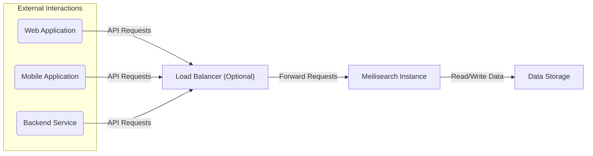
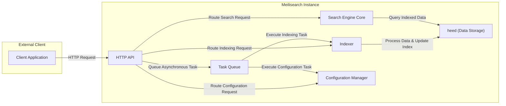
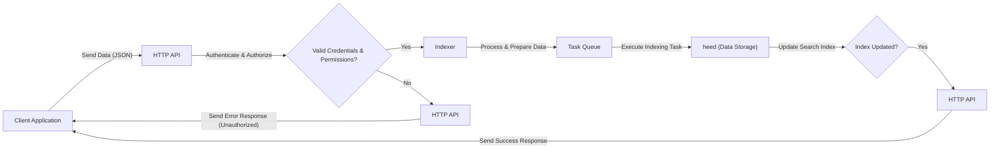
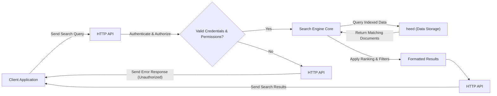
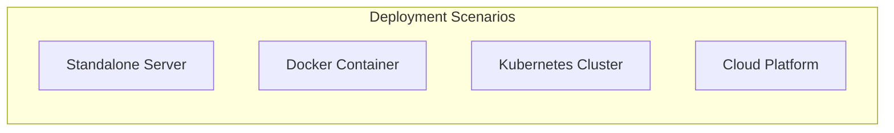

# Project Design Document: Meilisearch - Improved

**Document Version:** 1.1
**Date:** October 26, 2023
**Prepared By:** [Your Name/Organization]

## 1. Introduction

This document provides an enhanced design overview of the Meilisearch project, based on the GitHub repository: [https://github.com/meilisearch/meilisearch](https://github.com/meilisearch/meilisearch). This revised document aims for greater clarity and detail, specifically tailored for use in subsequent threat modeling activities. It elaborates on the system's architecture, component interactions, data flow, and security considerations, highlighting potential areas of interest for security analysis.

## 2. System Overview

Meilisearch is a powerful, open-source search engine designed for providing highly relevant search results with exceptional speed (millisecond latency). Its core strengths include:

*   **Robust Search Capabilities:**
    *   Typo tolerance for handling user errors.
    *   Filtering and faceting for refining search results.
    *   Sorting of results based on various attributes.
    *   Synonym support for understanding semantically similar terms.
    *   Customizable ranking rules to tailor search relevance.
*   **Developer-Friendly Interface:**
    *   RESTful API for easy integration.
    *   Comprehensive documentation and SDKs.
*   **User-Friendly Management:**
    *   Meilisearch Console: a web-based interface for managing indexes and settings.

## 3. System Architecture

Meilisearch employs a modular design, allowing for clear separation of concerns and independent scaling of components.

### 3.1. High-Level Architecture Diagram

### 3.2. Component Breakdown

*   **External Interactions:** Represent the various clients that communicate with Meilisearch.
    *   **Web Application:** A front-end application used by end-users.
    *   **Mobile Application:** A mobile application interacting with the search engine.
    *   **Backend Service:** Another service that programmatically interacts with Meilisearch.
*   **Load Balancer (Optional):** Distributes incoming traffic across multiple Meilisearch instances for high availability and scalability.
*   **Meilisearch Instance:** The core processing unit, encompassing several sub-components:
    *   **"HTTP API":**  The entry point for all external requests, handling authentication, authorization, request routing, and response formatting.
    *   **"Indexer":**  Responsible for processing incoming data, building and updating the search index. This involves tokenization, stemming, and other text processing techniques.
    *   **"Search Engine Core":** Executes search queries against the indexed data, applying ranking rules, filters, and sorting.
    *   **"Configuration Manager":**  Manages the internal settings and configurations of the Meilisearch instance, including API keys, index settings, and ranking rules.
    *   **"Task Queue":**  Handles asynchronous operations, such as indexing tasks, in a non-blocking manner.
*   **Data Storage:**  Persists the indexed data, configuration settings, and other persistent state.
    *   **"heed (Embedded Database)":** Meilisearch utilizes `heed`, an embedded key-value store, for efficient and reliable data persistence.

### 3.3. Detailed Component Interaction Diagram

## 4. Data Flow

This section details the flow of data during indexing and searching operations, highlighting potential security considerations at each stage.

### 4.1. Indexing Data Flow

*   **Client Application:** Sends data, typically in JSON format, to the Meilisearch API for indexing.
*   **HTTP API:** Receives the data and performs crucial authentication and authorization checks using API keys.
*   **Indexer:** Upon successful authentication and authorization, the Indexer processes the data, performing tokenization, stemming, and other necessary transformations.
*   **Task Queue:**  The indexing task is added to the Task Queue for asynchronous processing, preventing blocking of the main API thread.
*   **heed (Data Storage):** The processed data is used to update the search index within the `heed` database.
*   **HTTP API:**  Sends a success or error response back to the client, indicating the outcome of the indexing operation.

### 4.2. Searching Data Flow

*   **Client Application:** Sends a search query to the Meilisearch API.
*   **HTTP API:** Receives the search query and performs authentication and authorization checks. Search-specific API keys might have restricted access.
*   **Search Engine Core:**  If authorized, the Search Engine Core receives the query and interacts with the `heed` database to retrieve matching documents based on the indexed data.
*   **heed (Data Storage):**  Provides the relevant indexed data to the Search Engine Core.
*   **HTTP API:** Formats the search results according to the API specification and sends them back to the client.

## 5. Security Considerations

Security is a paramount concern in Meilisearch's design. Key considerations include:

*   **Authentication and Authorization:**
    *   **API Keys:** Meilisearch relies on API keys for authenticating requests. Different key types (e.g., `admin`, `search`) offer varying levels of privileges, adhering to the principle of least privilege.
    *   **Key Management:** Secure generation, storage, and rotation of API keys are crucial.
*   **Transport Layer Security (TLS):**
    *   **HTTPS Enforcement:** All communication with the Meilisearch API should be encrypted using HTTPS to protect data in transit.
*   **Data Security:**
    *   **Data Isolation:**  Multiple indexes provide logical separation of data.
    *   **Access Control:** API keys control access to specific indexes and operations.
*   **Input Validation:**
    *   **Sanitization:** The HTTP API must rigorously validate and sanitize all incoming data to prevent injection attacks (e.g., SQL injection, command injection - though less directly applicable due to the nature of Meilisearch).
*   **Rate Limiting:**
    *   **DoS Prevention:** Implementing rate limiting on API endpoints can mitigate denial-of-service attacks.
*   **Security Headers:**
    *   **Defense in Depth:** Properly configuring HTTP security headers (e.g., `Content-Security-Policy`, `X-Frame-Options`, `Strict-Transport-Security`) adds an extra layer of protection against common web vulnerabilities.
*   **Auditing and Logging:**
    *   **Activity Tracking:**  Logging API requests and administrative actions is essential for security monitoring and incident response.
*   **Dependency Management:**
    *   **Vulnerability Scanning:** Regularly scanning dependencies for known vulnerabilities is important for maintaining a secure system.
*   **Secure Defaults:**
    *   Meilisearch strives to have secure default configurations to minimize the risk of misconfiguration.

## 6. Deployment Architecture

Meilisearch offers flexibility in deployment options, each with its own security implications:

*   **Standalone Instance:** A single Meilisearch process running on a server. Security relies heavily on the host operating system and network configuration.
*   **Docker Container:** Encapsulates Meilisearch and its dependencies, providing a more isolated environment. Security best practices for containerization should be followed.
*   **Orchestration Platforms (e.g., Kubernetes):** Enables scalable and resilient deployments. Security considerations include securing the Kubernetes cluster itself and managing secrets.
*   **Cloud Platforms (e.g., AWS, GCP, Azure):** Leverages cloud provider security features, but requires careful configuration of network access control lists (ACLs), firewalls, and identity and access management (IAM).

## 7. External Dependencies

Meilisearch's functionality relies on the following external components:

*   **Operating System:** The underlying OS providing the execution environment.
*   **CPU Architecture:** The processor architecture for which Meilisearch is compiled.
*   **Memory:** Sufficient RAM for efficient data processing and caching.
*   **Disk Space:** Storage for the indexed data and configuration files.
*   **Network:**  Network infrastructure for communication with clients.
*   **`heed`:** The embedded database library for persistent storage.
*   **Rust Standard Library and Crates:**  Meilisearch is built using Rust and its ecosystem of libraries.

## 8. Assumptions and Constraints

*   Secure network infrastructure is assumed.
*   Best practices for server and application security are expected to be followed in the deployment environment.
*   This document focuses on the core Meilisearch engine and its direct dependencies. Client-side security is outside the scope.
*   The information is based on the current understanding of Meilisearch as of this document's creation.

This improved design document provides a more detailed and structured overview of Meilisearch, specifically tailored for threat modeling. It highlights key components, data flows, and security considerations, offering a solid foundation for identifying potential vulnerabilities and designing appropriate mitigations.
