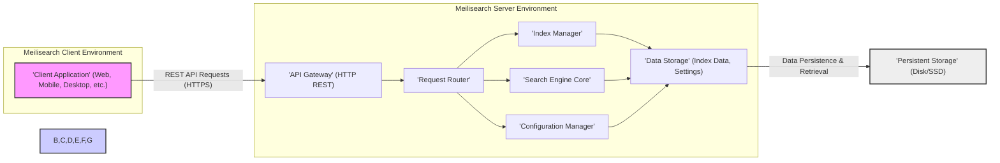
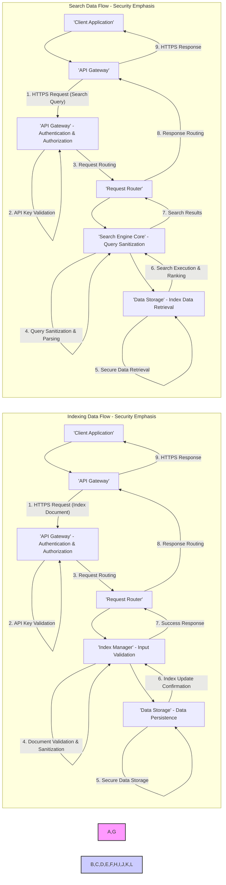

# Project Design Document: Meilisearch - Improved Version

## 1. Project Overview

Meilisearch is engineered as a highly performant and user-centric open-source search engine. Its primary design goal is to deliver an exceptionally fast and relevant search experience, incorporating features like typo tolerance, faceted search, and dynamic ranking. Meilisearch is designed for ease of integration and deployment, offering a comprehensive RESTful API for seamless incorporation into diverse applications and services. This document provides a refined and detailed design specification of Meilisearch, specifically tailored to facilitate comprehensive threat modelling and security evaluations.

## 2. Goals and Objectives

*   **Primary Goal:** To furnish an enhanced and detailed design document for Meilisearch, with a strong emphasis on architectural components, data flow mechanisms, and security considerations. This document is explicitly intended to serve as the foundation for rigorous threat modelling activities.
*   **Objectives:**
    *   To articulate a clear and comprehensive depiction of the Meilisearch system architecture, encompassing both high-level and granular component details.
    *   To precisely identify and describe the functionalities of all key components within the Meilisearch ecosystem.
    *   To visually and textually illustrate the complete data flow pathways within the system, covering indexing and search operations.
    *   To thoroughly highlight initial security considerations, potential vulnerability areas, and recommended mitigation strategies.
    *   To delineate typical deployment models for Meilisearch, considering various infrastructure environments.
    *   To accurately list the core technologies and programming languages underpinning Meilisearch's implementation.

## 3. Target Audience

This document is specifically crafted for the following audience:

*   **Cybersecurity Professionals:** Security engineers, security architects, and penetration testers who will be responsible for conducting threat modelling, vulnerability assessments, and security audits of Meilisearch deployments.
*   **Software Developers:** Developers seeking a deep understanding of Meilisearch's internal architecture for development, debugging, performance optimization, or contribution to the open-source project.
*   **DevOps and Operations Teams:** Teams responsible for the deployment, configuration, management, and maintenance of Meilisearch instances in production and development environments.
*   **Technical Stakeholders:** Individuals requiring a comprehensive understanding of Meilisearch's design, capabilities, and security posture, including project managers, product owners, and technical decision-makers.

## 4. System Architecture

### 4.1. High-Level Architecture

Meilisearch adopts a classic client-server architecture, facilitating interaction through a well-defined RESTful API. Client applications communicate with the Meilisearch server to perform indexing, search queries, and configuration management tasks. The server is responsible for processing requests, managing data, and returning responses.

*   **'Client Application' (Web, Mobile, Desktop, etc.):** Represents any application or service that interacts with Meilisearch by sending requests to its REST API. This could be a frontend web application, a mobile app, a backend service, or command-line tools.
*   **'API Gateway' (HTTP REST):** Serves as the single entry point for all external API requests. Key responsibilities include:
    *   Receiving and validating incoming HTTP requests.
    *   Handling HTTPS termination and ensuring secure communication.
    *   API Key authentication and authorization enforcement.
    *   Rate limiting and request throttling to protect against abuse.
    *   Cross-Origin Resource Sharing (CORS) policy enforcement.
    *   Routing requests to the 'Request Router'.
    *   Formatting API responses in JSON.
*   **'Request Router':**  Analyzes incoming requests from the 'API Gateway' and directs them to the appropriate internal component based on the requested API endpoint and operation. This component acts as a dispatcher within the server.
*   **'Index Manager':**  Manages all aspects related to search indexes. Its functions include:
    *   Index creation, deletion, and updates.
    *   Document indexing (adding, updating, deleting documents within indexes).
    *   Managing index settings such as searchable attributes, ranking rules, stop words, and synonyms.
    *   Optimizing index structures for search performance and storage efficiency.
    *   Persisting index data and metadata to 'Data Storage'.
    *   Handling index backups and restoration processes.
*   **'Search Engine Core':** The central processing unit for search operations. It is responsible for:
    *   Receiving search queries from the 'Request Router'.
    *   Parsing and analyzing search queries to understand user intent.
    *   Performing fast and relevant searches across indexed data using optimized algorithms and data structures.
    *   Applying typo tolerance, stemming, and other natural language processing techniques.
    *   Applying filters, sorts, and facets to refine search results.
    *   Ranking search results based on configured ranking rules and relevance algorithms.
    *   Returning search results to the 'Request Router'.
*   **'Configuration Manager':**  Manages the global configuration and settings of the Meilisearch instance. This includes:
    *   Managing API keys (creation, revocation, permissions).
    *   Handling global settings and parameters.
    *   Potentially managing user roles and permissions for more granular access control (future enhancement).
    *   Persisting configuration data to 'Data Storage'.
*   **'Data Storage' (Index Data, Settings):**  Provides persistent storage for all critical Meilisearch data. This encompasses:
    *   Indexed documents and associated data.
    *   Index metadata and settings.
    *   Global configuration settings.
    *   API keys and access control information.
    *   Typically implemented using an embedded key-value database for performance and efficiency.
*   **'Persistent Storage' (Disk/SSD):**  The physical storage medium where 'Data Storage' persists data. This is usually disk or SSD storage attached to the server.

### 4.2. Detailed Component Architecture (Further Elaboration)

#### 4.2.1. 'API Gateway' (HTTP REST) - Security Focus

*   **API Key Authentication:** Implements API key-based authentication. API keys are typically bearer tokens passed in headers. Secure generation, storage, and transmission of API keys are paramount.
*   **Authorization:** Enforces authorization policies based on API key permissions. Different API keys can be granted varying levels of access (e.g., read-only, index creation, admin).
*   **HTTPS Enforcement:**  Mandates HTTPS for all API communication to encrypt data in transit and protect against eavesdropping and man-in-the-middle attacks.
*   **Rate Limiting & Throttling:**  Implements configurable rate limiting and request throttling to prevent denial-of-service (DoS) attacks and abuse.
*   **CORS Policy:**  Enforces a strict CORS policy to control which origins are permitted to access the API, mitigating cross-site scripting (XSS) risks and unauthorized API usage from untrusted domains.
*   **Input Sanitization (Initial Stage):** Performs initial input sanitization and validation at the API gateway level to reject malformed requests early in the processing pipeline.

#### 4.2.2. 'Request Router' - Minimal Security Role

*   Primarily focused on routing efficiency. Security considerations are minimal at this stage, as authentication and authorization are handled by the 'API Gateway'.
*   May perform basic request validation to ensure requests are well-formed before forwarding.

#### 4.2.3. 'Index Manager' - Data Integrity and Access Control

*   **Index-Level Access Control (Potential Future Feature):** Could potentially enforce access control at the index level, allowing for more granular permissions (e.g., API key access to specific indexes only).
*   **Data Validation during Indexing:**  Performs validation of incoming documents during indexing to ensure data integrity and prevent indexing of malicious or corrupted data.
*   **Index Backup and Restore Security:**  Secure backup and restore mechanisms are crucial to prevent unauthorized access to backups and ensure data recovery in case of failures. Backups should be protected with appropriate access controls.

#### 4.2.4. 'Search Engine Core' - Query Security and Performance

*   **Query Parsing and Sanitization:**  Performs robust query parsing and sanitization to prevent query injection attacks. Ensures user-provided search terms are handled safely and do not lead to unintended data access or manipulation.
*   **Resource Limits:**  Implements resource limits on search queries to prevent resource exhaustion and denial-of-service attacks caused by overly complex or resource-intensive queries.
*   **Performance Optimization:**  Optimized for speed and efficiency to minimize response times and reduce the attack surface associated with slow processing.

#### 4.2.5. 'Configuration Manager' - Critical Security Component

*   **API Key Management Security:**  Securely manages API keys, including generation, storage (ideally hashed and salted), revocation, and rotation.
*   **Access Control Configuration:**  Defines and enforces access control policies, determining which API keys have access to which functionalities and data.
*   **Audit Logging:**  Logs security-relevant events, such as API key creation, revocation, authentication failures, and authorization violations, to facilitate security monitoring and incident response.
*   **Secure Configuration Defaults:**  Ensures secure default configurations are in place and guides users towards secure configuration practices.

#### 4.2.6. 'Data Storage' (Index Data) - Data at Rest Security

*   **Data at Rest Encryption (Future Enhancement):**  Consideration for implementing data at rest encryption to protect sensitive indexed data stored in 'Data Storage'. This would require secure key management practices.
*   **Access Control to Storage:**  Operating system-level access controls must be configured to restrict access to the underlying 'Persistent Storage' and the 'Data Storage' files, preventing unauthorized access to the raw data.
*   **Data Integrity Mechanisms:**  Employs mechanisms to ensure data integrity and prevent data corruption or tampering within 'Data Storage'.

## 5. Data Flow (Detailed and Security Focused)

The following diagrams illustrate the data flow for indexing and searching, highlighting security-relevant stages.

*   **Indexing Data Flow - Security Emphasis:**
    1. **'Client Application'** initiates an indexing request via HTTPS to the **'API Gateway'**.
    2. **'API Gateway' - Authentication & Authorization:** Authenticates the request using the provided API key and authorizes the action based on API key permissions.
    3. **'Request Router'** routes the authenticated and authorized request to the **'Index Manager'**.
    4. **'Index Manager' - Input Validation:**  Validates and sanitizes the incoming document data to prevent injection attacks and ensure data integrity.
    5. **'Data Storage' - Data Persistence:** Securely persists the validated and sanitized data into 'Data Storage'.
    6. **'Data Storage'** confirms successful data persistence.
    7. **'Index Manager'** updates the index and confirms the update to the **'Request Router'**.
    8. **'Request Router'** routes the success response back to the **'API Gateway'**.
    9. **'API Gateway'** sends an HTTPS success response to the **'Client Application'**.

*   **Search Data Flow - Security Emphasis:**
    1. **'Client Application'** initiates a search query via HTTPS to the **'API Gateway'**.
    2. **'API Gateway' - Authentication & Authorization:** Authenticates the request using the provided API key and authorizes the search action.
    3. **'Request Router'** routes the authenticated and authorized request to the **'Search Engine Core'**.
    4. **'Search Engine Core' - Query Sanitization:** Sanitizes and parses the search query to prevent query injection attacks and ensure safe query processing.
    5. **'Data Storage' - Index Data Retrieval:** Securely retrieves necessary index data from 'Data Storage' to perform the search.
    6. **'Search Engine Core'** executes the search, ranks results, and generates search results.
    7. **'Search Engine Core'** sends the search results to the **'Request Router'**.
    8. **'Request Router'** routes the search results response to the **'API Gateway'**.
    9. **'API Gateway'** sends an HTTPS response containing the search results to the **'Client Application'**.

## 6. Security Considerations (Detailed and Categorized)

This section provides a more detailed and categorized breakdown of security considerations for Meilisearch, forming a basis for threat modelling.

*   **Authentication and Authorization:**
    *   **API Key Management:**
        *   **Threat:** Weak API key generation, insecure storage of API keys (e.g., plaintext in configuration files), unauthorized access to API keys.
        *   **Mitigation:** Use cryptographically secure random API key generation, store API keys securely (hashed and salted in 'Data Storage'), enforce least privilege for API keys, implement API key rotation, and provide secure API key management interfaces.
    *   **Authorization Granularity:**
        *   **Threat:** Insufficient granularity in authorization controls, leading to overly permissive API keys and potential for unauthorized actions.
        *   **Mitigation:** Implement more granular authorization mechanisms (e.g., role-based access control, index-level permissions) to restrict API key access to only necessary functionalities and data.

*   **Input Validation and Sanitization:**
    *   **API Request Validation:**
        *   **Threat:** Injection attacks (e.g., command injection, NoSQL injection) due to insufficient validation of API request parameters and headers.
        *   **Mitigation:** Implement strict input validation for all API requests, including data type validation, format validation, and range checks. Sanitize input data to remove potentially malicious characters or code.
    *   **Document Validation during Indexing:**
        *   **Threat:** Stored Cross-Site Scripting (XSS) vulnerabilities if unsanitized document content is indexed and later displayed in web applications.
        *   **Mitigation:** Sanitize and validate document content during indexing to prevent the storage of malicious scripts or code. Implement output encoding when displaying search results in web applications to further mitigate XSS risks.
    *   **Query Sanitization:**
        *   **Threat:** Query injection attacks if search queries are not properly sanitized, potentially leading to unauthorized data access or manipulation.
        *   **Mitigation:** Implement robust query parsing and sanitization to neutralize potentially malicious query syntax and prevent unintended query behavior.

*   **Data Security:**
    *   **Data in Transit Protection:**
        *   **Threat:** Eavesdropping and man-in-the-middle attacks if API communication is not encrypted.
        *   **Mitigation:** Enforce HTTPS for all API communication to encrypt data in transit and protect confidentiality and integrity.
    *   **Data at Rest Protection (Future Enhancement):**
        *   **Threat:** Unauthorized access to sensitive indexed data if 'Data Storage' is compromised.
        *   **Mitigation:** Implement data at rest encryption for 'Data Storage' to protect data confidentiality even if physical storage is accessed. Use secure key management practices for encryption keys.
    *   **Data Integrity:**
        *   **Threat:** Data corruption or tampering within 'Data Storage' leading to inaccurate search results or data loss.
        *   **Mitigation:** Employ data integrity mechanisms within 'Data Storage' (e.g., checksums, data validation) to detect and prevent data corruption. Implement regular data backups and disaster recovery procedures.

*   **Availability and Resilience:**
    *   **Denial of Service (DoS) Attacks:**
        *   **Threat:** API abuse or malicious attacks aimed at overwhelming the Meilisearch server and making it unavailable.
        *   **Mitigation:** Implement rate limiting, request throttling, and resource limits to mitigate DoS attacks. Deploy Meilisearch in a resilient infrastructure with redundancy and failover capabilities.
    *   **Resource Exhaustion:**
        *   **Threat:** Resource exhaustion due to overly complex search queries or indexing operations, leading to performance degradation or service unavailability.
        *   **Mitigation:** Implement resource limits for search queries and indexing operations. Optimize search algorithms and data structures for performance and efficiency.

*   **Operational Security:**
    *   **Logging and Monitoring:**
        *   **Threat:** Lack of visibility into security events and potential security breaches.
        *   **Mitigation:** Implement comprehensive logging for security-relevant events (authentication, authorization, errors, API access). Monitor system logs for suspicious activities and security incidents. Integrate with security information and event management (SIEM) systems.
    *   **Dependency Management:**
        *   **Threat:** Vulnerabilities in third-party dependencies used by Meilisearch.
        *   **Mitigation:** Maintain an inventory of dependencies, regularly scan dependencies for known vulnerabilities, and promptly update dependencies to patch security flaws.
    *   **Secure Configuration Management:**
        *   **Threat:** Misconfigurations leading to security vulnerabilities (e.g., insecure default settings, exposed ports, weak access controls).
        *   **Mitigation:** Provide secure default configurations, document secure configuration best practices, and automate configuration management to ensure consistent and secure settings across deployments.

## 7. Deployment Model - Security Considerations per Model

*   **Cloud Environments (AWS, GCP, Azure, etc.):**
    *   **Security Considerations:** Cloud provider security responsibilities (shared responsibility model), cloud-specific security configurations (firewalls, network security groups), IAM roles and permissions for Meilisearch instances, securing cloud storage for backups, potential data residency requirements.
    *   **Mitigation:** Leverage cloud provider security services, properly configure cloud security settings, implement strong IAM policies, encrypt data at rest in cloud storage, and comply with data residency regulations.

*   **On-Premise Environments:**
    *   **Security Considerations:** Organization's responsibility for all aspects of security (physical security, network security, server security), securing the underlying infrastructure, managing access control within the organization's network, ensuring physical security of servers.
    *   **Mitigation:** Implement robust on-premise security controls, including firewalls, intrusion detection/prevention systems, physical security measures, and strong internal access control policies.

*   **Containerized Deployments (Docker, Kubernetes):**
    *   **Security Considerations:** Container image security (vulnerability scanning, base image selection), container runtime security, Kubernetes security configurations (network policies, RBAC), securing container registries, secrets management for API keys and sensitive data in containers.
    *   **Mitigation:** Use hardened container images, regularly scan container images for vulnerabilities, implement Kubernetes security best practices, secure container registries, and use secure secrets management solutions for containerized deployments.

## 8. Technologies Used (Specifics)

*   **Programming Language:** Rust (primarily) - Known for memory safety and performance, contributing to inherent security.
*   **Data Storage:**  `heed` (likely - a fast, lightweight, and persistent ordered key-value store written in Rust, based on LMDB). This choice emphasizes performance and embedded nature.
*   **API Framework:** `actix-web` (likely - a powerful, pragmatic, and extremely fast web framework for Rust). `actix-web` is known for its performance and security features.
*   **Serialization:** `serde` and `serde_json` (Rust libraries for serialization and deserialization, specifically JSON).
*   **Build System:** `Cargo` (Rust's package manager and build tool) - Facilitates dependency management and reproducible builds.

## 9. Future Considerations (Security Focused Enhancements)

*   **Enhanced Access Control Mechanisms:** Implement Role-Based Access Control (RBAC) or Attribute-Based Access Control (ABAC) for more fine-grained authorization beyond API keys.
*   **Built-in Data at Rest Encryption:** Integrate native support for data at rest encryption within Meilisearch to simplify secure data storage.
*   **Security Auditing and Compliance Features:** Enhance audit logging capabilities to meet compliance requirements (e.g., PCI DSS, HIPAA, GDPR) and facilitate security audits.
*   **Threat Intelligence Integration:** Explore integration with threat intelligence feeds to proactively identify and mitigate potential threats.
*   **Security Automation:** Implement security automation for vulnerability scanning, configuration checks, and incident response to improve security posture and efficiency.
*   **Web Application Firewall (WAF) Integration Guidance:** Provide guidance and best practices for deploying Meilisearch behind a Web Application Firewall (WAF) to enhance API security.

This improved design document provides a more comprehensive and security-focused view of Meilisearch's architecture. It serves as a robust foundation for conducting detailed threat modelling and implementing appropriate security measures to protect Meilisearch deployments.