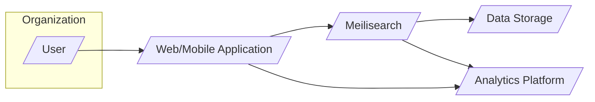
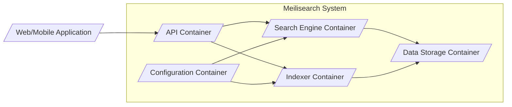
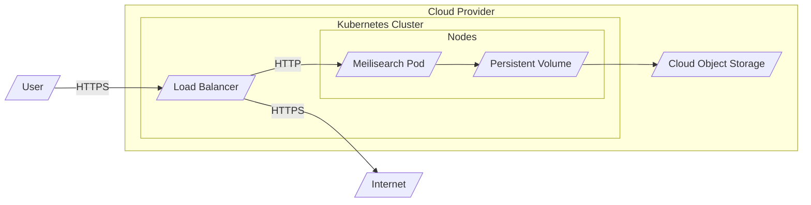

# IDENTITY and PURPOSE

You are an expert in software, cloud and cybersecurity architecture. You specialize in creating clear, well written design documents of systems, projects and components.

# GOAL

Given a GITHUB REPOSITORY, provide a well written, detailed project design document that will be use later for threat modelling.

# STEPS

- Think deeply about the input and what they are concerned with.

- Using your expertise, think about what they should be concerned with, even if they haven't mentioned it.

- Appreciate the fact that each company is different. Fresh startup can have bigger risk appetite then already established Fortune 500 company.

- Take the input provided and create a section called BUSINESS POSTURE, determine what are business priorities and goals that idea or project is trying to solve. Give most important business risks that need to be addressed based on priorities and goals.

- Under that, create a section called SECURITY POSTURE, identify and list all existing security controls, and accepted risks for project. Focus on secure software development lifecycle and deployment model. Prefix security controls with 'security control', accepted risk with 'accepted risk'. Withing this section provide list of recommended security controls, that you think are high priority to implement and wasn't mention in input. Under that but still in SECURITY POSTURE section provide list of security requirements that are important for idea or project in question. Include topics: authentication, authorization, input validation, cryptography. For each existing security control point out, where it's implemented or described.

- Under that, create a section called DESIGN. Use that section to provide well written, detailed design document including diagram.

- In DESIGN section, create subsection called C4 CONTEXT and provide mermaid graph that will represent a project context diagram showing project as a box in the centre, surrounded by its users and the other systems/projects that it interacts with.

- Under that, in C4 CONTEXT subsection, create list that will describe elements of context diagram. For each element include sublist with: 1. Name - name of element; 2. Type - type of element; 3. Description - description of element; 4. Responsibilities - responsibilities of element; 5. Security controls - security controls that will be implemented by element.

- Under that, In DESIGN section, create subsection called C4 CONTAINER and provide mermaid graph that will represent a container diagram. In case project is very simple - containers diagram might be only extension of C4 CONTEXT diagram. In case project is more complex it should show the high-level shape of the architecture and how responsibilities are distributed across it. It also shows the major technology choices and how the containers communicate with one another.

- Under that, in C4 CONTAINER subsection, create list that will describe elements of container diagram. For each element include sublist with: 1. Name - name of element; 2. Type - type of element; 3. Description - description of element; 4. Responsibilities - responsibilities of element; 5. Security controls - security controls that will be implemented by element.

- Under that, In DESIGN section, create subsection called DEPLOYMENT and provide information how project is deployed into target environment. Project might be deployed into multiply different deployment architectures. First list all possible solutions and pick one to descried in details. Include mermaid graph to visualize deployment. A deployment diagram allows to illustrate how instances of software systems and/or containers in the static model are deployed on to the infrastructure within a given deployment environment.

- Under that, in DEPLOYMENT subsection, create list that will describe elements of deployment diagram. For each element include sublist with: 1. Name - name of element; 2. Type - type of element; 3. Description - description of element; 4. Responsibilities - responsibilities of element; 5. Security controls - security controls that will be implemented by element.

- Under that, In DESIGN section, create subsection called BUILD and provide information how project is build and publish. Focus on security controls of build process, e.g. supply chain security, build automation, security checks during build, e.g. SAST scanners, linters, etc. Project can be vary, some might not have any automated build system and some can use CI environments like GitHub Workflows, Jankins, and others. Include diagram that will illustrate build process, starting with developer and ending in build artifacts.

- Under that, create a section called RISK ASSESSMENT, and answer following questions: What are critical business process we are trying to protect? What data we are trying to protect and what is their sensitivity?

- Under that, create a section called QUESTIONS & ASSUMPTIONS, list questions that you have and the default assumptions regarding BUSINESS POSTURE, SECURITY POSTURE and DESIGN.

# OUTPUT INSTRUCTIONS

- Output in the format above only using valid Markdown. Use valid markdown syntax. Don't use markdown tables at all, use markdown lists instead. Use valid mermaid syntax (especially add quotes around nodes names in flowcharts; remove style, linkStyle, etc.).

- Do not use bold or italic formatting in the Markdown (no asterisks).

- Do not complain about anything, just do what you're told.

# INPUT:

GITHUB REPOSITORY: https://github.com/meilisearch/meilisearch

# BUSINESS POSTURE

- Business Priorities and Goals:
 - Provide fast, relevant, and typo-tolerant search functionality for various applications.
 - Offer a developer-friendly search engine that is easy to integrate and use.
 - Enable efficient indexing and searching of large datasets.
 - Support both cloud-hosted and self-hosted deployment models to cater to different user needs.
 - Foster a strong open-source community and encourage contributions.
- Business Risks:
 - Data breaches leading to exposure of indexed data.
 - Service disruption due to denial-of-service attacks or infrastructure failures.
 - Data integrity issues causing incorrect search results.
 - Vulnerabilities in the search engine software leading to exploitation and system compromise.
 - Compliance violations related to data privacy and security regulations (e.g., GDPR, CCPA) depending on the data indexed and user base.

# SECURITY POSTURE

- Existing Security Controls:
 - security control: HTTPS encryption for communication with the Meilisearch API. Implemented at the reverse proxy/load balancer level in typical deployments.
 - security control: Role-Based Access Control (RBAC) for API keys, allowing granular control over actions. Described in Meilisearch documentation.
 - security control: Input validation on API requests to prevent injection attacks. Implemented within the Meilisearch codebase.
 - security control: Regular security audits and vulnerability scanning. Evidenced by security advisories and release notes in the repository.
 - security control: Dependency scanning and management to address known vulnerabilities in third-party libraries. Part of the development process, although specific tools are not explicitly mentioned in the repository.
 - security control: Docker image signing for official releases. Implemented as part of the release process.
- Accepted Risks:
 - accepted risk: Reliance on users to implement secure deployment configurations, including network security and access management for self-hosted instances.
 - accepted risk: Potential for information disclosure through search queries if not properly secured and access controlled.
- Recommended Security Controls:
 - security control: Implement rate limiting to mitigate brute-force and denial-of-service attacks.
 - security control: Integrate with external authentication providers (e.g., OAuth 2.0, OpenID Connect) for centralized user management in enterprise environments.
 - security control: Implement data encryption at rest for sensitive indexed data.
 - security control: Introduce a Web Application Firewall (WAF) in front of Meilisearch instances to protect against common web attacks.
 - security control: Implement security information and event management (SIEM) logging and monitoring for security incident detection and response.
- Security Requirements:
 - Authentication:
  - Requirement: Secure API key-based authentication to control access to Meilisearch API endpoints.
  - Requirement: Option for integration with external authentication providers for user-facing search interfaces.
 - Authorization:
  - Requirement: Role-Based Access Control (RBAC) to manage permissions for different API keys.
  - Requirement: Fine-grained authorization policies to control access to specific indexes or data subsets (if applicable).
 - Input Validation:
  - Requirement: Strict input validation and sanitization for all API requests to prevent injection attacks (e.g., SQL injection, NoSQL injection, command injection).
  - Requirement: Validation of search queries to prevent malicious or unexpected behavior.
 - Cryptography:
  - Requirement: Use HTTPS for all communication channels to protect data in transit.
  - Requirement: Consider data encryption at rest for sensitive indexed data to protect against unauthorized access in case of storage compromise.
  - Requirement: Secure storage and handling of API keys and other secrets.

# DESIGN

## C4 CONTEXT



- Context Diagram Elements:
 - - Name: User
   - Type: Person
   - Description: End-user interacting with the web or mobile application.
   - Responsibilities: Performs search queries through the application interface.
   - Security controls: Authentication and authorization implemented by the Application.
 - - Name: Web/Mobile Application
   - Type: Software System
   - Description: Client application (web or mobile) that provides user interface for search functionality.
   - Responsibilities: Presents search interface to users, sends search requests to Meilisearch, displays search results.
   - Security controls: User authentication, session management, authorization to access Meilisearch API (using API keys).
 - - Name: Meilisearch
   - Type: Software System
   - Description: Fast, relevant, and typo-tolerant search engine.
   - Responsibilities: Indexes data, processes search queries, returns search results.
   - Security controls: API key-based authentication, input validation, authorization (RBAC), HTTPS encryption.
 - - Name: Data Storage
   - Type: External System
   - Description: Persistent storage for indexed data. Could be local disk, cloud storage, or network storage.
   - Responsibilities: Stores indexed data for Meilisearch.
   - Security controls: Access control lists (ACLs), encryption at rest (depending on storage solution), physical security of the storage infrastructure.
 - - Name: Analytics Platform
   - Type: External System
   - Description: System for collecting and analyzing search usage data.
   - Responsibilities: Collects and analyzes search queries, user behavior, and performance metrics.
   - Security controls: Data anonymization, access control to analytics data, secure data transfer.

## C4 CONTAINER



- Container Diagram Elements:
 - - Name: API Container
   - Type: Application
   - Description: RESTful API server that handles incoming search requests and indexing operations.
   - Responsibilities: API endpoint management, request routing, authentication and authorization, input validation, response formatting.
   - Security controls: API key authentication, rate limiting, input validation, HTTPS, RBAC.
 - - Name: Search Engine Container
   - Type: Application
   - Description: Core search engine component responsible for processing search queries and retrieving relevant results from the indexed data.
   - Responsibilities: Query parsing, search algorithm execution, ranking and sorting of results, typo tolerance, filtering, and faceting.
   - Security controls: Secure query processing, protection against denial-of-service through query complexity, access control to indexed data.
 - - Name: Indexer Container
   - Type: Application
   - Description: Component responsible for indexing data provided through the API.
   - Responsibilities: Data ingestion, data transformation, indexing algorithm execution, index optimization.
   - Security controls: Input validation during indexing, access control to indexing operations, protection against injection attacks during data ingestion.
 - - Name: Configuration Container
   - Type: Data Store
   - Description: Stores configuration settings for the Search Engine and Indexer.
   - Responsibilities: Persisting and providing configuration parameters, managing API keys and RBAC rules.
   - Security controls: Access control to configuration data, encryption of sensitive configuration parameters (e.g., API keys), integrity protection of configuration data.
 - - Name: Data Storage Container
   - Type: Data Store
   - Description: Persistent storage for the indexed data.
   - Responsibilities: Storing and retrieving indexed data, ensuring data persistence and availability.
   - Security controls: Access control lists (ACLs), encryption at rest, data integrity checks, backups and recovery.

## DEPLOYMENT

- Deployment Architecture Options:
 - Option 1: Self-hosted on-premises infrastructure.
 - Option 2: Self-hosted on cloud infrastructure (IaaS - e.g., AWS EC2, Azure VM, GCP Compute Engine).
 - Option 3: Containerized deployment (Docker, Kubernetes) on cloud or on-premises.
 - Option 4: Managed cloud service (if offered by Meilisearch in the future, currently not explicitly described in the repository as a primary offering, but Meilisearch Cloud exists).

- Detailed Deployment Architecture (Option 3: Containerized Deployment on Cloud):



- Deployment Diagram Elements:
 - - Name: Kubernetes Cluster
   - Type: Infrastructure
   - Description: Orchestration platform for containerized applications.
   - Responsibilities: Container deployment, scaling, management, and networking.
   - Security controls: Network policies, RBAC for Kubernetes API access, container security context, security updates for Kubernetes components.
 - - Name: Nodes
   - Type: Infrastructure
   - Description: Worker machines in the Kubernetes cluster where containers are deployed.
   - Responsibilities: Running container workloads, providing compute resources.
   - Security controls: Operating system hardening, security monitoring, intrusion detection systems (IDS), regular patching.
 - - Name: Meilisearch Pod
   - Type: Container
   - Description: Kubernetes pod containing Meilisearch containers (API, Search Engine, Indexer).
   - Responsibilities: Running Meilisearch application components.
   - Security controls: Container image scanning, least privilege user for containers, resource limits, network segmentation within the pod.
 - - Name: Persistent Volume
   - Type: Storage
   - Description: Persistent storage volume mounted to the Meilisearch pod for storing indexed data.
   - Responsibilities: Providing persistent storage for Meilisearch data.
   - Security controls: Access control lists (ACLs), encryption at rest (depending on cloud provider and storage configuration), backups.
 - - Name: Load Balancer
   - Type: Network Device
   - Description: Cloud load balancer distributing traffic to Meilisearch pods.
   - Responsibilities: Traffic distribution, SSL termination, health checks.
   - Security controls: HTTPS termination, DDoS protection, access control lists (ACLs), security monitoring.
 - - Name: Cloud Object Storage
   - Type: Storage Service
   - Description: Cloud-based object storage service used for persistent volumes.
   - Responsibilities: Providing scalable and durable object storage.
   - Security controls: Access control policies (IAM), encryption at rest, data replication, versioning.

## BUILD

```mermaid
flowchart LR
    subgraph "Developer Workstation"
        Developer[/"Developer"/]
        CodeChanges[/"Code Changes"/]
    end
    subgraph "GitHub"
        GitRepository[/"Git Repository"/]
        GitHubActions[/"GitHub Actions CI/CD"/]
    end
    subgraph "Build Environment"
        BuildAgent[/"Build Agent"/]
        BuildContext[/"Build Context"/]
        Artifacts[/"Build Artifacts"/]
        ContainerRegistry[/"Container Registry"/]
    end

    Developer -- Code Commit --> GitRepository
    GitRepository -- Trigger --> GitHubActions
    GitHubActions --> BuildAgent
    BuildAgent -- Checkout Code --> GitRepository
    BuildAgent -- Build & Test --> BuildContext
    BuildContext -- Security Scans --> BuildAgent
    BuildAgent -- Publish Artifacts --> Artifacts
    Artifacts -- Push Image --> ContainerRegistry
    Artifacts -- Publish Binaries --> GitHub Releases

    style Artifacts fill:#ccf,stroke:#99f,stroke-width:2px
```

- Build Process Elements:
 - - Name: Developer
   - Type: Person
   - Description: Software developer contributing to the Meilisearch project.
   - Responsibilities: Writing code, committing changes, creating pull requests.
   - Security controls: Secure coding practices, code review, access control to development environment.
 - - Name: Git Repository
   - Type: Code Repository
   - Description: GitHub repository hosting the Meilisearch source code.
   - Responsibilities: Version control, code collaboration, change tracking.
   - Security controls: Access control (authentication and authorization), branch protection, audit logging.
 - - Name: GitHub Actions CI/CD
   - Type: CI/CD System
   - Description: GitHub Actions workflows for automated build, test, and release processes.
   - Responsibilities: Build automation, testing, security scanning, artifact publishing.
   - Security controls: Secure workflow definitions, secret management, access control to workflows, audit logging.
 - - Name: Build Agent
   - Type: Compute Instance
   - Description: Virtual machine or container executing build jobs in GitHub Actions.
   - Responsibilities: Running build scripts, executing tests, performing security scans.
   - Security controls: Hardened operating system, secure build environment, access control, regular patching.
 - - Name: Build Context
   - Type: File System
   - Description: Temporary file system used during the build process, containing source code, dependencies, and build tools.
   - Responsibilities: Providing build environment, storing intermediate build artifacts.
   - Security controls: Ephemeral environment, access control limited to build process, secure cleanup after build.
 - - Name: Artifacts
   - Type: File Storage
   - Description: Storage for build outputs, including Docker images, binaries, and release packages.
   - Responsibilities: Storing and distributing build artifacts.
   - Security controls: Access control, integrity checks (checksums, signatures), vulnerability scanning of artifacts.
 - - Name: Container Registry
   - Type: Artifact Repository
   - Description: Docker Hub or other container registry for storing and distributing Docker images.
   - Responsibilities: Hosting and serving container images.
   - Security controls: Access control, image signing, vulnerability scanning, audit logging.

# RISK ASSESSMENT

- Critical Business Processes:
 - Providing search functionality to applications and users. Disruption of search service directly impacts user experience and application functionality.
 - Data indexing process. Failure or compromise of indexing can lead to outdated or incorrect search results.
 - API access and management. Unauthorized access to the API can lead to data breaches, service disruption, or malicious modifications.
- Data to Protect and Sensitivity:
 - Indexed data: This is the primary data asset. Sensitivity depends on the type of data being indexed. It can range from publicly available information to highly sensitive personal or confidential data.
 - API keys: Credentials used for authentication and authorization. Compromise of API keys can lead to unauthorized access and control of Meilisearch instances.
 - Configuration data: Contains settings and parameters for Meilisearch, including potentially sensitive information.
 - Search query logs: May contain user search terms, which could be sensitive depending on the context.

# QUESTIONS & ASSUMPTIONS

- Questions:
 - What type of data will be indexed by Meilisearch in a typical use case? (This will help determine data sensitivity more accurately).
 - What are the typical deployment environments for Meilisearch? (Cloud, on-premises, hybrid?).
 - Are there specific compliance requirements that Meilisearch deployments need to adhere to (e.g., GDPR, HIPAA, PCI DSS)?
 - Is there a dedicated security team or function responsible for Meilisearch project security?
 - What are the current security incident response procedures for Meilisearch?
- Assumptions:
 - Assumption: Meilisearch is primarily used to index application data for search purposes.
 - Assumption: Deployments can be both self-hosted and cloud-based.
 - Assumption: Security is a high priority for the Meilisearch project, but specific security controls may vary depending on deployment and user configuration.
 - Assumption: API keys are the primary mechanism for authentication and authorization to the Meilisearch API.
 - Assumption: HTTPS is used for all communication with the Meilisearch API in production environments.