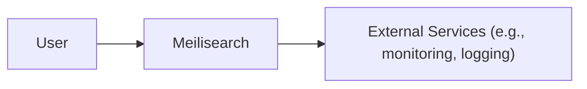
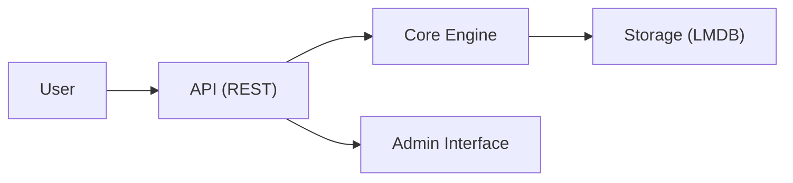
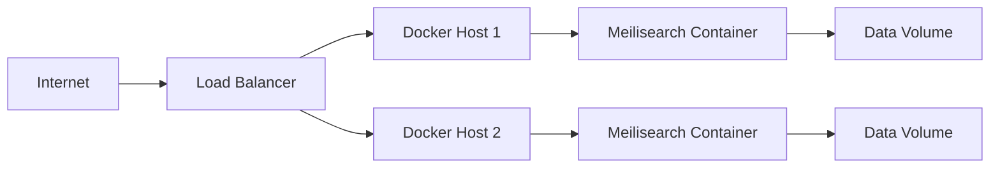
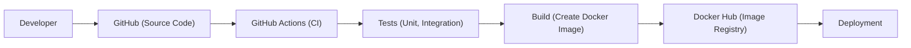

# BUSINESS POSTURE

Meilisearch is a search engine designed to be fast, relevant, and easy to integrate. It aims to provide a powerful search-as-you-type experience with minimal setup and configuration. The project is open-source, targeting developers and businesses that need a flexible and customizable search solution without the complexity of traditional search engines like Elasticsearch.

Business Priorities:

- Provide a fast and relevant search experience.
- Easy integration and deployment for developers.
- Customizable and extensible to fit various use cases.
- Maintain a strong open-source community.
- Offer a viable alternative to existing search solutions.

Business Goals:

- Increase adoption by developers and businesses.
- Expand the feature set based on community feedback.
- Ensure scalability and reliability for production use.
- Maintain high performance and low latency.

Most Important Business Risks:

- Data breaches or unauthorized access to search data.
- Performance degradation or service unavailability under heavy load.
- Inability to scale to meet growing demand.
- Vulnerabilities that could be exploited by attackers.
- Loss of community trust due to security or privacy issues.

# SECURITY POSTURE

Existing Security Controls:

- security control: API keys for authentication and access control. Described in documentation and implemented in the code.
- security control: HTTPS support for secure communication. Described in documentation and implemented in the code.
- security control: Basic input sanitization to prevent common injection attacks. Implemented in the code.
- security control: Regular updates and dependency management to address known vulnerabilities. Managed through GitHub and package managers.
- security control: Documentation on secure deployment and configuration. Available in the official documentation.

Accepted Risks:

- accepted risk: Limited built-in protection against DDoS attacks.
- accepted risk: Reliance on third-party libraries, which may introduce vulnerabilities.
- accepted risk: Potential for misconfiguration by users, leading to security issues.

Recommended Security Controls:

- Implement rate limiting and throttling to mitigate DDoS attacks.
- Introduce comprehensive input validation and sanitization to prevent a wider range of injection attacks.
- Conduct regular security audits and penetration testing.
- Implement Content Security Policy (CSP) and other security headers.
- Provide detailed security hardening guides for production deployments.
- Implement robust monitoring and alerting for security-related events.

Security Requirements:

- Authentication:
    - All API requests must be authenticated using API keys.
    - Support for multiple API keys with different permission levels.
    - Secure storage and management of API keys.
- Authorization:
    - Role-Based Access Control (RBAC) to restrict access to specific API endpoints and data.
    - Granular control over search and indexing operations.
- Input Validation:
    - Strict validation of all input parameters to prevent injection attacks.
    - Sanitization of search queries and indexed data.
    - Protection against common web vulnerabilities (XSS, CSRF, etc.).
- Cryptography:
    - Use of HTTPS for all communication.
    - Secure generation and storage of API keys.
    - Encryption of sensitive data at rest (if applicable).

# DESIGN

## C4 CONTEXT

Element Descriptions:

- User:
    - Name: User
    - Type: Person
    - Description: Represents a user or application interacting with Meilisearch.
    - Responsibilities:
        - Sending search queries.
        - Managing indexes and documents.
        - Configuring Meilisearch settings.
    - Security controls:
        - Authentication via API keys.
        - HTTPS for secure communication.

- Meilisearch:
    - Name: Meilisearch
    - Type: Software System
    - Description: The core search engine application.
    - Responsibilities:
        - Processing search queries.
        - Managing indexes and documents.
        - Providing API endpoints for interaction.
    - Security controls:
        - API key authentication.
        - Input sanitization.
        - HTTPS support.

- External Services:
    - Name: External Services
    - Type: Software System
    - Description: Represents external services used by Meilisearch, such as monitoring and logging.
    - Responsibilities:
        - Monitoring Meilisearch performance and health.
        - Logging events and errors.
    - Security controls:
        - Secure communication with Meilisearch.
        - Authentication and authorization for service access.

## C4 CONTAINER

Element Descriptions:

- API:
    - Name: API (REST)
    - Type: Container (Web Application)
    - Description: Provides RESTful API endpoints for interacting with Meilisearch.
    - Responsibilities:
        - Handling incoming requests.
        - Authenticating users via API keys.
        - Routing requests to the core engine.
    - Security controls:
        - API key authentication.
        - HTTPS support.
        - Input validation.

- Core Engine:
    - Name: Core Engine
    - Type: Container (Application)
    - Description: The core logic of the Meilisearch engine.
    - Responsibilities:
        - Processing search queries.
        - Managing indexes and documents.
        - Handling updates and deletions.
    - Security controls:
        - Internal input validation.

- Storage:
    - Name: Storage (LMDB)
    - Type: Container (Database)
    - Description: Stores the indexes and documents using LMDB.
    - Responsibilities:
        - Persisting data.
        - Providing fast access to data.
    - Security controls:
        - Access control through the core engine.

- Admin Interface:
    - Name: Admin Interface
    - Type: Container (Web Application)
    - Description: Provides a web-based interface for managing Meilisearch.
    - Responsibilities:
        - Displaying server statistics.
        - Managing API keys.
        - Configuring settings.
    - Security controls:
        - Authentication via API keys.
        - HTTPS support.
        - Input validation.

## DEPLOYMENT

Possible deployment solutions:

- Docker container.
- Bare-metal installation.
- Cloud-based deployment (e.g., AWS, GCP, Azure).
- Kubernetes deployment.

Chosen solution: Docker container.

Element Descriptions:

- Internet:
    - Name: Internet
    - Type: External
    - Description: Represents the public internet.
    - Responsibilities:
        - Routing traffic to the load balancer.
    - Security controls:
        - None (external).

- Load Balancer:
    - Name: Load Balancer
    - Type: Infrastructure
    - Description: Distributes incoming traffic across multiple Docker hosts.
    - Responsibilities:
        - Balancing load.
        - Handling SSL termination.
    - Security controls:
        - SSL/TLS encryption.
        - DDoS protection (if provided by the cloud provider).

- Docker Host:
    - Name: Docker Host 1, Docker Host 2
    - Type: Infrastructure
    - Description: Servers running Docker to host Meilisearch containers.
    - Responsibilities:
        - Running Docker containers.
        - Managing resources.
    - Security controls:
        - Firewall rules.
        - OS-level security hardening.

- Meilisearch Container:
    - Name: Meilisearch Container 1, Meilisearch Container 2
    - Type: Container
    - Description: Instances of the Meilisearch Docker container.
    - Responsibilities:
        - Running the Meilisearch application.
    - Security controls:
        - API key authentication.
        - HTTPS support.
        - Input validation.

- Data Volume:
    - Name: Data Volume 1, Data Volume 2
    - Type: Storage
    - Description: Persistent storage for Meilisearch data.
    - Responsibilities:
        - Storing indexes and documents.
    - Security controls:
        - Access control through the Docker host.
        - Encryption at rest (if configured).

## BUILD

Build Process Description:

- Developer commits code to GitHub.
- GitHub Actions triggers a CI workflow.
- The workflow runs unit and integration tests.
- If tests pass, the workflow builds a Docker image.
- The Docker image is pushed to Docker Hub.
- The image can then be deployed to various environments.

Security Controls:

- security control: Code review and pull request process on GitHub.
- security control: Automated testing (unit and integration) in GitHub Actions.
- security control: Static code analysis (SAST) integrated into the CI workflow (not explicitly mentioned, but recommended).
- security control: Dependency scanning for known vulnerabilities (not explicitly mentioned, but recommended).
- security control: Use of signed commits.
- security control: Use minimal base images for Docker builds.

# RISK ASSESSMENT

Critical Business Processes:

- Search query processing.
- Indexing and document management.
- API access for integration with other applications.

Data Protection:

- Data Sensitivity:
    - Search queries: Potentially sensitive, depending on the content.
    - Indexed documents: Potentially sensitive, depending on the content.
    - API keys: Highly sensitive, must be protected.
- Data to Protect:
    - Search indexes and documents.
    - API keys.
    - Configuration settings.
    - Logs and monitoring data.

# QUESTIONS & ASSUMPTIONS

Questions:

- What is the expected scale of data and query volume?
- Are there any specific compliance requirements (e.g., GDPR, HIPAA)?
- What is the current level of security expertise within the development team?
- Are there any existing monitoring and logging solutions in place?
- What is the tolerance for downtime or service interruption?

Assumptions:

- Business Posture:
    - assumption: The primary goal is to provide a fast and reliable search experience.
    - assumption: The project aims to be a viable alternative to existing search solutions.
    - assumption: Open-source community contributions are important.
- Security Posture:
    - assumption: Basic security measures (API keys, HTTPS) are in place.
    - assumption: There is a reliance on third-party libraries.
    - assumption: Users are responsible for securing their own deployments.
- Design:
    - assumption: The architecture is relatively simple and straightforward.
    - assumption: Docker is the preferred deployment method.
    - assumption: GitHub Actions is used for CI/CD.