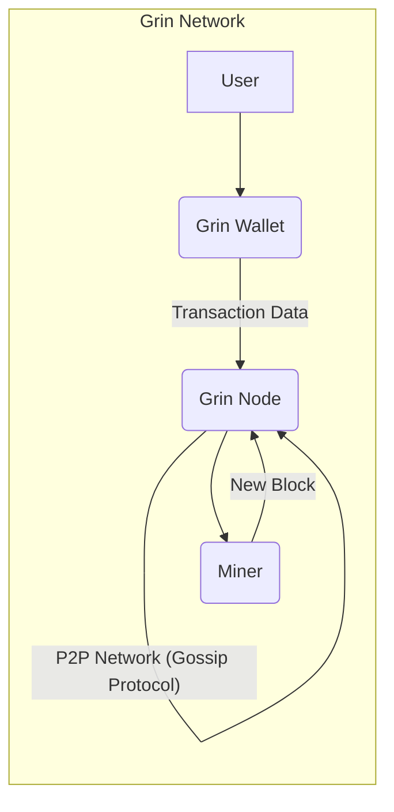
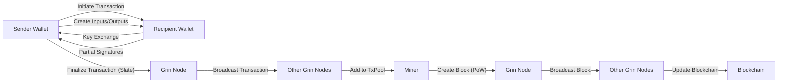

## Project Design Document: Grin Cryptocurrency (Improved)

**1. Introduction**

This document provides an enhanced architectural overview of the Grin cryptocurrency project, building upon the previous version. It offers a more detailed explanation of the key components, their interactions, and the underlying technologies. This document is specifically designed to serve as a comprehensive foundation for subsequent threat modeling activities, enabling a deeper understanding of the system's structure, functionality, and potential vulnerabilities.

**2. Goals and Objectives**

The fundamental goals of the Grin project remain:

* **Strong Privacy:** To ensure robust privacy for users and their transaction details.
* **High Scalability:** To facilitate efficient and scalable blockchain operations, accommodating a growing number of users and transactions.
* **Fair and Decentralized Distribution:** To maintain a fair initial distribution and ongoing mining process that promotes decentralization.
* **Code Simplicity and Auditability:** To keep the codebase concise, understandable, and easy to audit for security vulnerabilities.
* **Community-Driven Development:** To foster an open, transparent, and collaborative environment for development and innovation.

**3. Architecture Overview**

Grin operates as a decentralized peer-to-peer (P2P) network based on the Mimblewimble protocol. The network consists of interconnected nodes that collectively maintain the blockchain. Key actors and components include:

* **User:** An individual or entity interacting with the Grin network to send or receive Grin.
* **Grin Wallet:** The software application used by users to manage their Grin funds and construct transactions.
* **Grin Node:** The core software application that participates in the network, validates transactions and blocks, and maintains a copy of the blockchain.
* **Miner:** Specialized nodes that perform the computationally intensive Proof-of-Work (PoW) process to create new blocks and secure the network.

**4. Component Details**

**4.1. Grin Node**

* **Functionality:**
    * **Peer Discovery and Management:** Utilizes a gossip protocol to discover and maintain connections with other nodes in the network.
    * **Transaction Relay and Propagation:** Receives, validates, and forwards transaction data across the network to ensure broad dissemination.
    * **Blockchain Synchronization and Verification:** Downloads the blockchain from peers, verifies its integrity, and stays up-to-date with the latest blocks.
    * **Transaction Validation (Mimblewimble Rules):** Enforces the cryptographic rules of the Mimblewimble protocol to validate transaction correctness (e.g., no inflation, valid signatures).
    * **Block Validation:** Verifies the integrity of newly received blocks, including the Proof-of-Work and transaction validity.
    * **Transaction Pool (TxPool) Management:**  Stores a temporary collection of valid, unconfirmed transactions awaiting inclusion in a block. Implements logic for transaction prioritization and eviction.
    * **Blockchain Storage and Indexing:** Persistently stores the blockchain data (headers and kernels) and potentially indexes it for efficient querying.
    * **Application Programming Interface (API):** Provides a programmatic interface (typically RESTful) for wallets and other applications to interact with the node, allowing for transaction submission, blockchain data retrieval, and node status monitoring.

* **Key Responsibilities:**
    * Upholding the integrity and consistency of the distributed ledger (blockchain).
    * Enforcing the consensus rules of the Grin network.
    * Facilitating the reliable propagation of transaction and block data across the network.

**4.2. Grin Wallet**

* **Functionality:**
    * **Key Generation and Management:** Generates and securely stores the user's private keys, which are essential for spending Grin.
    * **Transaction Construction (Mimblewimble):**  Creates Mimblewimble transactions, involving the creation of inputs (references to previous outputs), outputs (new commitments), and a transaction kernel (signatures and fees).
    * **Slate Handling and Exchange:** Manages the exchange of transaction data (slates) between the sender and receiver. This often involves out-of-band communication methods.
    * **Stealth Address Generation:** Generates unique, unlinkable receiving addresses for each transaction, enhancing privacy. This involves cryptographic key exchange with the sender.
    * **Balance Derivation and Tracking:** Calculates the user's Grin balance by scanning the blockchain for outputs owned by the wallet's keys.
    * **Transaction History Management:** Maintains a record of past transactions associated with the wallet.
    * **Communication with Grin Node:** Interacts with a connected Grin node via its API to broadcast finalized transactions and retrieve blockchain information necessary for balance calculation and transaction construction.

* **Key Responsibilities:**
    * Securely managing the user's cryptographic keys.
    * Facilitating the creation and exchange of Grin transactions according to the Mimblewimble protocol.
    * Providing a user-friendly interface for interacting with the Grin network.

**4.3. Miner**

* **Functionality:**
    * **Block Template Assembly:** Constructs candidate blocks by selecting pending transactions from a connected Grin node's transaction pool and adding necessary metadata (e.g., previous block hash, timestamp).
    * **Proof-of-Work (PoW) Computation (Cuckoo Cycle):** Performs intensive computational hashing using the Cuckoo Cycle algorithm to find a nonce that satisfies the current network difficulty target.
    * **Block Header Construction:** Creates the block header containing the nonce, Merkle root of the transactions, and other relevant information.
    * **Block Broadcasting:**  Upon finding a valid PoW solution, broadcasts the newly mined block to the Grin network.

* **Key Responsibilities:**
    * Securing the network by making it computationally expensive to create new blocks, preventing malicious actors from easily rewriting history.
    * Introducing new Grin into circulation according to the pre-defined emission schedule.

**5. Data Flow (Detailed Transaction)**

The process of sending Grin from one user to another involves a multi-step interaction:

1. **Sender Wallet Initiates Transaction:** The sender's wallet begins the transaction process, identifying the outputs they wish to spend.
2. **Output Selection and Input Creation:** The wallet selects unspent transaction outputs (UTXOs) controlled by its keys to use as inputs for the new transaction.
3. **Stealth Address Generation and Key Exchange:** The sender's wallet generates a new stealth address for the recipient and exchanges necessary cryptographic information (e.g., via a secure communication channel or file exchange).
4. **Output Creation (Commitments):** The sender's wallet creates cryptographic commitments (Pedersen commitments) representing the amount being sent to the recipient and any change being returned to the sender. The actual amounts are blinded.
5. **Kernel Creation (Blinding Factors and Signatures):** The sender and receiver (or a designated listener) collaboratively create the transaction kernel, which includes signatures proving ownership of the inputs and blinding factors that ensure the amounts remain confidential.
6. **Fee Calculation:** A transaction fee is calculated and included in the kernel.
7. **Slate Assembly and Exchange:** The sender and receiver exchange transaction data (forming a "slate") which contains the inputs, outputs, and kernel. This exchange might happen multiple times as signatures are added.
8. **Transaction Finalization:** Once all necessary signatures are collected, one of the wallets finalizes the transaction.
9. **Transaction Broadcasting to Node:** The finalized transaction is sent to a connected Grin node via its API.
10. **Node Validation:** The receiving node validates the transaction according to Mimblewimble rules (e.g., no double-spending, valid signatures, kernel offset check).
11. **Transaction Added to TxPool:** If valid, the transaction is added to the node's transaction pool, awaiting inclusion in a block.
12. **Miner Selects Transactions:** Miners select transactions from their connected node's transaction pool to include in a new block template.
13. **Block Creation and PoW:** The miner performs Proof-of-Work on the block template.
14. **Block Broadcasting:** Once a valid PoW is found, the miner broadcasts the new block to the network.
15. **Node Receives and Validates Block:** Other nodes receive the block and validate its contents, including the PoW and the validity of the included transactions.
16. **Blockchain Update:** Valid nodes add the new block to their local copy of the blockchain.
17. **Transaction Confirmation:** The transaction is considered confirmed after a certain number of subsequent blocks have been added to the chain.

**6. Security Considerations**

Grin's security relies on several key design principles and cryptographic techniques:

* **Mimblewimble Protocol:** Provides inherent privacy by:
    * **Confidential Transactions:** Transaction amounts are cryptographically blinded using Pedersen commitments, preventing observers from seeing the transferred value.
    * **CoinJoin:** Transaction inputs and outputs from multiple transactions are aggregated, making it difficult to trace the flow of funds.
    * **Kernel Offsets:**  Cryptographic proofs that ensure no new value is created during transaction aggregation.
* **Dandelion++:**  A transaction propagation protocol that obscures the origin of transactions by initially routing them through a random path of nodes before wider broadcasting.
* **Proof-of-Work (Cuckoo Cycle):**  Makes it computationally expensive for malicious actors to create new blocks or alter the blockchain history. The memory-hard nature of Cuckoo Cycle aims to resist ASIC dominance.
* **Stealth Addresses:**  Enhance receiver privacy by making it difficult to link multiple incoming payments to the same recipient.
* **Elliptic Curve Cryptography:**  Underpins the digital signatures used to authorize transactions and secure the network.

**7. Deployment Considerations**

* **Grin Node Deployment:**
    * **Full Node:** Stores the entire blockchain and participates in full validation. Requires significant disk space, bandwidth, and processing power. Can be run on various operating systems (Linux, macOS, Windows) and cloud platforms.
    * **Pruned Node:** Stores a reduced version of the blockchain, typically only recent blocks. Reduces storage requirements but still participates in full validation of recent blocks.
* **Grin Wallet Deployment:**
    * **Desktop Wallet (GUI/CLI):** Runs on a user's local machine and interacts with a local or remote Grin node. Offers full control over private keys.
    * **Mobile Wallet:**  Simplified wallets designed for mobile devices. Often rely on connecting to remote Grin nodes.
    * **Hardware Wallet Integration:** Securely stores private keys on a dedicated hardware device, enhancing security against software-based attacks.
* **Miner Deployment:**
    * **Solo Mining:** An individual miner runs mining software connected to a Grin node.
    * **Pool Mining:** Miners coordinate their efforts and share rewards by connecting to a mining pool. Requires specialized hardware (GPUs or potentially ASICs in the future) and reliable network connectivity.

**8. Assumptions and Constraints**

* **Honest Majority of Nodes:** The security of the Grin network relies on the assumption that a majority of the participating nodes are honest and correctly follow the protocol rules.
* **Security of Private Keys:** The security of user funds is entirely dependent on the secure generation, storage, and handling of their private keys.
* **Network Connectivity:** All components (nodes, wallets, miners) require reliable internet connectivity to function.
* **Computational Resources for Mining:** Mining requires significant computational resources and access to appropriate hardware.

**9. Future Considerations**

* **Scalability Enhancements:** Ongoing research and development into layer-2 solutions or other techniques to further improve transaction throughput and reduce fees.
* **Privacy Enhancements:** Exploration of advanced cryptographic techniques to further strengthen user privacy and anonymity.
* **Interoperability:** Investigating potential mechanisms for seamless interaction with other blockchain networks and digital assets.
* **Usability and User Experience:** Continuous improvement of wallet interfaces and tools to make Grin more accessible and user-friendly.

This improved design document provides a more comprehensive and detailed understanding of the Grin cryptocurrency project's architecture and underlying principles. This enhanced information is crucial for conducting thorough threat modeling and identifying potential security vulnerabilities.