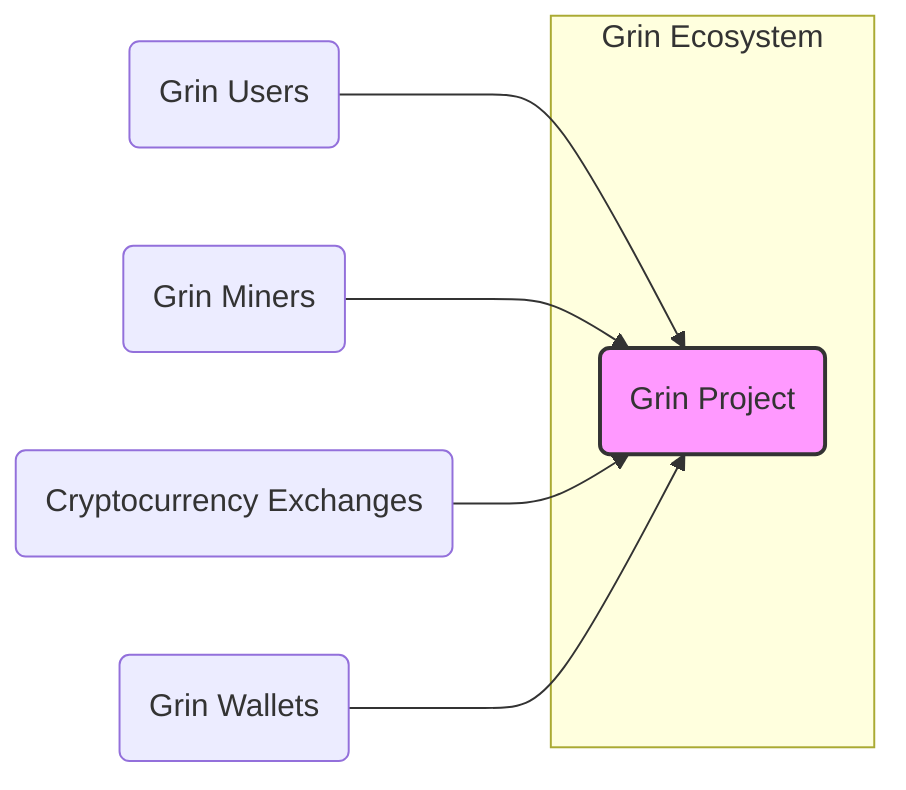
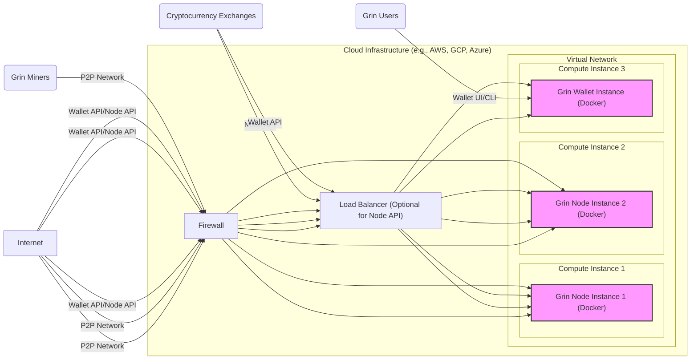
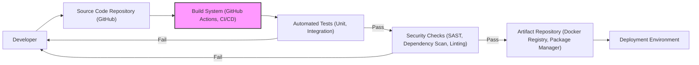

# BUSINESS POSTURE

- Business Priorities and Goals:
 - Provide a private and scalable cryptocurrency based on the MimbleWimble protocol.
 - Offer a community-driven and open-source alternative to existing cryptocurrencies.
 - Facilitate secure and confidential peer-to-peer transactions.
 - Promote decentralization and censorship resistance in digital currency.
- Business Risks:
 - Regulatory uncertainty surrounding cryptocurrencies and privacy-focused technologies.
 - Competition from other cryptocurrencies and established financial systems.
 - Security vulnerabilities in the Grin protocol or implementation that could lead to loss of funds or privacy breaches.
 - Fluctuations in cryptocurrency market value and adoption rates.
 - Dependence on a volunteer-based development community and potential lack of resources for long-term maintenance and development.

# SECURITY POSTURE

- Existing Security Controls:
 - security control: Open-source codebase allowing for community review and scrutiny. (Implemented: GitHub Repository)
 - security control: Use of the MimbleWimble protocol, which inherently provides privacy features. (Implemented: Protocol Design)
 - security control: Cryptographic algorithms used in MimbleWimble are well-established and researched. (Implemented: Protocol Design)
 - security control: Community-driven security audits and vulnerability disclosures. (Implemented: Community Practices)
- Accepted Risks:
 - accepted risk: Potential for undiscovered vulnerabilities in the MimbleWimble protocol or Grin implementation.
 - accepted risk: Reliance on the security of underlying cryptographic primitives.
 - accepted risk: Risk of user error in managing private keys and conducting transactions.
 - accepted risk: Security of third-party wallets and exchanges interacting with Grin.
- Recommended Security Controls:
 - security control: Implement automated security testing in the CI/CD pipeline, including static analysis (SAST) and dependency scanning.
 - security control: Conduct regular penetration testing and security audits by reputable third-party firms.
 - security control: Establish a formal vulnerability disclosure and incident response process.
 - security control: Provide security guidelines and best practices for users, developers, and integrators.
 - security control: Implement rate limiting and input validation at API endpoints to prevent abuse and attacks.
- Security Requirements:
 - Authentication:
  - Requirement: Grin protocol itself is permissionless and does not require authentication for participation in the network.
  - Requirement: Wallets and APIs interacting with Grin nodes should implement secure authentication mechanisms to protect user keys and data. (e.g., password protection, keyfile encryption).
 - Authorization:
  - Requirement: Grin protocol uses cryptographic keys for transaction authorization. Spending requires proof of ownership of funds.
  - Requirement: Wallets and APIs should implement authorization controls to manage user permissions and access to functionalities.
 - Input Validation:
  - Requirement: Grin nodes must rigorously validate all inputs from the network to prevent malformed transactions or protocol-level attacks. (Implemented: Node Software)
  - Requirement: Wallets and APIs must validate user inputs to prevent injection attacks and other client-side vulnerabilities.
 - Cryptography:
  - Requirement: Utilize strong and well-vetted cryptographic algorithms for all security-sensitive operations, including transaction signing, key generation, and encryption. (Implemented: Protocol and Node Software)
  - Requirement: Securely manage cryptographic keys, protecting them from unauthorized access and disclosure. (Responsibility: Wallet and Node Implementations, User Responsibility)

# DESIGN

## C4 CONTEXT



- Context Diagram Elements:
 - - Name: Grin Project
   - Type: Software System
   - Description: A privacy-focused cryptocurrency based on the MimbleWimble protocol, enabling private and scalable transactions.
   - Responsibilities:
    - Maintaining the Grin blockchain network.
    - Processing and validating transactions.
    - Providing a platform for private digital currency exchange.
   - Security controls:
    - security control: Consensus mechanism (Proof-of-Work) to secure the blockchain.
    - security control: Cryptographic protocols (MimbleWimble) for transaction privacy and integrity.
    - security control: Decentralized network architecture to resist censorship and single points of failure.
 - - Name: Grin Users
   - Type: Person
   - Description: Individuals who use Grin to send and receive payments, store value, and participate in the Grin ecosystem.
   - Responsibilities:
    - Managing their Grin wallets and private keys securely.
    - Initiating and receiving Grin transactions.
    - Participating in the Grin community.
   - Security controls:
    - security control: User-managed private keys for transaction authorization.
    - security control: Secure storage and backup of wallet data.
    - security control: Awareness of phishing and social engineering attacks.
 - - Name: Grin Miners
   - Type: Software System / Organization
   - Description: Entities that contribute computational power to the Grin network to validate transactions and create new blocks, earning block rewards in Grin.
   - Responsibilities:
    - Running Grin mining software.
    - Securing the Grin network through Proof-of-Work.
    - Contributing to network stability and transaction processing.
   - Security controls:
    - security control: Secure infrastructure for mining operations.
    - security control: Protection against denial-of-service attacks.
    - security control: Monitoring and logging of mining activities.
 - - Name: Cryptocurrency Exchanges
   - Type: Software System / Organization
   - Description: Platforms that allow users to buy, sell, and trade Grin for other cryptocurrencies or fiat currencies.
   - Responsibilities:
    - Providing a marketplace for Grin trading.
    - Custody of user Grin funds.
    - Integration with the Grin network for deposit and withdrawal processing.
   - Security controls:
    - security control: Exchange security measures (e.g., cold storage, multi-signature wallets).
    - security control: Compliance with regulatory requirements.
    - security control: User account security and authentication.
 - - Name: Grin Wallets
   - Type: Software System
   - Description: Software applications that allow users to manage their Grin keys, send and receive transactions, and interact with the Grin network.
   - Responsibilities:
    - Securely storing user private keys.
    - Creating and signing Grin transactions.
    - Interacting with Grin nodes to broadcast transactions and retrieve blockchain data.
   - Security controls:
    - security control: Wallet encryption and password protection.
    - security control: Secure key generation and management.
    - security control: Input validation and protection against client-side vulnerabilities.

## C4 CONTAINER

```mermaid
flowchart LR
    subgraph "Grin Node Container"
        Node["Grin Node"]
        Kernel["Kernel"]
        ChainDB["Chain Database"]
        P2P["P2P Network"]
        API["Node API"]
    end
    subgraph "Grin Wallet Container"
        Wallet["Grin Wallet"]
        WalletUI["Wallet UI"]
        WalletCLI["Wallet CLI"]
        WalletAPI["Wallet API"]
        KeyManagement["Key Management"]
    end

    Users("Grin Users")
    Miners("Grin Miners")
    Exchanges("Cryptocurrency Exchanges")

    Users --> WalletUI
    Users --> WalletCLI
    Exchanges --> WalletAPI
    Exchanges --> Node API
    Miners --> P2P

    WalletAPI --> Node API
    Wallet --> WalletAPI
    WalletUI --> WalletAPI
    WalletCLI --> WalletAPI
    Wallet --> KeyManagement
    Node --> Kernel
    Node --> ChainDB
    Node --> P2P
    Node --> API

    style Node fill:#f9f,stroke:#333,stroke-width:2px
    style Wallet fill:#f9f,stroke:#333,stroke-width:2px
```

- Container Diagram Elements:
 - - Name: Grin Node
   - Type: Application
   - Description: The core application that implements the Grin protocol, maintains the blockchain, and participates in the P2P network.
   - Responsibilities:
    - Maintaining a copy of the Grin blockchain (ChainDB).
    - Participating in the P2P network to discover peers and propagate transactions and blocks (P2P Network).
    - Validating and processing transactions and blocks (Kernel).
    - Providing an API for wallets and other applications to interact with the node (Node API).
   - Security controls:
    - security control: Input validation and sanitization for all network messages and API requests.
    - security control: Rate limiting and denial-of-service protection for the API and P2P network.
    - security control: Secure storage of blockchain data and node configuration.
    - security control: Regular security updates and patching.
 - - Name: Kernel
   - Type: Component
   - Description: The core logic of the Grin node responsible for implementing the MimbleWimble protocol, transaction validation, and block processing.
   - Responsibilities:
    - Implementing MimbleWimble cryptographic operations.
    - Verifying transaction signatures and proofs.
    - Processing and validating blocks.
    - Consensus mechanism logic.
   - Security controls:
    - security control: Robust implementation of cryptographic algorithms.
    - security control: Thorough testing and verification of protocol logic.
    - security control: Protection against protocol-level attacks and vulnerabilities.
 - - Name: Chain Database (ChainDB)
   - Type: Data Store
   - Description: Persistent storage for the Grin blockchain, including blocks, transactions, and chain state.
   - Responsibilities:
    - Storing and retrieving blockchain data.
    - Ensuring data integrity and consistency.
    - Providing efficient access to blockchain information.
   - Security controls:
    - security control: Data integrity checks and checksums.
    - security control: Secure file system permissions and access controls.
    - security control: Backup and recovery mechanisms.
 - - Name: P2P Network
   - Type: Component
   - Description: Handles peer-to-peer communication between Grin nodes, enabling transaction and block propagation across the network.
   - Responsibilities:
    - Discovering and connecting to peers.
    - Broadcasting transactions and blocks.
    - Handling network communication and message routing.
   - Security controls:
    - security control: Encryption of P2P communication (optional, depending on implementation).
    - security control: Peer authentication and reputation management (to prevent Sybil attacks).
    - security control: Denial-of-service protection for network connections.
 - - Name: Node API
   - Type: API
   - Description: Provides a programmatic interface for wallets, exchanges, and other applications to interact with the Grin node.
   - Responsibilities:
    - Exposing node functionalities through API endpoints.
    - Handling requests from wallets and other clients.
    - Providing blockchain data and transaction submission capabilities.
   - Security controls:
    - security control: Authentication and authorization for sensitive API endpoints (if needed for specific functionalities).
    - security control: Input validation and sanitization for all API requests.
    - security control: Rate limiting and API usage monitoring.
 - - Name: Grin Wallet
   - Type: Application
   - Description: A software application that allows users to manage their Grin funds, create transactions, and interact with the Grin network.
   - Responsibilities:
    - Managing user private keys (Key Management).
    - Creating and signing Grin transactions.
    - Interacting with Grin nodes via Wallet API or Node API.
    - Providing user interfaces for wallet functionalities (Wallet UI, Wallet CLI).
   - Security controls:
    - security control: Wallet encryption and password protection.
    - security control: Secure key generation and storage.
    - security control: Input validation and protection against client-side vulnerabilities.
 - - Name: Wallet UI
   - Type: User Interface
   - Description: Graphical user interface for the Grin Wallet, providing a user-friendly way to manage Grin funds and transactions.
   - Responsibilities:
    - Providing a visual interface for wallet functionalities.
    - Handling user input and displaying wallet information.
    - Interacting with the Wallet API.
   - Security controls:
    - security control: Protection against UI-based vulnerabilities (e.g., XSS if web-based).
    - security control: Secure communication with the Wallet API.
 - - Name: Wallet CLI
   - Type: User Interface
   - Description: Command-line interface for the Grin Wallet, providing a text-based way to manage Grin funds and transactions.
   - Responsibilities:
    - Providing a command-line interface for wallet functionalities.
    - Handling user input and displaying wallet information in the terminal.
    - Interacting with the Wallet API.
   - Security controls:
    - security control: Secure handling of command-line arguments and user input.
    - security control: Secure communication with the Wallet API.
 - - Name: Wallet API
   - Type: API
   - Description: Provides a programmatic interface for the Wallet UI and Wallet CLI to interact with the core wallet functionalities.
   - Responsibilities:
    - Exposing wallet functionalities through API endpoints.
    - Handling requests from the Wallet UI and Wallet CLI.
    - Interacting with the Grin Node API.
   - Security controls:
    - security control: Authentication and authorization for API endpoints.
    - security control: Input validation and sanitization for all API requests.
    - security control: Secure communication within the wallet application.
 - - Name: Key Management
   - Type: Component
   - Description: Responsible for generating, storing, and managing cryptographic keys used by the Grin Wallet.
   - Responsibilities:
    - Generating new Grin keypairs.
    - Securely storing private keys (e.g., encrypted keyfiles).
    - Providing key access for transaction signing and other operations.
   - Security controls:
    - security control: Strong key generation algorithms.
    - security control: Encryption of private keys at rest.
    - security control: Secure access control to key storage.

## DEPLOYMENT

Deployment Solution: Dockerized Deployment on Cloud Infrastructure (Example)



- Deployment Diagram Elements:
 - - Name: Cloud Infrastructure (e.g., AWS, GCP, Azure)
   - Type: Infrastructure
   - Description: Cloud provider platform providing virtualized compute, networking, and security services.
   - Responsibilities:
    - Providing the underlying infrastructure for Grin node and wallet deployments.
    - Ensuring infrastructure availability and scalability.
    - Providing network connectivity and security services.
   - Security controls:
    - security control: Cloud provider security controls (physical security, network security, access management).
    - security control: Infrastructure security hardening and configuration management.
    - security control: Monitoring and logging of infrastructure activities.
 - - Name: Virtual Network
   - Type: Network
   - Description: Isolated network within the cloud infrastructure to host Grin instances.
   - Responsibilities:
    - Providing network isolation and segmentation.
    - Routing network traffic between instances and the internet.
    - Implementing network security policies.
   - Security controls:
    - security control: Network Access Control Lists (NACLs) or Security Groups to control traffic flow.
    - security control: Network segmentation to isolate different components.
    - security control: Intrusion detection and prevention systems (IDS/IPS).
 - - Name: Compute Instance 1, Compute Instance 2
   - Type: Compute
   - Description: Virtual machines or containers running Grin Node instances.
   - Responsibilities:
    - Running Grin Node application.
    - Participating in the Grin P2P network.
    - Providing Node API access.
   - Security controls:
    - security control: Operating system and application security hardening.
    - security control: Regular security patching and updates.
    - security control: Host-based intrusion detection systems (HIDS).
 - - Name: Compute Instance 3
   - Type: Compute
   - Description: Virtual machine or container running Grin Wallet instance (e.g., for exchange integration).
   - Responsibilities:
    - Running Grin Wallet application.
    - Providing Wallet API access.
    - Managing Grin funds for specific purposes (e.g., exchange hot wallet).
   - Security controls:
    - security control: Operating system and application security hardening.
    - security control: Regular security patching and updates.
    - security control: Host-based intrusion detection systems (HIDS).
    - security control: Strict access control to the wallet instance and its API.
 - - Name: Grin Node Instance 1 (Docker), Grin Node Instance 2 (Docker), Grin Wallet Instance (Docker)
   - Type: Container
   - Description: Docker containers encapsulating Grin Node and Wallet applications.
   - Responsibilities:
    - Running the Grin Node or Wallet application within a containerized environment.
    - Providing isolation and portability.
   - Security controls:
    - security control: Container image security scanning and vulnerability management.
    - security control: Container runtime security hardening.
    - security control: Resource limits and isolation for containers.
 - - Name: Load Balancer (Optional for Node API)
   - Type: Network Component
   - Description: Distributes incoming API traffic across multiple Grin Node or Wallet instances for scalability and availability.
   - Responsibilities:
    - Load balancing API requests.
    - Improving API availability and responsiveness.
   - Security controls:
    - security control: SSL/TLS termination for secure API communication.
    - security control: Rate limiting and DDoS protection at the load balancer level.
    - security control: Access control and authentication for load balancer management.
 - - Name: Firewall
   - Type: Network Security
   - Description: Controls network traffic entering and leaving the virtual network, protecting Grin instances from unauthorized access.
   - Responsibilities:
    - Filtering network traffic based on defined rules.
    - Blocking unauthorized access to Grin instances.
    - Protecting against network-based attacks.
   - Security controls:
    - security control: Firewall rules to allow only necessary traffic (e.g., P2P, API ports).
    - security control: Intrusion prevention system (IPS) capabilities.
    - security control: Regular review and updates of firewall rules.
 - - Name: Internet
   - Type: Network
   - Description: Public internet network connecting users, miners, exchanges, and Grin infrastructure.
   - Responsibilities:
    - Providing connectivity for users, miners, and exchanges to interact with the Grin network.
   - Security controls:
    - security control: No direct security control by Grin project, relies on security of Grin components and user/organization security practices.

## BUILD



- Build Process Elements:
 - - Name: Developer
   - Type: Person
   - Description: Software developers contributing code to the Grin project.
   - Responsibilities:
    - Writing and committing code changes.
    - Performing local testing and code reviews.
    - Addressing build and security issues.
   - Security controls:
    - security control: Secure development practices (secure coding guidelines).
    - security control: Code review process to identify potential vulnerabilities.
    - security control: Developer workstation security.
 - - Name: Source Code Repository (GitHub)
   - Type: Code Repository
   - Description: Central repository for Grin source code, using Git version control and hosted on GitHub.
   - Responsibilities:
    - Storing and managing source code.
    - Version control and collaboration.
    - Triggering build pipelines on code changes.
   - Security controls:
    - security control: Access control and authentication for repository access.
    - security control: Branch protection and code review requirements for merges.
    - security control: Audit logging of repository activities.
 - - Name: Build System (GitHub Actions, CI/CD)
   - Type: Automation System
   - Description: Automated build and CI/CD pipeline, potentially using GitHub Actions or other CI/CD tools, to compile, test, and package Grin software.
   - Responsibilities:
    - Automating the build process.
    - Running automated tests.
    - Performing security checks.
    - Creating build artifacts.
   - Security controls:
    - security control: Secure CI/CD pipeline configuration and access control.
    - security control: Isolation of build environments.
    - security control: Audit logging of build activities.
 - - Name: Automated Tests (Unit, Integration)
   - Type: Testing System
   - Description: Suite of automated tests, including unit tests and integration tests, to verify code functionality and catch regressions.
   - Responsibilities:
    - Verifying code correctness and functionality.
    - Detecting bugs and regressions early in the development cycle.
   - Security controls:
    - security control: Tests covering security-relevant functionalities.
    - security control: Regular review and updates of test suites.
 - - Name: Security Checks (SAST, Dependency Scan, Linting)
   - Type: Security Tooling
   - Description: Automated security checks integrated into the build pipeline, including Static Application Security Testing (SAST), dependency vulnerability scanning, and code linting.
   - Responsibilities:
    - Identifying potential security vulnerabilities in the code.
    - Detecting vulnerable dependencies.
    - Enforcing code quality and style guidelines.
   - Security controls:
    - security control: Regularly updated security scanning tools and rulesets.
    - security control: Fail-fast mechanism to stop builds on security issues.
    - security control: Reporting and tracking of security findings.
 - - Name: Artifact Repository (Docker Registry, Package Manager)
   - Type: Artifact Storage
   - Description: Repository for storing build artifacts, such as Docker images, binaries, or packages, ready for deployment.
   - Responsibilities:
    - Securely storing build artifacts.
    - Versioning and managing artifacts.
    - Providing access to artifacts for deployment.
   - Security controls:
    - security control: Access control and authentication for artifact repository.
    - security control: Integrity checks and signing of artifacts.
    - security control: Vulnerability scanning of stored artifacts (e.g., Docker image scanning).
 - - Name: Deployment Environment
   - Type: Environment
   - Description: Target environment where Grin software is deployed, such as cloud infrastructure, servers, or user devices.
   - Responsibilities:
    - Running Grin software in production or other environments.
    - Ensuring environment security and stability.
   - Security controls:
    - security control: Deployment environment security hardening.
    - security control: Secure deployment processes.
    - security control: Monitoring and logging of deployed applications.

# RISK ASSESSMENT

- Critical Business Processes:
 - Maintaining the Grin blockchain network and ensuring its continuous operation.
 - Processing and validating Grin transactions securely and privately.
 - Protecting user funds and private keys from theft or loss.
 - Maintaining the integrity and immutability of the Grin blockchain.
 - Ensuring the privacy of Grin transactions.
- Data Sensitivity:
 - Private Keys: Highly sensitive. Loss or compromise leads to complete loss of funds. Requires highest level of protection.
 - Transaction Data: Sensitive. Contains information about transaction amounts and participants (though designed to be private, metadata leakage is a risk). Requires strong privacy controls.
 - Blockchain Data: Public but sensitive in aggregate. Contains transaction history and network state. Requires integrity and availability.
 - User Wallet Data (if stored centrally): Sensitive. May contain transaction history, addresses, and potentially user identifying information. Requires strong confidentiality and integrity controls.
 - Node Configuration Data: Moderately sensitive. May contain API keys or connection details. Requires access control and confidentiality.

# QUESTIONS & ASSUMPTIONS

- Questions:
 - What specific security audits have been performed on the Grin protocol and implementations?
 - Are there any formal security incident response plans in place for the Grin project?
 - What are the current practices for secure key management in popular Grin wallets?
 - What is the roadmap for implementing recommended security controls like automated security testing and penetration testing?
 - Are there any specific regulatory compliance requirements that the Grin project is considering?
- Assumptions:
 - BUSINESS POSTURE: The primary goal is to provide a secure and private cryptocurrency for users who prioritize these features. Community growth and adoption are important secondary goals.
 - SECURITY POSTURE: Security is a high priority for the Grin project, given its nature as a cryptocurrency. The open-source nature and community involvement contribute to security through transparency and peer review. However, formal security practices and tooling might be still evolving.
 - DESIGN: The design is decentralized and relies on the MimbleWimble protocol for privacy. The architecture is modular, with clear separation of concerns between the node, wallet, and network components. Deployment is flexible and can be adapted to various environments, including cloud and self-hosted setups. Build process is assumed to be using modern CI/CD practices, but the level of security automation might need to be enhanced.