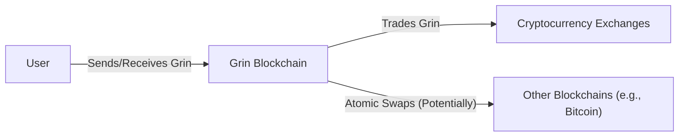
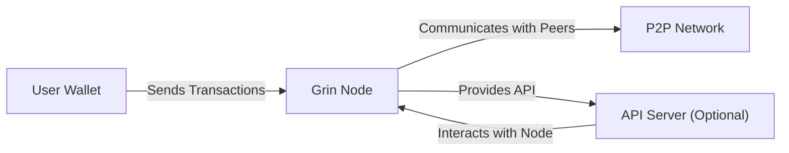
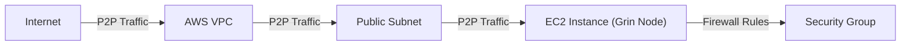
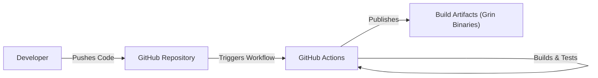

# Grin Project Design Document

## BUSINESS POSTURE

Grin is a privacy-focused cryptocurrency project implementing the Mimblewimble protocol. Its primary goals are to provide a scalable, fungible, and confidential cryptocurrency. The project prioritizes privacy and aims to be a lightweight and minimalist blockchain.

Business Priorities:

*   Provide a high degree of privacy for users and their transactions.
*   Maintain a scalable and efficient blockchain.
*   Foster a decentralized and community-driven development process.
*   Resist censorship and maintain network resilience.
*   Offer a fungible cryptocurrency where all coins are equal.

Business Risks:

*   Regulatory scrutiny and potential legal challenges due to the high level of privacy.
*   Adoption challenges due to the complexity of the underlying technology and competition from other privacy coins.
*   Potential vulnerabilities in the Mimblewimble protocol or its implementation that could compromise privacy or security.
*   Scalability limitations that could hinder transaction throughput as the network grows.
*   Maintaining a robust and active developer community to ensure ongoing development and security.

## SECURITY POSTURE

Grin's security model relies on the cryptographic properties of the Mimblewimble protocol and best practices in secure software development.

Existing Security Controls:

*   security control: Cryptographic primitives inherent to Mimblewimble (Pedersen commitments, Confidential Transactions, CoinJoin, Cut-through) provide transaction privacy and obfuscation. (Described in Mimblewimble protocol specifications and Grin codebase).
*   security control: Code reviews and audits are conducted to identify and address potential vulnerabilities. (Visible in GitHub pull requests and discussions).
*   security control: Use of Rust programming language, known for its memory safety features, reduces the risk of common software vulnerabilities. (Project codebase).
*   security control: Community participation in identifying and reporting security issues. (GitHub issues and community forums).

Accepted Risks:

*   accepted risk: Reliance on relatively new and less-tested cryptographic techniques (Mimblewimble) compared to more established cryptocurrencies.
*   accepted risk: Potential for undiscovered vulnerabilities in the codebase despite ongoing reviews and audits.
*   accepted risk: The inherent complexity of the Mimblewimble protocol makes it more challenging to understand and audit compared to simpler blockchain designs.

Recommended Security Controls:

*   security control: Formal verification of critical components of the codebase.
*   security control: Bug bounty program to incentivize external security researchers to find and report vulnerabilities.
*   security control: Regular penetration testing by independent security firms.

Security Requirements:

*   Authentication: Not directly applicable in the traditional sense, as Grin uses cryptographic keys for transaction authorization. Users are responsible for securing their private keys.
*   Authorization: Transaction authorization is based on cryptographic signatures, ensuring only the owner of a private key can spend their coins.
*   Input Validation: The protocol enforces strict validation rules for transaction data to prevent malformed transactions and potential attacks.
*   Cryptography: Grin relies heavily on strong cryptographic primitives, including Elliptic Curve Cryptography (ECC) and Pedersen commitments, to ensure confidentiality and integrity.

## DESIGN

### C4 CONTEXT

Context Diagram Element Descriptions:

*   Element:
    *   Name: User
    *   Type: Person
    *   Description: An individual or entity using Grin to send or receive transactions.
    *   Responsibilities: Managing their private keys, creating and broadcasting transactions.
    *   Security controls: Secure key management practices (e.g., hardware wallets, secure storage).

*   Element:
    *   Name: Grin Blockchain
    *   Type: System
    *   Description: The decentralized ledger recording all Grin transactions.
    *   Responsibilities: Maintaining consensus, validating transactions, storing transaction history.
    *   Security controls: Mimblewimble protocol, cryptographic primitives, peer-to-peer network security.

*   Element:
    *   Name: Cryptocurrency Exchanges
    *   Type: System
    *   Description: Platforms where users can buy, sell, and trade Grin for other cryptocurrencies or fiat currencies.
    *   Responsibilities: Providing liquidity, order matching, and custody of user funds (if applicable).
    *   Security controls: Exchange-specific security measures (e.g., KYC/AML, hot/cold wallet management).

*   Element:
    *   Name: Other Blockchains (e.g., Bitcoin)
    *   Type: System
    *   Description: Other blockchain networks that may interact with Grin through atomic swaps or other cross-chain mechanisms.
    *   Responsibilities: Maintaining their own consensus and security models.
    *   Security controls: Dependent on the specific blockchain's security mechanisms.

### C4 CONTAINER

Container Diagram Element Descriptions:

*   Element:
    *   Name: User Wallet
    *   Type: Application
    *   Description: Software used by users to manage their Grin, generate addresses, and create transactions.
    *   Responsibilities: Key management, transaction creation, interaction with Grin nodes.
    *   Security controls: Secure key storage, input validation, secure communication with nodes.

*   Element:
    *   Name: Grin Node
    *   Type: Application
    *   Description: A full node implementation of the Grin protocol.
    *   Responsibilities: Validating transactions, maintaining the blockchain, participating in the P2P network.
    *   Security controls: Mimblewimble protocol implementation, secure coding practices, network security.

*   Element:
    *   Name: P2P Network
    *   Type: Network
    *   Description: The decentralized network of Grin nodes that communicate with each other.
    *   Responsibilities: Propagating transactions and blocks, maintaining consensus.
    *   Security controls: Network security protocols, peer discovery mechanisms, DoS protection.

*   Element:
    *   Name: API Server (Optional)
    *   Type: Application
    *   Description: An optional component that provides an API for interacting with a Grin node.
    *   Responsibilities: Exposing node functionality to external applications.
    *   Security controls: API authentication and authorization, input validation, rate limiting.

### DEPLOYMENT

Grin nodes can be deployed in various environments, including:

1.  Personal computers/servers: Users can run full nodes on their own hardware.
2.  Cloud providers (AWS, Google Cloud, Azure, etc.): Nodes can be deployed on virtual machines or container services.
3.  Dedicated servers: Users can rent dedicated servers from hosting providers.

Chosen Deployment Solution (Cloud Provider - AWS EC2):

Deployment Diagram Element Descriptions:

*   Element:
    *   Name: Internet
    *   Type: Network
    *   Description: The global network connecting users and services.
    *   Responsibilities: Routing traffic to and from the AWS VPC.
    *   Security controls: Standard internet security protocols.

*   Element:
    *   Name: AWS VPC
    *   Type: Network
    *   Description: A logically isolated section of the AWS cloud.
    *   Responsibilities: Providing a private network environment for the Grin node.
    *   Security controls: VPC security groups, network ACLs.

*   Element:
    *   Name: Public Subnet
    *   Type: Network
    *   Description: A subnet within the VPC that has a route to the internet.
    *   Responsibilities: Allowing the Grin node to communicate with the P2P network.
    *   Security controls: Subnet-level security configurations.

*   Element:
    *   Name: EC2 Instance (Grin Node)
    *   Type: Virtual Machine
    *   Description: A virtual machine running the Grin node software.
    *   Responsibilities: Running the Grin node, participating in the P2P network.
    *   Security controls: Operating system security, Grin node security configurations.

*   Element:
    *   Name: Security Group
    *   Type: Firewall
    *   Description: A virtual firewall that controls inbound and outbound traffic to the EC2 instance.
    *   Responsibilities: Restricting access to the Grin node to only necessary ports and protocols.
    *   Security controls: Security group rules defining allowed traffic.

### BUILD

Grin uses a continuous integration (CI) system based on GitHub Actions. The build process is triggered by pull requests and commits to the main branch.

Build Process Description:

1.  Developers push code changes to the GitHub repository.
2.  GitHub Actions automatically triggers a workflow.
3.  The workflow performs the following steps:
    *   Checks out the code.
    *   Sets up the Rust build environment.
    *   Runs linters and code formatters (e.g., `rustfmt`, `clippy`).
    *   Compiles the code.
    *   Runs unit and integration tests.
    *   If all checks and tests pass, creates build artifacts (Grin binaries).
4.  The build artifacts are published and made available for download.

Security Controls:

*   security control: Automated build process ensures consistency and reproducibility.
*   security control: Linters and code formatters enforce coding standards and help prevent common errors.
*   security control: Automated testing (unit and integration tests) verifies the correctness of the code.
*   security control: GitHub Actions provides a secure and isolated build environment.
*   security control: Code signing of release binaries (not explicitly mentioned in the repository, but a recommended practice).

## RISK ASSESSMENT

Critical Business Processes:

*   Maintaining the integrity and privacy of the Grin blockchain.
*   Ensuring the availability and resilience of the Grin network.
*   Facilitating secure and private transactions for users.

Data to Protect:

*   Transaction data (amounts, sender/receiver information): Sensitivity - High (due to privacy focus). Although Mimblewimble obfuscates this, vulnerabilities could expose it.
*   Private keys: Sensitivity - Extremely High. Compromise leads to loss of funds.
*   Node metadata (IP addresses, network topology): Sensitivity - Medium. Could be used for deanonymization attacks or network disruption.

## QUESTIONS & ASSUMPTIONS

Questions:

*   What is the specific threat model used for Grin development (e.g., STRIDE, DREAD)?
*   Are there any formal security audits planned or completed for the Grin codebase?
*   What is the process for handling security vulnerabilities reported by external researchers?
*   What are the specific plans for addressing potential scalability limitations in the future?
*   What mechanisms are in place to prevent or mitigate denial-of-service (DoS) attacks on the Grin network?

Assumptions:

*   BUSINESS POSTURE: The Grin community prioritizes privacy above all else, even if it means sacrificing some performance or usability.
*   SECURITY POSTURE: The core developers of Grin have a strong understanding of cryptography and secure coding practices.
*   DESIGN: The Grin network will remain decentralized and resistant to censorship.
*   DESIGN: Users are responsible for securing their own private keys and wallets.
*   DESIGN: The optional API server, if used, will be properly secured and will not introduce new vulnerabilities.