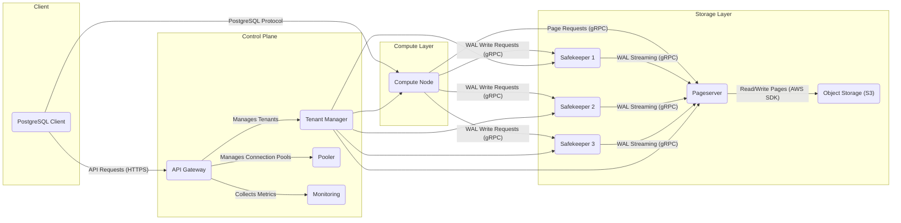
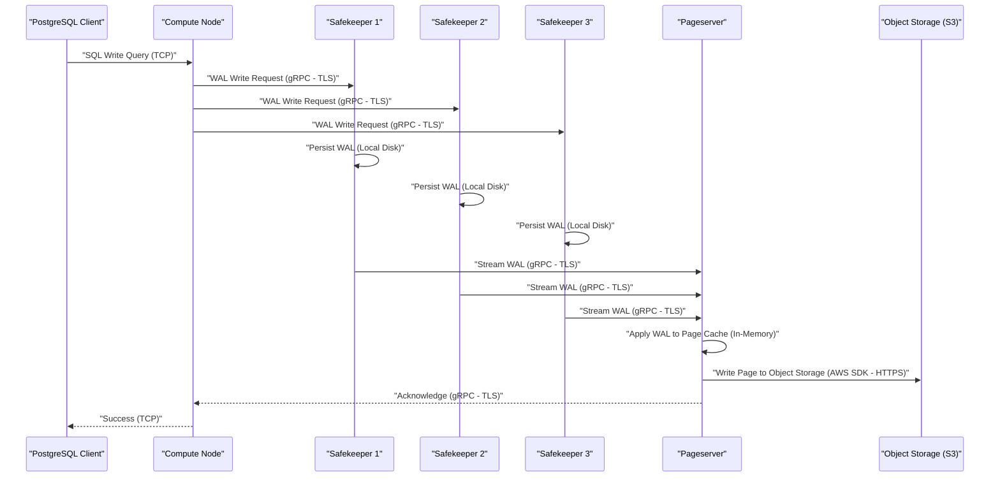
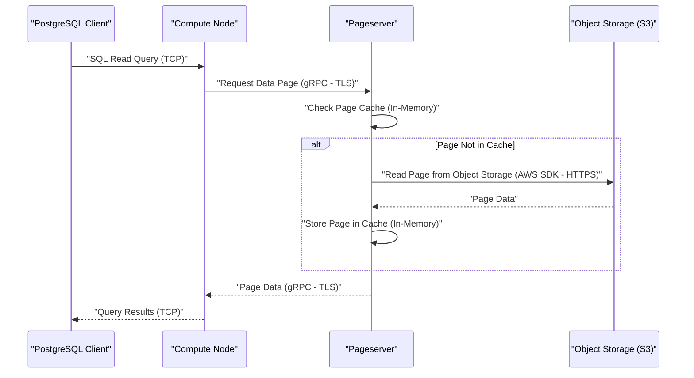
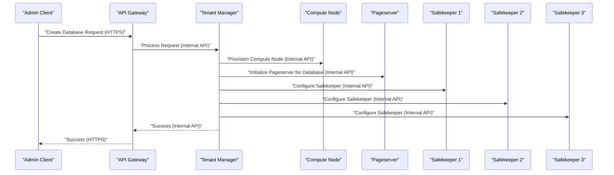

## Project Design Document: Neon - Serverless Postgres

**Document Version:** 1.1
**Date:** October 26, 2023
**Author:** AI Software Architect

### 1. Introduction

This document provides a detailed architectural design of the Neon project, a serverless, fully managed, multi-tenant branchable PostgreSQL. This document aims to provide a comprehensive understanding of the system's components, their interactions, and data flows, with a specific focus on aspects relevant for security analysis. It will serve as the foundation for subsequent threat modeling activities.

### 2. Goals and Scope

The primary goal of this document is to clearly articulate the architecture of the Neon project, emphasizing security-relevant details. The scope includes the core components responsible for providing the serverless Postgres functionality, including data storage, compute management, and control plane operations. This document focuses on the key architectural elements, interfaces, and data handling procedures that are critical for identifying potential security vulnerabilities.

### 3. Target Audience

This document is intended for:

* Security engineers and architects involved in threat modeling and security assessments of the Neon platform.
* Development teams working on the Neon project, particularly those responsible for security-sensitive components.
* Operations teams responsible for deploying, configuring, and maintaining the security posture of the system.

### 4. High-Level Architecture

Neon's architecture is based on a separation of compute and storage, enabling independent scaling and efficient resource utilization. The core components and their relationships are illustrated below:

* **Compute Nodes:** Stateless PostgreSQL instances for client connections and query execution.
* **Pageserver:** Manages the shared, versioned storage layer, serving page requests and persisting data.
* **Safekeepers:** A distributed write-ahead log (WAL) service ensuring data durability and consistency.
* **Control Plane:** Services for managing the system, including user management, database creation, scaling, and monitoring.
* **Object Storage (e.g., AWS S3):** The backing store for the Pageserver, providing durable and scalable storage.

### 5. Component Details

This section provides a detailed description of each core component, highlighting security-relevant aspects.

* **5.1 Compute Nodes:**
    * **Purpose:** Provide the actual PostgreSQL server processes that clients connect to and execute queries against. These are typically based on standard PostgreSQL binaries.
    * **Key Responsibilities:**
        * Accepting client connections via the standard PostgreSQL protocol (typically over TCP).
        * Authenticating clients using standard PostgreSQL authentication methods (e.g., password, SCRAM).
        * Parsing and executing SQL queries, enforcing PostgreSQL's built-in security features (e.g., row-level security).
        * Requesting data pages from the Pageserver using a custom gRPC interface.
        * Sending Write-Ahead Log (WAL) records to the Safekeepers using a custom gRPC interface.
        * Maintaining a local cache of frequently accessed data pages in memory.
    * **Interfaces:**
        * **Client Interface:** Listens for incoming PostgreSQL client connections on a designated port.
        * **Pageserver Interface:** Communicates with the Pageserver via gRPC for page requests. This interface needs to be mutually authenticated and encrypted (e.g., using TLS).
        * **Safekeeper Interface:** Communicates with the Safekeepers via gRPC for sending WAL records. This interface also requires mutual authentication and encryption.
        * **Control Plane Interface:** Interacts with the Control Plane (e.g., Tenant Manager) via HTTPS for configuration updates and lifecycle management. Authentication is typically based on API keys or service accounts.
    * **Data Storage:**
        * Primarily stateless, relying on the Pageserver for persistent data.
        * Maintains a local in-memory cache of data pages. This cache needs to be managed securely to prevent information leakage.
    * **Security Considerations:**
        * Secure handling of client credentials during authentication.
        * Protection against SQL injection vulnerabilities through parameterized queries and input sanitization.
        * Secure and authenticated communication channels with the Pageserver and Safekeepers, preventing man-in-the-middle attacks.
        * Resource isolation between different tenants sharing the same Compute Node instance (if applicable).
        * Securely managing and accessing any local cache data.

* **5.2 Pageserver:**
    * **Purpose:** Manages the shared, versioned storage layer for all Neon databases, providing a single source of truth for data. Implemented in Rust for performance and safety.
    * **Key Responsibilities:**
        * Serving page read requests from Compute Nodes via a custom gRPC interface.
        * Receiving and applying WAL segments from Safekeepers to update the page store.
        * Persisting data pages to object storage (e.g., AWS S3) using the cloud provider's SDK.
        * Implementing copy-on-write semantics for efficient branching and point-in-time recovery.
        * Garbage collecting old page versions to reclaim storage space.
        * Managing metadata about page locations and versions, often stored in a local key-value store (e.g., RocksDB).
    * **Interfaces:**
        * **Compute Node Interface:** Accepts page read requests from Compute Nodes via gRPC. Requires mutual authentication and encryption.
        * **Safekeeper Interface:** Accepts WAL segments from Safekeepers via gRPC. Requires mutual authentication and encryption.
        * **Object Storage Interface:** Interacts with object storage (e.g., AWS S3) using the cloud provider's SDK for reading and writing page data. Authentication is typically handled through IAM roles or access keys.
        * **Control Plane Interface:** Interacts with the Control Plane for management operations (e.g., tenant provisioning, metadata updates). Typically uses HTTPS with API key authentication.
    * **Data Storage:**
        * Stores data pages as objects in object storage (e.g., S3). Data is typically encrypted at rest by the object storage service.
        * Maintains metadata about page locations and versions in a local key-value store. This metadata needs to be protected from unauthorized access and corruption.
    * **Security Considerations:**
        * Robust access control to the underlying object storage to prevent unauthorized access or modification of data.
        * Integrity and confidentiality of data stored in object storage, relying on the cloud provider's encryption mechanisms.
        * Protection against unauthorized access to page data served to Compute Nodes through secure authentication and authorization.
        * Secure handling of metadata, preventing tampering or unauthorized access.
        * Protection against denial-of-service attacks targeting page serving.

* **5.3 Safekeepers:**
    * **Purpose:** Provide a distributed, durable, and consistent Write-Ahead Log (WAL) service, ensuring data durability even in the face of failures. Implemented using a consensus algorithm like Raft.
    * **Key Responsibilities:**
        * Receiving WAL records from Compute Nodes via a custom gRPC interface.
        * Replicating WAL records to other Safekeepers in the quorum for fault tolerance.
        * Persisting WAL records to local disk using `fsync` for durability.
        * Optionally archiving WAL segments to object storage for long-term retention and disaster recovery.
        * Streaming WAL records to the Pageserver for applying changes to the page store.
        * Participating in leader election using the Raft protocol to ensure a single source of truth for WAL.
    * **Interfaces:**
        * **Compute Node Interface:** Accepts WAL write requests from Compute Nodes via gRPC. Requires mutual authentication and encryption.
        * **Safekeeper Replication Interface:** Communicates with other Safekeepers via gRPC for WAL replication and consensus. This communication needs to be authenticated and encrypted.
        * **Pageserver Interface:** Streams WAL records to the Pageserver via gRPC. Requires mutual authentication and encryption.
        * **Control Plane Interface:** Interacts with the Control Plane for management and monitoring (e.g., membership changes, health checks). Typically uses HTTPS with API key authentication.
    * **Data Storage:**
        * Stores WAL segments on local disk for immediate durability. Access to these files needs to be restricted.
        * May archive WAL segments to object storage for long-term retention. Access to these archives needs to be controlled.
    * **Security Considerations:**
        * Secure communication between Safekeepers to prevent tampering with the replication process.
        * Protection against data loss or corruption in the WAL through replication and disk persistence.
        * Access control to WAL data, preventing unauthorized access or modification.
        * Ensuring consistency and ordering of WAL records to maintain data integrity.
        * Protection against attacks that could disrupt the consensus mechanism.

* **5.4 Control Plane:**
    * **Purpose:** Manages the overall Neon system and provides administrative functionalities. This is a collection of microservices responsible for various management tasks.
    * **Key Components (Examples):**
        * **API Gateway:** Provides a central entry point for administrative API requests, handling authentication and routing. Typically uses HTTPS and API key or OAuth 2.0 authentication.
        * **Tenant Manager:** Manages tenant creation, deletion, and configuration, including resource allocation and isolation.
        * **Pooler:** Manages connection pools for Compute Nodes, optimizing resource utilization.
        * **Monitoring:** Collects and displays metrics about the system's health and performance, often using tools like Prometheus and Grafana. Access to monitoring data needs to be controlled.
        * **User Management Service:** Handles user registration, authentication, and authorization for accessing the Neon platform.
    * **Key Responsibilities:**
        * User authentication and authorization for administrative tasks.
        * Tenant and database lifecycle management, including provisioning and de-provisioning resources.
        * Resource allocation and scaling of Compute Nodes, Pageservers, and Safekeepers.
        * Monitoring and alerting on system health and performance.
        * Configuration management of all components.
    * **Interfaces:**
        * **Admin API:** Provides APIs (typically REST over HTTPS) for administrative tasks. Requires strong authentication and authorization.
        * **Internal Communication:** Communicates with Compute Nodes, Pageservers, and Safekeepers via various mechanisms (e.g., gRPC, internal APIs) for management operations. These channels need to be secured.
        * **External Service Integration:** Interacts with external services (e.g., identity providers for SSO, cloud provider APIs). Secure handling of credentials and API keys is crucial.
    * **Data Storage:**
        * Stores metadata about tenants, users, databases, and system configuration in a persistent data store (e.g., a relational database). This data needs to be encrypted at rest and access controlled.
    * **Security Considerations:**
        * Secure authentication and authorization mechanisms for all administrative interfaces.
        * Protection of sensitive configuration data, such as database credentials and API keys, using secrets management solutions.
        * Secure communication channels with other components, preventing unauthorized management actions.
        * Auditing of all administrative actions for accountability.
        * Protection against unauthorized access to monitoring data, which could reveal sensitive information.

* **5.5 Object Storage (e.g., AWS S3):**
    * **Purpose:** Provides durable and scalable storage for data pages and potentially WAL archives. This is a standard cloud service with its own security model.
    * **Key Responsibilities:**
        * Storing and retrieving data objects (pages, WAL segments) with high availability and durability.
        * Providing data integrity checks (e.g., checksums).
        * Managing access control to stored objects through IAM policies.
        * Offering encryption at rest and in transit.
    * **Interfaces:**
        * Provides APIs (e.g., AWS SDK) for object storage operations (e.g., PUT, GET, DELETE). Authentication is handled through IAM roles or access keys.
    * **Data Storage:**
        * Stores data pages and potentially WAL archives as objects.
    * **Security Considerations:**
        * Secure access control policies (IAM) to restrict access to Neon's storage buckets.
        * Ensuring encryption of data at rest using server-side encryption (SSE) or client-side encryption.
        * Enabling encryption in transit (HTTPS) for all communication with the object storage service.
        * Implementing appropriate bucket policies to prevent accidental or malicious data deletion or modification.

### 6. Data Flow Diagrams

This section illustrates the key data flows within the Neon architecture, highlighting communication protocols and security considerations.

* **6.1 Write Path (Client Write Operation):**

* **6.2 Read Path (Client Read Operation):**

* **6.3 Control Plane - Database Creation:**

### 7. Security Considerations

This section outlines key security considerations based on the architecture, providing a basis for threat modeling.

* **Authentication and Authorization:**
    * **Client Authentication:** Secure authentication of clients connecting to Compute Nodes using standard PostgreSQL mechanisms (e.g., password, SCRAM-SHA-256), potentially integrated with external identity providers.
    * **Inter-Component Authentication:** Mutual authentication and authorization between Compute Nodes, Pageservers, and Safekeepers using TLS and potentially client certificates or API keys.
    * **Control Plane Authentication:** Strong authentication for administrative access to the Control Plane via the API Gateway, using mechanisms like API keys, OAuth 2.0, or SAML.
    * **Authorization Policies:** Fine-grained authorization policies to control access to databases, tables, and administrative functions, enforced at the Compute Node and Control Plane levels.

* **Data Encryption:**
    * **Data at Rest:** Encryption of data at rest in object storage (e.g., AWS S3 SSE-KMS or SSE-S3). Encryption of local disk storage used by Safekeepers and potentially Pageservers. Encryption of sensitive data within the Control Plane's data store.
    * **Data in Transit:** Encryption of all network communication between components using TLS (e.g., for gRPC and HTTPS).

* **Network Security:**
    * **Network Segmentation:** Isolation of different components into separate network segments (e.g., using VPCs and subnets) with restricted network access.
    * **Firewall Rules:** Strict firewall rules to limit access to specific ports and services based on the principle of least privilege.
    * **Secure Communication Protocols:** Enforcement of secure communication protocols (TLS 1.2 or higher) for all inter-component communication.

* **Input Validation:**
    * **SQL Injection Prevention:** Robust input validation and parameterized queries in Compute Nodes to prevent SQL injection attacks.
    * **API Request Validation:** Thorough validation of all API requests in the Control Plane to prevent injection attacks and other vulnerabilities.

* **Secrets Management:**
    * **Secure Storage:** Secure storage of secrets (e.g., database credentials, API keys, TLS certificates) using dedicated secrets management services (e.g., HashiCorp Vault, AWS Secrets Manager).
    * **Rotation:** Regular rotation of secrets to limit the impact of potential compromises.
    * **Least Privilege Access:** Restricting access to secrets based on the principle of least privilege.

* **Logging and Auditing:**
    * **Comprehensive Logging:** Logging of all security-relevant events across all components, including authentication attempts, authorization decisions, and data access.
    * **Audit Trails:** Maintaining immutable audit trails for compliance and forensic analysis.
    * **Centralized Logging:** Centralized logging infrastructure for efficient monitoring and analysis.

* **Resource Isolation:**
    * **Tenant Isolation:** Strong resource isolation between different tenants to prevent interference or information leakage, potentially using containerization or virtualization technologies.
    * **Rate Limiting:** Rate limiting on API endpoints and client connections to prevent denial-of-service attacks.

* **Vulnerability Management:**
    * **Regular Scanning:** Regular vulnerability scanning of all components and dependencies.
    * **Patch Management:** Timely patching of identified vulnerabilities.

* **Denial of Service (DoS) Protection:**
    * **Rate Limiting:** Rate limiting at the API Gateway and Compute Node levels.
    * **Traffic Filtering:** Network-level traffic filtering to mitigate volumetric attacks.
    * **Resource Limits:** Setting appropriate resource limits to prevent resource exhaustion.

### 8. Assumptions and Constraints

* **Assumptions:**
    * The underlying cloud infrastructure (e.g., AWS) provides basic security features such as network isolation and physical security.
    * Standard PostgreSQL security best practices are followed within Compute Nodes.
* **Constraints:**
    * The design must support multi-tenancy with strong isolation between tenants.
    * Performance and scalability are critical requirements, influencing security design choices.

### 9. Future Considerations

* Conduct a detailed threat modeling exercise based on this design document to identify potential vulnerabilities and attack vectors.
* Develop specific security requirements and controls for each component based on the threat model.
* Implement security testing and vulnerability scanning as part of the development lifecycle.
* Define and implement incident response procedures for security events.
* Explore and implement advanced security features such as data masking and encryption at the application level.

This improved document provides a more detailed and security-focused view of the Neon project's architecture, serving as a stronger foundation for subsequent threat modeling and security analysis.