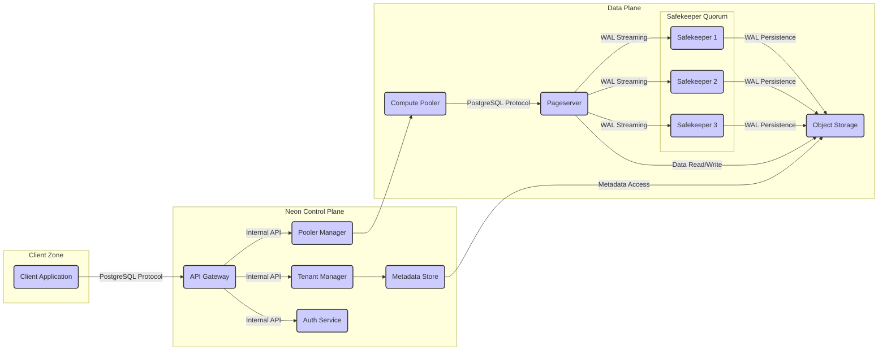

# Project Design Document: Neon Database

**Version:** 1.1
**Date:** October 26, 2023
**Author:** AI Cloud & Security Architect

## 1. Introduction

This document provides an enhanced description of the architectural design of the Neon database project, based on the codebase available at [https://github.com/neondatabase/neon](https://github.com/neondatabase/neon). This revised document aims to offer a more detailed and nuanced understanding of the system's components, interactions, and data flows, specifically tailored for effective threat modeling. It builds upon the previous version by providing greater clarity and depth in key areas.

## 2. Goals and Objectives

The core objectives of the Neon project remain focused on delivering:

*   A serverless PostgreSQL experience that abstracts away infrastructure management.
*   Horizontal scalability to handle varying workloads and data volumes.
*   Cost optimization through efficient resource utilization and pay-as-you-go pricing.
*   Non-blocking branching and forking capabilities for rapid development and experimentation with database states.
*   Durable and reliable storage leveraging cloud-native object storage solutions.
*   High availability and fault tolerance to ensure continuous operation.

This document emphasizes the architectural elements that contribute to these objectives, highlighting aspects crucial for identifying potential security vulnerabilities.

## 3. High-Level Architecture

The Neon architecture comprises several interconnected components working in concert:

*   **Client Applications:**  External applications and users interacting with Neon databases via standard PostgreSQL client libraries.
*   **Neon Control Plane:** The management layer responsible for orchestrating and controlling the lifecycle of Neon databases.
*   **Pageserver:** The stateless compute unit that executes SQL queries and manages the active database state in memory.
*   **Safekeepers:**  A quorum-based distributed log storage system ensuring the durability and consistency of write-ahead logs (WAL).
*   **Object Storage:** The persistent storage layer housing base database images, WAL segments, and metadata.
*   **Compute Poolers:**  Connection poolers that manage and route client connections to available Pageserver instances.

## 4. Component Breakdown

This section provides a more detailed breakdown of each component's responsibilities and internal workings:

*   **Client Application:**
    *   Initiates connections to Neon databases using standard PostgreSQL client libraries (e.g., `psycopg2`, `libpq`).
    *   Submits SQL queries and receives results.
    *   Authentication is handled externally or via the Neon authentication service.

*   **Neon Control Plane:**
    *   **API Gateway:**
        *   Serves as the entry point for all external API requests to manage Neon resources.
        *   Performs initial authentication and authorization checks.
        *   Routes requests to the appropriate control plane services.
    *   **Tenant Manager:**
        *   Manages the lifecycle of tenants, including creation, deletion, and resource allocation.
        *   Enforces tenant isolation and resource quotas.
    *   **Pooler Manager:**
        *   Manages a pool of connection pooler instances.
        *   Routes incoming client connections to available and appropriate Pageserver instances based on load and tenant.
    *   **Metadata Store:**
        *   Stores persistent metadata about tenants, databases, branches, users, roles, and other system configurations.
        *   Critical for the overall operation and consistency of the system.
        *   Likely implemented using a robust and highly available database system.
    *   **Auth Service:**
        *   Handles user authentication and authorization for accessing Neon resources.
        *   May integrate with external identity providers.

*   **Compute Pooler:**
    *   Acts as an intermediary between client applications and Pageservers.
    *   Maintains a pool of connections to Pageservers.
    *   Reduces the overhead of establishing new connections for each client request.
    *   Provides connection multiplexing and management.

*   **Pageserver:**
    *   The core compute engine responsible for processing SQL queries.
    *   Stateless and ephemeral; its state is derived from object storage and WAL streams.
    *   Retrieves base images and WAL segments from object storage on startup or when needed.
    *   Applies WAL records from Safekeepers to reconstruct the database state in memory.
    *   Maintains an in-memory page cache for frequently accessed data.
    *   Periodically checkpoints its state to object storage to create new base images.

*   **Safekeepers:**
    *   A distributed quorum of nodes responsible for durably storing the Write-Ahead Log (WAL) stream from Pageservers.
    *   Ensures that committed transactions are not lost, even in the event of Pageserver failure.
    *   Forms a consensus group (e.g., using Raft) to tolerate failures.
    *   Persists WAL segments to object storage.
    *   Can provide WAL segments to Pageservers for recovery or to build a consistent state.

*   **Object Storage:**
    *   Provides durable and scalable storage for:
        *   Base database images (snapshots of the database at a specific point in time).
        *   WAL segments (sequences of database changes).
        *   Metadata related to storage organization.
    *   Offers high availability and data redundancy.
    *   Access is typically controlled through access keys and policies.

## 5. Data Flow

This section details the flow of data during key operations:

*   **Client Connection Establishment:**
    1. The Client Application initiates a connection to the Neon service, typically through a load balancer.
    2. The connection is routed to the API Gateway.
    3. The API Gateway authenticates the client (or verifies an existing session).
    4. The Pooler Manager determines an appropriate Compute Pooler instance.
    5. The Compute Pooler establishes a connection to a suitable Pageserver.
    6. The client's connection is proxied through the Compute Pooler to the Pageserver.

*   **Write Operation (Detailed):**
    1. The Client Application sends a write query to the Compute Pooler.
    2. The Compute Pooler forwards the query to the assigned Pageserver.
    3. The Pageserver executes the query, modifying its in-memory state and generating WAL records.
    4. The Pageserver streams the WAL records to the Safekeeper quorum.
    5. Each Safekeeper in the quorum persists the WAL record to its local storage and acknowledges receipt.
    6. Once a quorum of Safekeepers acknowledges, the Pageserver considers the transaction committed.
    7. The Pageserver sends a confirmation to the Compute Pooler, which relays it to the Client Application.
    8. Asynchronously, Safekeepers upload the WAL segments to object storage.

*   **Read Operation (Detailed):**
    1. The Client Application sends a read query to the Compute Pooler.
    2. The Compute Pooler forwards the query to the assigned Pageserver.
    3. The Pageserver checks its in-memory page cache for the requested data.
    4. If the data is present in the cache, it is returned to the Compute Pooler and then to the Client Application.
    5. If the data is not in the cache, the Pageserver identifies the necessary base image and WAL segments from object storage.
    6. The Pageserver retrieves the base image and relevant WAL segments.
    7. The Pageserver applies the WAL segments to reconstruct the required data pages in its cache.
    8. The data is then returned to the Compute Pooler and subsequently to the Client Application.

*   **Database Branch Creation:**
    1. A request to create a new branch is sent to the API Gateway.
    2. The API Gateway authenticates and authorizes the request.
    3. The request is forwarded to the Tenant Manager.
    4. The Tenant Manager creates metadata for the new branch in the Metadata Store, referencing the parent branch's storage location.
    5. No data is physically copied at this stage. The new branch initially shares the storage of its parent.
    6. Subsequent writes to the new branch will trigger a copy-on-write mechanism, where modified data pages are written to new storage locations specific to the branch.

## 6. Security Considerations (Enhanced)

This section expands on the initial security considerations, providing more specific questions and areas for scrutiny during threat modeling:

*   **Authentication and Authorization:**
    *   How are users and applications authenticated when connecting via the PostgreSQL protocol? Is it password-based, certificate-based, or using other mechanisms?
    *   How is access control enforced at the database level (e.g., roles, permissions)?
    *   How is access to the Control Plane APIs secured? Are API keys, OAuth 2.0, or other methods used?
    *   How is multi-tenancy enforced to prevent unauthorized access between tenants?
    *   What mechanisms prevent privilege escalation within the system?

*   **Data Encryption:**
    *   Is data encrypted at rest in object storage? What encryption algorithm and key management strategy are employed (e.g., SSE-KMS, SSE-S3)?
    *   Is data encrypted in transit between all components (e.g., client to Pooler, Pooler to Pageserver, Pageserver to Safekeepers, Safekeepers to object storage)? What protocols are used (e.g., TLS 1.3)?
    *   How are encryption keys managed and rotated?

*   **Network Security:**
    *   Are network segments isolated using Virtual Private Clouds (VPCs) or similar technologies?
    *   Are Network Access Control Lists (NACLs) or security groups used to restrict traffic between components?
    *   Are all internal communications authenticated and potentially encrypted (e.g., using mutual TLS)?
    *   How is the system protected against network-based attacks (e.g., DDoS)?

*   **Secrets Management:**
    *   How are database credentials, API keys, and other sensitive information stored and managed securely? Are secrets stored in a dedicated secrets management service (e.g., HashiCorp Vault, AWS Secrets Manager)?
    *   How is access to secrets controlled and audited?

*   **Isolation:**
    *   How is tenant data isolated at the storage level? Are separate storage buckets or prefixes used?
    *   How is compute isolation achieved between tenants and branches?
    *   Are there any shared resources that could lead to cross-tenant contamination or interference?

*   **Vulnerability Management:**
    *   What is the process for identifying, tracking, and remediating security vulnerabilities in the codebase and dependencies?
    *   Are regular security audits and penetration testing conducted?

*   **Auditing and Logging:**
    *   What security-relevant events are logged (e.g., authentication attempts, authorization decisions, data access)?
    *   Where are logs stored, and how is their integrity and availability ensured?
    *   Are logs monitored for suspicious activity?

*   **Denial of Service (DoS) Protection:**
    *   Are there rate limiting mechanisms in place at the API Gateway and other entry points?
    *   How is the system protected against resource exhaustion attacks?

*   **Supply Chain Security:**
    *   How are dependencies vetted for security vulnerabilities?
    *   Is there a process for ensuring the integrity of the build and deployment pipeline?

## 7. Deployment Model

Neon is typically deployed in a cloud-native environment, leveraging:

*   **Container Orchestration:** Kubernetes is likely used to manage and scale the various components (Control Plane services, Poolers, Pageservers, Safekeepers).
*   **Cloud Provider Services:**
    *   **Compute:** Virtual Machines (VMs) or managed Kubernetes services (e.g., EKS, GKE, AKS).
    *   **Storage:** Object storage services (e.g., AWS S3, Azure Blob Storage, Google Cloud Storage).
    *   **Networking:** Virtual Private Clouds (VPCs), load balancers, security groups, DNS services.
    *   **Managed Databases:** Potentially for the Metadata Store (e.g., a managed PostgreSQL instance).
    *   **Secrets Management:** Cloud provider secrets management services.
    *   **Monitoring and Logging:** Cloud provider monitoring and logging solutions.

## 8. Technology Stack (Detailed)

*   **Core Database Engine:** PostgreSQL.
*   **Primary Programming Language:** Rust (for core components like Pageserver and Safekeepers).
*   **Control Plane Languages:** Potentially Go or other languages suitable for building microservices.
*   **Communication Protocols:**
    *   PostgreSQL wire protocol (for client-to-server communication).
    *   gRPC or similar for internal communication between services.
*   **Data Serialization:** Protocol Buffers or similar for efficient data exchange.
*   **Consensus Algorithm:** Likely Raft for Safekeeper quorum management.
*   **Cloud Provider Integrations:** SDKs for interacting with cloud storage, networking, and other services (e.g., AWS SDK for Rust, Azure SDK for Rust).
*   **Containerization:** Docker.
*   **Orchestration:** Kubernetes.

## 9. Assumptions and Constraints

*   The underlying cloud infrastructure provides a baseline level of security and reliability.
*   Standard security development practices are followed throughout the project lifecycle.
*   This document focuses on the logical architecture; specific implementation details may vary.

## 10. Future Considerations

*   More granular details on the implementation of authentication and authorization flows.
*   A deeper dive into the mechanisms for ensuring data consistency and durability.
*   Specific details on the implementation of branching and forking at the storage level.
*   Analysis of performance optimization strategies and their security implications.

This enhanced design document provides a more comprehensive and detailed view of the Neon database architecture, making it a more effective resource for conducting thorough threat modeling exercises. The added details and specific questions aim to facilitate a deeper understanding of potential security vulnerabilities and risks within the system.
