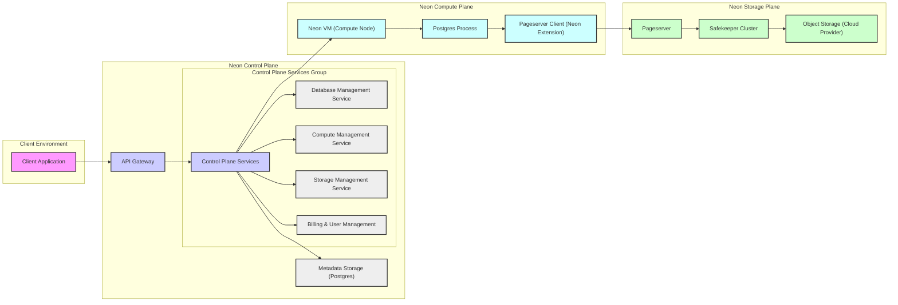

## Project Design Document: Neon Serverless Postgres (Improved)

**Project Name:** Neon Serverless Postgres

**Project Repository:** [https://github.com/neondatabase/neon](https://github.com/neondatabase/neon)

**Document Version:** 1.1
**Date:** 2023-10-27
**Author:** AI Software Architect

### 1. Project Overview

**1.1. Project Goals:**

*   Primary Goal: Deliver a fully managed, serverless Postgres database experience.
*   Scalability: Automatically scale compute and storage resources to meet application demands.
*   Cost Efficiency: Optimize costs by charging users only for resources actively consumed.
*   Operational Simplicity: Reduce database management burden for developers and operations teams.
*   Performance: Provide high performance and low latency for demanding database workloads.
*   Developer Experience: Offer a seamless and intuitive experience for Postgres developers.
*   Data Reliability: Ensure robust data durability, availability, and consistency.
*   Branching Innovation: Enable efficient database branching for development workflows and data experimentation.

**1.2. Target Audience:**

*   Cloud-Native Application Developers: Building applications designed for cloud environments.
*   Startups and SMEs: Seeking cost-effective and scalable database solutions without operational overhead.
*   Enterprises: Looking to modernize database infrastructure and improve agility.
*   DevOps Teams: Aiming to automate database management and integrate with CI/CD pipelines.
*   Postgres Community: Users who value Postgres compatibility and seek a serverless deployment option.

**1.3. Key Features:**

*   True Serverless Postgres: No server management, automatic scaling, and consumption-based billing.
*   Instant Branching: Create isolated database branches in seconds for development, testing, and feature isolation.
*   Scalable and Independent Compute & Storage: Compute and storage scale independently based on needs.
*   Full Postgres Compatibility: Supports standard Postgres features, extensions, and client libraries.
*   High Availability & Durability: Architected for resilience with data replication and fault tolerance.
*   Developer-Centric Tools: CLI, API, and integrations for streamlined database management.
*   Observability: Comprehensive monitoring and logging for performance analysis and troubleshooting.
*   Secure by Default: Built with security best practices at every layer of the architecture.

### 2. Architecture Diagram

### 3. Component Descriptions

**3.1. Client Environment:**

*   **Client Application:**  Any application requiring database access, utilizing standard Postgres client drivers and connection methods.

**3.2. Neon Control Plane:**

*   **API Gateway:**
    *   Publicly accessible entry point for all Neon API requests.
    *   Handles:
        *   API request routing and load balancing.
        *   Authentication (e.g., API keys, OAuth).
        *   Authorization and rate limiting.
        *   TLS termination.
*   **Control Plane Services Group:**  A collection of microservices responsible for core Neon management functions.
    *   **Control Plane Services (Core Orchestration):**
        *   Central service coordinating operations across all planes.
        *   Manages workflows for database lifecycle, scaling, and branching.
        *   Implements business logic and policy enforcement.
    *   **Database Management Service:**
        *   Handles database creation, deletion, configuration updates, and branch management.
        *   Interacts with Metadata Storage to persist database configurations.
    *   **Compute Management Service:**
        *   Manages the lifecycle of Neon VMs (Compute Nodes).
        *   Provisions, scales, and monitors compute resources based on workload.
        *   Integrates with infrastructure providers (e.g., AWS, GCP, Azure).
    *   **Storage Management Service:**
        *   Manages Pageserver and Safekeeper instances.
        *   Orchestrates storage provisioning and scaling.
        *   Ensures data durability and availability across the Storage Plane.
    *   **Billing & User Management:**
        *   Handles user authentication, authorization, and account management.
        *   Tracks resource usage and generates billing information.
        *   Manages user roles and permissions.
*   **Metadata Storage (Postgres):**
    *   Persistent and consistent storage for Neon's internal configuration and state.
    *   Stores:
        *   Database instance metadata (connection details, resource allocation).
        *   User account information and permissions.
        *   Branching relationships and history.
        *   Service configuration and operational parameters.

**3.3. Neon Compute Plane:**

*   **Neon VM (Compute Node):**
    *   Isolated compute environment (VM or container) dedicated to a single Postgres instance.
    *   Provides dedicated resources (CPU, memory, network) for optimal Postgres performance.
    *   Ephemeral and dynamically provisioned based on demand.
*   **Postgres Process:**
    *   Standard unmodified Postgres server binary.
    *   Executes SQL queries and manages database sessions as usual.
    *   Relies on the Pageserver Client for all storage operations.
*   **Pageserver Client (Neon Extension):**
    *   Custom Postgres extension acting as a storage proxy.
    *   Intercepts Postgres storage requests (read/write/WAL).
    *   Translates Postgres storage requests into Pageserver API calls.
    *   Handles local caching of frequently accessed data pages.
    *   Manages connection and communication with the Pageserver.

**3.4. Neon Storage Plane:**

*   **Pageserver:**
    *   Core storage service responsible for managing database pages.
    *   Stores data in a layered, versioned format optimized for branching and efficient storage.
    *   Provides a page-level API for read and write operations.
    *   Implements caching mechanisms for performance.
    *   Manages data consistency and concurrency control.
*   **Safekeeper Cluster:**
    *   Distributed cluster of Safekeeper nodes for WAL storage and replication.
    *   Ensures durability and high availability of transaction logs (WAL).
    *   Synchronously persists WAL records from Pageserver Clients.
    *   Replicates WAL across multiple Safekeeper nodes for fault tolerance.
    *   Provides WAL streaming for Pageserver recovery and point-in-time restore.
*   **Object Storage (Cloud Provider):**
    *   Scalable and durable cloud object storage (e.g., AWS S3, Google Cloud Storage, Azure Blob Storage).
    *   Serves as the long-term persistent storage backend for Pageserver and Safekeeper.
    *   Stores database pages and WAL segments for durability and cost-effectiveness.
    *   Enables efficient storage and retrieval of large datasets.

### 4. Data Flow

**4.1. Write Path (SQL Data Modification):**

1. **Client Application** sends a SQL write statement (INSERT, UPDATE, DELETE) to the **API Gateway**.
2. **API Gateway** authenticates, authorizes, and routes the request to **Control Plane Services**.
3. **Control Plane Services** identifies the target **Neon VM** and forwards the request.
4. **Postgres Process** on the Neon VM receives and executes the SQL statement.
5. **Postgres Process** generates WAL records and page modifications.
6. **Pageserver Client** intercepts WAL records and sends them to the **Safekeeper Cluster**.
7. **Safekeeper Cluster** synchronously persists and replicates the WAL records. Acknowledges write success.
8. **Pageserver Client** sends page modifications to the **Pageserver**.
9. **Pageserver** applies changes to its cache and asynchronously persists to **Object Storage**.
10. **Pageserver Client** receives confirmation from Pageserver and Safekeeper.
11. **Pageserver Client** signals transaction completion to the **Postgres Process**.
12. **Postgres Process** returns success to the **Client Application**.

**4.2. Read Path (SQL Data Retrieval):**

1. **Client Application** sends a SQL read statement (SELECT) to the **API Gateway**.
2. **API Gateway** authenticates, authorizes, and routes the request to **Control Plane Services**.
3. **Control Plane Services** identifies the target **Neon VM** and forwards the request.
4. **Postgres Process** on the Neon VM receives and executes the SQL statement.
5. **Postgres Process** requests data pages from the **Pageserver Client**.
6. **Pageserver Client** checks its local page cache.
7. If page is cached, **Pageserver Client** returns it to **Postgres Process**.
8. If page is not cached, **Pageserver Client** requests it from the **Pageserver**.
9. **Pageserver** retrieves the page from its cache or **Object Storage**.
10. **Pageserver** returns the page to the **Pageserver Client**.
11. **Pageserver Client** caches the page and returns it to the **Postgres Process**.
12. **Postgres Process** processes the data and returns query results to the **Client Application**.

**4.3. Branch Creation Flow:**

1. **Client Application** sends a "create branch" request to the **API Gateway**.
2. **API Gateway** authenticates, authorizes, and routes the request to **Control Plane Services**.
3. **Control Plane Services** invokes **Database Management Service**.
4. **Database Management Service** creates new metadata entries in **Metadata Storage** for the new branch, referencing the parent branch's storage lineage in **Pageserver**.
5. **Compute Management Service** provisions a new **Neon VM** for the new branch (initially may be lightweight or shared).
6. **Control Plane Services** configures routing so connections to the new branch are directed to the new **Neon VM**.
7. **Control Plane Services** returns success to the **API Gateway**.
8. **API Gateway** returns branch creation confirmation to the **Client Application**.
    *   Note: Branch creation is metadata-heavy and storage-light initially, leveraging copy-on-write principles in Pageserver for efficient branching.

### 5. Security Considerations (Detailed Initial)

**5.1. Confidentiality:**

*   **Data at Rest Encryption:**
    *   Object Storage encryption (SSE-S3, KMS, etc.) for database pages and WAL segments.
    *   Encryption of Metadata Storage.
    *   Consider encryption of Pageserver and Safekeeper caches if sensitive data is processed in memory.
*   **Data in Transit Encryption:**
    *   TLS/SSL encryption for all external communication (API Gateway to Client, Client to Neon VM).
    *   mTLS (mutual TLS) for internal service-to-service communication within Neon infrastructure.
*   **Secrets Management:**
    *   Use of dedicated secrets management systems (e.g., HashiCorp Vault, AWS Secrets Manager) for storing and managing API keys, database credentials, encryption keys, and internal service credentials.
    *   Principle of least privilege for secret access.

**5.2. Integrity:**

*   **Data Integrity Checks:**
    *   Checksums and integrity verification for data stored in Object Storage and during data transfer.
    *   WAL mechanism in Postgres and Safekeeper ensures transactional integrity.
*   **Access Control & Authorization:**
    *   RBAC (Role-Based Access Control) for Neon API and database operations.
    *   Fine-grained permissions for database access and management.
    *   Authentication and authorization enforced at API Gateway and Control Plane Services.
*   **Immutable Infrastructure:**
    *   Consider immutable infrastructure principles for Compute Plane and Storage Plane components to reduce configuration drift and improve security posture.

**5.3. Availability:**

*   **High Availability Architecture:**
    *   Redundancy and replication in Safekeeper Cluster for WAL durability and availability.
    *   Pageserver replication or clustering for high availability (implementation details to be further investigated).
    *   Load balancing and failover mechanisms for API Gateway and Control Plane Services.
    *   Multi-AZ deployment for critical components to withstand zone failures.
*   **Disaster Recovery:**
    *   Regular backups of Metadata Storage and potentially Pageserver snapshots.
    *   Disaster recovery plans and procedures for service restoration in case of major outages.
*   **Monitoring and Alerting:**
    *   Comprehensive monitoring of system health, performance, and security metrics.
    *   Automated alerting for critical issues and security events.
    *   Proactive capacity planning and scaling to prevent performance degradation and outages.

**5.4. Network Security:**

*   **Network Segmentation:**
    *   Isolation of Control Plane, Compute Plane, and Storage Plane into separate network segments (e.g., VPCs, subnets).
    *   Strict firewall rules to control traffic flow between components and external networks.
*   **Minimal Public Exposure:**
    *   Minimize the attack surface by limiting public exposure of internal services.
    *   API Gateway as the single point of entry for external traffic.
*   **DDoS Protection:**
    *   DDoS mitigation measures at the API Gateway and infrastructure level.

**5.5. Application Security:**

*   **Secure SDLC:**
    *   Secure Software Development Lifecycle (SDLC) practices throughout the development process.
    *   Regular security code reviews and vulnerability scanning.
    *   Penetration testing and security audits.
*   **Input Validation and Output Encoding:**
    *   Proper input validation and output encoding to prevent injection attacks (SQL injection, XSS, etc.) in Control Plane APIs and potentially within Postgres extensions (Pageserver Client).
*   **Dependency Management:**
    *   Secure dependency management practices and regular updates to address known vulnerabilities in third-party libraries.

### 6. Technology Stack (More Specific)

*   **Programming Languages:**
    *   Rust (Pageserver, Safekeeper, Pageserver Client Postgres Extension, Neon VM Agent - performance-critical and systems-level components)
    *   Go (Control Plane Services, API Gateway, Orchestration - for backend services and API development)
    *   SQL (Postgres - Metadata Storage, data processing within Postgres)
*   **Databases:**
    *   Postgres (Primary Metadata Storage, potentially for other internal services requiring relational data)
    *   Redis or similar in-memory data store (Potential caching layer in Control Plane or Pageserver)
*   **Object Storage:**
    *   AWS S3, Google Cloud Storage, Azure Blob Storage (Cloud provider specific object storage services)
*   **Container Orchestration:**
    *   Kubernetes (Likely for orchestrating Control Plane Services, Pageserver, Safekeeper, and potentially Neon VMs - for scalability and management)
*   **Virtualization/Containerization:**
    *   KVM, Firecracker, or similar VM technology (for Neon VMs - isolation and security)
    *   Docker or similar container technology (for Control Plane Services, Pageserver, Safekeeper components)
*   **Networking:**
    *   Cloud provider VPCs, Subnets, Network Policies, Load Balancers
    *   gRPC (Internal service communication - efficient and performant)
    *   HTTPS/TLS 1.3 (External API and client communication - secure communication)
*   **Monitoring and Logging:**
    *   Prometheus (Metrics collection and monitoring)
    *   Grafana (Dashboarding and visualization)
    *   Loki, Elasticsearch, or similar (Log aggregation and analysis)
    *   Jaeger or OpenTelemetry (Distributed tracing)
*   **Operating System:**
    *   Linux (Primarily for server-side components and Neon VMs - open-source and widely used in cloud environments)

This improved design document provides a more detailed and refined view of the Neon Serverless Postgres project, suitable for in-depth threat modelling and further architectural analysis. It includes more specific component descriptions, data flow details, expanded security considerations, and a more concrete technology stack.