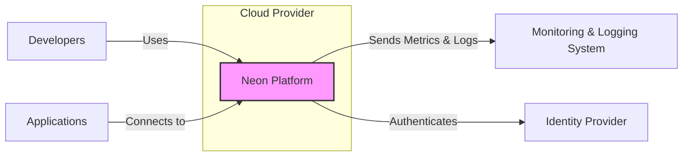
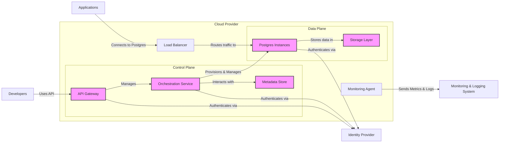

# BUSINESS POSTURE

Neon is a serverless Postgres platform designed to offer scalability, branching, and cost-efficiency for modern applications. The primary business goal is to provide a developer-friendly, scalable, and reliable database solution that simplifies database management and reduces operational overhead. Neon aims to address the challenges of traditional database systems in cloud-native environments, such as scaling complexity, slow branching, and high operational costs.

Key business priorities for Neon include:

*   Rapid growth and adoption by developers and businesses.
*   High availability and reliability of the database service.
*   Data security and privacy to build trust with users.
*   Cost-effectiveness for users compared to traditional database solutions.
*   Innovation and feature development to stay ahead of the competition.

Most important business risks that need to be addressed:

*   Data loss or corruption leading to business disruption and reputational damage.
*   Security breaches and data leaks compromising sensitive user data and trust.
*   Service unavailability impacting user applications and business operations.
*   Performance bottlenecks and scalability limitations hindering user growth and satisfaction.
*   Compliance and regulatory risks related to data privacy and security.

# SECURITY POSTURE

Existing security controls:

*   security control: Code reviews are likely implemented as part of the development process, especially for an open-source project like Neon. (Location: GitHub Pull Request process)
*   security control: Automated testing is expected to be in place, including unit, integration, and potentially performance tests. (Location: GitHub Workflows, CI/CD pipelines)
*   security control: Containerization using Docker is evident from the repository, providing isolation and consistency in deployment. (Location: Dockerfiles in the repository)
*   security control: Cloud infrastructure security provided by the underlying cloud provider (e.g., AWS, GCP, Azure). (Location: Cloud provider documentation and configurations)
*   security control: Network security controls within the cloud environment, such as VPCs, security groups, and network policies. (Location: Cloud provider network configurations)
*   security control: Access control mechanisms for infrastructure and services provided by the cloud provider. (Location: Cloud provider IAM and access management)

Accepted risks:

*   accepted risk: Potential vulnerabilities in open-source dependencies.
*   accepted risk: Risks associated with rapid development cycles and feature releases.
*   accepted risk: Security misconfigurations in cloud deployments due to complexity.
*   accepted risk: Insider threats from developers or operators with access to sensitive systems.
*   accepted risk: Denial of service attacks targeting the database service.

Recommended security controls:

*   security control: Implement static application security testing (SAST) tools in the CI/CD pipeline to identify vulnerabilities in the codebase.
*   security control: Implement dynamic application security testing (DAST) tools to test the running application for vulnerabilities.
*   security control: Integrate software composition analysis (SCA) tools to manage and monitor open-source dependencies for known vulnerabilities.
*   security control: Implement infrastructure as code (IaC) security scanning to detect misconfigurations in infrastructure deployments.
*   security control: Regularly perform penetration testing and vulnerability assessments to identify and address security weaknesses.
*   security control: Implement a security incident and event management (SIEM) system for monitoring and alerting on security events.
*   security control: Implement robust logging and monitoring of security-relevant events across all components.
*   security control: Establish a formal security incident response plan.
*   security control: Implement data encryption at rest and in transit for sensitive data.
*   security control: Implement strong authentication and authorization mechanisms for accessing the database service and management interfaces.

Security requirements:

*   Authentication:
    *   Requirement: Secure authentication mechanism for users and applications accessing the Neon database service.
    *   Requirement: Support for industry-standard authentication protocols (e.g., OAuth 2.0, API keys).
    *   Requirement: Multi-factor authentication (MFA) for administrative access.
*   Authorization:
    *   Requirement: Granular authorization controls to manage access to database resources and operations.
    *   Requirement: Role-based access control (RBAC) to simplify authorization management.
    *   Requirement: Principle of least privilege should be enforced for all access controls.
*   Input Validation:
    *   Requirement: Robust input validation for all data entering the system to prevent injection attacks (e.g., SQL injection, command injection).
    *   Requirement: Input validation should be applied at multiple layers of the application.
    *   Requirement: Use of parameterized queries or prepared statements to prevent SQL injection.
*   Cryptography:
    *   Requirement: Encryption of sensitive data at rest and in transit.
    *   Requirement: Use of strong cryptographic algorithms and protocols.
    *   Requirement: Secure key management practices for encryption keys.
    *   Requirement: Protection of cryptographic keys from unauthorized access.

# DESIGN

## C4 CONTEXT



Context Diagram Elements:

*   Element:
    *   Name: Neon Platform
    *   Type: Software System
    *   Description: The Neon serverless Postgres platform, providing scalable and branchable database services.
    *   Responsibilities:
        *   Managing Postgres instances.
        *   Providing API for database operations.
        *   Handling storage and compute scaling.
        *   Ensuring data durability and availability.
        *   Providing branching and versioning capabilities.
    *   Security controls:
        *   security control: Authentication and authorization for API access.
        *   security control: Input validation for all API requests.
        *   security control: Encryption at rest and in transit for database data.
        *   security control: Network security controls to isolate the platform.
        *   security control: Monitoring and logging of security events.

*   Element:
    *   Name: Developers
    *   Type: Person
    *   Description: Software developers who use the Neon platform to create and manage databases for their applications.
    *   Responsibilities:
        *   Creating and managing Neon projects and databases.
        *   Developing applications that connect to Neon databases.
        *   Monitoring database performance and usage.
    *   Security controls:
        *   security control: Strong password policies for developer accounts.
        *   security control: Multi-factor authentication for developer accounts.
        *   security control: Access control to Neon projects and resources based on roles.

*   Element:
    *   Name: Applications
    *   Type: Software System
    *   Description: Applications developed by users that connect to and utilize Neon databases for data storage and retrieval.
    *   Responsibilities:
        *   Sending database queries to Neon.
        *   Receiving and processing data from Neon.
        *   Managing application-level security.
    *   Security controls:
        *   security control: Securely storing database credentials.
        *   security control: Implementing application-level authorization.
        *   security control: Protecting against application-level vulnerabilities.

*   Element:
    *   Name: Monitoring & Logging System
    *   Type: Software System
    *   Description: External system used by Neon to collect, aggregate, and analyze logs and metrics for monitoring performance, detecting issues, and security auditing.
    *   Responsibilities:
        *   Collecting logs and metrics from Neon platform components.
        *   Providing dashboards and alerts for monitoring.
        *   Storing logs for auditing and security analysis.
    *   Security controls:
        *   security control: Secure communication channels for sending logs and metrics.
        *   security control: Access control to monitoring data and dashboards.
        *   security control: Data retention policies for audit logs.

*   Element:
    *   Name: Identity Provider
    *   Type: Software System
    *   Description: External system used by Neon for user authentication and identity management. Could be a service like Auth0, Okta, or a cloud provider's IAM.
    *   Responsibilities:
        *   Authenticating users accessing the Neon platform.
        *   Managing user identities and credentials.
        *   Providing authentication tokens for authorized access.
    *   Security controls:
        *   security control: Secure authentication protocols (e.g., OAuth 2.0, SAML).
        *   security control: Secure storage of user credentials.
        *   security control: Protection against account takeover attacks.

## C4 CONTAINER



Container Diagram Elements:

*   Element:
    *   Name: API Gateway
    *   Type: Container
    *   Description: Entry point for all API requests from developers and potentially applications for control plane operations.
    *   Responsibilities:
        *   API request routing and load balancing.
        *   Authentication and authorization of API requests.
        *   Rate limiting and request throttling.
        *   Input validation and sanitization.
    *   Security controls:
        *   security control: Authentication and authorization mechanisms (e.g., API keys, OAuth 2.0).
        *   security control: Input validation and sanitization to prevent injection attacks.
        *   security control: Rate limiting and DDoS protection.
        *   security control: TLS encryption for API communication.

*   Element:
    *   Name: Orchestration Service
    *   Type: Container
    *   Description: Manages the lifecycle of Postgres instances, including provisioning, scaling, branching, and monitoring.
    *   Responsibilities:
        *   Provisioning and de-provisioning Postgres instances.
        *   Scaling compute and storage resources.
        *   Implementing branching and versioning logic.
        *   Monitoring Postgres instance health and performance.
    *   Security controls:
        *   security control: Secure communication with other control plane components.
        *   security control: Access control to manage Postgres instances.
        *   security control: Secure configuration management for Postgres instances.

*   Element:
    *   Name: Metadata Store
    *   Type: Container
    *   Description: Stores metadata about Neon projects, databases, branches, users, and configurations.
    *   Responsibilities:
        *   Storing and retrieving metadata.
        *   Ensuring data consistency and durability.
        *   Providing data for orchestration and API services.
    *   Security controls:
        *   security control: Encryption at rest for sensitive metadata.
        *   security control: Access control to metadata store.
        *   security control: Backup and recovery mechanisms.

*   Element:
    *   Name: Postgres Instances
    *   Type: Container
    *   Description: Individual Postgres database instances serving user data. These are likely ephemeral and managed by the orchestration service.
    *   Responsibilities:
        *   Storing and managing user data.
        *   Executing database queries.
        *   Ensuring data consistency and integrity within the instance.
    *   Security controls:
        *   security control: Authentication and authorization for database connections.
        *   security control: Encryption at rest and in transit for database data.
        *   security control: Regular security patching and updates.
        *   security control: Database-level access controls (roles, permissions).

*   Element:
    *   Name: Storage Layer
    *   Type: Container
    *   Description: Underlying storage system used to persist database data. Likely a distributed object storage service (e.g., AWS S3, GCP Cloud Storage).
    *   Responsibilities:
        *   Storing database data durably and reliably.
        *   Providing scalable storage capacity.
        *   Ensuring data availability and redundancy.
    *   Security controls:
        *   security control: Encryption at rest for stored data.
        *   security control: Access control to storage buckets and objects.
        *   security control: Data replication and redundancy for high availability.

*   Element:
    *   Name: Load Balancer
    *   Type: Container
    *   Description: Distributes incoming database connection requests to available Postgres instances.
    *   Responsibilities:
        *   Load balancing database connections.
        *   Health checking Postgres instances.
        *   Routing traffic efficiently.
    *   Security controls:
        *   security control: DDoS protection.
        *   security control: TLS termination for database connections.
        *   security control: Network security controls to limit access.

*   Element:
    *   Name: Monitoring Agent
    *   Type: Container
    *   Description: Agent running within each component to collect metrics and logs and send them to the Monitoring & Logging System.
    *   Responsibilities:
        *   Collecting metrics and logs from the container.
        *   Forwarding data to the Monitoring & Logging System.
    *   Security controls:
        *   security control: Secure communication with the Monitoring & Logging System.
        *   security control: Minimal permissions to access container resources.

## DEPLOYMENT

Deployment Architecture: Cloud-Native Kubernetes Deployment

Neon is likely deployed in a cloud-native environment using Kubernetes for orchestration and container management. This allows for scalability, resilience, and efficient resource utilization.

```mermaid
flowchart LR
    subgraph Cloud Provider Infrastructure
        subgraph Kubernetes Cluster
            subgraph Node 1
                A[API Gateway Container]
                B[Orchestration Service Container]
                G[Monitoring Agent Container]
            end
            subgraph Node 2
                C[Metadata Store Container]
                H[Monitoring Agent Container]
            end
            subgraph Node 3
                D[Postgres Instance Container 1]
                I[Monitoring Agent Container]
            end
            subgraph Node N
                E[Postgres Instance Container N]
                J[Monitoring Agent Container]
            end
        end
        F[Load Balancer Service]
        K[Object Storage Service]
        L[Managed Kubernetes Service]
    end

    F -->|Routes traffic to| Kubernetes Cluster
    D -->|Uses| K
    E -->|Uses| K

    style A fill:#ccf,stroke:#333,stroke-width:1px
    style B fill:#ccf,stroke:#333,stroke-width:1px
    style C fill:#ccf,stroke:#333,stroke-width:1px
    style D fill:#ccf,stroke:#333,stroke-width:1px
    style E fill:#ccf,stroke:#333,stroke-width:1px
    style G fill:#ccf,stroke:#333,stroke-width:1px
    style H fill:#ccf,stroke:#333,stroke-width:1px
    style I fill:#ccf,stroke:#333,stroke-width:1px
    style J fill:#ccf,stroke:#333,stroke-width:1px
```

Deployment Diagram Elements:

*   Element:
    *   Name: Kubernetes Cluster
    *   Type: Infrastructure
    *   Description: Managed Kubernetes cluster provided by the cloud provider (e.g., EKS, GKE, AKS).
    *   Responsibilities:
        *   Container orchestration and management.
        *   Resource scheduling and allocation.
        *   Service discovery and load balancing within the cluster.
        *   Automated scaling and self-healing.
    *   Security controls:
        *   security control: Kubernetes RBAC for access control within the cluster.
        *   security control: Network policies to isolate namespaces and pods.
        *   security control: Security updates and patching of Kubernetes components.
        *   security control: Audit logging of Kubernetes API server events.

*   Element:
    *   Name: Node (Node 1, Node 2, Node 3, Node N)
    *   Type: Infrastructure
    *   Description: Virtual machines or physical servers that form the worker nodes of the Kubernetes cluster.
    *   Responsibilities:
        *   Running containerized applications (Neon components).
        *   Providing compute and memory resources.
        *   Networking and storage connectivity.
    *   Security controls:
        *   security control: Hardened operating system images.
        *   security control: Security updates and patching of the operating system.
        *   security control: Host-based intrusion detection systems (HIDS).
        *   security control: Network security controls at the host level (firewall).

*   Element:
    *   Name: API Gateway Container, Orchestration Service Container, Metadata Store Container, Postgres Instance Container 1...N, Monitoring Agent Container
    *   Type: Container Instance
    *   Description: Instances of the containers described in the Container Diagram, deployed as pods within the Kubernetes cluster.
    *   Responsibilities:
        *   Running the specific Neon component.
        *   Communicating with other containers and services.
    *   Security controls:
        *   security control: Container image scanning for vulnerabilities.
        *   security control: Principle of least privilege for container runtime.
        *   security control: Resource limits and quotas to prevent resource exhaustion.
        *   security control: Regular container image updates.

*   Element:
    *   Name: Load Balancer Service
    *   Type: Infrastructure Service
    *   Description: Cloud provider's managed load balancer service, exposing the API Gateway and Postgres instances to the internet or internal networks.
    *   Responsibilities:
        *   External access point for Neon services.
        *   Load balancing traffic to Kubernetes pods.
        *   TLS termination.
    *   Security controls:
        *   security control: DDoS protection provided by the cloud provider.
        *   security control: Web Application Firewall (WAF) if needed.
        *   security control: Access control lists (ACLs) to restrict access.

*   Element:
    *   Name: Object Storage Service
    *   Type: Infrastructure Service
    *   Description: Cloud provider's managed object storage service (e.g., AWS S3, GCP Cloud Storage) used as the Storage Layer.
    *   Responsibilities:
        *   Durable and scalable storage for database data.
        *   Data replication and redundancy.
    *   Security controls:
        *   security control: Encryption at rest provided by the cloud provider.
        *   security control: Access control policies (IAM) to restrict access.
        *   security control: Data versioning and backup capabilities.

*   Element:
    *   Name: Managed Kubernetes Service
    *   Type: Infrastructure Service
    *   Description: Cloud provider's managed Kubernetes service (e.g., EKS, GKE, AKS).
    *   Responsibilities:
        *   Managing the Kubernetes control plane.
        *   Providing infrastructure for the Kubernetes cluster.
        *   Handling upgrades and maintenance of Kubernetes.
    *   Security controls:
        *   security control: Security of the Kubernetes control plane managed by the cloud provider.
        *   security control: Compliance certifications of the managed service.

## BUILD

Build Process: GitHub Actions CI/CD Pipeline

Neon likely uses GitHub Actions for its CI/CD pipeline, given it's hosted on GitHub. The build process would involve steps for building, testing, security scanning, and publishing artifacts.

```mermaid
flowchart LR
    A[Developer] --> B{Git Repository (GitHub)}
    B --> C[GitHub Actions Workflow]
    C --> D{Build & Test Stage}
    D --> E{Security Scan Stage (SAST, SCA, Linters)}
    E --> F{Container Image Build Stage}
    F --> G{Container Registry (e.g., GitHub Container Registry, Docker Hub)}
    G --> H[Deployment System (Kubernetes)]

    style C fill:#ccf,stroke:#333,stroke-width:1px
    style D fill:#ccf,stroke:#333,stroke-width:1px
    style E fill:#ccf,stroke:#333,stroke-width:1px
    style F fill:#ccf,stroke:#333,stroke-width:1px
    style G fill:#ccf,stroke:#333,stroke-width:1px
```

Build Diagram Elements:

*   Element:
    *   Name: Developer
    *   Type: Person
    *   Description: Software developers writing and committing code changes.
    *   Responsibilities:
        *   Writing code and committing changes to the Git repository.
        *   Performing local testing and code reviews.
    *   Security controls:
        *   security control: Secure development practices.
        *   security control: Code reviews before merging changes.
        *   security control: Developer training on secure coding.

*   Element:
    *   Name: Git Repository (GitHub)
    *   Type: Code Repository
    *   Description: GitHub repository hosting the Neon project source code.
    *   Responsibilities:
        *   Version control of source code.
        *   Collaboration and code review platform.
        *   Triggering CI/CD pipelines.
    *   Security controls:
        *   security control: Access control to the repository (branch permissions).
        *   security control: Audit logging of repository activities.
        *   security control: Branch protection rules.

*   Element:
    *   Name: GitHub Actions Workflow
    *   Type: CI/CD System
    *   Description: Automated CI/CD pipeline defined using GitHub Actions workflows.
    *   Responsibilities:
        *   Automating build, test, and deployment processes.
        *   Running security scans and checks.
        *   Publishing build artifacts.
    *   Security controls:
        *   security control: Secure configuration of CI/CD pipelines.
        *   security control: Access control to CI/CD workflows and secrets.
        *   security control: Audit logging of CI/CD pipeline executions.

*   Element:
    *   Name: Build & Test Stage
    *   Type: Build Stage
    *   Description: Stage in the CI/CD pipeline responsible for compiling code, running unit tests, and integration tests.
    *   Responsibilities:
        *   Compiling source code.
        *   Executing automated tests.
        *   Generating build artifacts.
    *   Security controls:
        *   security control: Secure build environment.
        *   security control: Dependency management and vulnerability scanning.

*   Element:
    *   Name: Security Scan Stage (SAST, SCA, Linters)
    *   Type: Security Stage
    *   Description: Stage in the CI/CD pipeline that performs security scans, including static application security testing (SAST), software composition analysis (SCA), and code linters.
    *   Responsibilities:
        *   Identifying potential vulnerabilities in the codebase.
        *   Detecting vulnerable dependencies.
        *   Enforcing code quality and style guidelines.
    *   Security controls:
        *   security control: Integration of SAST, SCA, and linting tools.
        *   security control: Automated vulnerability scanning and reporting.
        *   security control: Fail-fast mechanism for critical security issues.

*   Element:
    *   Name: Container Image Build Stage
    *   Type: Build Stage
    *   Description: Stage in the CI/CD pipeline that builds container images for Neon components.
    *   Responsibilities:
        *   Building Docker container images.
        *   Tagging and versioning container images.
        *   Pushing container images to a container registry.
    *   Security controls:
        *   security control: Base image selection and hardening.
        *   security control: Minimal container image layers.
        *   security control: Container image signing and verification.

*   Element:
    *   Name: Container Registry (e.g., GitHub Container Registry, Docker Hub)
    *   Type: Artifact Repository
    *   Description: Repository for storing and managing container images.
    *   Responsibilities:
        *   Storing container images.
        *   Providing access to container images for deployment.
        *   Image vulnerability scanning (if supported by the registry).
    *   Security controls:
        *   security control: Access control to the container registry.
        *   security control: Container image vulnerability scanning.
        *   security control: Image signing and verification.

*   Element:
    *   Name: Deployment System (Kubernetes)
    *   Type: Deployment Target
    *   Description: Kubernetes cluster used for deploying and running Neon components.
    *   Responsibilities:
        *   Deploying container images to the Kubernetes cluster.
        *   Managing application deployments.
    *   Security controls:
        *   security control: Secure deployment configurations.
        *   security control: Deployment automation and repeatability.

# RISK ASSESSMENT

Critical business processes we are trying to protect:

*   Data Storage and Retrieval: Ensuring the confidentiality, integrity, and availability of user data stored in Neon databases.
*   Database Service Availability: Maintaining continuous operation of the Neon platform and database services to avoid service disruptions.
*   User Authentication and Authorization: Securely verifying user identities and controlling access to Neon resources and data.
*   Branching and Versioning: Protecting the integrity and consistency of database branches and versions.
*   Control Plane Operations: Securing the management and orchestration of the Neon platform.

Data we are trying to protect and their sensitivity:

*   Customer Data: User data stored in Neon databases, including potentially sensitive personal information, financial data, application data, intellectual property. Sensitivity: High (Confidentiality, Integrity, Availability).
*   Database Credentials: Passwords, API keys, and other credentials used to access Neon databases. Sensitivity: Critical (Confidentiality, Integrity).
*   Metadata: Information about Neon projects, databases, users, and configurations. Sensitivity: Medium (Confidentiality, Integrity, Availability).
*   Logs and Metrics: Operational and security logs, performance metrics. Sensitivity: Medium (Confidentiality, Integrity, Availability for security logs, Availability for operational logs).
*   Source Code: Neon platform source code. Sensitivity: Medium (Confidentiality, Integrity).
*   Infrastructure Configuration: Infrastructure as Code (IaC) configurations, Kubernetes manifests. Sensitivity: Medium (Confidentiality, Integrity, Availability).

# QUESTIONS & ASSUMPTIONS

Questions:

*   What is the specific cloud provider infrastructure used for Neon deployment (AWS, GCP, Azure)?
*   What Identity Provider is integrated for user authentication?
*   What specific monitoring and logging system is used?
*   What are the data retention policies for logs and backups?
*   What compliance certifications are relevant for Neon (e.g., SOC 2, GDPR, HIPAA)?
*   What is the process for security incident response?
*   Are there specific security tools already in use (SAST, DAST, SCA, SIEM)?
*   What is the risk appetite of the organization regarding security vs. speed of development?

Assumptions:

*   Neon is deployed on a major cloud provider (AWS, GCP, or Azure).
*   Kubernetes is used for container orchestration.
*   A managed object storage service is used for the Storage Layer.
*   GitHub Actions is used for CI/CD.
*   Standard security best practices are generally followed, but there is room for improvement in implementing more proactive security controls.
*   The target audience includes developers and businesses who require a secure and reliable database service.
*   Data confidentiality, integrity, and availability are all high priorities.