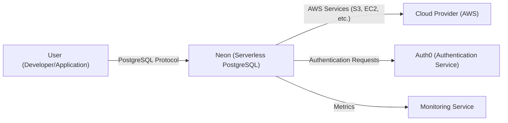
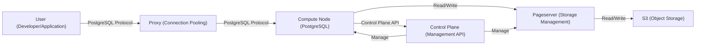

Okay, let's create a design document for the Neon project based on the provided GitHub repository. I will follow the instructions meticulously.

# BUSINESS POSTURE

Neon is a serverless, multi-tenant, scalable PostgreSQL offering.  The business appears to be targeting a similar market to other serverless database providers, aiming to reduce operational overhead for developers and businesses.  The core value proposition is ease of use, scalability, and cost-effectiveness (pay-per-use).  It's likely operating in a highly competitive market.  Given its "serverless" nature, high availability and data durability are paramount.  The project is relatively new, suggesting a higher risk tolerance than an established enterprise, but security is still critical due to the sensitive nature of database contents.

Business Priorities:

*   Rapid feature development and iteration.
*   Attracting and retaining users (developer experience).
*   Scalability and cost-efficiency of the platform itself.
*   Maintaining high availability and data durability.
*   Building trust and a reputation for reliability.

Business Goals:

*   Provide a seamless and intuitive developer experience for PostgreSQL.
*   Offer a cost-effective and scalable database solution.
*   Minimize operational overhead for users.
*   Ensure data durability and high availability.

Most Important Business Risks:

*   Data breaches or loss due to security vulnerabilities.
*   Service outages impacting customer applications.
*   Inability to scale to meet demand.
*   Negative user experience leading to churn.
*   Reputational damage from any of the above.

# SECURITY POSTURE

Based on the repository, the following security controls and accepted risks are identified.  This is inferred from code, documentation, and project structure.

Existing Security Controls:

*   security control: Authentication: Uses JWTs for authentication (likely between internal services and potentially for user API access).  Implementation details are spread across the codebase, including `control-plane` and `libs/auth`.
*   security control: Authorization: Role-based access control (RBAC) is mentioned, suggesting different levels of access for users and internal services. Implementation details are likely within the `control-plane` and related services.
*   security control: Encryption at rest: Data is encrypted at rest using AES-256, as indicated in documentation and by the use of storage layers that support encryption (e.g., S3).
*   security control: Encryption in transit: TLS is used for communication between services and with clients (enforced by cloud provider configurations and likely within service code).
*   security control: Input validation: Some level of input validation is expected, particularly in API handlers and data processing components, to prevent injection attacks. This is a general expectation for any database system, but specific implementations need to be verified across the codebase.
*   security control: Regular security audits and penetration testing: While not explicitly stated in the repository's root, the nature of the project and its cloud-native deployment strongly suggest regular security assessments.
*   security control: Dependency management: Use of Rust's `cargo` package manager helps manage dependencies and identify known vulnerabilities.
*   security control: Use of memory-safe language (Rust): Rust's ownership and borrowing system helps prevent common memory safety vulnerabilities like buffer overflows and use-after-free errors.
*   security control: Infrastructure as Code (IaC): Use of tools like Terraform (implied by cloud-native nature) allows for consistent and auditable infrastructure deployments.

Accepted Risks:

*   accepted risk: Complexity of a distributed system: The inherent complexity of a distributed, multi-tenant database introduces potential attack vectors and failure modes that are difficult to fully anticipate.
*   accepted risk: Reliance on third-party services (e.g., AWS S3, AWS EC2, AWS Aurora): Neon relies on the security and availability of these services.
*   accepted risk: Rapid development pace: The need for fast iteration may lead to temporary gaps in security controls or testing.
*   accepted risk: Potential for zero-day vulnerabilities: As with any software, there's a risk of undiscovered vulnerabilities.

Recommended Security Controls (High Priority):

*   Implement a comprehensive Web Application Firewall (WAF) to protect against common web attacks.
*   Establish a robust vulnerability disclosure program and bug bounty.
*   Implement detailed audit logging for all security-relevant events.
*   Enforce multi-factor authentication (MFA) for all administrative access.
*   Perform regular static and dynamic application security testing (SAST/DAST).
*   Implement a Security Information and Event Management (SIEM) system for centralized security monitoring and alerting.

Security Requirements:

*   Authentication:
    *   All users and services must be authenticated before accessing any resources.
    *   Support for strong authentication mechanisms (e.g., MFA).
    *   Secure storage and management of authentication credentials.
    *   Session management with appropriate timeouts and invalidation.

*   Authorization:
    *   Fine-grained access control based on the principle of least privilege.
    *   RBAC or attribute-based access control (ABAC) to manage user permissions.
    *   Regular review and auditing of access control policies.

*   Input Validation:
    *   All input from external sources (users, APIs, etc.) must be validated.
    *   Use of allow-lists rather than block-lists for validation.
    *   Protection against SQL injection, cross-site scripting (XSS), and other common injection attacks.

*   Cryptography:
    *   Use of strong, industry-standard cryptographic algorithms and protocols.
    *   Secure key management practices, including key rotation and secure storage.
    *   Encryption of data at rest and in transit.
    *   Proper use of cryptographic libraries and avoidance of custom implementations.

# DESIGN

## C4 CONTEXT

Element Descriptions:

*   Element:
    *   Name: User
    *   Type: Person
    *   Description: A developer or application interacting with the Neon database.
    *   Responsibilities: Connects to the Neon database, executes SQL queries, manages data.
    *   Security controls: Authentication via PostgreSQL protocol, authorization via Neon's access control mechanisms.

*   Element:
    *   Name: Neon
    *   Type: Software System
    *   Description: The Neon serverless PostgreSQL database service.
    *   Responsibilities: Provides a PostgreSQL-compatible interface, manages data storage and retrieval, scales resources automatically.
    *   Security controls: Authentication, authorization, encryption at rest, encryption in transit, input validation.

*   Element:
    *   Name: Cloud Provider (AWS)
    *   Type: Software System
    *   Description: Amazon Web Services, providing underlying infrastructure.
    *   Responsibilities: Provides compute, storage, and networking resources.
    *   Security controls: AWS's built-in security features (IAM, VPC, etc.), encryption at rest and in transit.

*   Element:
    *   Name: Auth0
    *   Type: Software System
    *   Description: Third-party authentication service.
    *   Responsibilities: Handles user authentication and provides identity information.
    *   Security controls: Auth0's security features, including MFA and anomaly detection.

*   Element:
    *   Name: Monitoring Service
    *   Type: Software System
    *   Description: Collects and displays metrics about Neon's performance and health.
    *   Responsibilities: Gathers metrics, provides dashboards and alerts.
    *   Security controls: Access controls to prevent unauthorized access to monitoring data.

## C4 CONTAINER

Element Descriptions:

*   Element:
    *   Name: User
    *   Type: Person
    *   Description: A developer or application interacting with the Neon database.
    *   Responsibilities: Connects to the Neon database, executes SQL queries, manages data.
    *   Security controls: Authentication via PostgreSQL protocol, authorization via Neon's access control mechanisms.

*   Element:
    *   Name: Proxy
    *   Type: Container
    *   Description: Handles incoming connections and routes them to appropriate compute nodes. Provides connection pooling.
    *   Responsibilities: Connection management, routing, load balancing.
    *   Security controls: TLS termination, potentially DoS protection.

*   Element:
    *   Name: Compute Node
    *   Type: Container
    *   Description: Runs a PostgreSQL instance.
    *   Responsibilities: Executes SQL queries, manages in-memory data, interacts with the Pageserver.
    *   Security controls: Authentication, authorization, input validation.

*   Element:
    *   Name: Pageserver
    *   Type: Container
    *   Description: Manages persistent storage of data.
    *   Responsibilities: Reads and writes data to/from S3, manages data consistency.
    *   Security controls: Encryption at rest, access control to S3.

*   Element:
    *   Name: S3
    *   Type: Container
    *   Description: AWS S3 object storage.
    *   Responsibilities: Stores data persistently.
    *   Security controls: AWS S3 security features, encryption at rest.

*   Element:
    *   Name: Control Plane
    *   Type: Container
    *   Description: Manages the overall system, including scaling and resource allocation.
    *   Responsibilities: Orchestrates compute nodes and pageservers, handles API requests for management tasks.
    *   Security controls: Authentication, authorization, audit logging.

## DEPLOYMENT

Possible Deployment Solutions:

1.  **Kubernetes (EKS):** Neon could be deployed on Amazon Elastic Kubernetes Service (EKS), leveraging Kubernetes for container orchestration, scaling, and management.
2.  **AWS ECS:** Neon could be deployed using Amazon Elastic Container Service (ECS), another container orchestration service offered by AWS.
3.  **AWS Fargate:** A serverless compute engine for containers, Fargate could be used to run Neon's containers without managing servers.
4.  **EC2 Instances (with custom orchestration):** While less likely given the serverless nature, Neon could theoretically be deployed directly on EC2 instances with a custom orchestration solution.

Chosen Solution (for detailed description): **Kubernetes (EKS)**

Neon is deployed on Amazon Elastic Kubernetes Service (EKS). This allows Neon to leverage the scalability and resilience of Kubernetes. Different components (Proxy, Compute Node, Pageserver, Control Plane) are deployed as separate Kubernetes Deployments, allowing for independent scaling and updates. Kubernetes Services are used to expose these components internally and externally.

```mermaid
graph LR
    Internet["Internet"] -- "Load Balancer" --> Ingress["Kubernetes Ingress"]
    Ingress -- "Route" --> ProxyService["Proxy Service"]
    ProxyService -- "Route" --> ProxyDeployment["Proxy Deployment (Pods)"]
    ProxyDeployment -- "Network" --> ComputeService["Compute Service"]
    ComputeService -- "Route" --> ComputeDeployment["Compute Deployment (Pods)"]
    ComputeDeployment -- "Network" --> PageserverService["Pageserver Service"]
    PageserverService -- "Route" --> PageserverDeployment["Pageserver Deployment (Pods)"]
    PageserverDeployment -- "S3 API" --> S3["AWS S3"]
    ControlPlaneService["Control Plane Service"] -- "Route" --> ControlPlaneDeployment["Control Plane Deployment (Pods)"]
    ControlPlaneDeployment -- "Manage" --> ComputeDeployment
    ControlPlaneDeployment -- "Manage" --> PageserverDeployment
    subgraph "Kubernetes Cluster (EKS)"
        Ingress
        ProxyService
        ProxyDeployment
        ComputeService
        ComputeDeployment
        PageserverService
        PageserverDeployment
		ControlPlaneService
		ControlPlaneDeployment
    end
```

Element Descriptions:

*   Element:
    *   Name: Internet
    *   Type: External
    *   Description: The public internet.
    *   Responsibilities: Source of user requests.
    *   Security controls: Network firewalls, DDoS protection.

*   Element:
    *   Name: Load Balancer
    *   Type: Infrastructure
    *   Description: Distributes traffic across multiple instances of the Kubernetes Ingress.
    *   Responsibilities: Load balancing, TLS termination.
    *   Security controls: DDoS protection, TLS configuration.

*   Element:
    *   Name: Kubernetes Ingress
    *   Type: Infrastructure
    *   Description: Handles external access to services within the Kubernetes cluster.
    *   Responsibilities: Routing traffic based on rules, TLS termination.
    *   Security controls: Access control, TLS configuration.

*   Element:
    *   Name: Proxy Service, Compute Service, Pageserver Service, Control Plane Service
    *   Type: Kubernetes Service
    *   Description: Provides a stable endpoint for accessing the corresponding deployments.
    *   Responsibilities: Service discovery, internal load balancing.
    *   Security controls: Network policies within Kubernetes.

*   Element:
    *   Name: Proxy Deployment, Compute Deployment, Pageserver Deployment, Control Plane Deployment
    *   Type: Kubernetes Deployment
    *   Description: Manages a set of pods running the respective components.
    *   Responsibilities: Running the application containers, scaling, self-healing.
    *   Security controls: Container security context, resource limits.

*   Element:
    *   Name: AWS S3
    *   Type: External
    *   Description: Amazon S3 object storage.
    *   Responsibilities: Stores data persistently.
    *   Security controls: AWS S3 security features, encryption at rest.

## BUILD

Neon's build process leverages Rust's `cargo` build system and likely uses a CI/CD pipeline (e.g., GitHub Actions, given the repository location).

1.  **Developer:** A developer writes code and pushes it to the GitHub repository.
2.  **CI Trigger:** A push or pull request triggers the CI pipeline.
3.  **Checkout:** The CI environment checks out the code.
4.  **Build:** `cargo build` is used to compile the Rust code. This includes dependency resolution and compilation.
5.  **Tests:** `cargo test` is used to run unit and integration tests.
6.  **Linters/Formatters:** Code linters (e.g., `clippy`) and formatters (e.g., `rustfmt`) are run to enforce code style and identify potential issues.
7.  **SAST:** Static Application Security Testing (SAST) tools *should* be integrated into the build process to scan for vulnerabilities in the code. (Recommended, not explicitly confirmed in the repo root).
8.  **Containerization:** Dockerfiles are used to build container images for each component (Proxy, Compute Node, Pageserver, Control Plane).
9.  **Image Push:** The container images are pushed to a container registry (e.g., Amazon ECR).
10. **Deployment:** A separate CD pipeline (or part of the same CI/CD pipeline) deploys the new container images to the Kubernetes cluster.

```mermaid
graph LR
    Developer["Developer"] -- "Push Code" --> GitHub["GitHub Repository"]
    GitHub -- "Trigger CI" --> CI["CI Pipeline (e.g., GitHub Actions)"]
    CI -- "Checkout Code" --> Checkout["Checkout"]
    Checkout -- "Build" --> Build["cargo build"]
    Build -- "Test" --> Test["cargo test"]
    Test -- "Lint" --> Lint["clippy, rustfmt"]
    Lint -- "SAST (Recommended)" --> SAST["SAST Tool"]
    SAST -- "Containerize" --> Containerize["Dockerfile"]
    Containerize -- "Push Image" --> Registry["Container Registry (e.g., ECR)"]
    Registry -- "Deploy" --> CD["CD Pipeline"]
	CD -- "Deploy" --> Kubernetes["Kubernetes Cluster (EKS)"]
```

# RISK ASSESSMENT

*   Critical Business Processes:
    *   Providing a highly available and reliable PostgreSQL database service.
    *   Ensuring data durability and preventing data loss.
    *   Scaling the service to meet user demand.
    *   Maintaining the security and confidentiality of user data.

*   Data Sensitivity:
    *   User Data (stored in the database): This is the most sensitive data and can range from personally identifiable information (PII) to financial data, depending on the user's application.  Sensitivity: **High**.
    *   Metadata (database schemas, user accounts, etc.): This data is also sensitive as it can be used to gain access to user data or disrupt the service. Sensitivity: **High**.
    *   Operational Data (logs, metrics): This data is less sensitive but can still contain information that could be useful to an attacker. Sensitivity: **Medium**.

# QUESTIONS & ASSUMPTIONS

*   Questions:
    *   What specific SAST and DAST tools are used in the CI/CD pipeline?
    *   What are the specific details of the RBAC implementation?
    *   What is the incident response plan for security breaches or service outages?
    *   Are there any specific compliance requirements (e.g., HIPAA, GDPR) that need to be considered?
    *   What is the process for managing and rotating cryptographic keys?
    *   What is the specific monitoring and alerting setup for security events?
    *   Is there a formal threat model in place, and how often is it updated?
    *   How is database backup and restore handled?
	*   How is database migration handled?

*   Assumptions:
    *   BUSINESS POSTURE: Assumes a relatively high risk tolerance due to the project's stage, but with a strong emphasis on security due to the nature of the service.
    *   SECURITY POSTURE: Assumes that standard security practices are followed for cloud deployments (e.g., least privilege, network segmentation). Assumes regular security audits and penetration testing are conducted.
    *   DESIGN: Assumes the use of Kubernetes (EKS) for deployment. Assumes the use of a CI/CD pipeline for building and deploying the software. Assumes the use of standard AWS services (S3, EC2, etc.). Assumes Auth0 is used for authentication.