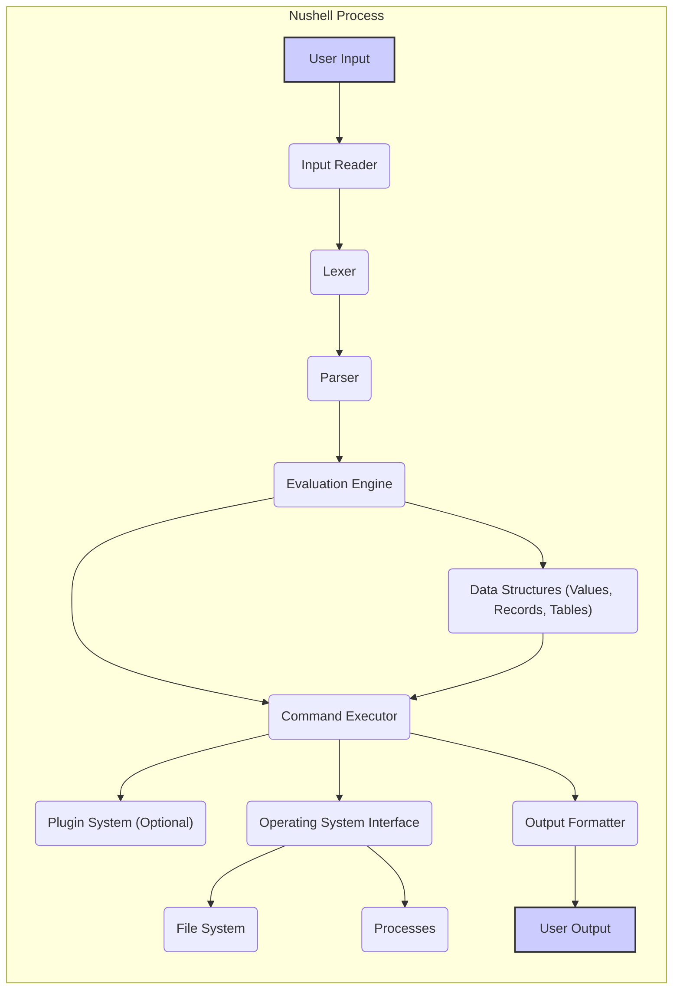
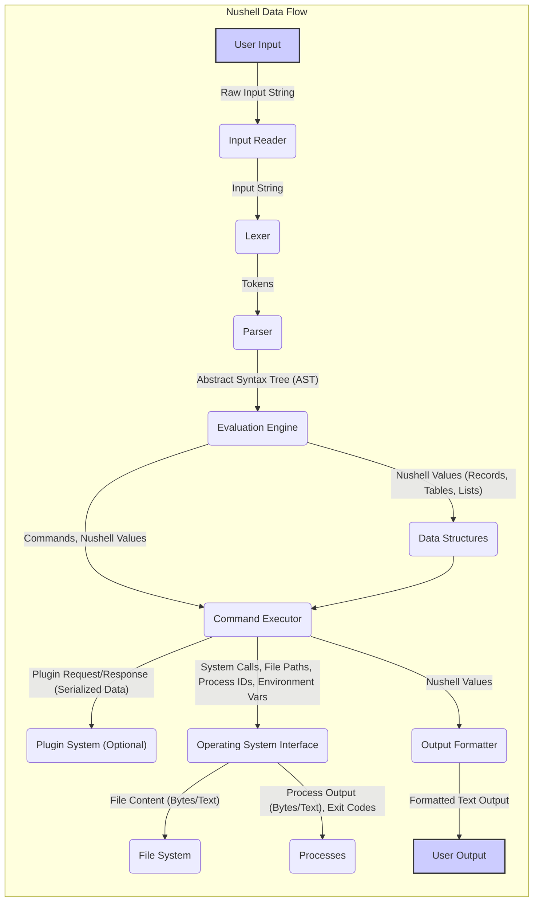

## Project Design Document: Nushell (Improved)

**1. Introduction**

This document provides an enhanced design overview of the Nushell project, an object-aware shell, based on the current state reflected in the GitHub repository: [https://github.com/nushell/nushell](https://github.com/nushell/nushell). This iteration aims to provide a more granular and detailed understanding of Nushell's architecture, focusing on aspects relevant to security analysis and threat modeling.

**2. Goals**

The primary goals of this improved design document are to:

*   Provide a more detailed and precise articulation of the major components and their specific responsibilities within the Nushell architecture.
*   Offer a more granular illustration of data and control flow, including specific data types and interactions.
*   Clearly identify all external interfaces, including the nature of the interaction and potential security implications.
*   Establish a robust and comprehensive understanding of the system's structure, specifically tailored for effective security analysis and threat modeling.

**3. High-Level Architecture**

Nushell operates through a pipeline of interconnected components, processing user input and orchestrating interactions with the underlying operating system and external entities.

**4. Component Details**

This section provides an in-depth description of each major component, highlighting key functionalities and potential security considerations.

*   **Input Reader:**
    *   **Responsibility:** Receives raw input from the user, typically via a terminal or potentially from a file or pipe.
    *   **Functionality:** Handles terminal interactions, including line editing (e.g., using libraries like `reedline`), command history management, and potentially auto-completion suggestions.
    *   **Security Relevance:** Vulnerabilities here could allow injection of malicious commands before parsing.

*   **Lexer:**
    *   **Responsibility:** Tokenizes the input string received from the Input Reader.
    *   **Functionality:** Breaks down the input string into a sequence of meaningful tokens (e.g., keywords, identifiers, operators, literals).
    *   **Security Relevance:** Errors in tokenization could lead to unexpected parsing behavior.

*   **Parser:**
    *   **Responsibility:** Constructs an Abstract Syntax Tree (AST) from the stream of tokens produced by the Lexer.
    *   **Functionality:**  Applies grammar rules to understand the structure of the command, including pipelines, sub-expressions, and control flow elements. Performs syntax validation and reports errors.
    *   **Security Relevance:**  Parsing vulnerabilities could allow crafting inputs that bypass security checks or lead to unexpected code execution.

*   **Evaluation Engine:**
    *   **Responsibility:** Interprets the AST, resolving variables, environment settings, aliases, and custom functions.
    *   **Functionality:** Determines the order of execution for commands in a pipeline. Manages the flow of data (Nushell values) between commands. Performs type checking and conversions.
    *   **Security Relevance:** Improper evaluation could lead to unintended command execution or access to sensitive data.

*   **Command Executor:**
    *   **Responsibility:** Executes the commands identified by the Evaluation Engine.
    *   **Functionality:**
        *   **Built-in Commands:** Executes commands implemented directly within Nushell (e.g., `cd`, `ls`, `where`).
        *   **External Commands:** Spawns new processes to execute external binaries or scripts. Manages input and output streams of these processes. Handles redirection and piping.
    *   **Security Relevance:**  A critical component for security. Vulnerabilities here could allow arbitrary code execution via external commands or insecure handling of built-in commands.

*   **Plugin System (Optional):**
    *   **Responsibility:** Provides a mechanism to extend Nushell's functionality through external plugins.
    *   **Functionality:**
        *   **Loading:** Dynamically loads plugin libraries or binaries.
        *   **Communication:** Facilitates communication between Nushell and plugins, likely using a defined interface (e.g., function calls, message passing).
        *   **Capabilities:** Plugins can introduce new commands, data formats, or other features.
    *   **Security Relevance:** Plugins represent a significant attack surface if not handled securely. Issues include malicious plugins, insecure communication, and lack of sandboxing.

*   **Operating System Interface:**
    *   **Responsibility:** Provides an abstraction layer for interacting with the underlying operating system.
    *   **Functionality:**
        *   **File System Access:** Handles operations like reading, writing, creating, and deleting files and directories.
        *   **Process Management:**  Manages the creation, termination, and signaling of processes.
        *   **System Calls:**  Provides access to various operating system functionalities through system calls.
        *   **Environment Variables:**  Provides access to and potentially modification of environment variables.
    *   **Security Relevance:**  Vulnerabilities in this interface could allow unauthorized access to system resources or manipulation of the operating system.

*   **File System:**
    *   **Responsibility:** Represents the file system that Nushell interacts with.
    *   **Functionality:** Stores files and directories, manages permissions, and provides metadata.
    *   **Security Relevance:**  Nushell's interactions with the file system must be secure to prevent unauthorized access or modification of files.

*   **Processes:**
    *   **Responsibility:** Represents the external processes spawned by Nushell.
    *   **Functionality:** Executes the code of external commands. Communicates with Nushell via standard input, standard output, and standard error.
    *   **Security Relevance:**  Nushell needs to handle external processes securely to prevent them from compromising the shell or the system.

*   **Data Structures (Values, Records, Tables):**
    *   **Responsibility:** Manages the internal representation of data within Nushell.
    *   **Functionality:**
        *   **Values:** Stores basic data types (strings, numbers, booleans, etc.).
        *   **Records:** Stores key-value pairs, similar to dictionaries or objects.
        *   **Tables:** Stores collections of records, similar to lists of dictionaries or dataframes.
    *   **Security Relevance:**  Improper handling of data structures could lead to information leaks or vulnerabilities if sensitive data is not managed correctly.

*   **Output Formatter:**
    *   **Responsibility:**  Transforms structured data into a human-readable format for display to the user.
    *   **Functionality:** Supports various output formats (e.g., table, JSON, CSV, plain text). Handles styling and formatting options.
    *   **Security Relevance:**  Output formatting needs to be secure to prevent terminal injection attacks or the disclosure of sensitive information in unexpected ways.

**5. Data Flow Diagram**

This diagram provides a more detailed view of the data flow, including specific data types and interactions between components.

**6. External Interfaces**

Nushell interacts with the following external entities, each with its own security implications:

*   **User:**
    *   **Interaction:** Provides commands and input data via the terminal or scripts. Receives formatted output.
    *   **Security Implication:** Malicious user input is a primary threat vector.

*   **Operating System:**
    *   **Interaction:**  Nushell relies on the OS for fundamental operations like file access, process management, memory allocation, and network communication (if commands utilize it).
    *   **Security Implication:**  Vulnerabilities in the OS or insecure interactions with the OS can be exploited.

*   **External Commands:**
    *   **Interaction:** Nushell executes external binaries and scripts as separate processes. Data is exchanged via standard input, output, and error streams.
    *   **Security Implication:**  Executing untrusted external commands poses a significant risk of arbitrary code execution.

*   **Plugins:**
    *   **Interaction:**  Nushell loads and communicates with external plugin libraries or binaries, potentially through function calls or message passing.
    *   **Security Implication:**  Malicious or vulnerable plugins can compromise the shell's integrity.

*   **File System:**
    *   **Interaction:** Nushell reads, writes, creates, and deletes files and directories.
    *   **Security Implication:**  Insecure file system operations can lead to data breaches, data corruption, or denial of service.

*   **Environment Variables:**
    *   **Interaction:** Nushell reads and potentially modifies environment variables.
    *   **Security Implication:**  Exposure or manipulation of sensitive environment variables can lead to security vulnerabilities.

*   **Network (Indirect):**
    *   **Interaction:** While Nushell itself might not directly handle network connections, external commands or plugins it invokes can.
    *   **Security Implication:**  Network-related vulnerabilities in external components can be exploited.

**7. Security Considerations (Detailed)**

This section expands on the initial security considerations, providing more specific examples and potential mitigation strategies.

*   **Input Validation and Sanitization:**
    *   **Threat:** Command injection, where malicious code is injected through user input.
    *   **Mitigation:** Rigorous input validation at the Parser and Evaluation Engine levels. Sanitize input before passing it to external commands. Employ parameterized queries or similar techniques when interacting with external systems.

*   **Privilege Management:**
    *   **Threat:** Nushell or its components operating with excessive privileges, allowing for greater damage in case of compromise.
    *   **Mitigation:** Adhere to the principle of least privilege. Drop privileges when executing external commands if possible. Implement secure inter-process communication mechanisms.

*   **Plugin Security:**
    *   **Threat:** Malicious or vulnerable plugins compromising the shell or the system.
    *   **Mitigation:** Implement a robust plugin sandboxing mechanism. Enforce code signing for plugins. Define clear plugin APIs with security considerations. Implement permission management for plugins. Regularly audit and review plugin code.

*   **External Command Execution Security:**
    *   **Threat:** Execution of arbitrary or malicious external commands.
    *   **Mitigation:** Provide mechanisms to restrict or audit the execution of external commands. Warn users about potentially dangerous commands. Consider using secure command execution techniques like containers or sandboxes for external processes. Avoid directly passing unsanitized user input to external commands.

*   **Data Handling Security:**
    *   **Threat:** Exposure or mishandling of sensitive data (e.g., passwords, API keys).
    *   **Mitigation:** Avoid storing sensitive data in plain text. Use secure storage mechanisms (e.g., credential managers). Implement mechanisms to mask or redact sensitive data in output.

*   **Dependency Management Security:**
    *   **Threat:** Vulnerabilities in external libraries and dependencies used by Nushell.
    *   **Mitigation:** Regularly update dependencies to their latest secure versions. Use dependency scanning tools to identify known vulnerabilities. Employ software composition analysis (SCA).

*   **Output Sanitization:**
    *   **Threat:** Terminal injection attacks, where malicious output manipulates the user's terminal.
    *   **Mitigation:** Sanitize output, especially from external commands, to remove potentially harmful control characters or escape sequences.

*   **Error Handling:**
    *   **Threat:**  Information leaks through verbose error messages.
    *   **Mitigation:** Implement secure error handling practices that avoid exposing sensitive information in error messages.

*   **Resource Management:**
    *   **Threat:** Denial-of-service attacks through excessive resource consumption (e.g., memory, CPU).
    *   **Mitigation:** Implement resource limits and quotas. Implement safeguards against infinite loops or recursive calls.

**8. Future Considerations**

This improved design document provides a more detailed and security-focused view of Nushell's architecture. Continuous review and updates are necessary as the project evolves, incorporating new features and addressing emerging security threats. Future considerations include:

*   Formal threat modeling exercises based on this document.
*   Regular security audits and penetration testing.
*   Implementation of security best practices throughout the development lifecycle.
*   Community engagement for security vulnerability reporting and feedback.

This enhanced document serves as a more robust foundation for understanding Nushell's architecture and identifying potential security vulnerabilities, facilitating more effective threat modeling and security analysis.