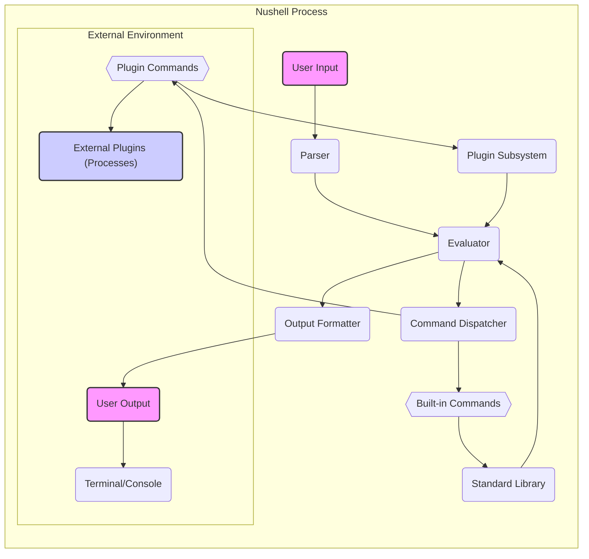

Okay, I will improve the Nushell design document as requested. Here is the improved version with enhanced structure, clarity, and adherence to your specifications:

```markdown
# Project Design Document: Nushell

**Project Name:** Nushell

**Project Repository:** [https://github.com/nushell/nushell](https://github.com/nushell/nushell)

**Document Version:** 1.1
**Date:** 2023-10-27
**Author:** AI Expert

## 1. Project Overview

### 1.1. Project Description

Nushell (Nu) is a modern, cross-platform shell designed around the principles of structured data and pipelines. Unlike traditional shells that primarily handle text streams, Nushell treats data as structured objects, such as tables, lists, and records. This approach enables more powerful and intuitive data manipulation directly within the shell environment. Nushell aims to provide a consistent syntax, a rich standard library, and extensibility through plugins, making it suitable for a wide range of users from developers to data scientists.

### 1.2. Project Goals

*   **Native Structured Data Handling:**  To operate on structured data formats (e.g., JSON, CSV, tables) as first-class citizens within the shell.
*   **Enhanced User Experience:** To offer a more user-friendly and less error-prone command-line interface compared to traditional shells.
*   **Cross-Platform Compatibility:** To ensure seamless operation across major operating systems including Windows, macOS, and Linux.
*   **Extensible Architecture:** To allow users to extend Nushell's capabilities through a robust plugin system and custom commands.
*   **Security-Focused Design:** To incorporate security best practices and mitigate common shell-related vulnerabilities from the ground up.

### 1.3. Target Users

*   Software Developers and DevOps Engineers managing systems and automating tasks.
*   System Administrators responsible for server management and configuration.
*   Data Scientists and Data Analysts who need to process and analyze structured data from the command line.
*   Power Users seeking a more efficient, modern, and scriptable shell environment.
*   Users requiring a consistent shell experience across different operating systems.

## 2. System Architecture

### 2.1. High-Level Architecture Diagram



### 2.2. Component Description

*   **User Input:**  Represents the commands, scripts, and queries entered by the user via the terminal or console.
*   **Parser:**  The component responsible for transforming raw user input (text) into a structured Abstract Syntax Tree (AST). This involves lexical analysis to break the input into tokens and syntactic analysis to understand the grammatical structure according to Nushell's language rules.
*   **Evaluator:**  Takes the AST from the Parser and executes the commands represented in the tree. It manages the shell's runtime state, including variables, environment settings, current working directory, and the data pipeline. It interprets the AST nodes and orchestrates the execution flow.
*   **Command Dispatcher:**  Determines which command implementation to invoke based on the parsed command name. It differentiates between commands built directly into Nushell (built-in commands) and those provided by external plugins (plugin commands).
*   **Built-in Commands:**  A set of core commands that are integral to Nushell. Implemented in Rust, these commands provide fundamental shell functionalities such as file system navigation (`ls`, `cd`), data filtering (`where`, `grep`), variable manipulation (`let`, `mut`), and more.
*   **Standard Library:**  A collection of modules and functions that extend the functionality of built-in commands. It offers reusable components and abstractions for common tasks, enhancing the shell's scripting capabilities.
*   **Plugin Subsystem:**  Manages the lifecycle of external plugins, including discovery, loading, registration, and communication. It ensures plugins can be dynamically loaded and integrated into Nushell's command environment.
*   **Plugin Commands:** Commands provided by external plugins. These extend Nushell's functionality beyond the core set, allowing users to add specialized commands and integrations. Plugins run as separate processes, providing isolation and language flexibility.
*   **Output Formatter:**  Takes the structured data output from command executions and transforms it into a user-readable format for display. Nushell supports various output formats, including table, JSON, CSV, and plain text, and allows customization of the output presentation.
*   **User Output:** The formatted output generated by Nushell, displayed to the user in the terminal or console.
*   **Terminal/Console:** The user interface application where Nushell receives input and displays output.
*   **External Plugins (Processes):**  Plugins are executed as independent processes, enabling language diversity for plugin development and providing process-level isolation from the core Nushell process for stability and security.

### 2.3. Data Flow Description

1.  **User Input:** A user enters a command or script into the terminal and presses the Enter key.
2.  **Parsing:** The `Parser` receives the input string. It performs lexical and syntactic analysis to create an Abstract Syntax Tree (AST) that represents the command structure.
3.  **Evaluation:** The `Evaluator` receives the AST. It traverses the tree, interpreting each node and managing the shell's state as it executes the commands.
4.  **Command Dispatch:** For each command identified in the AST, the `Command Dispatcher` checks if it is a built-in command or a plugin command.
5.  **Built-in Command Execution:** If the command is built-in, the `Command Dispatcher` invokes the corresponding function from the `Standard Library` or the core Nushell implementation.
6.  **Plugin Command Execution:** If the command is a plugin command, the `Command Dispatcher` interacts with the `Plugin Subsystem` to delegate the execution to the appropriate external plugin process.
7.  **Data Processing:** Commands (built-in or plugin) process data. This may involve reading data from files, accessing external APIs, manipulating data in memory, or processing input from the pipeline. Nushell operates on structured data types like Records, Tables, and Lists throughout this process.
8.  **Output Formatting:** The `Evaluator` receives the structured data output from the executed command. The `Output Formatter` transforms this data into a presentable format (e.g., a table, formatted text) based on default settings or user-specified formatting options.
9.  **User Output:** The formatted output is sent to the `Terminal/Console` and displayed to the user.

## 3. Component Details

### 3.1. Parser Component

*   **Functionality:**
    *   **Lexical Analysis:** Breaks down the input character stream into a sequence of tokens, identifying keywords, identifiers, operators, and literals.
    *   **Syntactic Analysis:** Constructs an Abstract Syntax Tree (AST) from the token stream, verifying the grammatical correctness of the input based on Nushell's grammar rules.
    *   **Syntax Error Reporting:** Detects and reports syntax errors, providing informative messages to the user about invalid command structures.
*   **Data Flow:**
    *   **Input:** Raw user input string.
    *   **Output:** Abstract Syntax Tree (AST) representing the parsed command, or error messages in case of parsing failures.
*   **Dependencies:**
    *   Nushell grammar specification.
    *   Lexer and parser implementation (potentially using Rust parsing libraries or custom-built).

### 3.2. Evaluator Component

*   **Functionality:**
    *   **AST Interpretation:** Traverses and interprets the Abstract Syntax Tree (AST) to execute commands and expressions.
    *   **State Management:** Manages the shell's runtime state, including variables (scope management), environment variables, current directory, and pipeline state.
    *   **Command Execution Orchestration:** Coordinates the execution of both built-in and plugin commands, delegating to the appropriate components.
    *   **Pipeline Management:** Handles the data flow between commands in a pipeline, ensuring that output from one command is correctly passed as input to the next.
    *   **Runtime Error Handling:** Manages errors that occur during command execution, providing informative error messages and potentially allowing for error recovery.
*   **Data Flow:**
    *   **Input:** Abstract Syntax Tree (AST) from the Parser.
    *   **Output:** Structured data output from executed commands, control signals for the Output Formatter, and potential error signals.
*   **Dependencies:**
    *   Standard Library (for built-in command implementations).
    *   Plugin Subsystem (for invoking plugin commands).
    *   Data structures for representing Nushell values (Records, Tables, Lists, Strings, Integers, etc.).

### 3.3. Command Dispatcher Component

*   **Functionality:**
    *   **Command Name Resolution:** Resolves command names from the parsed input to their corresponding implementations.
    *   **Built-in Command Lookup:** Checks a registry of built-in commands to see if the command is a core shell command.
    *   **Plugin Command Lookup:** Queries the Plugin Subsystem to determine if the command is provided by a loaded plugin.
    *   **Argument Parsing and Validation:** Prepares command arguments from the parsed input and validates them against the command's expected parameters.
*   **Data Flow:**
    *   **Input:** Command name and arguments extracted by the Evaluator from the AST.
    *   **Output:** Command execution context (e.g., function pointer for built-in commands, plugin invocation details for plugin commands).
*   **Dependencies:**
    *   Registry of built-in commands and their implementations.
    *   Plugin Subsystem for accessing information about registered plugin commands.

### 3.4. Plugin Subsystem Component

*   **Functionality:**
    *   **Plugin Discovery:** Locates available plugins based on configured plugin paths and naming conventions.
    *   **Plugin Loading:** Loads plugin code into the Nushell environment, typically at startup or on demand.
    *   **Plugin Registration:** Registers commands provided by loaded plugins with the Command Dispatcher, making them available for use in Nushell.
    *   **Plugin Communication:** Establishes and manages inter-process communication (IPC) with external plugin processes to send commands and receive results.
    *   **Plugin Lifecycle Management:** Handles plugin initialization, activation, deactivation, and potential unloading.
    *   **Plugin Isolation:** Ensures that plugins run in separate processes to provide isolation for security and stability, preventing plugin crashes from affecting the core shell.
*   **Data Flow:**
    *   **Input:** Plugin loading requests from Nushell core, commands to be executed by plugins, data to be passed to plugins.
    *   **Output:** Plugin command execution results, plugin metadata (e.g., command names, descriptions), plugin status information.
*   **Dependencies:**
    *   Inter-Process Communication (IPC) mechanisms (e.g., standard streams, sockets, or OS-specific IPC).
    *   Plugin manifest format definition (specifying how plugins describe their commands and requirements).

### 3.5. Standard Library Component

*   **Functionality:**
    *   **Core Command Implementations:** Provides the implementation logic for built-in Nushell commands.
    *   **Utility Functions and Modules:** Offers a collection of reusable functions and modules for common shell operations, such as file system manipulation, string processing, data conversion, networking, and more.
    *   **Abstraction Layer:** Provides an abstraction layer over operating system APIs, offering cross-platform compatibility for core functionalities.
*   **Data Flow:**
    *   **Input:** Command invocation requests from the Evaluator, data to be processed by commands.
    *   **Output:** Structured data output resulting from command execution, command execution status.
*   **Dependencies:**
    *   Core Nushell data structures and utility modules.
    *   Operating system APIs for interacting with the underlying system.

### 3.6. Output Formatter Component

*   **Functionality:**
    *   **Data Formatting:** Transforms structured data into various output formats, including tables, lists, JSON, CSV, YAML, and plain text.
    *   **Output Styling:** Handles styling and presentation of output, including colors, alignment, and column widths, to enhance readability.
    *   **Format Customization:** Supports user-configurable options for output formatting, allowing users to tailor the output appearance to their preferences.
*   **Data Flow:**
    *   **Input:** Structured data from the Evaluator to be formatted for display.
    *   **Output:** Formatted output string ready to be displayed in the terminal.
*   **Dependencies:**
    *   Formatting libraries or modules for different output formats (e.g., table formatting, JSON serialization).
    *   Configuration settings for user-defined output preferences.

## 4. Technology Stack

*   **Programming Language:** Rust (for core Nushell and built-in commands)
*   **Core Libraries (Rust Ecosystem):**
    *   Standard Rust library (`std`) for fundamental functionalities.
    *   Potentially `serde` for serialization and deserialization (especially for structured data and plugin communication).
    *   Likely libraries for asynchronous programming (`tokio` or `async-std`) for efficient I/O and concurrency.
    *   Libraries for file system operations, string manipulation, and data structures from the Rust ecosystem.
*   **Parsing Libraries:**
    *   Potentially custom-built parser or using Rust parsing crates like `nom`, `pest`, or `lalrpop` for parsing Nushell syntax.
*   **Output Formatting Libraries:**
    *   Likely crates for table formatting (e.g., `term-table`), JSON serialization (`serde_json`), CSV handling (`csv`), and other format-specific libraries.
*   **Build System:** Cargo (Rust's package manager and build system)
*   **Version Control:** Git (used for repository management on GitHub)

## 5. Deployment Model

*   **Installation Methods:** Nushell can be installed through various methods:
    *   **Pre-built Binaries:** Downloading pre-compiled binaries for different operating systems from Nushell's release pages or via package managers.
    *   **Building from Source:** Compiling Nushell from source code using Cargo, requiring a Rust toolchain to be installed.
    *   **Platform-Specific Package Managers:** Installation via system package managers like `apt` (Debian/Ubuntu), `brew` (macOS), `choco` or `scoop` (Windows), and others.
*   **Execution Environment:** Users interact with Nushell through a terminal emulator or console application. Launching the `nu` executable starts the shell in interactive mode.
*   **Configuration Management:** Nushell configuration is primarily managed through:
    *   **Configuration Files:**  Using configuration files (e.g., `config.nu`, `env.nu`) written in Nushell syntax to customize shell behavior, aliases, environment settings, and more.
    *   **Environment Variables:** Utilizing standard environment variables for system-wide or user-specific configurations.
*   **Plugin Management:** Plugins are typically installed and managed separately:
    *   **Plugin Installation:** Plugins are often distributed as separate packages or binaries and installed into plugin directories that Nushell searches.
    *   **Plugin Discovery:** Nushell discovers installed plugins at startup or when explicitly requested, based on configured plugin paths.

## 6. Security Considerations for Threat Modelling

This section outlines security considerations categorized for clarity, serving as a starting point for a comprehensive threat modelling exercise.

### 6.1. Plugin Security Threats

*   **Malicious Plugin Injection:**
    *   **Threat:** Users might unknowingly install or be tricked into installing malicious plugins that could compromise the system or user data.
    *   **Considerations:** Plugin verification mechanisms, sandboxing, and clear user warnings about plugin trust are important.
*   **Plugin Vulnerabilities Exploitation:**
    *   **Threat:** Legitimate plugins might contain security vulnerabilities (e.g., buffer overflows, injection flaws) that could be exploited by attackers.
    *   **Considerations:** Plugin code review, security audits, and mechanisms for reporting and patching plugin vulnerabilities are needed.
*   **Plugin Resource Abuse:**
    *   **Threat:** Plugins might intentionally or unintentionally consume excessive system resources (CPU, memory, disk I/O), leading to denial of service or performance degradation.
    *   **Considerations:** Resource limits for plugins, monitoring plugin resource usage, and mechanisms to terminate or isolate misbehaving plugins.

### 6.2. Command Injection Threats

*   **External Command Injection:**
    *   **Threat:** Improperly sanitized user input used in constructing external system commands (via `!` or `^` in Nushell) could lead to command injection vulnerabilities, allowing attackers to execute arbitrary commands on the host system.
    *   **Considerations:** Strict input validation and sanitization when constructing external commands, and potentially safer alternatives to external command execution where possible.
*   **String Interpolation Injection:**
    *   **Threat:** If Nushell's string interpolation features are not carefully implemented, they could be exploited to inject malicious code if user-controlled strings are interpolated into sensitive contexts (e.g., commands, file paths).
    *   **Considerations:** Secure string interpolation mechanisms that prevent code injection, and careful handling of user-provided strings in interpolation contexts.

### 6.3. Data Handling and Pipeline Security Threats

*   **Data Sanitization Issues:**
    *   **Threat:** When processing data from external sources or user input within pipelines, insufficient data sanitization could lead to injection attacks (e.g., SQL injection if interacting with databases, command injection if processing data as commands).
    *   **Considerations:** Robust data sanitization and validation mechanisms at pipeline boundaries, especially when dealing with external data.
*   **Sensitive Data Exposure in Pipelines:**
    *   **Threat:** Sensitive data processed in pipelines might be unintentionally logged, displayed in command history, or leaked through error messages or temporary files.
    *   **Considerations:** Secure handling of sensitive data throughout pipelines, mechanisms to prevent logging or exposure of sensitive information, and options for users to control data handling sensitivity.

### 6.4. Resource Exhaustion and Denial of Service (DoS) Threats

*   **Maliciously Crafted Commands/Scripts:**
    *   **Threat:** Attackers could craft commands or scripts designed to consume excessive system resources, leading to denial of service. Examples include infinite loops, recursive commands, or commands that allocate large amounts of memory.
    *   **Considerations:** Resource limits for command execution, mechanisms to detect and prevent runaway processes, and potentially rate limiting or throttling for certain operations.
*   **Plugin-Induced Resource Exhaustion:**
    *   **Threat:** Malicious or poorly written plugins could consume excessive resources, impacting Nushell's performance or causing crashes.
    *   **Considerations:** Resource quotas for plugins, monitoring plugin resource usage, and mechanisms to isolate or terminate plugins that exceed resource limits.

### 6.5. Access Control and Permissions Threats

*   **File System Access Control Bypass:**
    *   **Threat:** Vulnerabilities in Nushell commands or plugins could potentially be exploited to bypass file system access controls, allowing unauthorized access to files or directories.
    *   **Considerations:** Thorough security reviews of file system interaction commands, adherence to the principle of least privilege, and integration with operating system access control mechanisms.
*   **Permissions in Data Pipelines:**
    *   **Threat:** In complex pipelines involving data from different sources or with varying security contexts, improper handling of permissions could lead to unauthorized data access or modification.
    *   **Considerations:** Clear definition and enforcement of permissions within data pipelines, ensuring that commands and plugins operate with appropriate privileges.

### 6.6. Dependency Security Threats

*   **Third-Party Library Vulnerabilities:**
    *   **Threat:** Nushell relies on third-party Rust crates. Vulnerabilities in these dependencies could indirectly affect Nushell's security.
    *   **Considerations:** Regular dependency audits, vulnerability scanning of dependencies, and timely updates to patched versions of libraries.

This improved design document provides a more structured and detailed foundation for threat modelling Nushell. The categorized security considerations should facilitate a more systematic and comprehensive threat analysis process.