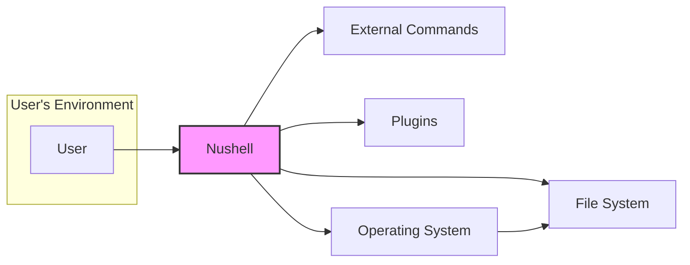
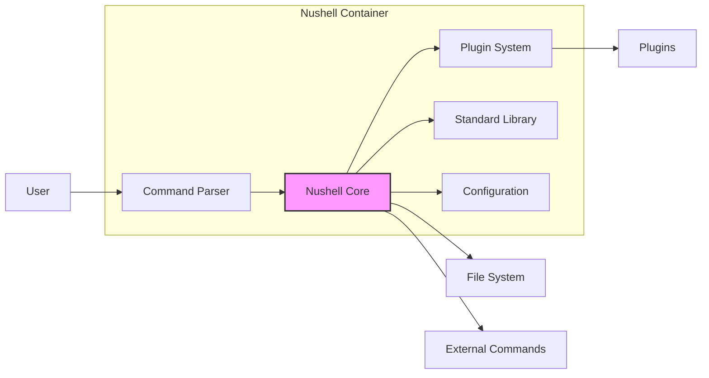
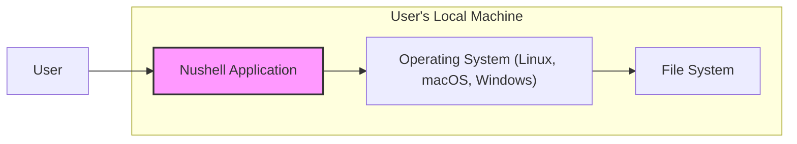
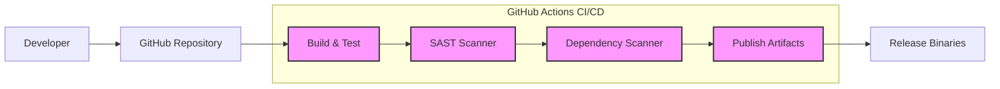

# BUSINESS POSTURE

The Nushell project aims to provide a modern, structured shell that is easier to use and more powerful than traditional shells like bash or zsh. It focuses on handling data as structured information, enabling users to manipulate and transform data effectively through a pipeline.

Business Priorities and Goals:
- Enhance user productivity by providing a more intuitive and efficient command-line experience.
- Improve data manipulation capabilities in the shell environment.
- Offer a cross-platform shell that works consistently across different operating systems.
- Foster a strong community around Nushell and encourage contributions.
- Provide a robust and reliable shell for daily use.

Business Risks:
- Data breaches due to vulnerabilities in Nushell that could be exploited to access sensitive information.
- System compromise if malicious code is injected into Nushell or its dependencies.
- Reputational damage if Nushell is perceived as insecure or unreliable.
- Loss of user trust if security incidents occur.
- Slow adoption if security concerns are not adequately addressed.

# SECURITY POSTURE

Existing Security Controls:
- security control: Code review process for contributions, implemented through GitHub pull requests.
- security control: Open source nature allows for community scrutiny and vulnerability discovery, described in project's public repository.
- security control: Use of Rust programming language, which provides memory safety and reduces the risk of certain types of vulnerabilities, inherent to Rust language design.

Accepted Risks:
- accepted risk: Potential for vulnerabilities to be introduced by community contributions, mitigated by code review but not entirely eliminated.
- accepted risk: Reliance on external dependencies, which may have their own vulnerabilities, mitigated by dependency management but not fully controlled.
- accepted risk: Security vulnerabilities might be discovered after release, requiring patching and updates.

Recommended Security Controls:
- security control: Implement automated Static Application Security Testing (SAST) in the CI/CD pipeline to identify potential vulnerabilities in the code.
- security control: Implement automated Dependency Scanning to detect known vulnerabilities in third-party libraries.
- security control: Conduct regular security audits and penetration testing to proactively identify and address security weaknesses.
- security control: Establish a clear vulnerability disclosure and response process to handle security issues effectively.
- security control: Provide security training for core developers and contributors to promote secure coding practices.

Security Requirements:
- Authentication: Not directly applicable to Nushell itself as a shell. Authentication is handled by the underlying operating system. However, if Nushell interacts with external services or resources that require authentication, it should support secure authentication mechanisms provided by those services.
- Authorization: Nushell must respect and enforce the operating system's authorization mechanisms, such as file system permissions. When interacting with external systems, Nushell should adhere to the authorization policies of those systems.
- Input Validation: Nushell needs robust input validation to prevent command injection and other input-related vulnerabilities. This applies to shell commands, script arguments, and data processed from external sources.
- Cryptography: If Nushell handles sensitive data or communicates over networks, it should utilize appropriate cryptographic measures to protect confidentiality and integrity. This might include secure storage of credentials, encrypted network communication, and secure handling of cryptographic keys if needed for plugins or extensions.

# DESIGN

## C4 CONTEXT

Context Diagram Elements:

- Element:
  - Name: User
  - Type: Person
  - Description: A user interacting with Nushell to execute commands, manage files, and automate tasks.
  - Responsibilities: Provides commands and input to Nushell, interprets Nushell's output.
  - Security controls: Operating system level user account management, strong passwords, multi-factor authentication for user accounts (managed outside of Nushell).

- Element:
  - Name: Nushell
  - Type: Software System
  - Description: The Nushell shell application, providing a command-line interface and scripting environment.
  - Responsibilities: Parses and executes user commands, interacts with the file system, executes external commands, loads and runs plugins, manages data pipelines.
  - Security controls: Input validation, authorization checks (file system permissions), secure plugin loading, memory safety (Rust), SAST/DAST, dependency scanning, vulnerability management.

- Element:
  - Name: File System
  - Type: External System
  - Description: The local file system of the operating system where Nushell is running.
  - Responsibilities: Stores files and directories, manages file permissions, provides data to Nushell.
  - Security controls: Operating system level file permissions, access control lists, file system encryption (managed outside of Nushell).

- Element:
  - Name: External Commands
  - Type: External System
  - Description: External command-line utilities and applications that Nushell can execute.
  - Responsibilities: Perform specific tasks as invoked by Nushell, process data provided by Nushell, return output to Nushell.
  - Security controls: Permissions of executed commands are determined by the operating system user running Nushell. Nushell should avoid executing commands with elevated privileges unless explicitly authorized by the user. User is responsible for the security of external commands.

- Element:
  - Name: Plugins
  - Type: External System
  - Description: Dynamically loaded extensions that extend Nushell's functionality.
  - Responsibilities: Provide additional commands and features to Nushell, interact with Nushell's core functionality.
  - Security controls: Plugin loading mechanism should ensure plugins are loaded from trusted sources. Plugin API should be designed to minimize security risks. Plugin verification and signing mechanisms could be considered.

- Element:
  - Name: Operating System
  - Type: External System
  - Description: The underlying operating system (e.g., Linux, macOS, Windows) on which Nushell runs.
  - Responsibilities: Provides core system services, manages file system access, handles process execution, provides user authentication and authorization.
  - Security controls: Operating system security features, including user account management, access control, process isolation, and security updates.

## C4 CONTAINER

Container Diagram Elements:

- Element:
  - Name: Nushell Core
  - Type: Container - Rust Application
  - Description: The core runtime engine of Nushell, responsible for command execution, pipeline management, and data handling.
  - Responsibilities: Interprets parsed commands, manages data flow between commands, interacts with the file system and external commands, loads and manages plugins, handles configuration.
  - Security controls: Memory safety (Rust), input validation, authorization checks, secure plugin system integration, SAST/DAST, dependency scanning, vulnerability management.

- Element:
  - Name: Command Parser
  - Type: Container - Rust Library
  - Description: Parses user input into an abstract syntax tree (AST) that Nushell Core can execute.
  - Responsibilities: Lexical analysis, syntax analysis, command parsing, input validation to prevent command injection.
  - Security controls: Input validation, sanitization of user input, protection against injection attacks.

- Element:
  - Name: Plugin System
  - Type: Container - Rust Library
  - Description: Manages the loading, execution, and isolation of plugins.
  - Responsibilities: Plugin discovery, plugin loading, plugin communication, plugin isolation to prevent malicious plugins from compromising the core shell.
  - Security controls: Plugin verification (e.g., signing), sandboxing or process isolation for plugins, secure plugin API, access control for plugin capabilities.

- Element:
  - Name: Standard Library
  - Type: Container - Rust Library
  - Description: Provides a set of built-in commands and functions for common shell operations.
  - Responsibilities: Offers core functionalities like file manipulation, data processing, string operations, and more.
  - Security controls: Code review, input validation within standard library commands, memory safety (Rust).

- Element:
  - Name: Configuration
  - Type: Container - Configuration Files
  - Description: Stores Nushell's configuration settings, including aliases, environment variables, and custom settings.
  - Responsibilities: Customization of Nushell's behavior, user-specific settings.
  - Security controls: Secure storage of configuration files (file system permissions), validation of configuration settings to prevent malicious configurations.

## DEPLOYMENT

Deployment Architecture: Standalone Application Deployment

Nushell is typically deployed as a standalone application on a user's local machine. Users download pre-built binaries or compile Nushell from source and install it on their operating system.

Deployment Diagram Elements:

- Element:
  - Name: User's Local Machine
  - Type: Environment
  - Description: The user's personal computer or workstation where Nushell is installed and run.
  - Responsibilities: Provides the execution environment for Nushell, including operating system, file system, and hardware resources.
  - Security controls: Operating system security controls, user account management, endpoint security software (antivirus, firewall), physical security of the machine.

- Element:
  - Name: Operating System (Linux, macOS, Windows)
  - Type: Infrastructure - Operating System
  - Description: The specific operating system installed on the user's machine.
  - Responsibilities: Provides core system services, manages file system access, handles process execution, provides user authentication and authorization.
  - Security controls: Operating system security features, security updates, configuration hardening.

- Element:
  - Name: Nushell Application
  - Type: Software - Executable
  - Description: The compiled Nushell executable binary installed on the user's machine.
  - Responsibilities: Executes Nushell shell, provides command-line interface, interacts with the operating system and file system.
  - Security controls: Application-level security controls (as described in previous sections), software updates, integrity checks of the executable.

- Element:
  - Name: File System
  - Type: Infrastructure - File System
  - Description: The local file system on the user's machine.
  - Responsibilities: Stores files and directories, manages file permissions, provides data to Nushell.
  - Security controls: Operating system level file permissions, access control lists, file system encryption.

## BUILD

Build Process: GitHub Actions based CI/CD

Nushell uses GitHub Actions for its Continuous Integration and Continuous Delivery (CI/CD) pipeline. The build process involves compiling the Rust code, running tests, and creating release binaries for different platforms.

Build Process Elements:

- Element:
  - Name: Developer
  - Type: Person
  - Description: Software developers contributing code to the Nushell project.
  - Responsibilities: Writing code, submitting pull requests, participating in code reviews.
  - Security controls: Secure development practices, code review participation, security training.

- Element:
  - Name: GitHub Repository
  - Type: Platform - Code Repository
  - Description: The GitHub repository hosting the Nushell source code.
  - Responsibilities: Version control, code storage, collaboration platform, CI/CD integration.
  - Security controls: Access control to the repository, branch protection, pull request reviews, audit logs.

- Element:
  - Name: GitHub Actions CI/CD
  - Type: Platform - CI/CD System
  - Description: GitHub's CI/CD platform used to automate the build, test, and release process.
  - Responsibilities: Automated build execution, testing, static analysis, dependency scanning, artifact publishing, release management.
  - Security controls: Secure build environment, access control to CI/CD workflows, secrets management, audit logs.

- Element:
  - Name: Build & Test
  - Type: Process - Build Stage
  - Description: Compiles the Rust source code and runs automated tests.
  - Responsibilities: Code compilation, unit testing, integration testing.
  - Security controls: Secure build environment, dependency management, build reproducibility.

- Element:
  - Name: SAST Scanner
  - Type: Tool - Security Scanner
  - Description: Static Application Security Testing tool integrated into the CI/CD pipeline.
  - Responsibilities: Automated static code analysis to identify potential security vulnerabilities.
  - Security controls: SAST tool configuration, vulnerability reporting, integration with CI/CD pipeline.

- Element:
  - Name: Dependency Scanner
  - Type: Tool - Security Scanner
  - Description: Dependency scanning tool to identify known vulnerabilities in third-party libraries.
  - Responsibilities: Dependency vulnerability scanning, vulnerability reporting, integration with CI/CD pipeline.
  - Security controls: Dependency scanner configuration, vulnerability database updates, integration with CI/CD pipeline.

- Element:
  - Name: Publish Artifacts
  - Type: Process - Publish Stage
  - Description: Packages and publishes build artifacts, including release binaries.
  - Responsibilities: Artifact packaging, signing (if applicable), uploading to release repositories.
  - Security controls: Secure artifact storage, access control to release repositories, integrity checks of artifacts.

- Element:
  - Name: Release Binaries
  - Type: Software - Distribution
  - Description: Pre-built executable binaries for different platforms, ready for user download and installation.
  - Responsibilities: Distribution of Nushell to users.
  - Security controls: Integrity checks (e.g., checksums, signatures) for release binaries, secure distribution channels.

# RISK ASSESSMENT

Critical Business Processes:
- User's daily command-line workflows and scripting tasks.
- Data manipulation and processing performed using Nushell.
- Automation scripts and workflows built with Nushell.

Data Sensitivity:
- User data processed by Nushell can vary in sensitivity. It can include:
    - File system paths and contents (potentially sensitive documents, configuration files).
    - Command history (may contain sensitive commands and arguments).
    - Environment variables (could include credentials or API keys).
    - Data processed through pipelines (can be any type of data, including sensitive information).
- Sensitivity level depends heavily on the user's context and the data they are working with. In general, Nushell should be considered as potentially handling sensitive data.

# QUESTIONS & ASSUMPTIONS

Questions:
- What is the intended user base for Nushell? (General users, developers, specific industries?)
- Are there any specific compliance requirements that Nushell needs to meet? (e.g., GDPR, HIPAA, PCI DSS - unlikely for a shell, but good to consider for context).
- Are there any plans for enterprise adoption or commercialization of Nushell?
- What is the process for handling security vulnerabilities reported by the community?
- Are there any specific security features planned for future releases?

Assumptions:
- BUSINESS POSTURE: Nushell is primarily focused on providing a better user experience and improving productivity for command-line users. Security is important for user trust and adoption, but not necessarily the primary driver in the early stages.
- SECURITY POSTURE: Current security controls are basic open-source best practices (code review, community scrutiny). There is room for improvement in automated security testing and vulnerability management. Security is a growing concern as the project matures.
- DESIGN: Nushell is designed as a standalone application for local user deployment. The architecture is modular with a core engine, parser, plugin system, and standard library. The build process is automated using GitHub Actions.