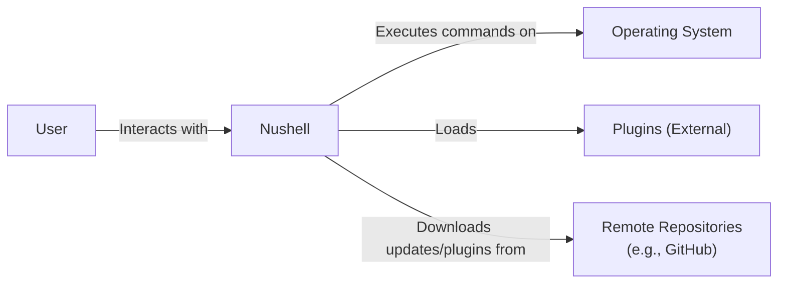
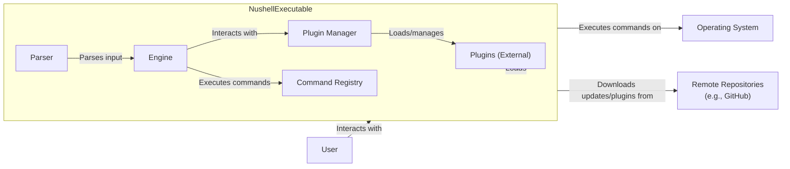
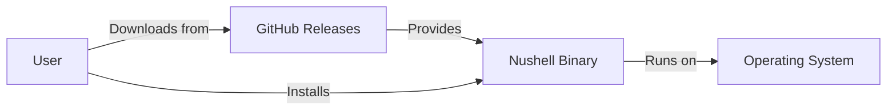
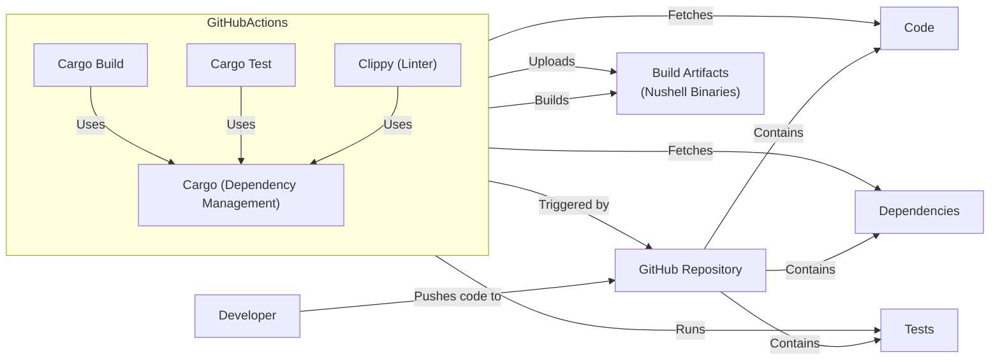

Okay, let's create a design document for the Nushell project, focusing on aspects relevant for threat modeling.

# BUSINESS POSTURE

Nushell is a new type of shell, aiming to provide a modern, powerful, and cross-platform shell experience.  It's open-source and community-driven.  Given its nature as a shell, it directly interacts with the operating system and user data, making security paramount.

Priorities:

*   Provide a user-friendly and productive shell experience.
*   Ensure cross-platform compatibility (Windows, macOS, Linux).
*   Maintain a robust and extensible plugin system.
*   Offer a secure environment for executing commands and scripts.
*   Foster a welcoming and active open-source community.

Goals:

*   Become a viable alternative to traditional shells (bash, zsh, PowerShell).
*   Attract a large user base and developer community.
*   Provide a secure and reliable platform for system administration and scripting.

Business Risks:

*   _Malicious Code Execution_: As a shell, Nushell executes user-provided commands.  A vulnerability could allow malicious code to be executed with the user's privileges, potentially leading to system compromise.
*   _Data Leakage_:  Nushell handles sensitive data (environment variables, command history, file contents).  A vulnerability could expose this data to unauthorized access.
*   _Denial of Service_:  A bug or vulnerability could cause Nushell to crash or become unresponsive, disrupting the user's workflow.
*   _Plugin Vulnerabilities_:  The plugin system, while powerful, introduces a risk of vulnerabilities in third-party plugins.  A malicious or poorly written plugin could compromise the security of Nushell.
*   _Supply Chain Attacks_: Compromise of the build or distribution process could lead to the insertion of malicious code into Nushell releases.

# SECURITY POSTURE

Existing Security Controls (based on the GitHub repository and general knowledge of secure coding practices):

*   _security control_: Code Reviews: The project uses pull requests on GitHub, implying code reviews are part of the development process. (Described in GitHub repository's contribution guidelines).
*   _security control_: Static Analysis (Likely): Given the use of Rust, it's highly probable that tools like Clippy (linter) and Cargo's built-in checks are used to identify potential bugs and security issues. (Implicit in the use of Rust and Cargo).
*   _security control_: Memory Safety (Rust): The use of Rust as the primary programming language provides inherent memory safety guarantees, mitigating common vulnerabilities like buffer overflows and use-after-free errors. (Fundamental to the Rust language).
*   _security control_: Dependency Management (Cargo): Rust's package manager, Cargo, helps manage dependencies and track versions, reducing the risk of using outdated or vulnerable libraries. (Implicit in the use of Rust and Cargo).
*   _security control_: Testing: The repository contains tests, indicating an effort to ensure code correctness and prevent regressions. (Visible in the GitHub repository's test suite).
*   _security control_: Fuzzing (Possible): While not explicitly mentioned, the nature of the project (handling user input) makes fuzzing a likely and recommended practice.

Accepted Risks:

*   _accepted risk_: User Error: Nushell, like any shell, relies on the user to exercise caution when executing commands.  It cannot prevent users from running malicious commands they obtain from untrusted sources.
*   _accepted risk_: Plugin Responsibility: While Nushell aims to provide a secure plugin API, the ultimate responsibility for the security of a plugin lies with its developer.  Nushell can provide sandboxing and permission control mechanisms, but cannot guarantee the absence of vulnerabilities in third-party plugins.
*   _accepted risk_: Operating System Vulnerabilities: Nushell relies on the underlying operating system for many of its functions.  Vulnerabilities in the OS kernel or system libraries could impact Nushell's security.

Recommended Security Controls:

*   _security control_: Explicit Sandboxing for Plugins: Implement a robust sandboxing mechanism for plugins, limiting their access to system resources and data.  This could involve using technologies like WebAssembly or OS-level sandboxing features.
*   _security control_: Input Validation and Sanitization:  Rigorously validate and sanitize all user input, including command arguments, environment variables, and data read from files.
*   _security control_: Security Audits: Conduct regular security audits, both internal and external, to identify and address potential vulnerabilities.
*   _security control_: Fuzzing: Implement continuous fuzzing to test Nushell's input handling and identify potential crashes or vulnerabilities.
*   _security control_: Supply Chain Security Measures: Implement measures to secure the build and distribution process, such as code signing, software bill of materials (SBOM), and vulnerability scanning of dependencies.
*   _security control_: Content Security Policy (CSP) or Similar: If Nushell incorporates any web-based components (e.g., for documentation or a plugin marketplace), implement CSP to mitigate XSS vulnerabilities.

Security Requirements:

*   Authentication:
    *   Nushell itself does not handle user authentication; this is managed by the operating system.
    *   Plugins that require authentication should use secure methods and avoid storing credentials insecurely.

*   Authorization:
    *   Nushell should respect the operating system's user permissions and access controls.
    *   The plugin system should implement a permission model to restrict plugin access to specific resources and capabilities.

*   Input Validation:
    *   All user input should be validated and sanitized to prevent command injection and other injection vulnerabilities.
    *   Regular expressions used for parsing should be carefully reviewed to avoid ReDoS (Regular Expression Denial of Service) vulnerabilities.

*   Cryptography:
    *   If Nushell handles sensitive data (e.g., encryption keys, passwords), it should use strong, well-vetted cryptographic libraries and algorithms.
    *   Cryptographic keys should be stored securely, leveraging OS-provided key management mechanisms where possible.

# DESIGN

## C4 CONTEXT

Element Descriptions:

*   Element:
    1.  Name: User
    2.  Type: Person
    3.  Description: A person who interacts with Nushell.
    4.  Responsibilities: Provides commands and input to Nushell, receives output from Nushell.
    5.  Security controls: Relies on OS-level authentication and authorization.

*   Element:
    1.  Name: Nushell
    2.  Type: Software System
    3.  Description: The Nushell shell itself.
    4.  Responsibilities: Parses user input, executes commands, manages plugins, interacts with the operating system.
    5.  Security controls: Memory safety (Rust), static analysis, code reviews, testing, (planned) sandboxing for plugins, input validation.

*   Element:
    1.  Name: Operating System
    2.  Type: Software System
    3.  Description: The underlying operating system (Windows, macOS, Linux).
    4.  Responsibilities: Provides system resources, manages processes, enforces security policies.
    5.  Security controls: OS-level security features (user accounts, file permissions, process isolation, etc.).

*   Element:
    1.  Name: Plugins (External)
    2.  Type: Software System
    3.  Description: External plugins that extend Nushell's functionality.
    4.  Responsibilities: Provide additional commands, features, and integrations.
    5.  Security controls: (Planned) Sandboxing, permission model, reliance on Nushell's security mechanisms.

*   Element:
    1.  Name: Remote Repositories
    2.  Type: Software System
    3.  Description: Remote repositories, such as GitHub, used for distributing Nushell and its plugins.
    4.  Responsibilities: Host Nushell releases, plugin code, and documentation.
    5.  Security controls: Repository-specific security features (access controls, code signing, vulnerability scanning).

## C4 CONTAINER

Since Nushell is a relatively self-contained application, the container diagram is a simple extension of the context diagram. The primary "container" is the Nushell executable itself.

Element Descriptions:

*   Element:
    1.  Name: Nushell Executable
    2.  Type: Executable
    3.  Description: The compiled Nushell binary.
    4.  Responsibilities: Contains all core Nushell components.
    5.  Security controls: Memory safety (Rust), static analysis, code reviews, testing.

*   Element:
    1.  Name: Parser
    2.  Type: Component
    3.  Description: Parses user input into an abstract syntax tree (AST).
    4.  Responsibilities: Lexical analysis, syntax analysis, error handling.
    5.  Security controls: Input validation, robust parsing logic, fuzzing.

*   Element:
    1.  Name: Engine
    2.  Type: Component
    3.  Description: Executes the parsed commands.
    4.  Responsibilities: Command lookup, argument evaluation, execution control, interaction with the operating system.
    5.  Security controls: Secure handling of command execution, privilege management.

*   Element:
    1.  Name: Plugin Manager
    2.  Type: Component
    3.  Description: Loads and manages external plugins.
    4.  Responsibilities: Plugin discovery, loading, communication, sandboxing (planned).
    5.  Security controls: Sandboxing, permission model, secure communication channels.

*   Element:
    1.  Name: Command Registry
    2.  Type: Component
    3.  Description: Stores information about available commands (built-in and plugin-provided).
    4.  Responsibilities: Command lookup, help information.
    5.  Security controls: Access control to prevent unauthorized modification of the registry.

*   Element:
    1.  Name: User
    2.  Type: Person
    3.  Description: A person who interacts with Nushell.
    4.  Responsibilities: Provides commands and input to Nushell, receives output from Nushell.
    5.  Security controls: Relies on OS-level authentication and authorization.

*   Element:
    1.  Name: Operating System
    2.  Type: Software System
    3.  Description: The underlying operating system (Windows, macOS, Linux).
    4.  Responsibilities: Provides system resources, manages processes, enforces security policies.
    5.  Security controls: OS-level security features (user accounts, file permissions, process isolation, etc.).

*   Element:
    1.  Name: Plugins (External)
    2.  Type: Software System
    3.  Description: External plugins that extend Nushell's functionality.
    4.  Responsibilities: Provide additional commands, features, and integrations.
    5.  Security controls: (Planned) Sandboxing, permission model, reliance on Nushell's security mechanisms.

*   Element:
    1.  Name: Remote Repositories
    2.  Type: Software System
    3.  Description: Remote repositories, such as GitHub, used for distributing Nushell and its plugins.
    4.  Responsibilities: Host Nushell releases, plugin code, and documentation.
    5.  Security controls: Repository-specific security features (access controls, code signing, vulnerability scanning).

## DEPLOYMENT

Nushell supports multiple deployment models:

1.  **Manual Installation:** Downloading pre-built binaries from the official website or GitHub releases.
2.  **Package Managers:** Using system package managers (e.g., `apt`, `brew`, `choco`).
3.  **Building from Source:** Cloning the repository and building Nushell using Cargo.
4.  **Containers:** (Potentially) Running Nushell within a container (e.g., Docker).

We'll describe the *Manual Installation* from pre-built binaries, as it's a common and straightforward approach.

Element Descriptions:

*   Element:
    1.  Name: User
    2.  Type: Person
    3.  Description: A person who installs and uses Nushell.
    4.  Responsibilities: Downloads and installs Nushell, configures their environment.
    5.  Security controls: Relies on OS-level authentication and authorization, verifies downloaded binaries (ideally).

*   Element:
    1.  Name: GitHub Releases
    2.  Type: Software System
    3.  Description: The GitHub Releases page for the Nushell project.
    4.  Responsibilities: Hosts pre-built binaries for various platforms.
    5.  Security controls: GitHub's security features, (ideally) code signing of binaries.

*   Element:
    1.  Name: Nushell Binary
    2.  Type: Executable
    3.  Description: The downloaded Nushell executable.
    4.  Responsibilities: Runs the Nushell shell.
    5.  Security controls: Relies on the security of the build process and distribution mechanism.

*   Element:
    1.  Name: Operating System
    2.  Type: Software System
    3.  Description: The user's operating system.
    4.  Responsibilities: Provides the environment for Nushell to run.
    5.  Security controls: OS-level security features.

## BUILD

Nushell's build process leverages Rust's Cargo build system and GitHub Actions for automation.

Security Controls in the Build Process:

*   _security control_: Automated Build: GitHub Actions automates the build process, ensuring consistency and reducing the risk of manual errors.
*   _security control_: Dependency Management: Cargo manages dependencies, ensuring that specific versions are used and tracked.
*   _security control_: Static Analysis: Clippy (likely used) performs static analysis to identify potential bugs and security issues.
*   _security control_: Testing: Cargo Test runs the test suite, ensuring code correctness and preventing regressions.
*   _security control_: (Recommended) Software Bill of Materials (SBOM): Generate an SBOM during the build process to track all dependencies and their versions.
*   _security control_: (Recommended) Code Signing: Digitally sign the build artifacts to ensure their integrity and authenticity.
*   _security control_: (Recommended) Vulnerability Scanning: Scan dependencies for known vulnerabilities during the build process.

# RISK ASSESSMENT

Critical Business Processes:

*   _Command Execution_: The core function of Nushell is to execute user commands.  Compromise of this process could lead to arbitrary code execution with the user's privileges.
*   _Plugin Management_: The ability to extend Nushell with plugins is a key feature.  Vulnerabilities in the plugin system could allow malicious plugins to compromise the shell.
*   _Data Handling_: Nushell handles user data, including command history, environment variables, and file contents.  Data leakage or corruption could have significant consequences.

Data Sensitivity:

*   _Command History_: Contains a record of all commands executed by the user, which may include sensitive information (e.g., passwords entered accidentally). Sensitivity: **High**
*   _Environment Variables_: May contain API keys, passwords, and other sensitive configuration data. Sensitivity: **High**
*   _File Contents_: Nushell can read and write files, potentially accessing sensitive data stored on the user's system. Sensitivity: **Variable (depends on the files accessed)**
*   _Plugin Data_: Plugins may store their own data, which could include sensitive information depending on the plugin's functionality. Sensitivity: **Variable (depends on the plugin)**
*   _Configuration Files_: Nushell's configuration files may contain user preferences and customizations, which could be considered sensitive in some contexts. Sensitivity: **Low to Medium**

# QUESTIONS & ASSUMPTIONS

Questions:

*   What is the specific threat model or attack surface that is of greatest concern? (e.g., malicious plugins, command injection, data leakage)
*   What level of security assurance is required? (e.g., basic security best practices, formal verification, penetration testing)
*   What resources are available for security testing and auditing?
*   Are there any specific compliance requirements (e.g., GDPR, PCI DSS) that apply to Nushell or its use cases?
*   What is the process for handling security vulnerabilities reported by users or researchers?
*   What is current state of plugin sandboxing?
*   Is there a plan to implement code signing for releases?
*   Is fuzzing currently being used, and if so, what tools and techniques are employed?

Assumptions:

*   _BUSINESS POSTURE_: The Nushell project prioritizes security and is willing to invest in reasonable security measures.
*   _SECURITY POSTURE_: The development team follows secure coding practices and is aware of common security vulnerabilities. The use of Rust provides a strong foundation for memory safety.
*   _DESIGN_: The design of Nushell is modular and allows for the implementation of security features like sandboxing and permission control. The build process is automated and reproducible.
*   _DEPLOYMENT_: Users are responsible for downloading Nushell from trusted sources (e.g., the official website or GitHub releases) and verifying the integrity of the downloaded binaries.
*   _BUILD_: GitHub Actions is used for continuous integration and build automation. Cargo is used for dependency management and building.