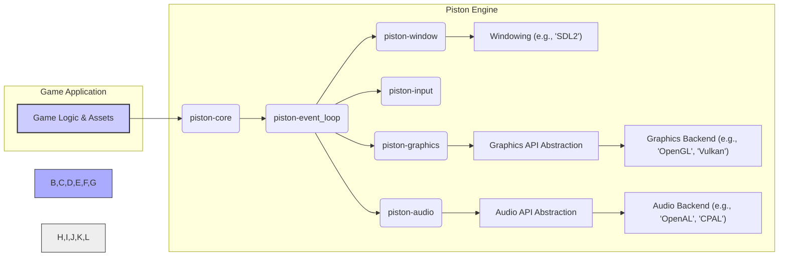
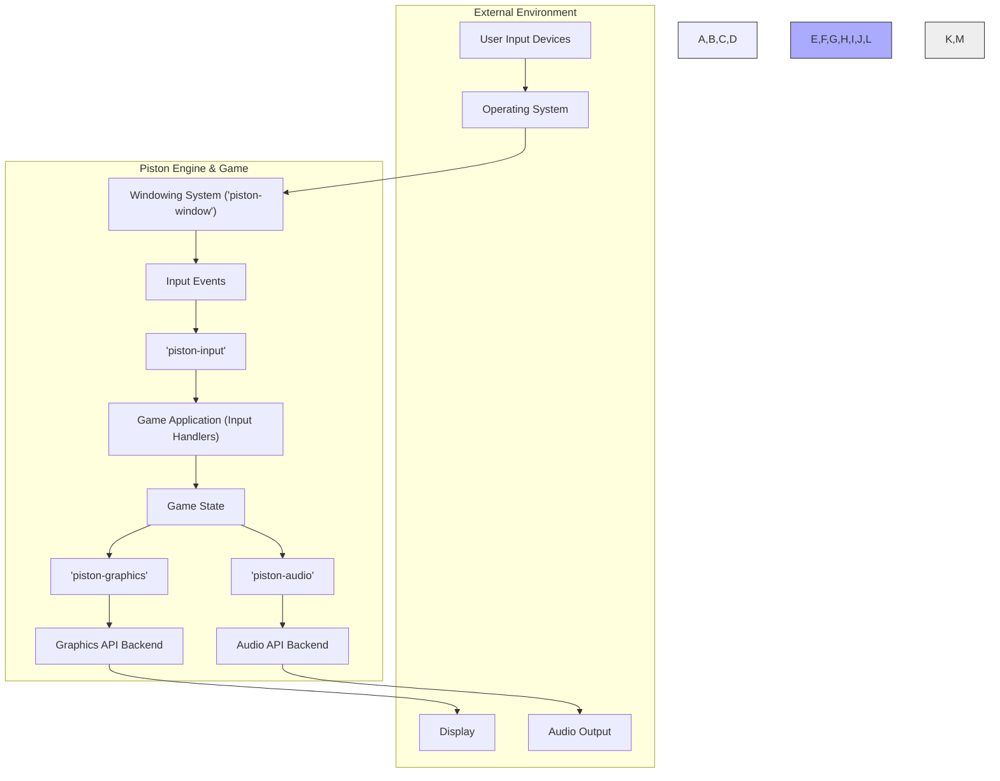

## Project Design Document: Piston Game Engine (Improved)

**1. Introduction**

This document provides an enhanced architectural design of the Piston game engine project, as found on GitHub at [https://github.com/PistonDevelopers/piston](https://github.com/PistonDevelopers/piston). This revised document aims for greater clarity and detail in outlining the system's components, their interactions, and data flow, making it more robust for subsequent threat modeling activities. Piston is a modular, open-source game engine written in Rust, primarily focused on 2D game development. Its design prioritizes flexibility and extensibility through a collection of independent, specialized crates.

**2. Goals and Objectives**

The primary goals of the Piston project are to:

*   Provide a robust and efficient foundation for building 2D games using the Rust programming language.
*   Offer a highly modular architecture, enabling developers to select and integrate only the necessary functionalities for their specific game.
*   Abstract platform-specific complexities, facilitating cross-platform game development and deployment.
*   Achieve high performance and resource efficiency suitable for interactive applications.
*   Cultivate an active and supportive community of developers and contributors.

**3. System Architecture**

Piston's architecture is fundamentally based on a collection of loosely coupled, independent crates, each responsible for a specific aspect of game development. A game built with Piston selectively integrates these crates to assemble the required functionality.

**3.1. High-Level Architecture Diagram**

**3.2. Component Descriptions**

*   **Game Application:** This represents the developer's game code, encompassing game logic, asset management, and the orchestration of Piston engine functionalities. It's the primary user of the Piston library.
*   **piston-core:** Provides fundamental data structures, traits, and utilities shared across other Piston crates. This includes core concepts like the game loop phases (`Update`, `Render`), time management, and basic mathematical types.
*   **piston-event\_loop:**  Manages the central game loop, responsible for processing events (input, window events, etc.) and dispatching them to relevant parts of the engine and the game application. It ensures a consistent and platform-agnostic flow of execution.
*   **piston-window:**  Handles the creation and management of application windows, providing an abstraction layer over platform-specific windowing systems. It deals with window resizing, focus events, and basic window properties. It typically relies on backend libraries like SDL2 or GLFW.
*   **piston-input:**  Provides a unified and platform-independent interface for handling various user input events, such as keyboard presses, mouse movements, mouse button clicks, and gamepad inputs. It normalizes input data for easier consumption by the game logic.
*   **piston-graphics:** Offers an abstraction layer for 2D graphics rendering. It provides functionalities for drawing shapes, images (textures), and text, managing rendering states, and interacting with underlying graphics APIs. It often uses libraries like `gfx-rs` to interface with backends like OpenGL or Vulkan. Key concepts include:
    *   **Render Context:** Manages the state of the graphics pipeline.
    *   **Textures:**  Represents images used for rendering.
    *   **Sprites:**  Optimized representations of textured rectangles.
    *   **Shaders:**  Programs executed on the GPU to control rendering.
*   **piston-audio:**  Provides functionalities for playing and managing audio within the game. It offers an abstraction layer over platform-specific audio APIs, allowing for playback of sound effects and music. It typically interfaces with backend libraries like OpenAL or CPAL.
*   **Windowing (e.g., 'SDL2'):** A platform-specific library used by `piston-window` to interact with the operating system's windowing system, creating and managing native windows.
*   **Graphics API Abstraction:**  A layer within `piston-graphics` (often provided by libraries like `gfx-rs`) that provides a common interface to different low-level graphics APIs.
*   **Graphics Backend (e.g., 'OpenGL', 'Vulkan'):** Low-level graphics libraries used by the graphics abstraction layer to perform the actual rendering operations on the GPU.
*   **Audio API Abstraction:** A layer within `piston-audio` that provides a common interface to different low-level audio APIs.
*   **Audio Backend (e.g., 'OpenAL', 'CPAL'):** Low-level audio libraries used by the audio abstraction layer to manage audio devices and playback sound.

**4. Data Flow**

The typical data flow within a game built using the Piston engine involves the following stages:

**Detailed Data Flow Description:**

*   **User Input Devices:**  Physical devices like keyboards, mice, and gamepads generate raw input signals.
*   **Operating System:** The OS intercepts these raw input signals and translates them into system-level events.
*   **Windowing System ('piston-window'):**  `piston-window`, through its backend (e.g., SDL2), receives window-related events and raw input events from the operating system.
*   **Input Events:** `piston-window` transforms the raw input into a structured, platform-independent representation of input events.
*   **'piston-input':** The `piston-input` crate receives these structured input events and further processes and normalizes them, making them easily accessible to the game application.
*   **Game Application (Input Handlers):** The game's logic receives the processed input events and updates the **Game State** accordingly.
*   **Game State:** This represents the current state of the game world, including positions of objects, game variables, and other relevant information.
*   **'piston-graphics':** The game application uses `piston-graphics` to generate rendering commands based on the current **Game State**. This involves specifying what to draw, where to draw it, and with what appearance.
*   **Graphics API Backend:** `piston-graphics` translates these rendering commands into calls to the underlying graphics API (e.g., OpenGL, Vulkan).
*   **Display:** The graphics API backend performs the actual rendering on the GPU, and the resulting image is displayed on the screen.
*   **'piston-audio':** The game application sends audio data or commands to `piston-audio` based on the **Game State**. This could involve triggering sound effects or playing background music.
*   **Audio API Backend:** `piston-audio` uses the underlying audio API (e.g., OpenAL, CPAL) to manage audio devices and play the specified sounds.
*   **Audio Output:** The audio API backend sends the audio data to the system's audio output devices (speakers, headphones).

**5. Key Technologies and Dependencies**

*   **Primary Programming Language:** Rust
*   **Core Piston Crates:** `piston-core`, `piston-event_loop`, `piston-window`, `piston-input`, `piston-graphics`, `piston-audio`
*   **Common Windowing Backends:** SDL2, GLFW
*   **Common Graphics Backends (via Abstraction Layers like `gfx-rs`):** OpenGL, Vulkan, Metal, DirectX
*   **Common Audio Backends (via Abstraction Layers):** OpenAL, CPAL, Rodio

**6. Security Considerations (For Threat Modeling)**

This section outlines potential security considerations relevant for threat modeling, focusing on potential vulnerabilities and attack vectors.

*   **Input Handling Vulnerabilities:**
    *   **Malicious Input Injection:**  Exploiting vulnerabilities in `piston-input` or the game's input handling logic to inject unexpected or malicious data, potentially leading to crashes, unexpected behavior, or even code execution.
    *   **Denial of Service (DoS) via Input Flooding:** Sending a large volume of input events to overwhelm the system and cause performance degradation or crashes.
*   **Graphics Rendering Vulnerabilities:**
    *   **Shader Exploits:**  If custom shaders are allowed or if there are vulnerabilities in the shader compilation or execution pipeline, malicious shaders could be used to crash the application or potentially gain unauthorized access.
    *   **Resource Exhaustion:**  Crafting rendering commands that consume excessive GPU resources, leading to denial of service.
    *   **Vulnerabilities in Graphics Backends:** Exploiting known vulnerabilities in the underlying graphics API (e.g., OpenGL drivers).
*   **Audio Processing Vulnerabilities:**
    *   **Malicious Audio File Exploits:**  Playing specially crafted audio files that exploit vulnerabilities in the audio decoding or playback libraries.
    *   **Resource Exhaustion:**  Playing a large number of audio sources or very complex audio, leading to performance issues or crashes.
    *   **Vulnerabilities in Audio Backends:** Exploiting known vulnerabilities in the underlying audio API.
*   **Dependency Vulnerabilities:**
    *   **Third-Party Library Vulnerabilities:**  Piston relies on various third-party libraries (e.g., SDL2, `gfx-rs`). Vulnerabilities in these dependencies could be exploited if not properly managed and updated.
    *   **Supply Chain Attacks:**  Compromised dependencies introduced through malicious packages or compromised repositories.
*   **Memory Safety:**
    *   **Rust's Memory Safety Features:** While Rust's ownership and borrowing system helps prevent many memory safety issues, unsafe code blocks or incorrect usage can still introduce vulnerabilities like buffer overflows or use-after-free errors.
*   **Build Process Security:**
    *   **Compromised Build Environment:**  If the build environment is compromised, malicious code could be injected into the Piston libraries or the game application.
    *   **Lack of Reproducible Builds:** Difficulty in verifying the integrity of the built artifacts.
*   **Game Logic Vulnerabilities (Beyond Piston's Scope but Relevant):**
    *   While not directly a Piston vulnerability, flaws in the game application's logic (e.g., insecure network communication, save file vulnerabilities) can be exploited.

**7. Deployment Considerations**

Deployment strategies for games built with Piston will vary depending on the target platform:

*   **Desktop Platforms (Windows, macOS, Linux):**
    *   Compilation of Rust code for the specific target operating system.
    *   Distribution of the executable along with necessary dynamic libraries (e.g., SDL2, OpenGL/Vulkan drivers).
    *   Packaging and installation mechanisms specific to each platform.
*   **Web (via WebAssembly):**
    *   Compilation of Rust code to WebAssembly (WASM).
    *   Integration with HTML and JavaScript for browser interaction.
    *   Consideration of browser security sandboxing and limitations.
*   **Mobile Platforms (Android, iOS):**
    *   Utilizing platform-specific build tools and SDKs (e.g., Android NDK, Xcode).
    *   Packaging the application according to platform requirements (e.g., APK for Android, IPA for iOS).
    *   Addressing platform-specific security considerations and permissions.

**8. Future Considerations**

*   **Enhanced Error Handling and Diagnostics:**  Improving error reporting and providing more detailed debugging information within Piston crates.
*   **Advanced Graphics Features Integration:** Exploring and integrating more modern rendering techniques, such as physically based rendering (PBR) or more advanced shader capabilities.
*   **Broader Platform Support:**  Expanding support to additional platforms or improving the robustness of existing platform integrations.
*   **Improved Documentation and Examples:**  Providing more comprehensive documentation and practical examples to aid developers.
*   **Community Engagement and Contribution:**  Actively fostering community contributions and providing clear guidelines for participation.

This improved design document provides a more detailed and nuanced understanding of the Piston game engine's architecture, data flow, and security considerations. It serves as a more robust foundation for subsequent threat modeling activities, enabling a deeper analysis of potential vulnerabilities and attack surfaces.
