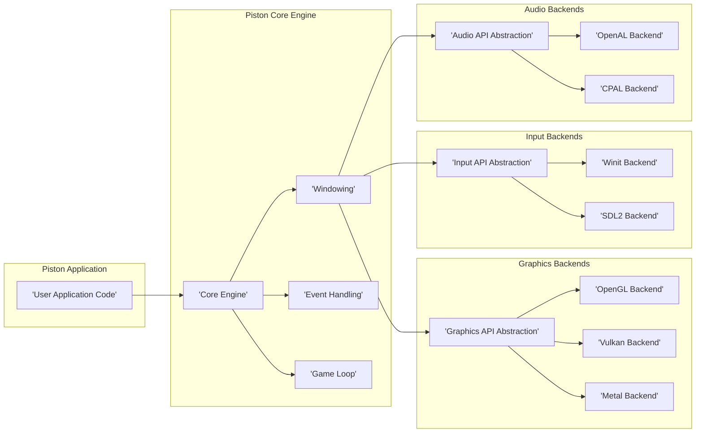
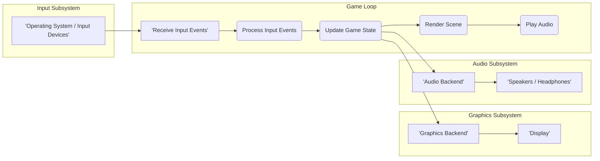

# Project Design Document: Piston Game Engine

**Version:** 1.1
**Date:** October 26, 2023
**Author:** AI Software Architect

## 1. Introduction

This document provides an enhanced outline of the high-level and detailed design of the Piston game engine project. It serves as a foundational resource for understanding the system's architecture, components, and data flow, which is crucial for subsequent threat modeling activities. This revised document aims to offer an even clearer and more comprehensive overview of the engine's structure and functionality.

## 2. Goals and Objectives

The primary goals of the Piston project are to:

* Provide a highly modular and extensible 2D game engine framework.
* Offer support for a diverse range of graphics, input, and audio backends, promoting platform independence.
* Deliver a cross-platform development experience, enabling game creation for various operating systems.
* Leverage the memory safety and performance benefits of the Rust programming language.
* Facilitate rapid prototyping and efficient development of 2D games and interactive applications.

## 3. High-Level Architecture

The Piston game engine is designed with a modular architecture at its core. This design philosophy allows developers to select and integrate specific backends and components tailored to their project's needs. The central engine manages the fundamental game loop and overall system orchestration, while specialized modules are responsible for distinct functionalities.

**Components:**

* **User Application Code:** This represents the game-specific logic and assets created by the developer utilizing the Piston engine's APIs. It encompasses game entities, state management, and event handling specific to the game being built.
* **Core Engine:** The central component responsible for the overall lifecycle management of the game. This includes initialization of subsystems, management of the main game loop, and handling core resource management tasks.
* **Windowing:** Provides an abstraction layer for creating, managing, and interacting with application windows across different operating systems. This ensures platform independence for window-related operations.
* **Event Handling:**  A crucial component for managing and dispatching various events within the engine. This includes input events from devices (keyboard, mouse, gamepad), window events (resize, close, focus), and custom events defined within the game logic.
* **Game Loop:** The fundamental execution loop that drives the game's progression. It orchestrates the sequence of processing input, updating the game state, and rendering the visual output at regular intervals.
* **Graphics API Abstraction:** Defines a common, platform-independent interface for interacting with different underlying graphics APIs. This allows the engine to support multiple rendering backends without requiring significant code changes in the core engine or user application.
* **OpenGL Backend:**  A concrete implementation of the Graphics API Abstraction, utilizing the OpenGL graphics library for rendering.
* **Vulkan Backend:** Another implementation of the Graphics API Abstraction, leveraging the modern Vulkan graphics API for potentially higher performance and lower overhead.
* **Metal Backend:** An implementation of the Graphics API Abstraction specifically for Apple platforms, utilizing the Metal graphics API.
* **Input API Abstraction:**  Provides a consistent interface for handling input events from various sources, abstracting away platform-specific input mechanisms.
* **Winit Backend:** An implementation of the Input API Abstraction using the `winit` library, a cross-platform window creation and event loop management library.
* **SDL2 Backend:** Another implementation of the Input API Abstraction, utilizing the popular SDL2 library for handling input and other multimedia functionalities.
* **Audio API Abstraction:** Defines a unified interface for managing audio playback and processing, allowing the engine to support different audio backends.
* **OpenAL Backend:** An implementation of the Audio API Abstraction using the OpenAL library, a widely used cross-platform audio API.
* **CPAL Backend:** Another implementation of the Audio API Abstraction, leveraging the `cpal` library, a cross-platform audio I/O library in Rust.

## 4. Detailed Component Breakdown

This section delves deeper into the functionalities and responsibilities of the key components within the Piston engine.

### 4.1. Core Engine

* **Initialization Sequence:**  Handles the initial setup of the engine, including initializing logging, configuring subsystems (windowing, input, audio, graphics), and potentially loading initial configuration settings.
* **Game Loop Orchestration:**  Manages the execution of the main game loop, ensuring consistent timing and frame rate control through techniques like fixed or variable time steps.
* **Resource Management System:**  Responsible for loading, caching, and unloading game assets such as textures, models, sounds, and other data, optimizing memory usage and loading times.
* **Plugin/Module Management (Potential Future Feature):**  Could provide a mechanism for extending engine functionality through dynamically loaded modules or plugins, enhancing extensibility.
* **Error Handling and Reporting:**  Implements mechanisms for detecting, handling, and reporting errors and exceptions that occur during engine execution.

### 4.2. Windowing

* **Platform Window Creation:**  Provides platform-specific implementations for creating and configuring application windows, including setting window size, title, and display mode (windowed, fullscreen).
* **Window Event Queue Management:**  Manages a queue of window-related events received from the operating system, such as resize events, close requests, and focus changes.
* **Input Context Management:**  May handle the association of input devices with specific windows or contexts.
* **Cursor Control:**  Provides functionality for controlling the mouse cursor's visibility and position within the window.

### 4.3. Event Handling

* **Raw Input Event Reception:**  Receives raw input events from the underlying operating system or backend libraries (e.g., keyboard presses, mouse movements, gamepad button presses).
* **Event Translation and Normalization:**  Translates raw input data into a consistent, engine-specific event format, normalizing differences between input devices and platforms.
* **Event Dispatching Mechanism:**  Routes processed events to the appropriate parts of the engine and the user application code through event listeners or callbacks.
* **Custom Event Definition and Triggering:**  Allows developers to define and trigger custom events within their game logic for inter-component communication or game-specific event handling.

### 4.4. Graphics Backends

* **Graphics Context Creation and Management:**  Handles the creation and management of the graphics context associated with the rendering window.
* **Command Buffer Generation and Submission:**  Generates command buffers containing rendering instructions for the underlying graphics API and submits them for execution on the GPU.
* **GPU Resource Management:**  Manages GPU resources such as textures, vertex buffers, index buffers, and shaders, including allocation, uploading, and deallocation.
* **Rendering Pipeline Implementation:**  Implements the different stages of the rendering pipeline, including vertex processing, rasterization, and fragment shading, using the specific capabilities of the chosen graphics API.
* **Shader Management:**  Handles the loading, compilation, and management of shaders used in the rendering process.
* **Platform-Specific API Interfacing:**  Directly interacts with the chosen graphics API (OpenGL, Vulkan, Metal) through their respective SDKs or bindings.

### 4.5. Input Backends

* **Input Device Enumeration and Detection:**  Detects and enumerates available input devices (keyboards, mice, gamepads) connected to the system.
* **Device State Polling or Event-Driven Handling:**  Either periodically polls input devices for their current state or uses an event-driven approach to receive input updates.
* **Input Event Mapping and Abstraction:**  Maps raw input events from different devices to a common, engine-agnostic input representation.
* **Platform-Specific Input API Usage:**  Utilizes platform-specific APIs or libraries (e.g., operating system input APIs, `winit`, SDL2) to access and handle input device data.

### 4.6. Audio Backends

* **Audio Device Initialization and Selection:**  Initializes and selects the appropriate audio output device for playback.
* **Audio Resource Loading and Decoding:**  Loads and decodes audio files from various formats into a format suitable for playback by the audio API.
* **Audio Playback Control:**  Provides functions for controlling the playback of sound effects and music, including play, pause, stop, and volume control.
* **Spatial Audio Implementation (Potential Future Feature):**  Could implement features for positional audio, allowing sounds to be positioned in 3D space.
* **Platform-Specific Audio API Interaction:**  Interacts with platform-specific audio APIs (e.g., OpenAL, `cpal`, platform audio APIs) for audio output.

## 5. Data Flow

The following diagram illustrates the typical data flow within the Piston engine during a single frame of execution.

**Data Flow Description:**

1. **Receive Input Events:** The engine's input subsystem receives raw input events from the operating system or dedicated input backend libraries, capturing user interactions.
2. **Process Input Events:** The input subsystem processes these raw events, translating and normalizing them into engine-specific input actions that can be understood by the game logic.
3. **Update Game State:** Based on the processed input and internal game rules, the user application code and engine logic update the current state of the game world, including object positions, animations, and game logic variables.
4. **Render Scene:** The graphics subsystem utilizes the updated game state to generate rendering commands. These commands are then sent to the selected graphics backend to draw the visual representation of the game scene on the display.
5. **Play Audio:** The audio subsystem plays relevant sound effects and music based on the updated game state, enhancing the user experience with auditory feedback.

## 6. Technology Stack

* **Primary Programming Language:** Rust
* **Supported Graphics APIs:** OpenGL, Vulkan, Metal
* **Windowing Libraries in Use:** `winit`, SDL2
* **Input Handling Mechanisms:** (Potentially integrated within windowing libraries or through dedicated input handling within backends)
* **Audio Libraries Supported:** OpenAL, `cpal`
* **Build Automation and Dependency Management:** Cargo

## 7. Deployment Model

Piston is designed as a game engine library intended for use by developers to create standalone game applications. The typical deployment process involves:

1. **Developer Integration:** Developers integrate the Piston crate as a dependency within their Rust project using Cargo.
2. **Game Logic Implementation:** Developers utilize the provided Piston API to implement their specific game logic, integrate assets, and design the user interface.
3. **Compilation and Linking:** The developer compiles their game project, linking against the Piston library and the necessary backend implementations for the target platform.
4. **Executable Distribution:** The resulting executable application, along with required assets and libraries, is distributed to end-users for their respective operating systems.

## 8. Security Considerations (For Threat Modeling)

This section expands upon initial security considerations, providing more specific examples for threat modeling.

* **Dependency Vulnerabilities:**  Piston relies on external Rust crates. Vulnerabilities in these dependencies (e.g., in `winit`, `sdl2`, `openal`, `cpal` bindings, or graphics API wrappers) could be exploited. Threat modeling should consider the potential impact of known vulnerabilities and the process for updating dependencies.
* **Input Validation and Sanitization:**  Improper handling of user input (keyboard, mouse, gamepad, network input if networking is added) can lead to vulnerabilities. Examples include buffer overflows if input strings are not handled correctly, or injection attacks if input is used to construct commands or queries without proper sanitization.
* **Graphics API Vulnerabilities:**  Bugs or vulnerabilities in the underlying graphics API drivers or implementations (OpenGL, Vulkan, Metal) could be exploited by malicious shaders or rendering commands. Threat modeling should consider the potential for GPU-based attacks.
* **Resource Management Weaknesses:**  Improper management of resources (memory leaks, dangling pointers, file handle leaks) can lead to denial-of-service or other stability issues. Threat modeling should consider scenarios where resource exhaustion could be triggered.
* **Plugin/Module Security (If Implemented):**  If a plugin system is introduced, the security of loaded plugins becomes a concern. Malicious plugins could execute arbitrary code or compromise the game's integrity. Threat modeling should assess the plugin loading and isolation mechanisms.
* **Data Serialization/Deserialization Flaws:** If game data is saved or loaded (e.g., save files, network data), vulnerabilities can arise from insecure serialization formats or processes. For example, deserializing untrusted data could lead to remote code execution if the deserialization process is flawed.
* **Network Security Deficiencies (If Applicable):** If the game incorporates networking features, standard network security considerations apply. This includes vulnerabilities related to insecure protocols, lack of encryption, susceptibility to man-in-the-middle attacks, and denial-of-service attacks targeting the game server or clients.
* **Supply Chain Security Risks:** Ensuring the integrity and trustworthiness of the Piston codebase and its dependencies is crucial. Compromised dependencies or build tools could introduce vulnerabilities. Threat modeling should consider the processes for verifying the integrity of the software supply chain.
* **Asset Loading and Handling:** Vulnerabilities could exist in how the engine loads and handles game assets (images, audio, models). Maliciously crafted assets could potentially exploit parsing vulnerabilities leading to crashes or code execution.

This enhanced design document provides a more detailed and comprehensive understanding of the Piston game engine's architecture and functionalities, serving as an improved foundation for thorough threat modeling activities.