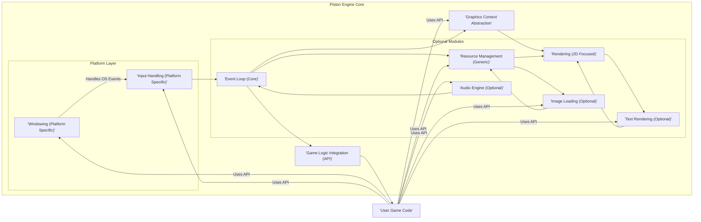
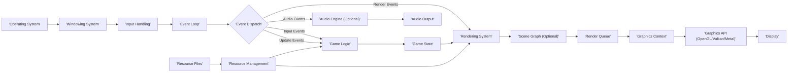

# Project Design Document: Piston Game Engine (Improved)

**Project Name:** Piston Game Engine

**Project Repository:** [https://github.com/pistondevelopers/piston](https://github.com/pistondevelopers/piston)

**Document Version:** 1.1

**Date:** October 26, 2023

**Author:** Gemini (AI Assistant)

## 1. Introduction

This document provides a comprehensive design overview of the Piston game engine project. Piston is a modular, open-source game engine library written in Rust, primarily focused on facilitating 2D game and interactive application development. This document details the system's architecture, core components, data flow, technology stack, deployment model, and crucial security considerations. It is intended to serve as a foundational resource for threat modeling, security audits, and ongoing development efforts related to the Piston project. This document is targeted towards developers, security researchers, and project contributors seeking a deep understanding of Piston's design.

## 2. Project Overview

Piston is engineered to be a lightweight, highly customizable, and performant 2D game engine library. Its modular design philosophy allows developers to selectively integrate components, optimizing resource usage and tailoring the engine to specific project needs. Piston aims to empower developers with a robust and flexible foundation for creating 2D games and interactive experiences within the Rust ecosystem.

Key features and design principles of Piston include:

*   **Extensive Modularity:**  Piston's architecture is built upon independent, interchangeable modules. This allows developers to choose only the necessary components, reducing bloat and improving performance. Modules cover areas like windowing, input, graphics, audio, and more.
*   **Cross-Platform by Design:**  Leveraging Rust's inherent cross-platform capabilities, Piston strives for broad compatibility across major operating systems (Windows, macOS, Linux) and potentially web platforms (via WebAssembly) and mobile platforms.
*   **Emphasis on 2D Development:**  While extensible and capable of supporting 3D rendering through external libraries, Piston's core focus is on providing a streamlined and efficient workflow for 2D game development. This includes optimized 2D rendering pipelines and tools.
*   **Event-Driven Architecture at its Core:**  Piston employs a robust event-driven architecture. This promotes decoupled components and facilitates reactive programming paradigms, making it easier to manage complex game logic and interactions.
*   **Rust Ecosystem Integration and Benefits:**  Being written in Rust, Piston benefits from Rust's memory safety, performance, and modern concurrency features. It seamlessly integrates with the rich Rust crate ecosystem, allowing developers to leverage existing libraries and tools.
*   **Data-Driven Design Principles:**  Piston encourages data-driven approaches to game development, promoting separation of data and logic for better maintainability and flexibility.

## 3. System Architecture

Piston's architecture is structured around a set of loosely coupled, yet interconnected modules. This modularity is a central design tenet, enabling flexibility and customization. The following diagram provides a more detailed view of the Piston engine core architecture, highlighting key modules and their relationships:

### 3.1. Component Description (Detailed)

The Piston engine core is composed of the following key components, with a more granular description of their responsibilities and technologies:

*   **Windowing (Platform Specific):**
    *   **Description:**  This module is responsible for all platform-dependent window management operations. It provides an abstraction over operating system-specific windowing APIs, allowing the rest of the engine to interact with windows in a platform-agnostic way.
    *   **Functionality:**
        *   Window creation, destruction, and management lifecycle.
        *   Handling window events: resize, minimize, maximize, focus, close requests, etc.
        *   Platform-specific window backend initialization and setup (e.g., Wayland, X11 for Linux; Win32 API for Windows; Cocoa for macOS).
        *   Integration with display servers and window compositors.
        *   Potentially managing multiple windows or contexts.
    *   **Technologies:**  Rust standard library for OS interaction (`std::os::raw`, `std::ptr`, etc.). Platform-specific C/C++ APIs accessed via Rust FFI (Foreign Function Interface). Examples: `wayland-client`, `xlib`, `winapi`, `cocoa-rs`.

*   **Input Handling (Platform Specific):**
    *   **Description:**  This module handles raw input events from various input devices and translates them into a unified, engine-level input event stream. It is also platform-dependent as input APIs vary across operating systems.
    *   **Functionality:**
        *   Polling and event-driven input capture from keyboards, mice, gamepads, touchscreens, and potentially other input devices.
        *   Normalization and abstraction of input data across different devices and platforms.
        *   Handling keyboard layouts and text input methods.
        *   Mouse cursor management and position tracking.
        *   Gamepad API abstraction (e.g., handling different gamepad types and button mappings).
        *   Potentially supporting custom input device integrations.
    *   **Technologies:**  Rust standard library. Platform-specific input APIs (e.g., DirectInput, Raw Input for Windows; IOKit for macOS; evdev for Linux). Libraries for input abstraction (SDL2, winit - though Piston often aims for lower-level control). Rust FFI for interacting with platform APIs.

*   **Event Loop (Core):**
    *   **Description:**  The central orchestrator of the engine. It manages the game loop, processes events, and drives the update and rendering cycles. This module is platform-independent and forms the core control flow.
    *   **Functionality:**
        *   Continuous game loop execution (frame-based or time-based).
        *   Event queue management and processing.
        *   Dispatching events to registered event handlers and subsystems.
        *   Frame timing and rate control (e.g., VSync, fixed timestep).
        *   Orchestrating the order of operations: input processing, game logic updates, rendering, and event handling.
        *   Potentially handling engine lifecycle events (startup, shutdown).
    *   **Technologies:**  Rust concurrency features (threads, channels, async/await if applicable). Custom event queue implementation (likely using Rust's standard library collections). Timing mechanisms using `std::time`.

*   **Graphics Context Abstraction:**
    *   **Description:**  Provides a platform-agnostic and graphics API-agnostic interface for rendering operations. It abstracts away the complexities of different graphics APIs (OpenGL, Vulkan, Metal, potentially WebGPU in the future).
    *   **Functionality:**
        *   Graphics API context creation and management.
        *   Abstraction of core rendering concepts: shaders, textures, buffers, render targets, draw calls, state management.
        *   Support for multiple rendering backends (OpenGL as primary, with potential for Vulkan/Metal modules).
        *   Resource management for graphics objects (textures, shaders, etc.).
        *   Provides a higher-level, Rust-idiomatic API for rendering compared to raw graphics API calls.
    *   **Technologies:**  Rust. Abstraction layer design patterns (traits, interfaces). Rust bindings for graphics APIs (e.g., `gl`, `vulkano`, `metal-rs`, `wgpu`). Potentially using libraries like `gfx-rs` or similar for further abstraction.

*   **Rendering (2D Focused):**
    *   **Description:**  Implements the 2D rendering pipeline using the Graphics Context Abstraction. It provides functionalities for drawing 2D primitives, sprites, text, and managing 2D scenes.
    *   **Functionality:**
        *   2D primitive rendering (lines, rectangles, circles, polygons).
        *   Sprite rendering with texture management and animation support.
        *   Text rendering using font libraries (see "Text Rendering (Optional) Module").
        *   2D camera and viewport management.
        *   Basic 2D scene graph or rendering order management.
        *   Potentially supporting 2D effects and post-processing.
    *   **Technologies:**  Rust. Utilizes the Graphics Context Abstraction module. Math libraries for 2D transformations (e.g., `cgmath`, `nalgebra`). Potentially using libraries for sprite sheet animation or 2D scene management.

*   **Resource Management (Generic):**
    *   **Description:**  Handles the loading, caching, and management of various game assets. It aims to be generic and support different asset types (images, audio, fonts, data files).
    *   **Functionality:**
        *   Asynchronous asset loading from file systems or other sources.
        *   Asset caching mechanisms (memory caching, disk caching).
        *   Asset lifecycle management (loading, unloading, disposal, reloading).
        *   Asset format handling (image decoding, audio decoding, font parsing, etc.).
        *   Asset path management and organization.
        *   Potentially supporting asset hot-reloading during development.
    *   **Technologies:**  Rust standard library for file I/O (`std::fs`, `std::path`). Libraries for image loading (`image`, `imageproc`), audio decoding (`rodio`, `miniaudio`), font parsing (`rusttype`, `fontdue`), and other asset formats. Data structures for caching (e.g., `HashMap`, `LruCache`). Rust's asynchronous programming features for non-blocking asset loading.

*   **Game Logic Integration (API):**
    *   **Description:**  Defines the API and mechanisms for user game code to interact with the Piston engine. It provides interfaces for event handling, accessing engine subsystems, and controlling the game loop.
    *   **Functionality:**
        *   Event registration and handling for game-specific events.
        *   API access to input states, graphics context, resource manager, and other engine modules.
        *   Game loop integration points for update logic and rendering logic.
        *   Mechanisms for structuring game code and managing game state.
        *   Potentially providing utilities for game state serialization and deserialization.
    *   **Technologies:**  Rust traits, structs, enums to define the API. Function pointers, closures, or other callback mechanisms for event handling. Rust's module system for API organization.

*   **Optional Modules (Examples):**
    *   **Audio Engine (Optional):**  Provides audio playback and sound management capabilities. Technologies: `rodio`, `miniaudio`, or custom audio implementations.
    *   **Text Rendering (Optional):**  Handles text rendering using font libraries. Technologies: `rusttype`, `fontdue`, `glyph_brush`.
    *   **Image Loading (Optional):**  Provides image loading and decoding functionalities. Technologies: `image`, `imageproc`.

*   **User Game Code:**
    *   **Description:**  The game-specific code developed by users of the Piston engine. It utilizes the Piston API to create games and interactive applications.
    *   **Functionality:**  Implements game logic, rendering, user interfaces, gameplay mechanics, and utilizes Piston's features to build a complete game.
    *   **Technologies:**  Rust programming language. Piston engine libraries and API. Game-specific libraries and dependencies chosen by the game developer.

## 4. Data Flow Diagram (Detailed)

This diagram expands on the previous data flow, showing more detail within the rendering and input pipelines, and including the optional modules:

### 4.1. Data Flow Description (Detailed)

1. **Operating System to Windowing System:**  Same as before - OS events to window management.
2. **Windowing System to Input Handling:** Same as before - raw input events.
3. **Input Handling to Event Loop:** Same as before - engine-level input events.
4. **Event Loop and Event Dispatch:** Same as before - central event management. Now also includes "Audio Events" dispatched to the Audio Engine.
5. **Event Dispatch to Game Logic:** Input and Update events drive Game Logic updates.
6. **Game Logic and Game State:** Game Logic updates Game State, potentially interacting with Resource Management.
7. **Game State to Rendering System:** Rendering System receives Game State to prepare for rendering.
8. **Rendering System to Scene Graph (Optional):**  Rendering System might use an optional Scene Graph to organize renderable objects and their properties.
9. **Scene Graph to Render Queue:** The Scene Graph (or direct from Rendering System) generates a Render Queue, ordering rendering operations for efficiency.
10. **Render Queue to Graphics Context:** The Render Queue is processed by the Graphics Context Abstraction.
11. **Graphics Context to Graphics API:** The Graphics Context translates rendering commands into specific Graphics API calls (OpenGL, Vulkan, Metal).
12. **Graphics API to Display:** The Graphics API renders to the Display.
13. **Resource Files to Resource Management:** Asset loading from files.
14. **Resource Management to Rendering System and Game Logic:** Assets provided to rendering and game logic.
15. **Event Dispatch to Audio Engine (Optional):** Audio events (e.g., play sound) are dispatched to the Audio Engine.
16. **Audio Engine to Audio Output:** Audio Engine processes audio events and sends audio data to the Audio Output (speakers, headphones).

## 5. Technology Stack (Detailed)

Piston leverages a wide range of Rust crates and technologies:

*   **Core Language:** Rust (Stable channel recommended)
*   **Graphics API (Primary):** OpenGL (via crates like `gl`, `glow`). Potential for Vulkan (via `vulkano`, `ash`), Metal (via `metal-rs`), and WebGPU (via `wgpu`) through optional modules or backend selection in the Graphics Context Abstraction.
*   **Windowing and Input:** Platform-specific APIs accessed via Rust FFI. Potentially using or inspired by libraries like `winit` for cross-platform window creation and event handling, but often aiming for more direct platform API interaction for finer control.
*   **Build System and Package Manager:** Cargo
*   **Mathematics and Linear Algebra:** `cgmath`, `nalgebra`, `glam`
*   **Image Loading and Processing:** `image`, `imageproc`, `texture_packer`
*   **Audio Decoding and Playback:** `rodio`, `miniaudio`, `kira`
*   **Text Rendering:** `rusttype`, `fontdue`, `glyph_brush`, `ab_glyph`
*   **Asynchronous Programming:** `async-std`, `tokio` (depending on module and feature requirements)
*   **Serialization/Deserialization:** `serde`, `bincode`, `ron` (for asset formats, game state saving)
*   **User Interface (Optional Modules):**  Potentially using or developing UI libraries built on top of Piston's rendering capabilities (e.g., immediate mode UI or retained mode UI approaches).
*   **Logging and Debugging:** `log`, `tracing`, `env_logger`
*   **Testing:** Rust's built-in testing framework, `criterion` for benchmarking.

## 6. Security Considerations (Enhanced)

Security in Piston, while not directly facing web-style vulnerabilities, is crucial for robustness, preventing exploits in games built with it, and ensuring a safe development environment.

*   **Dependency Management (Supply Chain Security):**
    *   **Risk:**  Malicious or vulnerable dependencies (Rust crates) can be introduced, potentially leading to code execution, data breaches, or denial of service in games built with Piston.
    *   **Mitigation:**
        *   **Cargo Audit:** Regularly use `cargo audit` to scan dependencies for known vulnerabilities.
        *   **Dependency Review:**  Carefully review dependencies before adding them. Check crate reputation, maintainer activity, and code quality.
        *   **Vendoring Dependencies:** Consider vendoring dependencies to have more control over the supply chain and reduce reliance on crates.io at build time (though this increases maintenance burden).
        *   **Dependency Pinning:** Use Cargo.lock to pin dependency versions and ensure reproducible builds, preventing unexpected updates that might introduce vulnerabilities.
        *   **Software Bill of Materials (SBOM):**  Consider generating SBOMs for games built with Piston to track dependencies and facilitate vulnerability management.

*   **Resource Loading and Handling (Asset Security):**
    *   **Risk:**  Maliciously crafted assets (images, audio, fonts, data files) could exploit vulnerabilities in asset loaders, decoders, or processing logic, leading to buffer overflows, code execution, or denial of service.
    *   **Mitigation:**
        *   **Input Validation and Sanitization:** Implement strict validation of asset file formats and data structures. Sanitize asset data before processing.
        *   **Secure Asset Loading Libraries:** Use well-vetted and actively maintained libraries for asset loading and decoding. Prefer libraries written in memory-safe languages like Rust.
        *   **Sandboxing Asset Loading:**  Isolate asset loading and processing in separate processes or sandboxes to limit the impact of potential exploits.
        *   **Content Security Policies (for Web/Network Assets):** If loading assets from network sources, implement Content Security Policies to restrict asset origins and types.
        *   **File Format Whitelisting:**  Only support a limited set of well-defined and secure asset file formats. Avoid supporting overly complex or obscure formats.
        *   **Fuzz Testing Asset Loaders:**  Use fuzzing tools to test asset loaders and decoders for robustness against malformed or malicious input.

*   **Input Handling Vulnerabilities (Robustness and DoS):**
    *   **Risk:**  While less prone to direct code injection, improper input handling can still lead to denial of service (e.g., processing excessively large input, triggering infinite loops), or in rare cases, memory safety issues if custom input handling code is not carefully written.
    *   **Mitigation:**
        *   **Input Validation and Limits:** Validate and sanitize all user input. Impose limits on input sizes and rates to prevent resource exhaustion.
        *   **Defensive Programming:**  Apply defensive programming principles in input handling code. Handle unexpected input gracefully.
        *   **Fuzz Testing Input Handling:**  Fuzz test input handling logic with various input combinations and edge cases to identify potential vulnerabilities.
        *   **Rust's Memory Safety:** Leverage Rust's memory safety features to prevent common memory corruption vulnerabilities in input handling.

*   **Graphics API Vulnerabilities (Driver and API Security):**
    *   **Risk:**  Vulnerabilities in graphics API drivers (OpenGL, Vulkan, Metal) or the APIs themselves can be exploited, potentially leading to code execution or denial of service.
    *   **Mitigation:**
        *   **Driver Updates:** Encourage users to keep their graphics drivers updated to patch known vulnerabilities.
        *   **API Abstraction:** Piston's Graphics Context Abstraction can help mitigate some API-specific issues by providing a more controlled interface and potentially allowing for backend switching if vulnerabilities are found in a specific API.
        *   **Minimize API Surface:** Use only necessary graphics API features to reduce the attack surface.
        *   **Error Handling:** Implement robust error handling for graphics API calls to gracefully handle unexpected errors or driver issues.

*   **Denial of Service (DoS) Attacks (Resource Exhaustion):**
    *   **Risk:**  Malicious assets or input could be designed to consume excessive resources (CPU, memory, GPU), leading to denial of service and game crashes.
    *   **Mitigation:**
        *   **Resource Limits and Throttling:** Implement resource limits for asset loading, rendering, and other resource-intensive operations. Throttling mechanisms can prevent excessive resource consumption.
        *   **Performance Monitoring:** Monitor resource usage during development and testing to identify potential performance bottlenecks and DoS vulnerabilities.
        *   **Input Validation and Rate Limiting:**  As mentioned before, input validation and rate limiting can prevent input-based DoS attacks.
        *   **Robust Error Handling and Recovery:** Implement robust error handling to gracefully handle resource exhaustion scenarios and prevent crashes.

## 7. Deployment Model (Expanded)

Piston games are deployed as platform-specific applications. The deployment process involves compilation, packaging, and distribution for target platforms.

*   **Development Phase:**
    *   Developers use the Rust toolchain (Cargo) to build their game project, which includes Piston as a dependency.
    *   Cross-compilation may be used to target different platforms from a single development environment.
    *   Asset pipelines are typically set up to process and package game assets for deployment.

*   **Compilation and Packaging:**
    *   **Platform-Specific Compilation:**  Rust code and Piston are compiled for each target platform (Windows, macOS, Linux, WebAssembly, etc.). This generates platform-specific executables or application bundles.
    *   **Asset Packaging:** Game assets (images, audio, fonts, data files) are packaged along with the executable. This might involve creating archive files (ZIP, etc.) or embedding assets directly into the executable.
    *   **Dependency Bundling:**  Necessary runtime libraries and dependencies (e.g., graphics API drivers, dynamic link libraries) are bundled or linked with the game executable, depending on the platform and deployment requirements.

*   **Distribution Methods:**
    *   **Desktop Platforms (Windows, macOS, Linux):**
        *   **Standalone Executables:** Distributing self-contained executables with bundled assets.
        *   **Installers:** Creating platform-specific installers (e.g., MSI for Windows, DMG for macOS, DEB/RPM packages for Linux) for easier installation and uninstallation.
        *   **Game Distribution Platforms:**  Releasing games on platforms like Steam, Itch.io, GOG, etc., which handle distribution, updates, and DRM (Digital Rights Management).
    *   **Web Platform (WebAssembly):**
        *   **Web Deployment:** Compiling the game to WebAssembly and deploying it as a web application hosted on web servers. Requires a web browser with WebAssembly support.
        *   **Web Game Portals:** Distributing web games through online game portals and websites.
    *   **Mobile Platforms (iOS, Android - Potential Future Targets):**
        *   **App Stores:**  Packaging games as mobile applications (IPA for iOS, APK for Android) and distributing them through app stores like Apple App Store and Google Play Store. Requires platform-specific SDKs and development processes.

*   **Update Mechanisms:**
    *   **Manual Updates:** Users manually download and install new versions of the game.
    *   **Automatic Updates:** Implementing in-game update mechanisms or using platform-specific update systems (e.g., Steam's auto-update feature).
    *   **Patching Systems:**  Developing patching systems to distribute smaller updates that only modify changed files, reducing download sizes.

## 8. Future Enhancements (Expanded Vision)

Piston's future development could focus on expanding its capabilities and ecosystem:

*   **Advanced Rendering Features:**
    *   **3D Rendering Pipeline:**  Developing a more comprehensive 3D rendering pipeline, potentially integrating with existing Rust-based 3D rendering libraries or building a modular 3D rendering module.
    *   **Modern Rendering Techniques:**  Implementing advanced rendering techniques like physically based rendering (PBR), deferred rendering, global illumination, and ray tracing (if feasible).
    *   **Shader Graph Editor:**  Providing a visual shader graph editor to simplify shader creation and management for artists and developers.

*   **Expanded Platform Support:**
    *   **Mobile Platform Support (iOS, Android):**  Officially supporting mobile platforms as target deployment targets, requiring platform-specific backend implementations and input handling.
    *   **WebGPU Backend:**  Fully integrating WebGPU as a rendering backend for improved web platform performance and modern graphics API support in browsers.
    *   **Console Platform Support:**  Exploring support for game consoles (Nintendo Switch, PlayStation, Xbox), which would require significant platform-specific development and potentially closed-source SDK integration.

*   **Enhanced Tooling and Ecosystem:**
    *   **Scene Editor:**  Developing a visual scene editor for level design, object placement, and scene management.
    *   **Animation Editor:**  Creating an animation editor for sprite animation, skeletal animation (if 3D is expanded), and animation state machines.
    *   **Asset Browser and Management Tools:**  Improving asset management tools, including asset browsers, importers, and pipelines.
    *   **Scripting Language Integration (Lua, Rhai, etc.):**  Integrating a scripting language for game logic scripting, rapid prototyping, and modding support.
    *   **Physics Engine Integration (Rapier, Bevy Physics, etc.):**  Deepening integration with Rust-based physics engines for more realistic and complex game physics.
    *   **Networking and Multiplayer Framework:**  Developing a robust networking framework for multiplayer game development, including networking protocols, server management tools, and client-side networking APIs.

*   **Community and Ecosystem Growth:**
    *   **Improved Documentation and Tutorials:**  Expanding documentation, tutorials, and examples to make Piston more accessible to new users.
    *   **Community Forums and Support Channels:**  Establishing active community forums, chat channels, and support resources to foster collaboration and help users.
    *   **Plugin/Extension System:**  Developing a plugin or extension system to allow community contributions and extend Piston's functionality in a modular way.
    *   **Game Jams and Contests:**  Organizing game jams and contests to promote Piston usage and showcase games built with it.

This improved design document provides a more detailed and comprehensive overview of the Piston game engine, enhancing its value for threat modeling and project understanding.