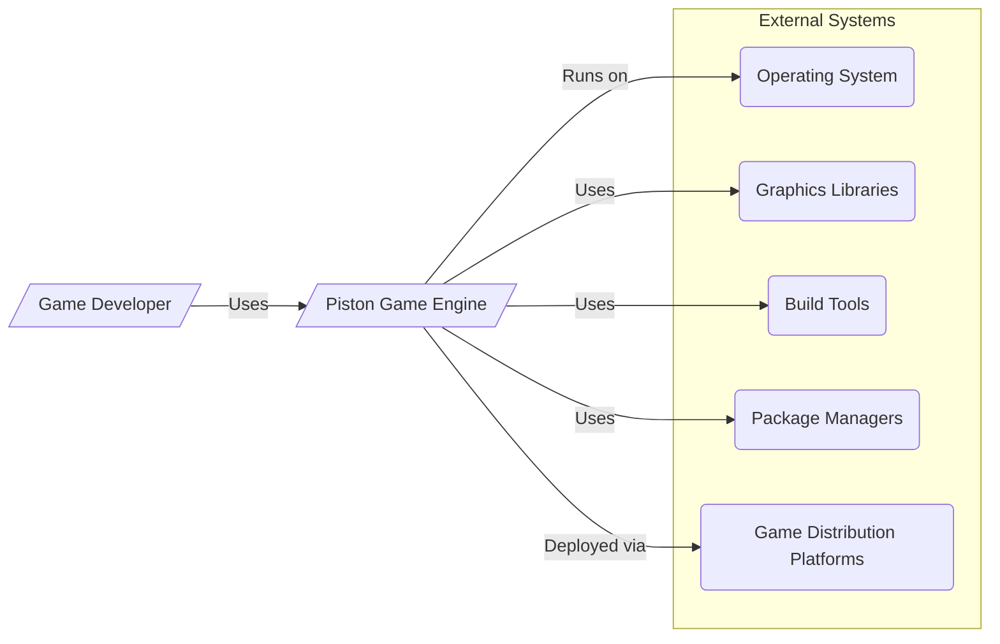
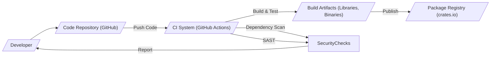

# BUSINESS POSTURE

The Piston Game Engine project aims to provide a modular, open-source 2D game engine written in Rust. Its primary goal is to empower game developers with a flexible and efficient toolset for creating games. The project prioritizes modularity and modern Rust practices, targeting developers who value control and performance in their game development process.

Business Priorities and Goals:
- Provide a robust and feature-rich 2D game engine.
- Foster an active and supportive open-source community around the engine.
- Encourage adoption of the engine by game developers for various projects.
- Maintain high code quality and performance.
- Offer a modular and extensible architecture.

Business Risks:
- Security vulnerabilities in the engine could lead to exploitation in games built with Piston, damaging the reputation of the engine and potentially affecting end-users.
- Lack of security awareness within the development community could result in insecure coding practices and vulnerabilities being introduced into the engine.
- Dependency vulnerabilities in third-party libraries used by Piston could be exploited.
- Inadequate input validation in the engine could lead to crashes or unexpected behavior in games.
- Insufficient security testing could result in vulnerabilities being missed before release.

# SECURITY POSTURE

Existing Security Controls:
- security control: GitHub repository with version control and history. (Implemented: GitHub)
- security control: Issue tracking system for reporting bugs and potential vulnerabilities. (Implemented: GitHub Issues)
- security control: Community contributions and peer review through pull requests. (Implemented: GitHub Pull Requests)
- security control: Basic automated testing as part of CI using GitHub Actions. (Implemented: GitHub Actions, see `.github/workflows` in repository)

Accepted Risks:
- accepted risk: Reliance on community contributions for security vulnerability identification and patching.
- accepted risk: Limited dedicated security expertise within the project.
- accepted risk: Potential for vulnerabilities to be present in dependencies.
- accepted risk: Security testing might be less comprehensive compared to commercial software.

Recommended Security Controls:
- recommended security control: Implement automated dependency scanning to identify and alert on vulnerable dependencies.
- recommended security control: Integrate static analysis security testing (SAST) tools into the CI pipeline to automatically detect potential code-level vulnerabilities.
- recommended security control: Introduce security focused code reviews, specifically looking for common vulnerability patterns.
- recommended security control: Establish a process for reporting and handling security vulnerabilities, including a security policy and contact information.
- recommended security control: Consider performing penetration testing or security audits, especially before major releases.

Security Requirements:
- Authentication: Not directly applicable to the game engine itself, as it's a library/framework. Authentication might be relevant for any associated services or websites (not part of this project scope).
- Authorization: Not directly applicable to the game engine itself. Authorization might be relevant in the context of game development tools built on top of Piston, but not within the engine core.
- Input Validation: Critical for all engine APIs that accept external input (e.g., file loading, network input, user input). All input from external sources must be validated to prevent crashes, unexpected behavior, and potential vulnerabilities like buffer overflows or injection attacks.
- Cryptography: May be required for game features like saving game state securely, implementing secure networking in games, or handling sensitive data within games built using Piston. If cryptography is used, it must be implemented correctly using well-vetted libraries and best practices to avoid vulnerabilities.

# DESIGN

## C4 CONTEXT



Context Diagram Elements:

- Element:
    - Name: Game Developer
    - Type: Person
    - Description: Software developers who use the Piston Game Engine to create games.
    - Responsibilities: Uses the Piston Game Engine to develop, build, and deploy games. Provides feedback and contributions to the Piston project.
    - Security controls: Responsible for secure coding practices in the games they develop using Piston.

- Element:
    - Name: Piston Game Engine
    - Type: Software System
    - Description: An open-source, modular 2D game engine written in Rust, providing libraries and tools for game development.
    - Responsibilities: Provides core game engine functionalities such as rendering, input handling, audio, and game logic management.  Offers APIs for game developers to build upon.
    - Security controls: Input validation on all external interfaces, secure coding practices within the engine codebase, dependency management, and security testing.

- Element:
    - Name: Operating System
    - Type: Software System
    - Description: The operating system (e.g., Windows, macOS, Linux, Android, iOS) on which the Piston Game Engine and games built with it run.
    - Responsibilities: Provides the runtime environment for the engine and games. Manages system resources and provides system-level security features.
    - Security controls: OS-level security controls such as access control, process isolation, and memory protection.

- Element:
    - Name: Graphics Libraries
    - Type: Software System
    - Description: Graphics libraries (e.g., OpenGL, Vulkan, DirectX) used by Piston for rendering graphics.
    - Responsibilities: Provides low-level graphics rendering capabilities.
    - Security controls: Security of graphics drivers and libraries is assumed to be managed by their respective vendors. Piston should use these libraries in a secure manner, avoiding deprecated or vulnerable functions.

- Element:
    - Name: Build Tools
    - Type: Software System
    - Description: Tools like Rust compiler (rustc), Cargo (Rust package manager), and other build utilities used to compile and build the Piston Game Engine and games.
    - Responsibilities: Compiles the source code into executable binaries and libraries. Manages dependencies.
    - Security controls: Ensuring the integrity and security of the build toolchain is crucial. Using trusted and updated versions of build tools.

- Element:
    - Name: Package Managers
    - Type: Software System
    - Description: Package managers like crates.io (for Rust dependencies) used to manage external libraries and dependencies of Piston.
    - Responsibilities: Provides a repository for external libraries and manages dependency resolution and downloading.
    - Security controls: Dependency scanning to identify vulnerable packages. Using reputable package repositories.

- Element:
    - Name: Game Distribution Platforms
    - Type: Software System
    - Description: Platforms (e.g., Steam, Itch.io, web browsers, app stores) used to distribute games built with Piston to end-users.
    - Responsibilities: Provides a platform for distributing and delivering games to players.
    - Security controls: Platform-specific security controls for game distribution and execution. Piston needs to ensure games built with it are compatible with platform security requirements.

## C4 CONTAINER

```mermaid
flowchart LR
    subgraph Piston Game Engine [/"Piston Game Engine"/]
        subgraph Core Modules
            RenderingEngine[/"Rendering Engine"/]
            InputHandling[/"Input Handling"/]
            AudioEngine[/"Audio Engine"/]
            ScriptingEngine[/"Scripting Engine"/]
            GameLogic[/"Game Logic Framework"/]
        end
        BuildTools[/"Build Tools & Examples"/]
        Documentation[/"Documentation"/]
    end

    GameDeveloper[/"Game Developer"/]

    GameDeveloper -- Uses --> RenderingEngine
    GameDeveloper -- Uses --> InputHandling
    GameDeveloper -- Uses --> AudioEngine
    GameDeveloper -- Uses --> ScriptingEngine
    GameDeveloper -- Uses --> GameLogic
    GameDeveloper -- Uses --> BuildTools
    GameDeveloper -- Reads --> Documentation

    RenderingEngine -- Uses --> GraphicsLibraries
    InputHandling -- Uses --> OperatingSystem
    AudioEngine -- Uses --> OperatingSystem
    ScriptingEngine -- Uses --> ScriptingLanguageRuntime
    GameLogic -- Relies on --> CoreModules

    subgraph External Containers
        GraphicsLibraries[/"Graphics Libraries (OpenGL, Vulkan, etc.)"/]
        OperatingSystem[/"Operating System APIs"/]
        ScriptingLanguageRuntime[/"Scripting Language Runtime (Optional)"/]
    end
```

Container Diagram Elements:

- Element:
    - Name: Piston Game Engine
    - Type: Software System
    - Description: The overall Piston Game Engine, encompassing all its modules, tools, and documentation.
    - Responsibilities: Provides a complete game development framework.
    - Security controls: Overall security posture of the engine, including secure development practices, dependency management, and testing.

- Element:
    - Name: Rendering Engine
    - Type: Container (Module)
    - Description: Responsible for rendering 2D and potentially 3D graphics. Interacts with graphics libraries.
    - Responsibilities: Graphics rendering, scene management, drawing primitives, texture management.
    - Security controls: Input validation for rendering commands and assets, secure usage of graphics library APIs to prevent vulnerabilities like shader injection or resource exhaustion.

- Element:
    - Name: Input Handling
    - Type: Container (Module)
    - Description: Handles user input from various sources (keyboard, mouse, gamepad, touch). Interacts with the operating system for input events.
    - Responsibilities: Input event processing, input mapping, input state management.
    - Security controls: Input validation to prevent injection attacks through input fields (if any), handling of potentially malicious input events gracefully.

- Element:
    - Name: Audio Engine
    - Type: Container (Module)
    - Description: Manages audio playback, sound effects, and music. Interacts with the operating system for audio output.
    - Responsibilities: Audio playback, sound mixing, audio resource management.
    - Security controls: Input validation for audio files and playback commands to prevent vulnerabilities like buffer overflows or format string bugs in audio processing.

- Element:
    - Name: Scripting Engine
    - Type: Container (Module)
    - Description: (Optional) Provides scripting capabilities for game logic, allowing developers to use scripting languages (e.g., Lua, Rhai) within their games.
    - Responsibilities: Script execution, API binding between script and engine, script management.
    - Security controls: Secure execution environment for scripts, preventing scripts from accessing unauthorized resources or performing malicious actions. Input validation for script inputs.

- Element:
    - Name: Game Logic Framework
    - Type: Container (Module)
    - Description: Provides a framework and utilities for structuring game logic, managing game states, and implementing game rules.
    - Responsibilities: Game state management, scene management, entity-component system (if applicable), game loop management.
    - Security controls: Secure design of game logic framework to prevent logical vulnerabilities in games built with Piston.

- Element:
    - Name: Build Tools & Examples
    - Type: Container (Tools & Resources)
    - Description: Includes build scripts, example projects, and utilities to help developers build and use the Piston Game Engine.
    - Responsibilities: Build process automation, providing examples and templates for game development.
    - Security controls: Ensuring build scripts are secure and do not introduce vulnerabilities. Examples should demonstrate secure coding practices.

- Element:
    - Name: Documentation
    - Type: Container (Documentation)
    - Description: User manuals, API documentation, tutorials, and other documentation for the Piston Game Engine.
    - Responsibilities: Providing comprehensive documentation for developers.
    - Security controls: Documentation should include security considerations and best practices for using the engine securely.

## DEPLOYMENT

Deployment Scenario: Developer Environment

```mermaid
flowchart LR
    subgraph Developer Machine [/"Developer Machine"/]
        Developer[/"Game Developer"/]
        PistonDevEnv[/"Piston Engine (Development Environment)"/]
        CodeEditor[/"Code Editor (VS Code, etc.)"/]
        RustToolchain[/"Rust Toolchain (rustc, cargo)"/]
        OperatingSystem[/"Operating System (Windows, macOS, Linux)"/]
    end

    Developer -- Uses --> CodeEditor
    Developer -- Uses --> RustToolchain
    CodeEditor -- Uses --> PistonDevEnv
    RustToolchain -- Builds --> PistonDevEnv
    PistonDevEnv -- Runs on --> OperatingSystem
```

Deployment Diagram Elements (Developer Environment):

- Element:
    - Name: Developer Machine
    - Type: Infrastructure (Physical/Virtual Machine)
    - Description: The local computer used by a game developer to develop games with Piston.
    - Responsibilities: Provides the environment for development, coding, building, and testing games.
    - Security controls: Developer machine security controls are the responsibility of the developer. This includes OS security, antivirus, firewall, and secure coding practices.

- Element:
    - Name: Game Developer
    - Type: Person
    - Description: The software developer using the development environment.
    - Responsibilities: Writing code, building games, testing, and managing the development environment.
    - Security controls: Secure coding practices, protecting development credentials, and maintaining the security of their development machine.

- Element:
    - Name: Piston Engine (Development Environment)
    - Type: Software System (Development Instance)
    - Description: The Piston Game Engine libraries and tools installed and configured on the developer's machine for development purposes.
    - Responsibilities: Providing the game engine functionalities for development and testing.
    - Security controls: Security of the engine source code, dependencies, and build process.

- Element:
    - Name: Code Editor (VS Code, etc.)
    - Type: Software Application
    - Description: The code editor used by the developer to write and edit game code.
    - Responsibilities: Code editing, debugging, and integration with development tools.
    - Security controls: Code editor security features, extensions security, and secure handling of project files.

- Element:
    - Name: Rust Toolchain (rustc, cargo)
    - Type: Software System (Development Tools)
    - Description: The Rust programming language toolchain used to compile and build Piston and games.
    - Responsibilities: Compiling Rust code, managing dependencies, and building executables.
    - Security controls: Ensuring the integrity and security of the Rust toolchain. Using trusted and updated versions.

- Element:
    - Name: Operating System (Windows, macOS, Linux)
    - Type: Software System
    - Description: The operating system running on the developer machine.
    - Responsibilities: Providing the runtime environment for development tools and the engine.
    - Security controls: OS-level security controls on the developer machine.

## BUILD



Build Process Diagram Elements:

- Element:
    - Name: Developer
    - Type: Person
    - Description: A developer contributing to the Piston Game Engine project.
    - Responsibilities: Writes code, fixes bugs, and contributes features to the project.
    - Security controls: Secure coding practices, code review participation, and adherence to project security guidelines.

- Element:
    - Name: Code Repository (GitHub)
    - Type: Software System (Version Control)
    - Description: GitHub repository hosting the Piston Game Engine source code.
    - Responsibilities: Version control, code storage, collaboration platform, and triggering CI/CD pipelines.
    - Security controls: Access control to the repository, branch protection, and audit logs.

- Element:
    - Name: CI System (GitHub Actions)
    - Type: Software System (Build Automation)
    - Description: GitHub Actions used for continuous integration and build automation.
    - Responsibilities: Automated building, testing, security checks (dependency scanning, SAST), and publishing of build artifacts.
    - Security controls: Secure configuration of CI pipelines, secrets management, and access control to CI workflows.

- Element:
    - Name: Build Artifacts (Libraries, Binaries)
    - Type: Data (Software Packages)
    - Description: Compiled libraries and binaries of the Piston Game Engine produced by the build process.
    - Responsibilities: Distributable components of the engine for developers to use.
    - Security controls: Integrity checks of build artifacts, signing of artifacts (if applicable), and secure storage.

- Element:
    - Name: Security Checks
    - Type: Software System (Security Tools)
    - Description: Automated security checks performed during the build process, including dependency scanning and Static Application Security Testing (SAST).
    - Responsibilities: Identifying potential security vulnerabilities in dependencies and code.
    - Security controls: Configuration and maintenance of security scanning tools, vulnerability reporting, and integration with the CI pipeline.

- Element:
    - Name: Package Registry (crates.io)
    - Type: Software System (Package Distribution)
    - Description: crates.io, the Rust package registry, used to publish Piston Game Engine libraries for developers to download and use.
    - Responsibilities: Hosting and distributing Piston packages to the Rust developer community.
    - Security controls: Package integrity checks, vulnerability scanning of published packages, and account security for publishing.

# RISK ASSESSMENT

Critical Business Processes to Protect:
- Providing a functional and reliable game engine: The core business process is to ensure the engine works as expected and is free from critical bugs and vulnerabilities that could prevent developers from using it effectively or lead to issues in games built with it.
- Maintaining the integrity of the engine codebase: Protecting the source code from unauthorized modifications or malicious insertions is crucial to ensure the engine remains trustworthy and secure.
- Ensuring the availability of the engine: The engine and its documentation should be accessible to developers when needed.

Data to Protect and Sensitivity:
- Source code of the Piston Game Engine: High sensitivity. Intellectual property and potential vulnerabilities are exposed if compromised.
- Build artifacts (libraries, binaries): Medium sensitivity. Compromised build artifacts could be distributed to developers, potentially introducing vulnerabilities into their games.
- Project documentation: Low to medium sensitivity. Documentation vulnerabilities could mislead developers or expose non-critical information.
- Developer accounts and credentials: High sensitivity. Compromised developer accounts could lead to unauthorized code changes or malicious actions.

# QUESTIONS & ASSUMPTIONS

Questions:
- What is the process for reporting and handling security vulnerabilities in Piston? Is there a security policy or dedicated contact?
- Are there any plans to implement more advanced security testing, such as penetration testing or security audits?
- What is the strategy for managing dependencies and ensuring they are free from vulnerabilities?
- Are there any specific security requirements or compliance standards that Piston needs to adhere to (e.g., for game distribution platforms)?
- Is there a formal security awareness training for contributors to the project?

Assumptions:
- The primary users of Piston are game developers who are building 2D games.
- The project is open-source and community-driven, relying on community contributions for development and security.
- The project uses GitHub for version control, issue tracking, and CI/CD.
- Security is considered important for the project, but resources and expertise might be limited due to its open-source nature.
- The deployment environment primarily considered is the developer's local machine for development and testing. Games built with Piston are deployed to various platforms by game developers, which is outside the direct scope of the engine's deployment.