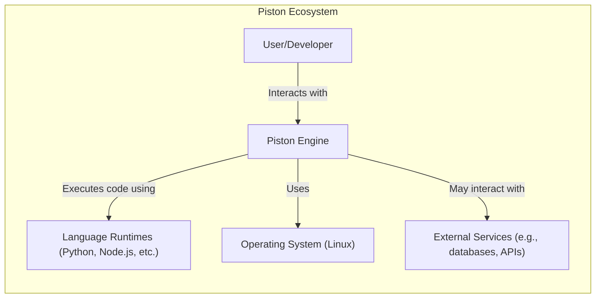
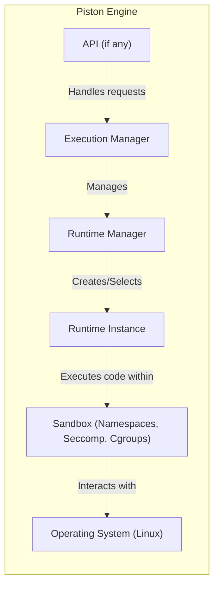
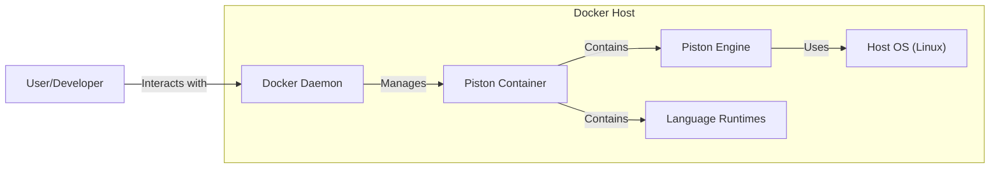
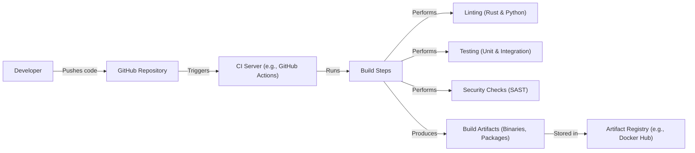

Okay, let's create a design document for the Piston project, focusing on aspects relevant for threat modeling.

# BUSINESS POSTURE

Piston is an open-source project that provides a high-speed general purpose code execution engine.  It appears to be aimed at developers and organizations who need to run untrusted code in a sandboxed environment.  The primary business goals seem to be:

*   Provide a reliable and secure code execution environment.
*   Offer high performance for fast code execution.
*   Support multiple programming languages.
*   Maintain an open-source and community-driven development model.
*   Potentially, to be integrated into other products or services that require code execution capabilities (e.g., online coding platforms, automated testing systems, serverless functions).

Business priorities:

*   Security: Preventing malicious code from escaping the sandbox and affecting the host system is paramount. This is the core value proposition.
*   Performance:  The engine must be fast and efficient to be competitive and useful.
*   Reliability:  The engine should consistently produce correct results and handle errors gracefully.
*   Maintainability:  The codebase should be easy to understand, modify, and extend.
*   Portability: Support various operating systems and architectures.

Most important business risks:

*   Sandbox Escape:  A vulnerability allowing code to break out of the sandbox and compromise the host system. This is the highest risk.
*   Denial of Service (DoS):  Malicious code could consume excessive resources (CPU, memory, disk), making the engine or the host system unavailable.
*   Data Leakage:  Sensitive information (if any is processed by the engine) could be leaked by malicious code.
*   Incorrect Results:  The engine might produce incorrect output due to bugs or vulnerabilities, leading to incorrect behavior in systems that rely on it.
*   Supply Chain Attacks: Compromised dependencies or build processes could introduce vulnerabilities.
*   Reputational Damage:  Security incidents or major bugs could damage the project's reputation and adoption.

# SECURITY POSTURE

Existing security controls (based on the GitHub repository):

*   security control: Sandboxing (Namespaces, Seccomp, Resource Limits): The core of Piston's security relies on Linux namespaces (mount, UTS, IPC, PID, network, user, cgroup), seccomp filters, and resource limits (cgroups) to isolate executed code. Implemented in the `runtimes` and execution logic.
*   security control: Language-Specific Security Measures: Some language runtimes may have additional security features (e.g., Python's restricted execution mode). Implemented within individual runtime configurations.
*   security control: Regular Dependency Updates: The project appears to use dependency management tools (e.g., `poetry` for Python) to keep dependencies updated.  Observed in the project's dependency files.
*   security control: Code Reviews: As an open-source project, code reviews are likely part of the development process, although the rigor is not explicitly stated. Implemented through the GitHub pull request process.
*   security control: Limited Network Access: The default configuration appears to restrict network access for executed code, although this can be configured. Implemented via network namespaces.

Accepted risks:

*   accepted risk: Zero-Day Exploits:  There's always a risk of unknown vulnerabilities in the Linux kernel, libraries, or Piston itself that could allow sandbox escape.
*   accepted risk: Complex Configuration:  Incorrect configuration of runtimes or security parameters could weaken the sandbox.
*   accepted risk: Side-Channel Attacks:  While unlikely, sophisticated attacks might exploit side channels (e.g., timing differences) to leak information.
*   accepted risk: Reliance on External Runtimes: The security of Piston depends on the security of the underlying language runtimes (e.g., Python, Node.js, etc.).

Recommended security controls:

*   Implement a comprehensive test suite that specifically targets security vulnerabilities (e.g., fuzzing, penetration testing).
*   Establish a clear security policy and vulnerability disclosure process.
*   Consider using a more robust sandboxing technology like gVisor or Kata Containers for enhanced isolation, if performance trade-offs are acceptable.
*   Implement Security Audits: Regular security audits by external experts.
*   Implement Static Analysis: Integrate static analysis tools (SAST) into the build process to identify potential vulnerabilities early.
*   Implement Dynamic Analysis: Use dynamic analysis tools (DAST) during testing to detect runtime vulnerabilities.

Security Requirements:

*   Authentication: Not directly applicable to the core engine, but relevant if Piston is integrated into a larger system with user accounts.  If authentication is needed, it should use strong, industry-standard methods (e.g., OAuth 2.0, OpenID Connect).
*   Authorization: If Piston is used to execute code on behalf of different users or with different privileges, a robust authorization mechanism is needed to control access to resources and capabilities. This might involve defining roles and permissions for executed code.
*   Input Validation:  The engine should carefully validate any input provided to it, including code to be executed, configuration parameters, and any data passed to the executed code. This is crucial to prevent injection attacks and other vulnerabilities. Input validation should be performed at the API level (if any) and before passing data to runtimes.
*   Cryptography: If Piston handles sensitive data, appropriate cryptographic techniques should be used to protect it. This might include encrypting data at rest and in transit, using secure hash functions, and managing cryptographic keys securely.  Specific needs depend on the use case.
*   Output Encoding: If Piston returns output from executed code, it should be properly encoded to prevent cross-site scripting (XSS) or other injection vulnerabilities in applications that consume the output.

# DESIGN

## C4 CONTEXT

Element Descriptions:

*   Element:
    *   Name: User/Developer
    *   Type: Person
    *   Description: A person who uses Piston to execute code, either directly or through an application that integrates Piston.
    *   Responsibilities: Provides code to be executed, configures Piston, and consumes the results.
    *   Security controls: Authentication and authorization (if part of a larger system), input validation (of code and data).

*   Element:
    *   Name: Piston Engine
    *   Type: Software System
    *   Description: The core code execution engine.
    *   Responsibilities: Manages the execution of code in a sandboxed environment, handles input and output, enforces security policies.
    *   Security controls: Sandboxing (namespaces, seccomp, cgroups), resource limits, input validation, runtime configuration.

*   Element:
    *   Name: Language Runtimes (Python, Node.js, etc.)
    *   Type: Software System
    *   Description: The specific language runtimes used to execute code (e.g., Python interpreter, Node.js runtime).
    *   Responsibilities: Executes code in a specific language.
    *   Security controls: Language-specific security features, regular updates to address vulnerabilities.

*   Element:
    *   Name: Operating System (Linux)
    *   Type: Software System
    *   Description: The underlying operating system (primarily Linux) that provides the core sandboxing capabilities.
    *   Responsibilities: Provides kernel-level isolation mechanisms (namespaces, seccomp, cgroups).
    *   Security controls: Kernel security features, regular security updates.

*   Element:
    *   Name: External Services (e.g., databases, APIs)
    *   Type: Software System
    *   Description: External services that the executed code might interact with (if network access is permitted).
    *   Responsibilities: Varies depending on the service.
    *   Security controls: Authentication, authorization, encryption, input validation (specific to each service).

## C4 CONTAINER

Element Descriptions:

*   Element:
    *   Name: API (if any)
    *   Type: API
    *   Description: An optional API for interacting with Piston.
    *   Responsibilities: Receives requests to execute code, validates input, returns results.
    *   Security controls: Input validation, authentication, authorization, rate limiting.

*   Element:
    *   Name: Execution Manager
    *   Type: Component
    *   Description: The main component that orchestrates code execution.
    *   Responsibilities: Receives execution requests, selects the appropriate runtime, manages the lifecycle of runtime instances, handles input/output.
    *   Security controls: Input validation, configuration management, error handling.

*   Element:
    *   Name: Runtime Manager
    *   Type: Component
    *   Description: Manages the available language runtimes.
    *   Responsibilities: Loads, configures, and manages runtime instances.
    *   Security controls: Runtime configuration, dependency management.

*   Element:
    *   Name: Runtime Instance
    *   Type: Component
    *   Description: A specific instance of a language runtime (e.g., a Python interpreter).
    *   Responsibilities: Executes code in a specific language.
    *   Security controls: Language-specific security features.

*   Element:
    *   Name: Sandbox (Namespaces, Seccomp, Cgroups)
    *   Type: Container
    *   Description: The isolated environment where code is executed.
    *   Responsibilities: Isolates the executed code from the host system.
    *   Security controls: Linux namespaces, seccomp filters, cgroups resource limits.

*   Element:
    *   Name: Operating System (Linux)
    *   Type: Software System
    *   Description: The underlying operating system.
    *   Responsibilities: Provides kernel-level isolation mechanisms.
    *   Security controls: Kernel security features.

## DEPLOYMENT

Piston can be deployed in several ways:

1.  **Direct Installation:** Installing Piston directly on a host machine (e.g., a server or virtual machine) using package managers or from source.
2.  **Docker Container:** Running Piston within a Docker container. This provides an additional layer of isolation.
3.  **Kubernetes:** Deploying Piston as part of a Kubernetes cluster, potentially using a custom controller to manage code execution.
4.  **Serverless Platforms:** Integrating Piston with serverless platforms (e.g., AWS Lambda, Google Cloud Functions) to provide custom runtimes.

We'll describe the **Docker Container** deployment in detail:

Element Descriptions:

*    Element:
    *   Name: Docker Host
    *   Type: Infrastructure Node
    *   Description: Physical or Virtual machine that runs Docker.
    *   Responsibilities: Provides resources for Docker.
    *   Security controls: OS hardening, firewall.

*   Element:
    *   Name: Docker Daemon
    *   Type: Software System
    *   Description: The Docker daemon that manages containers.
    *   Responsibilities: Creates, runs, and manages Docker containers.
    *   Security controls: Docker security best practices, access control.

*   Element:
    *   Name: Piston Container
    *   Type: Container
    *   Description: The Docker container running the Piston engine and runtimes.
    *   Responsibilities: Provides an isolated environment for Piston.
    *   Security controls: Docker security context, resource limits, read-only filesystem (if possible).

*   Element:
    *   Name: Piston Engine
    *   Type: Software System
    *   Description: The Piston engine running inside the container.
    *   Responsibilities: Same as described above.
    *   Security controls: Same as described above.

*   Element:
    *   Name: Language Runtimes
    *   Type: Software System
    *   Description: The language runtimes inside the container.
    *   Responsibilities: Same as described above.
    *   Security controls: Same as described above.

*   Element:
    *   Name: Host OS (Linux)
    *   Type: Software System
    *   Description: The host operating system.
    *   Responsibilities: Provides the underlying kernel and resources.
    *   Security controls: Kernel security features, regular updates.
*   Element:
    *   Name: User/Developer
    *   Type: Person
    *   Description: Interacts with Docker to manage Piston container.
    *   Responsibilities: Provides code to be executed, configures Piston, and consumes the results.
    *   Security controls: Authentication and authorization (if part of a larger system), input validation (of code and data).

## BUILD

The Piston build process appears to involve multiple languages (primarily Rust and Python).  A simplified build process is described below, assuming a CI environment like GitHub Actions:

Build Process Description:

1.  **Code Push:** A developer pushes code changes to the GitHub repository.
2.  **CI Trigger:** The CI server (e.g., GitHub Actions) is triggered by the code push.
3.  **Build Steps:** The CI server executes a series of build steps:
    *   **Linting:** Code linters (e.g., `clippy` for Rust, `flake8` for Python) are run to check for code style and potential errors.
    *   **Testing:** Unit and integration tests are executed to verify the functionality of the code.
    *   **Security Checks:** Static analysis security testing (SAST) tools (e.g., `cargo audit` for Rust, `bandit` for Python) are run to identify potential security vulnerabilities.
4.  **Artifact Creation:** If all build steps are successful, build artifacts (e.g., binaries, packages, Docker images) are created.
5.  **Artifact Storage:** The build artifacts are stored in an artifact registry (e.g., Docker Hub, a private registry).

Security Controls in Build Process:

*   security control: Linting: Enforces code style and helps prevent common errors.
*   security control: Testing: Verifies functionality and helps catch bugs early.
*   security control: SAST: Identifies potential security vulnerabilities in the code.
*   security control: Dependency Management: Tools like `poetry` and `cargo` help manage dependencies and ensure they are up-to-date.
*   security control: CI/CD Pipeline: Automates the build process and ensures consistency.
*   security control: Code Review: Required before merging into main branch.

# RISK ASSESSMENT

*   **Critical Business Processes:** The critical business process is the secure and reliable execution of untrusted code. This enables various use cases, such as online coding platforms, automated testing, and serverless functions.
*   **Data Sensitivity:**
    *   **Code:** The code executed by Piston is considered highly sensitive, as it is untrusted and potentially malicious.
    *   **Configuration:** Piston's configuration data (e.g., runtime settings, resource limits) is moderately sensitive, as incorrect configuration could weaken security.
    *   **Input/Output Data:** The sensitivity of data passed to and from the executed code depends on the specific use case. It could range from non-sensitive (e.g., public code examples) to highly sensitive (e.g., user data, API keys).
    *   **Logs:** Piston's logs may contain moderately sensitive information, such as code snippets, error messages, and resource usage data.

# QUESTIONS & ASSUMPTIONS

*   **Questions:**
    *   What is the expected threat model? (e.g., Who are the potential attackers? What are their motivations and capabilities?)
    *   What are the specific performance requirements? (e.g., What is the acceptable latency for code execution?)
    *   What are the specific availability requirements? (e.g., What is the acceptable downtime?)
    *   Are there any specific compliance requirements? (e.g., GDPR, HIPAA)
    *   What level of logging and auditing is required?
    *   What is the process for handling security vulnerabilities?
    *   How are secrets (e.g., API keys) managed if they are needed by the executed code?
    *   What is the long-term maintenance plan for the project?

*   **Assumptions:**
    *   The primary operating system is Linux.
    *   The developers have a good understanding of security best practices.
    *   The project is actively maintained and updated.
    *   The users of Piston are responsible for securing the environment in which it is deployed.
    *   The users of Piston are responsible for validating the input they provide to the engine.
    *   The project aims for a balance between security and performance.
    *   Network access for executed code is restricted by default.
    *   The build process is automated and includes security checks.
    *   Docker is used for containerization.