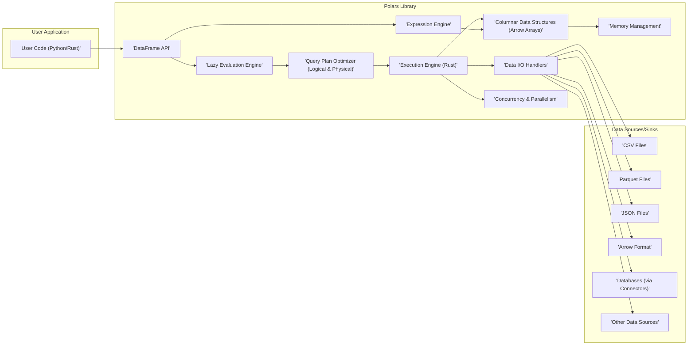
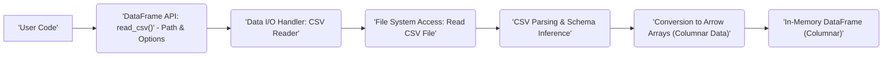
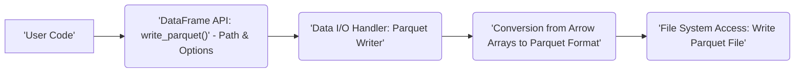

# Project Design Document: Polars DataFrame Library

**Version:** 1.1
**Date:** October 26, 2023
**Author:** AI Software Architect

## 1. Introduction

This document provides an enhanced architectural design of the Polars DataFrame library. Polars is an open-source DataFrame library implemented in Rust, renowned for its performance and memory efficiency. This revised document offers a more detailed exploration of its core components, data flow mechanisms, and architectural nuances, specifically refined for subsequent threat modeling exercises. The aim is to provide a robust and comprehensive understanding of the system's inner workings.

## 2. Goals and Objectives

The primary goals of this enhanced design document are:

*   To provide a more granular and precise articulation of the Polars library's architecture.
*   To offer deeper insights into the responsibilities and interactions of key components.
*   To meticulously describe the data flow within the library, highlighting critical stages.
*   To establish a stronger foundation for identifying potential security vulnerabilities and attack vectors during subsequent threat modeling activities.
*   To serve as an improved and more detailed reference for developers, security analysts, and anyone seeking a thorough understanding of Polars' design.

## 3. System Architecture

Polars is architected for high-performance, supporting both in-memory and out-of-core DataFrame processing. Its design prioritizes parallelism, efficient memory utilization, and extensibility.

### 3.1. High-Level Architecture Diagram

### 3.2. Component Description

*   **'User Code (Python/Rust)':** Represents the user's application code that interacts with the Polars library through its provided APIs (both Python and Rust). This is the entry point for all Polars operations.
*   **'DataFrame API':** This is the primary user-facing interface, offering methods for DataFrame creation, manipulation (filtering, selection, aggregation, joins), and querying. It acts as a facade, abstracting the underlying complexity.
*   **'Lazy Evaluation Engine':**  A core optimization component. Instead of executing operations immediately, it builds a logical representation of the query plan. This allows for optimizations before execution.
*   **'Query Plan Optimizer (Logical & Physical)':** This component takes the logical query plan and applies optimizations.
    *   **Logical Optimization:**  Rewrites the logical plan for efficiency (e.g., predicate pushdown, projection pushdown).
    *   **Physical Optimization:** Determines the most efficient physical execution strategy, considering factors like data partitioning and available parallelism.
*   **'Execution Engine (Rust)':** The heart of Polars, implemented in Rust for performance and memory safety. It executes the optimized physical plan, leveraging multi-threading and SIMD instructions.
*   **'Data I/O Handlers':** Responsible for reading data from and writing data to various file formats and external data sources.
    *   Specific handlers exist for formats like CSV, Parquet, JSON, and Arrow.
    *   Database connectors (e.g., for PostgreSQL, MySQL) also fall under this category. These handlers manage parsing, serialization, and data format conversions.
*   **'Expression Engine':**  Handles the evaluation of expressions within DataFrame operations. This includes arithmetic operations, logical comparisons, string manipulations, and more complex custom functions.
*   **'Columnar Data Structures (Arrow Arrays)':** Polars utilizes the Apache Arrow format for its in-memory columnar data representation. This provides efficient memory layout and interoperability with other Arrow-based systems.
*   **'Memory Management':**  Polars employs careful memory management techniques to minimize memory usage and avoid unnecessary copying. This includes techniques like zero-copy reads where possible.
*   **'Concurrency & Parallelism':** Polars is designed for parallel execution. This component manages the distribution of tasks across multiple threads to accelerate processing.

## 4. Data Flow

The data flow within Polars can be broken down into distinct stages, depending on the operation being performed.

### 4.1. Data Flow Diagram (Read Operation from CSV)

### 4.2. Data Flow Diagram (DataFrame Filtering Operation - Lazy)

```mermaid
graph LR
    A["'User Code'"] --> B("'DataFrame API: lazy().filter(condition)'");
    B --> C("'Lazy Evaluation Engine: Build Logical Plan Node (Filter)'");
    C --> D("'Query Plan Optimizer: Logical Optimization'");
    D --> E("'Query Plan Optimizer: Physical Optimization'");
    E --> F("'Execution Engine: Execute Filter Operation on Columnar Data'");
    F --> G("'Expression Engine: Evaluate Filter Condition'");
    G --> H("'Columnar Data Structures: Apply Filter Mask'");
    H --> I("'Resulting Filtered DataFrame (Lazy)'");
```

### 4.3. Data Flow Diagram (DataFrame Write Operation to Parquet)

## 5. Security Considerations (Detailed)

This section provides a more detailed examination of potential security considerations, linking them directly to specific components and data flow stages.

*   **Data Injection Vulnerabilities (Input Validation):**
    *   **Relevant Components:** 'Data I/O Handlers' (CSV Reader, JSON Reader, etc.), 'DataFrame API'.
    *   **Risk:** Maliciously crafted data in input files (CSV, JSON, etc.) could exploit parsing vulnerabilities in the 'Data I/O Handlers', leading to crashes, unexpected behavior, or potentially code execution if vulnerabilities exist in the underlying parsing libraries. Insufficient validation in the 'DataFrame API' when accepting user-provided data or options could also introduce risks.
    *   **Mitigation:** Implement robust input validation and sanitization within the 'Data I/O Handlers'. Utilize well-vetted and secure parsing libraries. Sanitize user inputs in the 'DataFrame API'.
*   **Denial of Service (DoS) through Resource Exhaustion:**
    *   **Relevant Components:** 'Execution Engine', 'Memory Management', 'Data I/O Handlers'.
    *   **Risk:** Processing extremely large or specially crafted datasets could consume excessive memory or CPU resources, leading to DoS. Inefficient query plans that are not adequately optimized by the 'Query Plan Optimizer' could exacerbate this. Reading very large files without proper chunking in 'Data I/O Handlers' could also lead to memory exhaustion.
    *   **Mitigation:** Implement resource limits and monitoring within the 'Execution Engine' and 'Memory Management'. Improve the 'Query Plan Optimizer' to handle edge cases and prevent inefficient plans. Implement chunking and streaming for large data I/O operations.
*   **Dependency Vulnerabilities:**
    *   **Relevant Components:** Entire 'Polars Library'.
    *   **Risk:** Polars relies on various external Rust crates (dependencies). Vulnerabilities in these dependencies could be exploited to compromise Polars.
    *   **Mitigation:** Regularly audit and update dependencies. Utilize tools for dependency vulnerability scanning. Employ Software Bill of Materials (SBOM) practices.
*   **Information Disclosure through Error Handling:**
    *   **Relevant Components:** All components, especially 'Execution Engine' and 'Data I/O Handlers'.
    *   **Risk:** Verbose error messages or stack traces could inadvertently reveal sensitive information about the system's internal state, data, or file paths.
    *   **Mitigation:** Implement secure error handling practices. Avoid exposing sensitive information in error messages. Log errors securely and separately.
*   **Code Execution through Unsafe Code (Though Less Likely in Rust):**
    *   **Relevant Components:** 'Execution Engine', potentially 'Data I/O Handlers' if using custom parsing.
    *   **Risk:** While Rust's memory safety features mitigate many code execution risks, the use of `unsafe` blocks requires careful scrutiny. Vulnerabilities within these blocks or in external C libraries linked to Polars could potentially lead to arbitrary code execution.
    *   **Mitigation:** Minimize the use of `unsafe` code. Thoroughly audit any `unsafe` blocks. Securely manage any external library integrations.
*   **Insecure Deserialization (If Applicable):**
    *   **Relevant Components:** 'Data I/O Handlers' if handling serialized data formats beyond standard CSV/JSON/Parquet.
    *   **Risk:** If Polars were to handle deserialization of arbitrary data formats (e.g., pickle in Python), vulnerabilities in the deserialization process could lead to code execution.
    *   **Mitigation:** Avoid insecure deserialization methods. If necessary, use safe and well-vetted deserialization libraries with strict controls.
*   **Lack of Access Control (Deployment Context):**
    *   **Relevant Components:**  Integration points with external systems (e.g., database connectors in 'Data I/O Handlers').
    *   **Risk:** If Polars is used to access sensitive data sources (databases, cloud storage), inadequate authentication and authorization mechanisms could lead to unauthorized data access. This is more of a concern in the deployment environment.
    *   **Mitigation:** Ensure proper authentication and authorization are implemented when connecting to external data sources. Utilize secure connection protocols.

## 6. Deployment Considerations (Security Focused)

The security implications of deploying Polars vary depending on the environment:

*   **Local Machine:**
    *   **Security Focus:** Primarily concerns the security of the user's machine and the integrity of local data sources. Ensure data files are protected with appropriate permissions.
    *   **Threats:** Malicious local files, compromised user account.
*   **Server Environment:**
    *   **Security Focus:** Requires robust security measures, including access control (who can run scripts using Polars), network security (if accessing remote data), and secure storage for data.
    *   **Threats:** Unauthorized access to the server, network attacks, data breaches.
*   **Cloud Environment:**
    *   **Security Focus:** Leverages cloud provider security features (IAM roles, security groups, encryption). Secure configuration of cloud storage services is crucial.
    *   **Threats:** Misconfigured cloud resources, compromised cloud accounts, data breaches in cloud storage.

## 7. Future Considerations (Security Implications)

*   **Plugin System for Data Sources/Formats:** If Polars introduces a plugin system, security vulnerabilities in third-party plugins could pose a risk. A robust plugin security model with sandboxing or code signing would be necessary.
*   **Remote Execution/Distributed Processing:**  Introducing features for distributed processing would necessitate addressing security concerns related to network communication (encryption, authentication), node authorization, and secure data transfer between nodes.
*   **User-Defined Functions (UDFs) in Expressions:** Allowing users to define custom functions within expressions could introduce code injection risks if not properly sandboxed or validated.

This enhanced design document provides a more detailed and security-focused understanding of the Polars architecture, serving as a stronger foundation for subsequent threat modeling activities. The detailed component descriptions, data flow diagrams, and security considerations aim to provide a comprehensive view of the system's potential attack surfaces.