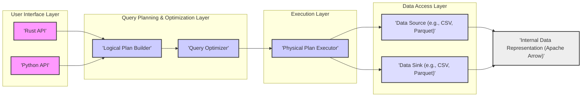
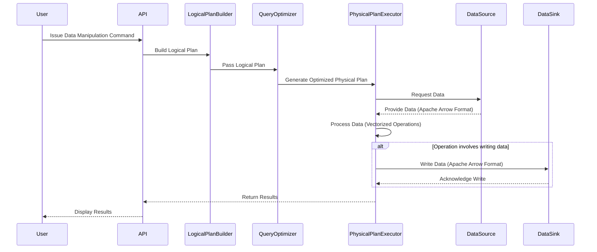

# Project Design Document: Polars Data Analysis Library

**Version:** 1.1
**Date:** October 26, 2023
**Author:** Gemini (AI Language Model)

## 1. Introduction

This document provides an enhanced and more detailed design overview of the Polars data analysis library. Polars is an open-source DataFrame library implemented in Rust, renowned for its high performance and efficiency in data manipulation and analysis. This document aims to provide a deeper understanding of the key architectural components, data flow intricacies, and the underlying technologies that power Polars. It serves as a robust foundation for future threat modeling activities, enabling a more precise identification of potential security vulnerabilities.

## 2. Goals and Objectives

*   Deliver a more granular and comprehensive architectural overview of the Polars library.
*   Elaborate on the key components, their specific responsibilities, and the nuances of their interactions within the system.
*   Provide a detailed description of the data flow, including various scenarios and potential pathways.
*   Offer a more exhaustive list of the technologies, libraries, and dependencies employed by Polars.
*   Strengthen the foundation for identifying potential security vulnerabilities by providing a more detailed architectural context for threat modeling.

## 3. High-Level Architecture

Polars is designed with a layered architecture, emphasizing performance and efficiency. The core is implemented in Rust, ensuring memory safety and speed, with carefully crafted bindings for languages like Python to broaden its accessibility.

**Components:**

*   **User Interface Layer (Python/Rust API):**
    *   Serves as the primary entry point for users to interact with the Polars library.
    *   Provides a user-friendly interface for constructing and executing data manipulation operations.
    *   Includes a comprehensive set of functions for DataFrame creation, data transformation, and querying.
    *   Responsible for initial input validation and translating user requests into an intermediate representation.
*   **Query Planning & Optimization Layer:**
    *   **Logical Plan Builder:** Transforms user commands from the API into a declarative logical plan. This plan outlines *what* operations need to be performed without specifying *how*.
    *   **Query Optimizer:** Analyzes the logical plan to identify opportunities for performance enhancement. It applies various optimization techniques to reorder and transform the plan into a more efficient physical plan.
*   **Execution Layer:**
    *   **Physical Plan Executor:** Takes the optimized physical plan and orchestrates its execution. This involves dispatching tasks, managing data flow, and coordinating with the Data Access Layer. It leverages multi-threading and vectorized operations for parallel processing.
*   **Data Access Layer:**
    *   **Data Source (e.g., CSV, Parquet):** Handles the reading of data from various external sources. This includes file systems, cloud storage, and potentially databases. It manages parsing, schema inference, and data conversion into Polars' internal representation.
    *   **Data Sink (e.g., CSV, Parquet):** Manages the writing of processed data to external destinations. It handles data formatting, serialization, and interaction with the underlying storage mechanism.
*   **Internal Data Representation (Apache Arrow):**
    *   Polars leverages Apache Arrow as its in-memory columnar data format. This provides significant performance benefits due to efficient memory layout and vectorized operations.

## 4. Component Details

This section delves deeper into the functionality and key considerations for each component.

### 4.1. User Interface Layer (Python/Rust API)

*   **Functionality:**
    *   DataFrame construction from diverse sources (in-memory data structures, files, network streams).
    *   A rich set of data manipulation verbs (filtering, selection, aggregation, sorting, joining, window functions).
    *   Lazy and eager execution modes, offering flexibility in query planning and execution.
    *   Data serialization and deserialization to various formats.
    *   Error handling and propagation to the user.
*   **Implementation:**
    *   The Python API is built on top of the Rust core using libraries like PyO3, enabling efficient communication between the two languages.
    *   The Rust API provides direct access to the underlying Polars functionality, offering maximum performance.
*   **Key Considerations:**
    *   Robust input validation to prevent unexpected behavior or security vulnerabilities arising from malformed input.
    *   Clear and informative error messages to aid debugging.
    *   Secure handling of user-provided credentials or sensitive data when interacting with external resources.

### 4.2. Query Planning & Optimization Layer

*   **4.2.1. Logical Plan Builder:**
    *   **Functionality:**
        *   Parses user commands and constructs a logical representation of the data operations.
        *   Represents operations as nodes in a directed acyclic graph (DAG).
        *   Maintains metadata about the data being processed, including schema and data types.
    *   **Implementation:**
        *   Utilizes data structures to represent the logical plan, such as expression trees and operator nodes.
        *   Involves mapping API calls to corresponding logical plan operators.
    *   **Key Considerations:**
        *   Ensuring the logical plan accurately reflects the user's intent.
        *   Maintaining consistency and validity within the logical plan.

*   **4.2.2. Query Optimizer:**
    *   **Functionality:**
        *   Analyzes the logical plan to identify optimization opportunities.
        *   Applies a series of rewrite rules to transform the logical plan into a more efficient physical plan.
        *   Examples of optimizations include:
            *   Predicate pushdown: Moving filter operations closer to the data source.
            *   Projection pushdown: Selecting only necessary columns early in the pipeline.
            *   Common subexpression elimination: Identifying and reusing redundant computations.
            *   Join reordering: Optimizing the order in which tables are joined.
            *   Lazy evaluation: Deferring execution until results are needed.
    *   **Implementation:**
        *   Employs a rule-based system where optimization rules are applied iteratively.
        *   May involve cost-based optimization in more complex scenarios.
    *   **Key Considerations:**
        *   Ensuring that optimizations preserve the semantic correctness of the query.
        *   Balancing optimization effort with potential performance gains.
        *   Preventing infinite loops or excessive resource consumption during optimization.

### 4.3. Execution Layer

*   **Functionality:**
    *   Interprets and executes the optimized physical plan.
    *   Manages the execution of individual operators in the plan.
    *   Orchestrates data loading, processing, and writing.
    *   Leverages multi-threading and SIMD instructions for parallel and vectorized processing.
    *   Manages memory allocation and deallocation during execution.
*   **Implementation:**
    *   Involves task scheduling and resource management.
    *   Implementation of efficient algorithms for each physical operator (e.g., hash joins, sort-merge joins, aggregations).
    *   Integration with the Data Access Layer for data retrieval and storage.
    *   Utilizes libraries like `rayon` for parallel execution.
*   **Key Considerations:**
    *   Maximizing performance and scalability.
    *   Efficient memory management to avoid out-of-memory errors.
    *   Robust error handling and recovery mechanisms.
    *   Ensuring data integrity during processing.

### 4.4. Data Access Layer

*   **4.4.1. Data Source (e.g., CSV, Parquet):**
    *   **Functionality:**
        *   Reads data from various file formats (CSV, Parquet, JSON, Avro, etc.).
        *   Connects to external data sources (databases, cloud storage).
        *   Handles data parsing and schema inference.
        *   Converts data into Polars' internal representation (Apache Arrow).
    *   **Implementation:**
        *   Separate implementations for each supported data source format, often leveraging external libraries (e.g., `arrow2` for Parquet).
        *   Handles decompression and deserialization of data.
    *   **Key Considerations:**
        *   Security implications of accessing external resources (file system permissions, network access controls, authentication).
        *   Handling various data encodings and formats correctly.
        *   Potential vulnerabilities in parsing logic that could lead to denial-of-service or other issues.

*   **4.4.2. Data Sink (e.g., CSV, Parquet):**
    *   **Functionality:**
        *   Writes processed data to various file formats.
        *   Supports writing to different storage locations.
        *   Handles data formatting and serialization.
    *   **Implementation:**
        *   Separate implementations for each supported data sink format.
        *   Handles compression and serialization of data.
    *   **Key Considerations:**
        *   Ensuring data is written correctly and completely.
        *   Security implications of writing data to external locations (permissions, access controls).
        *   Preventing data corruption or loss during the write process.

### 4.5. Internal Data Representation (Apache Arrow)

*   **Functionality:**
    *   Provides an efficient in-memory columnar data format.
    *   Enables zero-copy reads and writes for certain operations.
    *   Supports vectorized operations, leading to significant performance gains.
*   **Implementation:**
    *   Polars heavily relies on the `arrow2` crate for its Arrow implementation.
*   **Key Considerations:**
    *   Understanding Arrow's data types and memory layout is crucial for efficient Polars development.
    *   Potential vulnerabilities within the `arrow2` library could impact Polars.

## 5. Data Flow

A typical data processing flow in Polars involves these stages:

1. **User Initiates Operation:** The user interacts with Polars through the Python or Rust API, issuing a command to manipulate or query data.
2. **Logical Plan Construction:** The API passes the command to the Logical Plan Builder, which constructs a logical plan representing the desired operations.
3. **Query Optimization:** The logical plan is then passed to the Query Optimizer. It analyzes the plan and applies optimization rules to generate an efficient physical plan.
4. **Physical Plan Execution:** The Physical Plan Executor receives the optimized physical plan and begins execution. This involves:
    *   **Data Loading (if necessary):** The Executor instructs the Data Source to load data from the specified source.
    *   **Data Processing:** The Executor orchestrates the execution of individual operators in the physical plan, processing data in batches or streams using vectorized operations.
    *   **Data Transfer:** Data is passed between operators in memory, often leveraging the Apache Arrow format for efficiency.
    *   **Data Writing (if necessary):** If the operation involves writing data, the Executor instructs the Data Sink to write the processed data to the specified destination.
5. **Result Delivery:** The results of the operation are returned to the user through the API.

## 6. Technology Stack

*   **Core Language:** Rust
*   **Python Bindings:** PyO3
*   **Data Handling:** Apache Arrow (via the `arrow2` crate)
*   **Parallel Processing:** `rayon`
*   **File Formats & Data Sources:**
    *   CSV: Standard library or dedicated CSV parsing crates.
    *   Parquet: `arrow2` crate.
    *   JSON: `serde_json` or similar.
    *   Potentially other formats and database connectors.
*   **Memory Management:** Rust's ownership and borrowing system, potentially arena allocators for specific use cases.
*   **SIMD:** Utilizing Rust's portable SIMD intrinsics or libraries.

## 7. Deployment Considerations

Polars is primarily deployed as a library integrated into applications.

*   **Embedding:** Integrated into Python or Rust applications.
*   **Operating Systems:** Cross-platform support (Linux, macOS, Windows) due to Rust's portability.
*   **Dependencies:** Requires the Rust toolchain for compilation and potentially Python with required packages for the Python API.
*   **Resource Usage:** Performance is generally good, but memory usage can be significant for large datasets.

## 8. Security Considerations (Pre-Threat Modeling)

This section expands on potential security concerns, providing more specific examples.

*   **Input Validation Vulnerabilities:**
    *   Maliciously crafted file paths in data source operations could lead to unauthorized file access or modification.
    *   Exploiting vulnerabilities in parsing logic for file formats could lead to denial-of-service or arbitrary code execution.
    *   Injection attacks through user-provided expressions or queries if not properly sanitized.
*   **Dependency Vulnerabilities:**
    *   Security flaws in third-party crates like `arrow2`, `rayon`, or format-specific parsing libraries could be exploited. Regular dependency audits and updates are crucial.
*   **Memory Safety Issues:**
    *   While Rust's memory safety features mitigate many risks, `unsafe` code blocks or logical errors could still introduce vulnerabilities like buffer overflows or use-after-free.
*   **File System and Network Access Risks:**
    *   Insufficient permission checks when accessing data sources or sinks could lead to unauthorized data access or modification.
    *   Vulnerabilities in network communication if Polars integrates with remote data sources.
*   **Denial of Service:**
    *   Maliciously crafted queries that consume excessive CPU or memory resources.
    *   Providing extremely large or complex data that overwhelms parsing or processing stages.
*   **Data Integrity:**
    *   Ensuring data is not corrupted during processing or when reading/writing to external sources.
    *   Potential for data injection or manipulation if data sources are compromised.

## 9. Assumptions and Constraints

*   This document describes the general architecture of Polars. Specific implementation details may vary between versions.
*   Security considerations are presented at a high level and require further in-depth analysis during dedicated threat modeling sessions.
*   The focus is on the core Polars library and its immediate dependencies. Integrations with other systems are not covered in detail.

This improved design document offers a more detailed and nuanced understanding of the Polars library's architecture, providing a stronger foundation for identifying and mitigating potential security risks through comprehensive threat modeling.