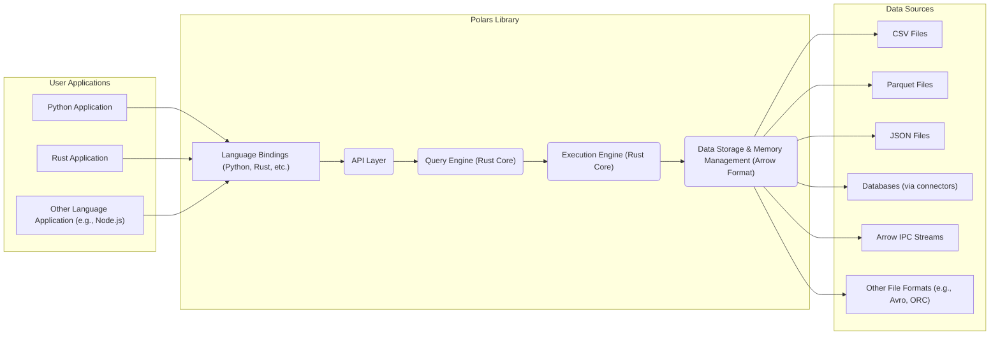

# Project Design Document: Polars Data Processing Library

**Project Name:** Polars

**Project Repository:** [https://github.com/pola-rs/polars](https://github.com/pola-rs/polars)

**Document Version:** 1.1
**Date:** 2023-10-27
**Author:** Gemini (AI Expert)

## 1. Project Overview

### 1.1. Project Description

Polars is a high-performance DataFrame library written in Rust, designed for efficient data manipulation and analysis. It aims to be a faster and more memory-efficient alternative to Pandas, especially for large datasets. Polars leverages Apache Arrow as its underlying memory model, enabling vectorized operations and parallel processing. It provides a DataFrame API in Python, Rust, and other languages, allowing users to perform complex data transformations, aggregations, and queries.

### 1.2. Project Goals

*   **Performance:** Provide significantly faster data processing compared to traditional DataFrame libraries, especially for large datasets, by utilizing vectorized operations and parallel execution.
*   **Memory Efficiency:** Minimize memory usage through techniques like memory mapping, copy-on-write semantics, and efficient columnar data structures provided by Apache Arrow.
*   **Expressiveness:** Offer a rich and intuitive API for data manipulation, inspired by Pandas but with a focus on clarity, consistency, and performance.
*   **Scalability:** Enable processing of datasets that exceed available RAM by leveraging techniques like chunking, lazy evaluation, and out-of-core processing (for certain operations and file formats).
*   **Cross-Language Compatibility:** Offer APIs in multiple languages (primarily Python and Rust) to cater to a wider range of users and use cases, promoting broader adoption and integration.
*   **Interoperability:** Seamlessly integrate with other data science tools and ecosystems, particularly those based on Apache Arrow, facilitating data exchange and workflow integration.

### 1.3. Target Users

*   Data Scientists who need to process and analyze large datasets efficiently.
*   Data Engineers building data pipelines and requiring high-performance data transformations.
*   Machine Learning Engineers preparing and featurizing data for machine learning models.
*   Business Analysts performing complex data analysis and reporting.
*   Anyone working with tabular data who requires high-performance data manipulation and analysis capabilities, especially when dealing with datasets that are challenging for traditional tools.

## 2. System Architecture

### 2.1. High-Level Architecture Diagram

### 2.2. Component Description

*   **User Applications:** These are applications written by users in various programming languages (primarily Python and Rust) that utilize the Polars library to perform data processing tasks. These applications interact with Polars through language-specific bindings.
*   **Language Bindings (Python, Rust, etc.):** These components provide language-specific interfaces (APIs) that allow users to interact with the core Polars library. They handle:
    *   Language-specific data type conversions between the user application's language and Polars' internal representation.
    *   Function call marshalling and unmarshalling, translating user-level function calls into instructions for the core engine.
    *   Error handling and exception propagation between the core library and the user application.
    *   Memory management related to data transfer between the language binding and the core library.
*   **API Layer:** This layer defines the public interface of the Polars library. It exposes functions and classes for:
    *   DataFrame creation and manipulation.
    *   Query construction using a declarative API (e.g., expression-based syntax).
    *   Data input/output operations for various file formats and data sources.
    *   Lazy evaluation and query optimization control.
    *   Error handling and user feedback.
    It aims to provide a consistent and user-friendly API across different language bindings.
*   **Query Engine (Rust Core):** This is the central component of Polars, written in Rust. It is responsible for:
    *   **Query Parsing and Logical Plan Generation:**  Translating user queries (expressed through the API) into an optimized logical plan represented as a directed acyclic graph (DAG) of operations.
    *   **Query Optimization:** Applying various optimization techniques to the logical plan to improve execution efficiency. These techniques include:
        *   Predicate pushdown: Filtering data as early as possible in the query execution.
        *   Projection pushdown: Selecting only necessary columns early in the query execution.
        *   Query reordering: Rearranging operations for better performance (e.g., performing filters before joins).
        *   Cost-based optimization: Choosing the most efficient execution strategy based on estimated costs of different operations.
    *   **Logical Plan Execution Planning:**  Preparing the optimized logical plan for execution by the Execution Engine.
*   **Execution Engine (Rust Core):** This component, also written in Rust, is responsible for the actual execution of the query plan. It performs the low-level data processing operations, leveraging:
    *   **Data Loading and Parsing:** Efficiently reading data from various sources (files, databases, etc.) and parsing it into the Apache Arrow columnar format.
    *   **Vectorized Operations:** Implementing core DataFrame operations using vectorized instructions (SIMD) for maximum performance.
    *   **Parallel Processing:** Utilizing multi-threading and task parallelism to execute operations concurrently across multiple CPU cores.
    *   **Data Manipulation Operations:** Implementing a wide range of DataFrame operations, including:
        *   Filtering and selection
        *   Sorting and ordering
        *   Joining and merging DataFrames
        *   Grouping and aggregation
        *   Data transformations and column operations
        *   Window functions
    *   **Memory Management:** Efficiently managing memory allocation and deallocation during query execution, leveraging Arrow's memory management capabilities.
*   **Data Storage & Memory Management (Arrow Format):** Polars uses Apache Arrow as its in-memory data format. Arrow provides:
    *   **Columnar Data Representation:** Data is stored in columns, which is highly efficient for analytical workloads as it allows for vectorized operations and reduces memory access overhead.
    *   **Schema Definition:**  A well-defined schema for data types, enabling type safety and efficient data processing.
    *   **Zero-Copy Data Sharing:** Enables efficient data exchange between different components within Polars and with other Arrow-based libraries and systems, minimizing data serialization and deserialization overhead.
    *   **Memory Mapping:** Allows Polars to work with datasets larger than RAM by mapping files directly into memory, reducing memory pressure and improving performance for large datasets.
    *   **Efficient Serialization/Deserialization:**  Provides optimized mechanisms for serializing and deserializing Arrow data for storage and data transfer.
*   **Data Sources:** Polars can read data from various sources, including:
    *   **File Formats:** CSV, Parquet, JSON, Avro, ORC, and potentially others.
    *   **Databases:** Through database connectors (e.g., for PostgreSQL, MySQL, SQLite, etc.) supporting various database protocols.
    *   **Arrow IPC Streams:** For seamless interoperability with other Arrow-based systems and data pipelines.
    *   **In-memory Data:**  Directly from in-memory data structures like Python lists or NumPy arrays (via language bindings).

## 3. Data Flow

### 3.1. Data Ingestion

1.  **User Application Request:** A user application (e.g., Python script) initiates a request to read data into a Polars DataFrame. This request specifies the data source (e.g., file path, database connection string), data format (e.g., CSV, Parquet), and any format-specific options (e.g., delimiters, headers).
2.  **Language Binding Interaction:** The language binding receives the request and translates it into a corresponding function call in the Polars API layer.
3.  **API Layer Processing:** The API layer validates the request parameters and forwards the data ingestion request to the Query Engine.
4.  **Query Engine Planning:** The Query Engine creates a query plan for data ingestion. This plan includes steps for:
    *   Accessing the specified data source.
    *   Parsing the data according to the specified format.
    *   Converting the parsed data into the Apache Arrow columnar format.
    *   Optimizing the data loading process (e.g., using parallel file reading).
5.  **Execution Engine Data Loading:** The Execution Engine executes the data ingestion plan. It:
    *   Opens connections to data sources (files, databases).
    *   Reads data in chunks or streams.
    *   Utilizes format-specific parsers to process the raw data.
6.  **Data Parsing and Arrow Conversion:** The Execution Engine parses the data according to the specified format (e.g., CSV parsing, JSON deserialization) and immediately converts it into the Apache Arrow columnar format in memory.
7.  **Data Storage in Memory:** The parsed data in Arrow format is stored in memory, managed by the Data Storage & Memory Management component. Polars may use memory mapping for large files to avoid loading the entire dataset into RAM at once.
8.  **DataFrame Creation and Return:** A Polars DataFrame object is created, which is a lightweight wrapper around the in-memory Arrow data. This DataFrame object is then returned to the user application through the language binding, allowing the user to interact with the ingested data.

### 3.2. Data Processing

1.  **User Application Query:** A user application submits a query or data manipulation operation (e.g., filter, join, aggregate, transform) through the Polars API. The query is typically expressed using Polars' expression-based API.
2.  **Language Binding Translation:** The language binding translates the user query into an internal representation (e.g., expression tree) that can be understood by the Polars core engine.
3.  **API Layer Query Handling:** The API layer receives the query representation and passes it to the Query Engine.
4.  **Query Engine Optimization:** The Query Engine receives the query and performs query optimization. This involves:
    *   Analyzing the query for potential performance bottlenecks.
    *   Applying optimization rules (predicate pushdown, projection pushdown, etc.).
    *   Generating an optimized logical query plan.
5.  **Execution Engine Execution:** The Execution Engine executes the optimized query plan. This involves:
    *   Accessing the relevant data from the in-memory Arrow data structures.
    *   Performing vectorized operations on data columns according to the query plan.
    *   Utilizing parallel processing to speed up execution, distributing operations across multiple threads or cores.
    *   Potentially using lazy evaluation, where operations are only performed when the results are actually needed.
6.  **Result Generation:** The Execution Engine generates the result of the query. The result can be:
    *   A new Polars DataFrame (for operations like filtering, joining, transformations).
    *   A Polars Series (for operations like aggregations on a single column).
    *   A scalar value (for aggregations that return a single value).
7.  **Result Return:** The result is returned to the user application through the API layer and language binding. The language binding may perform necessary conversions to represent the result in the user application's language.

### 3.3. Data Output

1.  **User Application Export Request:** A user application requests to export a Polars DataFrame to a specific format (e.g., CSV, Parquet, JSON) and destination (e.g., file path, database). The request includes the desired output format and destination details.
2.  **Language Binding Handling:** The language binding receives the export request and translates it into a call to the Polars API layer for data output.
3.  **API Layer Export Processing:** The API layer validates the export request and passes it to the Query Engine.
4.  **Query Engine Export Planning:** The Query Engine creates a plan for data export. This plan includes steps for:
    *   Serializing the in-memory Arrow data into the requested output format.
    *   Writing the serialized data to the specified destination.
    *   Optimizing the data writing process (e.g., using buffered writing, parallel compression).
5.  **Execution Engine Data Serialization:** The Execution Engine serializes the in-memory Arrow data into the requested format (e.g., converting Arrow columns to CSV rows, Parquet format).
6.  **Data Writing to Destination:** The Execution Engine writes the serialized data to the specified destination (e.g., writing to a file system, database). It handles file creation, buffering, and error handling during the writing process.
7.  **Confirmation Return:** Upon successful data export, a confirmation or status message is returned to the user application through the API layer and language binding, indicating that the export operation has completed.

## 4. Technology Stack

*   **Core Language:** Rust (for performance, memory safety, concurrency, and a rich ecosystem of libraries)
*   **Data Format:** Apache Arrow (version >= 1.0) (for columnar data representation, interoperability, and efficient memory management)
*   **Python Bindings:** PyO3 (for creating efficient and safe Python extensions in Rust)
*   **Other Language Bindings:**  Potentially Node.js (Neon), Go, R, etc. (depending on community contributions and project roadmap, using technologies appropriate for each target language's ecosystem)
*   **Build System:** Cargo (Rust's package manager and build tool, for dependency management, building, testing, and releasing)
*   **Testing Framework:** Rust's built-in testing framework (`#[test]` attribute) and potentially external crates like `criterion` for benchmarking performance-critical parts, `proptest` for property-based testing.
*   **Dependencies:**
    *   Apache Arrow Rust implementation (`arrow-rs` crate)
    *   `pyo3` crate (for Python bindings)
    *   File format parsing and serialization libraries (e.g., `csv-crate`, `parquet-rs`, `serde_json`, `arrow-json`, `arrow-csv`, `arrow-ipc`)
    *   Potentially database connectors (e.g., `postgres`, `mysql_async`, `sqlite` crates, potentially using database-specific Rust drivers or wrappers around C drivers)
    *   Concurrency and parallelism libraries from Rust's standard library and potentially crates like `rayon` for data parallelism.
    *   Logging and error handling libraries (e.g., `log`, `thiserror`, `anyhow`).

## 5. Security Considerations (Initial)

This section outlines initial security considerations for threat modeling. A more detailed threat model would be developed in a separate document based on this design document.

*   **Input Validation:**
    *   **Data Parsing:**
        *   **Threat:** Malformed or malicious data in input files (CSV, JSON, Parquet, etc.) could exploit vulnerabilities in parsing logic.
        *   **Vulnerabilities:** Format string bugs (less likely in Rust but conceptually possible in underlying C/C++ dependencies if used), buffer overflows (less likely in Rust due to memory safety, but possible in unsafe code blocks or dependencies), CSV injection attacks (if Polars were to directly output CSV based on user input without sanitization - less relevant for Polars core but important for applications using Polars), JSON parsing vulnerabilities (e.g., denial of service through deeply nested structures or large strings), Parquet format vulnerabilities (less common but possible in complex file formats).
        *   **Mitigation:** Use robust and well-tested parsing libraries. Implement input sanitization and validation where necessary. Define limits on input data size and complexity to prevent resource exhaustion. Fuzz testing parsing logic with malformed inputs.
    *   **User Queries:**
        *   **Threat:** Complex or maliciously crafted queries could lead to resource exhaustion or unexpected behavior in the Query Engine and Execution Engine.
        *   **Vulnerabilities:** Resource exhaustion (CPU, memory) due to computationally expensive queries, logical flaws in query planning that could be exploited to cause incorrect results or crashes, potential for injection-style attacks if Polars were to integrate with SQL-like interfaces in the future (currently less relevant).
        *   **Mitigation:** Implement query complexity analysis and resource limits (query timeouts, memory limits). Sanitize user-provided query parameters if applicable. Thoroughly test query planning and execution logic to prevent logical flaws.
    *   **Database Connectors:**
        *   **Threat:** Vulnerabilities in database connector libraries or insecure configuration could expose sensitive data or allow unauthorized database access.
        *   **Vulnerabilities:** SQL injection vulnerabilities in database connector libraries (if not properly parameterized queries are used), insecure storage of database credentials, unencrypted database connections (lack of TLS/SSL), vulnerabilities in the database driver itself.
        *   **Mitigation:** Use well-vetted and regularly updated database connector libraries. Enforce secure credential management practices (e.g., using environment variables or secrets management systems, avoiding hardcoding credentials). Enforce encrypted database connections (TLS/SSL). Sanitize inputs when constructing database queries to prevent injection attacks at the database level.

*   **Data Confidentiality and Integrity:**
    *   **In-Memory Data Security:**
        *   **Threat:** Sensitive data in memory could be exposed through memory dumps, swap space, or unauthorized memory access.
        *   **Vulnerabilities:** Lack of memory encryption at the Polars level (relies on OS-level memory protection), potential for data leakage to swap space if memory pressure is high, vulnerabilities in the underlying operating system's memory management.
        *   **Mitigation:**  Rely on operating system-level memory protection mechanisms. Advise users to consider OS-level memory encryption if handling highly sensitive data. Minimize data residency in memory when possible.
    *   **Data Leakage:**
        *   **Threat:** Error messages, logging, or debugging information could inadvertently leak sensitive data.
        *   **Vulnerabilities:** Verbose error messages in production environments, logging sensitive data at inappropriate levels, exposing internal data structures in debug outputs.
        *   **Mitigation:** Sanitize error messages and logging output to remove sensitive information. Implement secure logging practices (e.g., logging only necessary information at appropriate levels, using structured logging). Avoid verbose error reporting in production.
    *   **Data Integrity during Processing:**
        *   **Threat:** Bugs in the core engine or data processing logic could lead to data corruption or incorrect results.
        *   **Vulnerabilities:** Logical errors in algorithms, race conditions in parallel processing, incorrect data type handling, memory corruption bugs (less likely in Rust but still possible in unsafe code or dependencies).
        *   **Mitigation:** Implement rigorous unit and integration testing, including property-based testing. Use memory-safe programming practices (Rust's memory safety features). Perform data validation throughout the processing pipeline to detect and prevent data corruption. Code reviews and security audits of critical components.

*   **Access Control:**
    *   **API Access:**
        *   **Threat:** Unauthorized access to Polars API could allow malicious users to manipulate or extract data.
        *   **Vulnerabilities:** Lack of built-in authentication or authorization mechanisms within Polars itself. Reliance on application-level access control.
        *   **Mitigation:** Implement access control at the application level that uses Polars. Use authentication and authorization mechanisms to restrict API access to authorized users or processes.
    *   **Resource Limits:**
        *   **Threat:** Lack of resource limits could allow malicious users to exhaust system resources (CPU, memory) and cause denial of service.
        *   **Vulnerabilities:** No built-in mechanisms in Polars to limit resource consumption per query or user.
        *   **Mitigation:** Implement resource limits at the application level or system level. Set query timeouts, memory limits, CPU quotas to prevent resource exhaustion.

*   **Dependency Management:**
    *   **Third-Party Libraries:**
        *   **Threat:** Vulnerabilities in third-party Rust crates or C/C++ libraries used by Polars could indirectly affect Polars' security.
        *   **Vulnerabilities:** Known vulnerabilities in dependencies, transitive dependencies with vulnerabilities, malicious dependencies (supply chain attacks).
        *   **Mitigation:** Regularly scan dependencies for vulnerabilities using tools like `cargo audit`. Keep dependencies updated to the latest secure versions. Perform security audits of critical dependencies.
    *   **Supply Chain Security:**
        *   **Threat:** Compromise of the Polars build or release process could lead to distribution of malicious code.
        *   **Vulnerabilities:** Compromised build servers, insecure release pipelines, lack of code signing, lack of reproducible builds.
        *   **Mitigation:** Implement secure build and release pipelines. Use code signing to verify the integrity of releases. Strive for reproducible builds to ensure build process integrity.

*   **Denial of Service (DoS):**
    *   **Resource Exhaustion:**
        *   **Threat:** Maliciously crafted input data or queries could be designed to consume excessive CPU, memory, or disk I/O, leading to denial of service.
        *   **Vulnerabilities:** Processing very large input files, deeply nested or recursive queries, computationally expensive operations (e.g., very large joins, complex aggregations), unbounded memory allocation.
        *   **Mitigation:** Implement resource limits (query timeouts, memory limits, CPU quotas). Validate input data size and complexity. Analyze query complexity and identify potentially expensive operations. Implement circuit breakers to prevent cascading failures.
    *   **Algorithmic Complexity:**
        *   **Threat:** Certain operations might have high algorithmic complexity that can be exploited with specific inputs to cause performance degradation or DoS.
        *   **Vulnerabilities:** Operations with quadratic or exponential time complexity (e.g., certain types of joins, aggregations on very large groups), inefficient algorithms for specific operations.
        *   **Mitigation:** Choose algorithms with optimal time complexity. Analyze the algorithmic complexity of core operations. Implement query complexity analysis to detect potentially expensive queries. Provide documentation and guidance on avoiding operations with high complexity on large datasets.

This initial security consideration list will be used as a starting point for a more comprehensive threat modeling exercise. A full threat model would involve a deeper analysis of each component, data flow, and potential threat actor, using methodologies like STRIDE or PASTA to systematically identify and mitigate security risks.