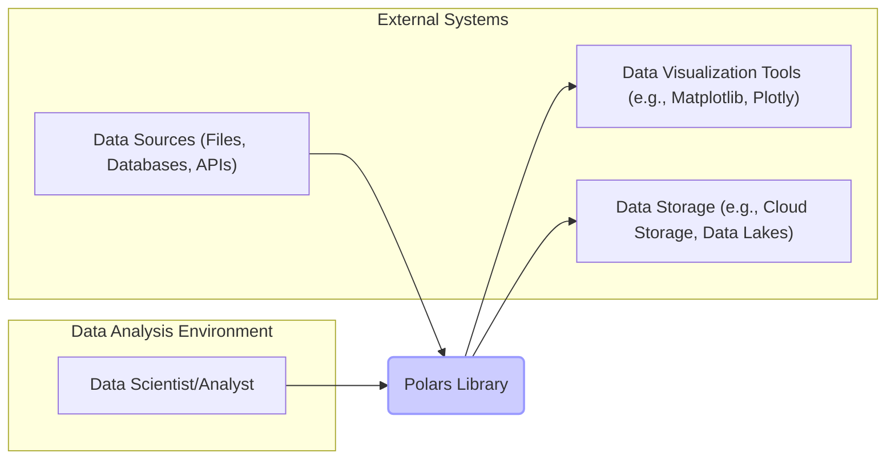
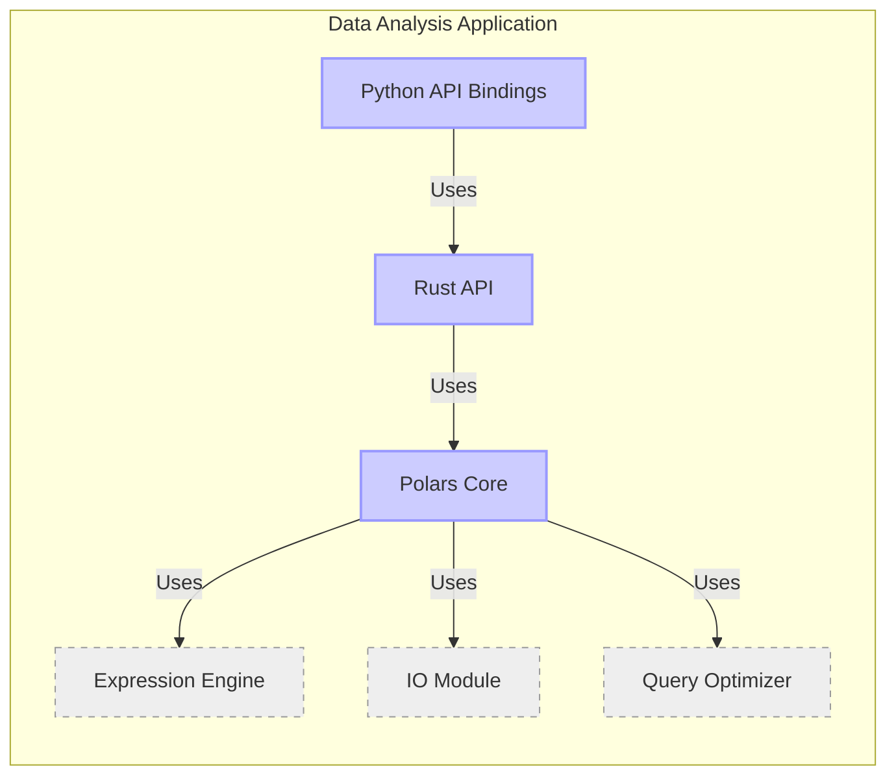
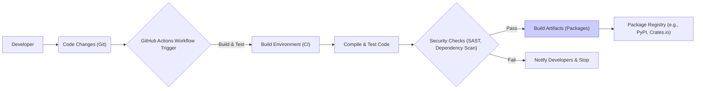

# BUSINESS POSTURE

This project, Polars, is an extremely fast DataFrame library written in Rust, aiming to provide high-performance data manipulation and analysis capabilities.

- Business Priorities:
 - Performance: Polars is designed for speed and efficiency in data processing, which is a critical priority for users dealing with large datasets.
 - Scalability: The library should be able to handle increasing data volumes and complexity as user needs grow.
 - Ease of Use: Despite its performance focus, Polars aims to provide a user-friendly API that is accessible to data scientists and analysts.
 - Open Source Community:  Leveraging and growing an active open-source community is important for long-term sustainability, feature development, and user support.

- Business Goals:
 - Become the leading DataFrame library for high-performance data analysis in various programming environments (initially Python and Rust).
 - Enable users to process and analyze large datasets faster and more efficiently, reducing processing time and infrastructure costs.
 - Provide a robust and reliable tool for data manipulation, cleaning, and transformation.
 - Foster a collaborative open-source ecosystem around Polars, driving innovation and adoption.

- Business Risks:
 - Performance regressions: Introducing changes that negatively impact the performance, which is a core value proposition.
 - Data integrity issues: Bugs or vulnerabilities that could lead to data corruption or incorrect analysis results.
 - Security vulnerabilities: Although primarily a library, vulnerabilities in Polars could be exploited in applications that use it, potentially leading to data breaches or denial of service.
 - Community fragmentation: Lack of community engagement or disagreements within the community could hinder development and adoption.
 - Dependency issues: Reliance on external libraries that may have vulnerabilities or become unmaintained.

# SECURITY POSTURE

- Security Controls:
 - security control: Code review process on GitHub via Pull Requests. Implemented in: GitHub repository contribution guidelines and workflow.
 - security control: Unit and integration testing. Implemented in: GitHub Actions workflows and project testing framework.
 - security control: Fuzz testing. Implemented in: GitHub Actions workflows and project fuzzing framework.
 - security control: Memory safety provided by Rust language. Implemented in: Core language design and compiler.

- Accepted Risks:
 - accepted risk: Limited dedicated security team or security expert involvement in the project.
 - accepted risk: Reliance on community contributions for identifying and addressing security vulnerabilities.
 - accepted risk: Potential vulnerabilities in dependencies that are not actively monitored or patched by the Polars project directly.
 - accepted risk: Lack of formal security audits or penetration testing.

- Recommended Security Controls:
 - security control: Implement static application security testing (SAST) tools in the CI/CD pipeline to automatically detect potential code vulnerabilities.
 - security control: Integrate dependency scanning tools to identify known vulnerabilities in project dependencies.
 - security control: Establish a process for reporting and handling security vulnerabilities, including a security policy and contact information.
 - security control: Consider performing periodic security audits or penetration testing, especially before major releases.
 - security control: Enhance input validation and sanitization practices throughout the codebase to prevent injection attacks and data corruption.

- Security Requirements:
 - Authentication: Not directly applicable to a library. Polars itself does not handle user authentication. Applications using Polars will be responsible for their own authentication mechanisms.
 - Authorization: Not directly applicable to a library. Polars does not enforce authorization. Applications using Polars are responsible for controlling access to data and operations.
 - Input Validation: Critical. Polars must robustly validate all external inputs, including data loaded from files, databases, and user-provided expressions, to prevent data corruption, crashes, or potential injection vulnerabilities. This should be implemented at the API boundaries where data enters the Polars library.
 - Cryptography: Potentially relevant for features that might involve handling or processing encrypted data. If cryptographic operations are implemented, they must use well-vetted and secure cryptographic libraries and follow best practices to avoid vulnerabilities. For general data processing, cryptography might be less directly relevant to the core library itself, but could be important in applications using Polars to handle sensitive data.

# DESIGN

## C4 CONTEXT



- Context Diagram Elements:
 - Element:
  - Name: Data Scientist/Analyst
  - Type: Person
  - Description: Users who utilize Polars to perform data analysis, manipulation, and exploration.
  - Responsibilities: Writing code that uses the Polars API to process and analyze data. Interpreting results and making data-driven decisions.
  - Security controls: User access control to their development environment and data sources. Secure coding practices when using Polars API.
 - Element:
  - Name: Data Sources (Files, Databases, APIs)
  - Type: External System
  - Description: External systems that provide data to be processed by Polars. These can include local files (CSV, Parquet, JSON), databases (PostgreSQL, MySQL), and external APIs.
  - Responsibilities: Providing data to Polars in various formats. Ensuring data availability and integrity.
  - Security controls: Access control to data sources (authentication and authorization). Data encryption at rest and in transit. Input validation at the data source level.
 - Element:
  - Name: Data Visualization Tools (e.g., Matplotlib, Plotly)
  - Type: External System
  - Description: Tools used to visualize the results of data analysis performed by Polars.
  - Responsibilities: Presenting data in a visual format for analysis and interpretation.
  - Security controls: Security controls of the visualization tools themselves. Ensuring data is securely passed from Polars to visualization tools.
 - Element:
  - Name: Data Storage (e.g., Cloud Storage, Data Lakes)
  - Type: External System
  - Description: Systems used to store the processed data after analysis with Polars. This could include cloud storage services, data lakes, or databases.
  - Responsibilities: Storing processed data securely and reliably. Providing access to processed data for further use.
  - Security controls: Access control to data storage. Data encryption at rest and in transit. Data backup and recovery mechanisms.
 - Element:
  - Name: Polars Library
  - Type: Software System
  - Description: The Polars DataFrame library itself, providing high-performance data manipulation and analysis functionalities.
  - Responsibilities: Reading, processing, and transforming data efficiently and correctly. Providing a user-friendly API for data manipulation. Ensuring data integrity during processing.
  - Security controls: Input validation, memory safety (Rust), secure coding practices, vulnerability management, testing (unit, integration, fuzz).

## C4 CONTAINER



- Container Diagram Elements:
 - Element:
  - Name: Polars Core
  - Type: Container - Rust Library
  - Description: The core DataFrame library written in Rust. Implements the fundamental data structures and algorithms for data manipulation and analysis.
  - Responsibilities: High-performance data processing, memory management, core API implementation, data structure management.
  - Security controls: Memory safety (Rust), input validation within core algorithms, unit and integration testing, fuzz testing.
 - Element:
  - Name: Python API Bindings
  - Type: Container - Python Library
  - Description: Provides Python bindings to the Polars Core, allowing Python users to interact with the high-performance Rust core.
  - Responsibilities: Exposing Polars Core functionality to Python, handling data type conversions between Python and Rust, providing a Pythonic API.
  - Security controls: Input validation at the Python API level, secure handling of data passed between Python and Rust, adherence to Python security best practices.
 - Element:
  - Name: Rust API
  - Type: Container - Rust Library API
  - Description: Public Rust API for direct interaction with Polars Core from Rust applications.
  - Responsibilities: Providing a stable and well-documented Rust API for Polars functionality.
  - Security controls: API design to minimize potential misuse, input validation at the Rust API level, documentation emphasizing secure usage.
 - Element:
  - Name: Expression Engine
  - Type: Container - Module
  - Description:  Component responsible for parsing, optimizing, and executing expressions used in Polars queries.
  - Responsibilities: Efficiently evaluating expressions, handling different data types and operations, query optimization.
  - Security controls: Input validation of expressions to prevent injection attacks or unexpected behavior, secure handling of user-provided code within expressions (if applicable).
 - Element:
  - Name: IO Module
  - Type: Container - Module
  - Description: Handles input and output operations, including reading data from various file formats (CSV, Parquet, JSON) and databases, and writing data to storage.
  - Responsibilities: Reading and writing data efficiently, supporting various data formats and sources, handling data serialization and deserialization.
  - Security controls: Input validation of data read from external sources, secure handling of file paths and database connections, protection against directory traversal vulnerabilities, secure parsing of file formats to prevent vulnerabilities like buffer overflows.
 - Element:
  - Name: Query Optimizer
  - Type: Container - Module
  - Description: Optimizes query execution plans to improve performance.
  - Responsibilities: Analyzing queries, rewriting queries for better performance, selecting efficient execution strategies.
  - Security controls: Ensuring query optimization does not introduce security vulnerabilities, preventing denial-of-service through maliciously crafted queries (though less likely in a library context).

## DEPLOYMENT

Polars is a library, and its deployment is primarily about how it is integrated into applications.  Here we consider a typical deployment scenario within a data science or data engineering environment.

- Deployment Scenario: Local Development and Cloud-Based Data Processing

```mermaid
flowchart LR
    subgraph "Developer Machine"
        A["Developer Environment (Python/Rust, IDE)"]
        B["Polars Library (Installed)"]
    end
    subgraph "Cloud Environment (e.g., AWS, GCP, Azure)"
        subgraph "Compute Instance (e.g., EC2, Compute Engine)"
            C["Compute Instance OS"]
            D["Polars Library (Installed)"]
            E["Data Processing Application"]
        end
        F["Data Storage (e.g., S3, GCS, Azure Blob Storage)"]
        G["Database Service (e.g., RDS, Cloud SQL)"]
    end

    A --> B
    B --> "Data Files (Local)"
    E --> D
    D --> F
    D --> G
    C -- Contains --> D
    C -- Contains --> E

    style B fill:#ccf,stroke:#99f,stroke-width:2px
    style D fill:#ccf,stroke:#99f,stroke-width:2px
```

- Deployment Diagram Elements:
 - Element:
  - Name: Developer Environment (Python/Rust, IDE)
  - Type: Environment
  - Description: Local development environment used by data scientists and analysts to develop and test Polars-based applications. Includes IDE, Python or Rust installation, and necessary development tools.
  - Responsibilities: Code development, testing, local data exploration.
  - Security controls: Developer machine security (OS hardening, endpoint protection), access control to development environment, secure coding practices.
 - Element:
  - Name: Polars Library (Installed - Developer Machine)
  - Type: Software - Library
  - Description: Polars library installed within the developer's local environment.
  - Responsibilities: Providing Polars functionality for local development and testing.
  - Security controls: Ensuring the library is obtained from a trusted source (e.g., official package repositories), keeping the library updated to patch vulnerabilities.
 - Element:
  - Name: Data Files (Local)
  - Type: Data Store
  - Description: Data files stored locally on the developer's machine for testing and development purposes.
  - Responsibilities: Providing sample data for local development.
  - Security controls: Access control to local data files, data encryption if sensitive data is used locally.
 - Element:
  - Name: Compute Instance OS
  - Type: Infrastructure - Operating System
  - Description: Operating system of the cloud compute instance (e.g., Linux) where the data processing application and Polars are deployed.
  - Responsibilities: Providing a secure and stable operating environment for the application and Polars.
  - Security controls: OS hardening, regular patching, access control, security monitoring.
 - Element:
  - Name: Polars Library (Installed - Cloud)
  - Type: Software - Library
  - Description: Polars library installed on the cloud compute instance.
  - Responsibilities: Providing Polars functionality for data processing in the cloud environment.
  - Security controls: Ensuring the library is obtained from a trusted source, keeping the library updated, potentially using containerization to isolate the library and application.
 - Element:
  - Name: Data Processing Application
  - Type: Software - Application
  - Description: The application that utilizes the Polars library to perform data processing tasks in the cloud.
  - Responsibilities: Implementing data processing logic, interacting with data storage and databases, orchestrating data workflows.
  - Security controls: Secure coding practices, input validation, proper error handling, access control to resources, application-level security measures.
 - Element:
  - Name: Data Storage (e.g., S3, GCS, Azure Blob Storage)
  - Type: Infrastructure - Cloud Storage
  - Description: Cloud-based object storage used to store input and output data for processing.
  - Responsibilities: Secure and reliable data storage, scalability, data availability.
  - Security controls: Access control (IAM roles, policies), data encryption at rest and in transit, versioning, audit logging.
 - Element:
  - Name: Database Service (e.g., RDS, Cloud SQL)
  - Type: Infrastructure - Cloud Database
  - Description: Managed database service used as a data source or sink for Polars-based data processing.
  - Responsibilities: Providing structured data storage and retrieval, data integrity, scalability, availability.
  - Security controls: Database access control (authentication, authorization), data encryption at rest and in transit, database security hardening, regular patching, backup and recovery.

## BUILD



- Build Process Elements:
 - Element:
  - Name: Developer
  - Type: Person
  - Description: Software developers contributing code to the Polars project.
  - Responsibilities: Writing code, fixing bugs, implementing new features, submitting code changes via pull requests.
  - Security controls: Secure coding practices, code review participation, adherence to project contribution guidelines, developer machine security.
 - Element:
  - Name: Code Changes (Git)
  - Type: Software - Version Control
  - Description: Code changes committed to the Git repository, triggering the build process.
  - Responsibilities: Tracking code changes, version control, collaboration.
  - Security controls: Access control to the Git repository, branch protection, commit signing.
 - Element:
  - Name: GitHub Actions Workflow Trigger
  - Type: Automation
  - Description: GitHub Actions workflows automatically triggered by code changes (e.g., pull requests, pushes).
  - Responsibilities: Automating the build, test, and security check process.
  - Security controls: Secure configuration of GitHub Actions workflows, access control to workflow definitions and secrets.
 - Element:
  - Name: Build Environment (CI)
  - Type: Infrastructure - CI Environment
  - Description: Cloud-based CI environment (GitHub Actions runners) used to execute the build process.
  - Responsibilities: Providing a consistent and isolated environment for building and testing the code.
  - Security controls: Security hardening of CI environment, access control, secure handling of build secrets.
 - Element:
  - Name: Compile & Test Code
  - Type: Build Step
  - Description: Compilation of Rust and Python code, and execution of unit and integration tests.
  - Responsibilities: Ensuring code compiles successfully and passes all tests.
  - Security controls: Secure compilation process, test suite covering security-relevant aspects.
 - Element:
  - Name: Security Checks (SAST, Dependency Scan)
  - Type: Build Step - Security
  - Description: Automated security checks performed during the build process, including Static Application Security Testing (SAST) and dependency scanning for known vulnerabilities.
  - Responsibilities: Identifying potential security vulnerabilities in the code and dependencies.
  - Security controls: Configuration and maintenance of SAST and dependency scanning tools, integration with build pipeline, vulnerability reporting.
 - Element:
  - Name: Build Artifacts (Packages)
  - Type: Software - Packages
  - Description: Compiled and packaged Polars libraries (e.g., Python wheels, Rust crates).
  - Responsibilities: Creating distributable packages of the Polars library.
  - Security controls: Signing of packages to ensure integrity and authenticity, secure storage of build artifacts before publishing.
 - Element:
  - Name: Package Registry (e.g., PyPI, Crates.io)
  - Type: Software - Package Repository
  - Description: Public package registries where Polars packages are published for users to download and install.
  - Responsibilities: Distributing Polars packages to users, providing package management infrastructure.
  - Security controls: Account security for publishing packages, package integrity verification (checksums, signatures), vulnerability scanning of published packages (by registry).
 - Element:
  - Name: Notify Developers & Stop
  - Type: Automation - Notification
  - Description: Automated notification to developers and halting of the build process if security checks fail.
  - Responsibilities: Alerting developers to security issues, preventing insecure code from being released.
  - Security controls: Reliable notification mechanism, clear reporting of security failures.

# RISK ASSESSMENT

- Critical Business Processes:
 - Data analysis and reporting: Polars is used to perform data analysis that informs business decisions and generates reports. Incorrect or compromised data processing could lead to flawed insights and poor decision-making.
 - Data transformation and preparation: Polars is used to prepare data for various downstream applications and processes. Data integrity issues during transformation could propagate to other systems.
 - Performance-critical data pipelines: In performance-sensitive environments, Polars' speed is crucial. Availability and performance degradation due to vulnerabilities could disrupt critical data pipelines.

- Data Sensitivity:
 - The sensitivity of data processed by Polars depends entirely on the user's application. Polars itself is data-agnostic.
 - Data processed could range from publicly available datasets to highly sensitive personal or financial information.
 - The potential impact of a security breach or data integrity issue is directly related to the sensitivity of the data being processed by applications using Polars.
 - Polars itself should be designed to handle data securely, regardless of its sensitivity, as it cannot know the context of its usage. Focus should be on preventing data corruption, unauthorized access to Polars internals (less relevant for a library), and vulnerabilities that could be exploited in applications using Polars to process sensitive data.

# QUESTIONS & ASSUMPTIONS

- Questions:
 - What are the specific types of data and industries that Polars users primarily work with? Understanding the typical use cases would help prioritize security requirements.
 - Are there any specific regulatory compliance requirements that Polars or its users need to adhere to (e.g., GDPR, HIPAA, PCI DSS)?
 - What is the process for reporting and handling security vulnerabilities in Polars currently? Is there a security contact or security policy?
 - Are there any plans for formal security audits or penetration testing in the future?
 - What is the tolerance for performance impact when implementing additional security controls?

- Assumptions:
 - Polars is primarily used as a library embedded within larger applications, rather than as a standalone service.
 - Security is a growing concern for the Polars project, but resources dedicated to security are currently limited.
 - The open-source community plays a significant role in identifying and addressing issues, including security vulnerabilities.
 - Users of Polars are responsible for securing their own applications and data pipelines that utilize the library. Polars aims to provide a secure foundation but cannot control the security practices of its users.
 - Performance remains a top priority for Polars, and security measures should be implemented without significantly degrading performance.