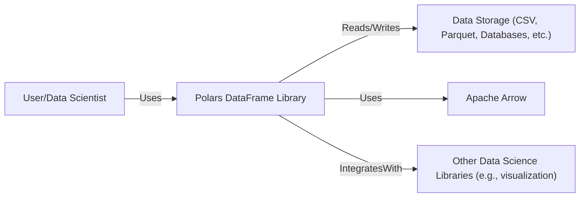
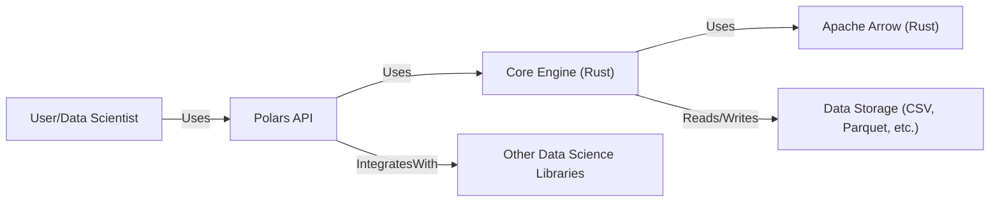
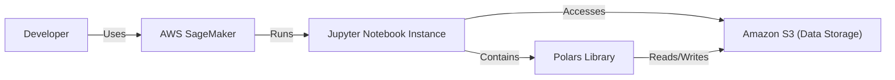
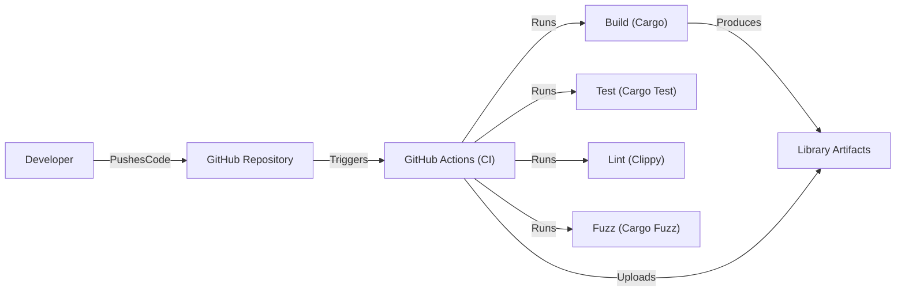

Okay, let's create a design document for the Polars project, focusing on aspects relevant to threat modeling.

# BUSINESS POSTURE

Polars is a DataFrame library written in Rust that uses Apache Arrow Columnar Format as its in-memory format.  It's designed for high performance data manipulation, particularly for large datasets.  The project appears to be open-source and community-driven, aiming to provide a fast and efficient alternative to other DataFrame libraries like Pandas.

Business Priorities:

*   Performance: Provide significantly faster data processing and manipulation compared to existing solutions.
*   Efficiency: Minimize memory usage and computational overhead.
*   Usability: Offer a user-friendly API for data analysis and manipulation.
*   Community Adoption: Grow a strong user and contributor base.
*   Reliability: Ensure data integrity and consistent results.
*   Extensibility: Allow for integration with other tools and libraries in the data ecosystem.

Business Goals:

*   Become a leading DataFrame library, particularly for performance-sensitive applications.
*   Attract a large and active community of users and contributors.
*   Establish Polars as a reliable and trusted tool for data analysis.

Most Important Business Risks:

*   Data Corruption: Bugs or vulnerabilities leading to incorrect data manipulation or loss.
*   Performance Degradation: Unexpected performance bottlenecks or regressions.
*   Security Vulnerabilities: Exploitable vulnerabilities that could compromise data or systems using Polars.
*   Lack of Adoption: Failure to gain traction within the data science community.
*   Competition: Existing and emerging DataFrame libraries offering similar or better features.
*   Maintainability: Difficulty in maintaining and evolving the codebase as it grows.

# SECURITY POSTURE

Existing Security Controls:

*   security control: Code Reviews: Pull requests on GitHub are subject to review by other contributors, helping to identify potential bugs and vulnerabilities. (Described in GitHub repository's contribution guidelines).
*   security control: Testing: The project includes a comprehensive test suite, including unit tests, integration tests, and property-based tests (using `proptest`). (Visible in the `tests` directory and CI configuration).
*   security control: Fuzzing: Some fuzzing is employed to test for edge cases and potential crashes. (Mentioned in the documentation and present in the codebase).
*   security control: Static Analysis: Rust's strong type system and memory safety features provide inherent protection against many common vulnerabilities.
*   security control: CI/CD: GitHub Actions are used for continuous integration, running tests and checks on every commit. (Visible in the `.github/workflows` directory).
*   security control: Dependency Management: Cargo (Rust's package manager) helps manage dependencies and track versions.
*   security control: Clippy: Rust linter (Clippy) is used to enforce code style and identify potential issues. (Present in CI configuration).

Accepted Risks:

*   accepted risk: Limited Formal Security Audits: While code reviews and testing are in place, there's no mention of regular, formal security audits by external experts.
*   accepted risk: Reliance on Third-Party Libraries: Polars depends on external libraries (like Apache Arrow), inheriting any potential vulnerabilities in those dependencies.
*   accepted risk: Potential for Undiscovered Vulnerabilities: Despite best efforts, there's always a risk of undiscovered vulnerabilities, especially in complex codebases.
*   accepted risk: User-Provided Code Execution (in some contexts): If users can execute arbitrary code through Polars expressions or plugins, this introduces a significant security risk.

Recommended Security Controls:

*   security control: Regular Security Audits: Conduct periodic security audits by independent security experts.
*   security control: Enhanced Fuzzing: Expand fuzzing coverage to include more components and edge cases.
*   security control: Dependency Vulnerability Scanning: Implement automated scanning of dependencies for known vulnerabilities.
*   security control: Supply Chain Security: Investigate and implement measures to secure the software supply chain (e.g., signing releases, verifying dependencies).
*   security control: Security Training: Provide security training for core contributors.

Security Requirements:

*   Authentication: Not directly applicable to Polars itself, as it's a library. However, applications using Polars should implement appropriate authentication mechanisms.
*   Authorization: Not directly applicable to Polars itself. Applications using Polars should implement appropriate authorization mechanisms to control access to data.
*   Input Validation: Polars should validate input data types and ranges to prevent unexpected behavior or crashes. This is partially addressed by Rust's type system, but additional checks may be needed for specific operations.
*   Cryptography: If Polars handles sensitive data, it should use appropriate cryptographic libraries and algorithms for encryption and data integrity. This is more relevant to applications *using* Polars, but Polars should provide mechanisms for working with encrypted data.
*   Error Handling: Polars should handle errors gracefully and provide informative error messages without revealing sensitive information.
*   Memory Safety: Rust's ownership and borrowing system inherently address many memory safety issues. Polars should be carefully reviewed for any `unsafe` code blocks.

# DESIGN

## C4 CONTEXT

C4 Context Element List:

*   Element:
    *   Name: User/Data Scientist
    *   Type: Person
    *   Description: A person who uses Polars to perform data analysis and manipulation.
    *   Responsibilities: Provides input data, writes Polars code, interprets results.
    *   Security controls: Not directly applicable. Security controls are the responsibility of the user's environment and practices.

*   Element:
    *   Name: Polars DataFrame Library
    *   Type: Software System
    *   Description: The core Polars library, providing DataFrame functionality.
    *   Responsibilities: Data loading, manipulation, processing, and output.
    *   Security controls: Input validation, memory safety (via Rust), error handling, dependency management.

*   Element:
    *   Name: Data Storage (CSV, Parquet, Databases, etc.)
    *   Type: External System
    *   Description: Various data storage systems that Polars can read from and write to.
    *   Responsibilities: Storing and retrieving data.
    *   Security controls: Responsibility of the specific data storage system (e.g., database access controls, file system permissions).

*   Element:
    *   Name: Apache Arrow
    *   Type: External Library
    *   Description: A columnar memory format used by Polars for efficient data representation.
    *   Responsibilities: Providing the in-memory data format.
    *   Security controls: Relies on the security of the Apache Arrow implementation.

*   Element:
    *   Name: Other Data Science Libraries (e.g., visualization)
    *   Type: External System
    *   Description: Other libraries that might be used in conjunction with Polars.
    *   Responsibilities: Varies depending on the library.
    *   Security controls: Responsibility of the specific library.

## C4 CONTAINER

Since Polars is primarily a library, the container diagram is relatively simple and closely resembles the context diagram.  It doesn't have separate deployable units in the traditional sense.

C4 Container Element List:

*   Element:
    *   Name: User/Data Scientist
    *   Type: Person
    *   Description: A person who uses Polars to perform data analysis and manipulation.
    *   Responsibilities: Provides input data, writes Polars code, interprets results.
    *   Security controls: Not directly applicable.

*   Element:
    *   Name: Polars API
    *   Type: API
    *   Description: The public interface that users interact with.  This includes functions for creating, manipulating, and querying DataFrames.
    *   Responsibilities: Providing a user-friendly interface to the core engine.
    *   Security controls: Input validation, error handling.

*   Element:
    *   Name: Core Engine (Rust)
    *   Type: Application
    *   Description: The core logic of Polars, implemented in Rust. This includes the DataFrame implementation, query execution, and data manipulation algorithms.
    *   Responsibilities: Data processing, query optimization, memory management.
    *   Security controls: Memory safety (via Rust), input validation, error handling, fuzzing.

*   Element:
    *   Name: Apache Arrow (Rust)
    *   Type: Library
    *   Description: The Rust implementation of the Apache Arrow columnar memory format.
    *   Responsibilities: Providing the in-memory data representation.
    *   Security controls: Relies on the security of the Apache Arrow implementation.

*   Element:
    *   Name: Data Storage (CSV, Parquet, etc.)
    *   Type: External System
    *   Description: Various data storage systems that Polars can read from and write to.
    *   Responsibilities: Storing and retrieving data.
    *   Security controls: Responsibility of the specific data storage system.

*   Element:
    *   Name: Other Data Science Libraries
    *   Type: External System
    *   Description: Other libraries that might be used in conjunction with Polars (e.g. for visualization).
    *   Responsibilities: Varies depending on the library.
    *   Security controls: Responsibility of the specific library.

## DEPLOYMENT

Polars, as a library, is not "deployed" in the traditional sense of a web application or service.  It's *integrated* into other applications.  However, we can describe how it's typically used and the environments it might run in.

Possible Deployment Scenarios:

1.  **Local Development Environment:**  A developer installs Polars as a dependency in their Rust project using Cargo.
2.  **Cloud-Based Data Science Platform:** Polars is used within a Jupyter notebook or similar environment on a platform like AWS SageMaker, Google Colab, or Azure Machine Learning.
3.  **Server-Based Application:** Polars is embedded within a larger application running on a server (physical or virtual).
4.  **Embedded Systems:** (Less common, but possible) Polars could be used in resource-constrained embedded systems due to its efficiency.

Chosen Deployment Scenario (for detailed description): **Cloud-Based Data Science Platform (e.g., AWS SageMaker)**

Deployment Element List:

*   Element:
    *   Name: Developer
    *   Type: Person
    *   Description: A data scientist or developer using Polars within SageMaker.
    *   Responsibilities: Writing and executing Polars code.
    *   Security controls: AWS IAM user credentials, multi-factor authentication.

*   Element:
    *   Name: AWS SageMaker
    *   Type: Cloud Platform
    *   Description: Amazon's cloud-based machine learning platform.
    *   Responsibilities: Providing managed Jupyter notebook instances, compute resources, and access to other AWS services.
    *   Security controls: AWS IAM, VPCs, security groups, encryption at rest and in transit.

*   Element:
    *   Name: Jupyter Notebook Instance
    *   Type: Virtual Machine
    *   Description: A virtual machine running a Jupyter notebook server.
    *   Responsibilities: Providing an interactive environment for data analysis.
    *   Security controls: AWS security groups, instance-level firewalls, regular patching and updates.

*   Element:
    *   Name: Polars Library
    *   Type: Library
    *   Description: The Polars library installed within the Jupyter notebook environment.
    *   Responsibilities: Providing DataFrame functionality.
    *   Security controls: Inherits security controls from the Jupyter notebook instance and the underlying AWS infrastructure.

*   Element:
    *   Name: Amazon S3 (Data Storage)
    *   Type: Cloud Storage
    *   Description: Amazon's object storage service.
    *   Responsibilities: Storing and retrieving data.
    *   Security controls: S3 bucket policies, access control lists, encryption at rest and in transit.

## BUILD

Polars uses a typical Rust build process managed by Cargo and automated with GitHub Actions.

Build Process Description:

1.  **Developer Action:** A developer pushes code changes to the Polars GitHub repository.
2.  **CI Trigger:** GitHub Actions detects the push and triggers a predefined workflow.
3.  **Build:** The workflow uses Cargo to build the Polars library. This includes compiling the Rust code and resolving dependencies.
4.  **Test:** The workflow runs the test suite using `cargo test`. This includes unit tests, integration tests, and property-based tests.
5.  **Lint:** The workflow runs Clippy, a Rust linter, to check for code style issues and potential bugs.
6.  **Fuzz:** The workflow runs fuzzing tests using `cargo fuzz` to identify potential vulnerabilities and crashes.
7.  **Artifact Creation:** If all checks pass, the build process produces library artifacts (e.g., compiled libraries, documentation).
8.  **Artifact Upload:** The workflow may upload the artifacts to a package repository (e.g., crates.io) or store them for later use.

Security Controls in Build Process:

*   security control: Automated Testing: Comprehensive test suite run on every build.
*   security control: Static Analysis: Rust's compiler and Clippy perform static analysis.
*   security control: Fuzzing: Fuzzing tests help identify vulnerabilities.
*   security control: Dependency Management: Cargo manages dependencies and their versions.
*   security control: CI/CD: GitHub Actions provides a controlled and reproducible build environment.

# RISK ASSESSMENT

Critical Business Processes:

*   Data Analysis and Manipulation: The core functionality of Polars, enabling users to perform data analysis tasks.
*   Data Loading and Transformation: The ability to efficiently load and transform data from various sources.
*   Integration with Data Ecosystem: Seamless integration with other data science tools and libraries.

Data Sensitivity:

*   Polars itself doesn't inherently handle sensitive data. It's a library. The sensitivity of the data depends entirely on the data being processed by the user.
*   Data sensitivity can range from non-sensitive (e.g., publicly available datasets) to highly sensitive (e.g., personally identifiable information, financial data, healthcare records).
*   The *user* of Polars is responsible for determining the sensitivity of the data and implementing appropriate security measures.

# QUESTIONS & ASSUMPTIONS

Questions:

*   Are there any specific performance benchmarks or targets that Polars aims to achieve?
*   What are the plans for long-term maintenance and support of Polars?
*   Are there any plans for formal security certifications or compliance with specific regulations?
*   What is the process for handling security vulnerability reports?
*   Are there any specific data formats or sources that pose unique security challenges?
*   How are user contributions (e.g., plugins, extensions) vetted for security?

Assumptions:

*   BUSINESS POSTURE: The primary goal is to provide a high-performance DataFrame library, prioritizing speed and efficiency. The project is community-driven and open-source.
*   SECURITY POSTURE: The development team is aware of basic security principles and incorporates them into the development process (code reviews, testing, etc.). There is an implicit reliance on the security features of the Rust language and ecosystem.
*   DESIGN: Polars is primarily used as a library within other applications, not as a standalone service. The main interaction is through the Polars API. Data storage and security are largely the responsibility of the user and the environment in which Polars is used.