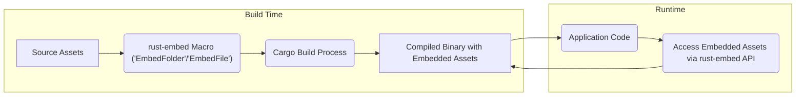

# Project Design Document: rust-embed

**Version:** 1.1
**Date:** October 26, 2023
**Author:** AI Software Architect

## 1. Introduction

This document provides an enhanced design overview of the `rust-embed` crate. This crate is a Rust library enabling developers to seamlessly integrate static assets directly into the compiled binary of their Rust applications. This design serves as a refined foundation for subsequent threat modeling activities.

## 2. Goals

* Clearly articulate the architecture and functionality of the `rust-embed` crate.
* Precisely identify the key components and detail their interactions within the system.
* Thoroughly describe the data flow during both the build and runtime phases of asset embedding and access.
* Highlight specific potential areas of security concern to guide future threat modeling efforts.

## 3. Non-Goals

* This document will not delve into the intricate implementation specifics of the Rust compiler or build tools like Cargo beyond their interaction with `rust-embed`.
* The document will not analyze the internal workings of specific compression algorithms used by `rust-embed`.
* Security considerations related to the underlying operating system or hardware environment are outside the scope of this document.

## 4. System Architecture

The `rust-embed` crate's operation is distinctly divided into two key phases: **build-time asset embedding** and **runtime asset access**.

### 4.1. High-Level Architecture

### 4.2. Detailed Architecture

The `rust-embed` crate utilizes a procedural macro (`EmbedFolder` or `EmbedFile`) to instruct the Rust compiler to incorporate specified static assets directly into the compiled binary.

**Build-Time Embedding:**

* **User Asset Declaration:** The developer identifies the assets for embedding using the `#[derive(EmbedFolder)]` or `#[derive(EmbedFile)]` attribute on a struct. This attribute specifies the file system path to the folder or individual file to be embedded.
* **Macro Expansion and Code Generation:** During compilation, the `rust-embed` macro is expanded by the Rust compiler. This macro reads the content of the specified asset files from the file system. It then generates Rust code that represents these assets as static byte arrays directly within the application's source code.
* **Cargo Build Process Integration:** The `rust-embed` macro relies on the Cargo build process to locate and access the specified assets. This process is subject to the file system permissions of the user running the build command and the integrity of the files at the given paths.
* **Compilation and Binary Creation:** The Rust compiler (`rustc`) compiles the entire codebase, including the generated code containing the static byte arrays of the embedded assets. This results in the final executable binary where the assets are part of the binary's data segment.

**Runtime Access:**

* **Binary Loading and Initialization:** When the application is executed, the operating system loads the compiled binary into memory. The embedded assets, being part of the binary's data segment, are loaded along with the program's code and other data.
* **API-Driven Access:** The `rust-embed` crate provides methods on the struct generated by the macro (e.g., `get()`, `iter()`). The application code uses these methods to access the embedded assets.
* **In-Memory Data Retrieval:** These API methods allow the application to retrieve the content of specific embedded files as immutable byte slices (`&'static [u8]`) or to iterate over the collection of embedded files and their corresponding content.
* **Independence from External Resources:** Once the binary is compiled, accessing the embedded assets does not require any interaction with the file system or any other external resources. The assets are directly available in the application's memory space.

## 5. Data Flow

The data flow within the `rust-embed` system can be visualized as follows:

```mermaid
graph LR
    A["Developer defines assets to embed using macro attributes"] --> B("Cargo build process invokes rust-embed macro during compilation");
    B --> C("rust-embed macro reads content of specified asset files from disk");
    C --> D("Asset content is transformed into static byte arrays within generated Rust code");
    D --> E("Rust compiler compiles the generated code, embedding assets into the binary");
    E --> F("Application starts, loading the binary (including embedded assets) into memory");
    F --> G("Application code calls rust-embed API to request access to an embedded asset");
    G --> H("rust-embed API retrieves the requested asset's content from the in-memory static byte arrays");
    H --> I("Asset content (as a byte slice) is returned to the application");
```

**Detailed Data Flow Description:**

1. **Asset Definition:** The developer uses the `#[derive(EmbedFolder)]` or `#[derive(EmbedFile)]` macro, specifying the path to the desired assets. This declaration is part of the application's Rust source code.
2. **Macro Invocation:** During the Cargo build process, the Rust compiler encounters the `rust-embed` macro and triggers its expansion logic.
3. **Asset Reading from Disk:** The `rust-embed` macro executes, reading the raw byte content of the files or directories specified in the macro attribute. This step involves standard file system operations.
4. **Code Generation with Embedded Data:** The macro generates Rust code. This generated code includes the content of the read assets directly embedded as static byte arrays. This generated code becomes part of the compilation unit.
5. **Compilation and Embedding:** The Rust compiler compiles the entire codebase, including the generated code containing the embedded asset data, into the final executable binary. The embedded assets are now an integral part of the binary's data segment.
6. **Binary Loading at Runtime:** When the application is launched, the operating system loads the compiled binary into the system's memory. The embedded assets are loaded into memory along with the rest of the program's data and instructions.
7. **API Access Request:** The application code utilizes the methods provided by the `rust-embed` generated struct (e.g., `get("path/to/asset.txt")`) to request access to a specific embedded asset.
8. **In-Memory Data Retrieval:** The `rust-embed` API implementation directly accesses the static byte array in memory that corresponds to the requested asset. There is no file system interaction at this stage.
9. **Asset Content Delivery:** The content of the embedded asset is returned to the application code, typically as an immutable byte slice (`&'static [u8]`).

## 6. Components

The key components involved in the `rust-embed` system are:

* **`rust-embed` Crate:** The core library providing the procedural macros (`EmbedFolder`, `EmbedFile`) and the runtime API for accessing embedded assets.
* **`EmbedFolder` and `EmbedFile` Macros:** These procedural macros are the workhorses of the build-time embedding process. They read asset files from disk and generate the necessary Rust code to embed their contents.
* **Generated Struct:** A Rust struct is automatically generated by the macros. This struct holds the embedded asset data (as static byte arrays) and implements the methods for accessing these assets at runtime (e.g., `get()`, `iter()`).
* **Cargo Build System:** The standard Rust build tool that orchestrates the compilation process. It is responsible for invoking the `rust-embed` macro during compilation.
* **Rust Compiler (`rustc`):** The compiler that takes the Rust source code (including the code generated by the `rust-embed` macro) and compiles it into the final executable binary.
* **Static Assets:** The files or directories containing the data that the developer intends to embed within the application's binary. These are the input to the embedding process.
* **Application Code:** The developer's Rust code that utilizes the `rust-embed` crate to declare assets for embedding and subsequently access them at runtime.

## 7. Security Considerations

This section outlines potential security considerations relevant to the `rust-embed` crate, serving as a guide for subsequent threat modeling activities.

* **Build-Time Vulnerabilities:**
    * **Path Traversal Vulnerabilities:** If the file paths provided to the `EmbedFolder` or `EmbedFile` macros are not rigorously validated, a malicious actor could potentially craft paths that escape the intended directory and embed unintended or sensitive files.
    * **Symbolic Link Exploitation:** If the specified asset paths contain symbolic links, the macro might follow these links and embed files that were not explicitly intended, potentially leading to the inclusion of malicious or sensitive data.
    * **Compromised Source Assets:** If the source assets themselves are compromised (e.g., containing malware or sensitive information), this malicious content will be directly embedded into the application binary.
    * **Supply Chain Attacks via Dependencies:** The `rust-embed` crate has its own dependencies. Vulnerabilities in these dependencies could potentially be exploited during the build process, leading to the injection of malicious code or the embedding of unwanted assets.
* **Runtime Vulnerabilities:**
    * **Information Disclosure through Improper Handling:** While the assets are embedded within the binary, improper handling of the retrieved asset data within the application code could lead to unintended information disclosure (e.g., logging sensitive data, exposing it through an API).
    * **Denial of Service due to Large Assets:** Accessing extremely large embedded files could potentially lead to memory exhaustion or performance degradation, resulting in a denial-of-service condition if not handled with appropriate resource management.
    * **Indirect Code Injection Risks:** If the embedded assets are used to generate code or influence application behavior (e.g., template files), and the content of these assets is not properly sanitized, it could create indirect code injection vulnerabilities.
* **Configuration and Usage Vulnerabilities:**
    * **Insecure Default Configurations (if any):** While `rust-embed` has minimal runtime configuration, any default behaviors that are not secure could introduce vulnerabilities.
    * **Lack of Control over Asset Processing:** Limited control over how assets are processed during embedding (e.g., lack of integrity checks) could introduce risks.
* **General Security Considerations:**
    * **Integrity of the Build Environment:** A compromised build environment could lead to the embedding of malicious assets without the developer's knowledge.
    * **Supply Chain Security of `rust-embed`:** The security of the `rust-embed` crate itself and its dependencies is paramount. Regular security audits and updates are crucial.

## 8. Deployment Considerations

The primary advantage of using `rust-embed` is the simplification of deployment, as all necessary static assets are included within the application's executable. However, this approach also has implications:

* **Increased Binary Size:** Embedding assets directly increases the size of the final binary. This can impact download times, storage requirements, and memory footprint.
* **Resource Usage at Runtime:** Accessing and using large embedded assets can consume significant memory resources at runtime.
* **Update Cycle Implications:** Updating embedded assets necessitates a recompilation and redeployment of the entire application binary. This might not be suitable for frequently changing assets.
* **Trade-offs with External Asset Management:**  Consider the trade-offs between the convenience of embedded assets and the flexibility of managing assets separately (e.g., for easier updates or conditional loading).

## 9. Future Considerations

Potential future enhancements or changes to `rust-embed` that could impact its design and security:

* **More Granular Control over Embedding:** Providing more fine-grained control over which specific assets within a folder are embedded, potentially through include/exclude patterns or more advanced filtering mechanisms.
* **Dynamic Asset Loading Options:** Exploring the possibility of offering options for dynamically loading assets in addition to the current embedding approach, providing more flexibility for different use cases.
* **Enhanced Security Features:** Implementing features such as integrity checks (e.g., checksums) for embedded assets to detect tampering.
* **Improved Error Handling and Reporting:** Providing more detailed and informative error messages during both the build and runtime phases to aid in debugging and security analysis.
* **Support for Asset Compression Options:** Offering more control over compression algorithms and settings to balance binary size and runtime performance.

This improved document provides a more detailed and refined understanding of the `rust-embed` crate's design and operation. The highlighted security considerations offer a more specific and actionable basis for conducting thorough threat modeling activities.