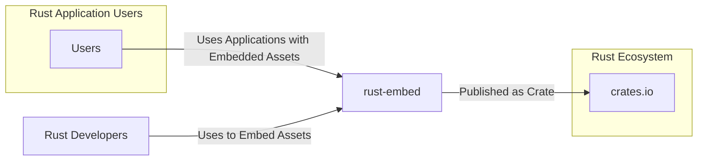
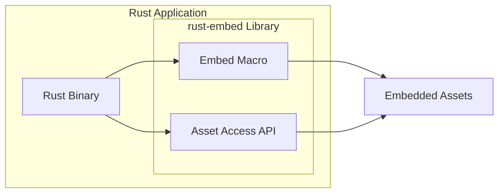
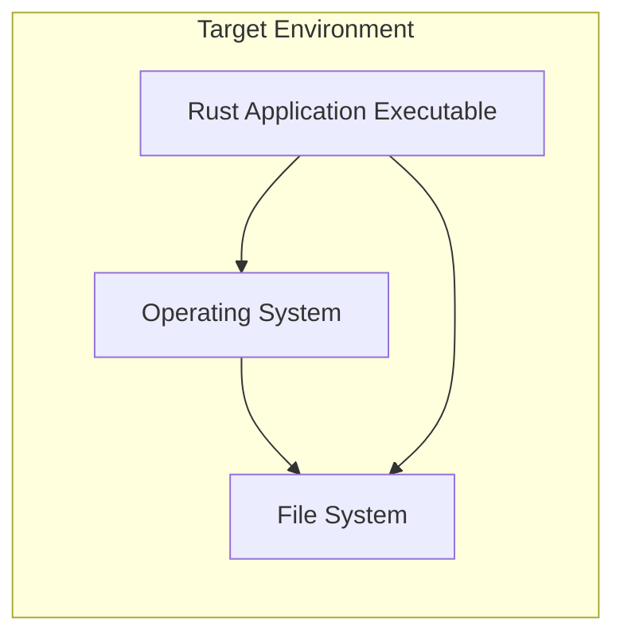

# BUSINESS POSTURE

- Business Priorities and Goals:
  - Enable Rust developers to easily embed static assets (like HTML, CSS, JavaScript, images, etc.) directly into their compiled Rust binaries.
  - Simplify the distribution and deployment of Rust applications by bundling assets within the executable, eliminating the need for separate asset files or directories.
  - Improve the user experience by ensuring that applications are self-contained and assets are readily available without complex configuration.
  - Enhance application portability by reducing dependencies on external file systems for static assets.
- Business Risks:
  - Increased binary size due to embedded assets, potentially impacting download times and storage requirements.
  - Potential security vulnerabilities if embedded assets are not properly managed or sanitized, especially if they are dynamically served or processed by the application.
  - Risk of including sensitive data within embedded assets if not handled carefully.
  - Dependency on the 'rust-embed' library itself, introducing a supply chain risk if the library is compromised or contains vulnerabilities.

# SECURITY POSTURE

- Existing Security Controls:
  - security control: Rust's memory safety features inherently reduce the risk of memory-related vulnerabilities in the library itself. (Implemented by: Rust Language)
  - security control: Use of `cargo` for dependency management, which includes checksum verification for downloaded crates. (Implemented by: Cargo build system)
  - security control: Code hosted on GitHub, allowing for community review and scrutiny. (Implemented by: GitHub platform)
- Accepted Risks:
  - accepted risk: Potential vulnerabilities in dependencies of 'rust-embed' that are not yet identified or patched.
  - accepted risk: Risk of developer misuse of 'rust-embed' leading to security issues in the applications that use it (e.g., embedding and serving untrusted content without proper sanitization).
  - accepted risk: Reliance on the security of the crates.io registry for distributing the library.
- Recommended Security Controls:
  - security control: Implement automated security scanning (e.g., `cargo audit`, `cargo deny`) in the CI/CD pipeline to detect known vulnerabilities in dependencies and enforce security policies.
  - security control: Conduct regular security audits of the 'rust-embed' codebase, especially before major releases, to identify and address potential security flaws.
  - security control: Provide clear documentation and examples for developers on secure usage of 'rust-embed', highlighting potential security pitfalls and best practices for handling embedded assets.
  - security control: Consider signing releases of the 'rust-embed' crate to enhance supply chain security and verify the authenticity of the library.
- Security Requirements:
  - Authentication: Not directly applicable to a library like 'rust-embed'. Authentication is the responsibility of the applications that use this library.
  - Authorization: Not directly applicable to 'rust-embed'. Authorization is the responsibility of the applications that use this library to control access to the embedded assets if needed.
  - Input Validation: Input validation is relevant to 'rust-embed' in the context of how it processes configuration or user-provided paths for embedding assets. Ensure proper validation to prevent path traversal or other input-related vulnerabilities.
  - Cryptography: Cryptography might be relevant if there's a need to embed encrypted assets. 'rust-embed' itself doesn't inherently require cryptography, but applications using it might need to decrypt embedded assets at runtime. If so, ensure secure cryptographic practices are followed in the application.

# DESIGN

## C4 CONTEXT



- Context Diagram Elements:
  - - Name: Users
    - Type: Person
    - Description: End-users who interact with Rust applications that utilize 'rust-embed' to serve embedded static assets.
    - Responsibilities: Use applications and access functionalities provided by them, including accessing embedded static assets.
    - Security controls: Security controls are not directly implemented by users but are enforced by the applications they use.
  - - Name: crates.io
    - Type: System
    - Description: The official package registry for Rust crates, used to distribute and download 'rust-embed' and other Rust libraries.
    - Responsibilities: Host and distribute 'rust-embed' crate, ensuring availability and integrity of the package.
    - Security controls: crates.io implements security controls to protect the registry and ensure the integrity of published crates, including checksum verification and account security.
  - - Name: rust-embed
    - Type: Software System
    - Description: A Rust library that allows developers to embed static assets into Rust binaries during compilation.
    - Responsibilities: Provide macros and functionality to embed files and directories into Rust binaries, making them accessible at runtime.
    - Security controls: Implements input validation for configuration paths, and relies on Rust's memory safety. Recommended security controls include automated security scanning and code audits.
  - - Name: Rust Developers
    - Type: Person
    - Description: Software developers who use the 'rust-embed' library to embed static assets in their Rust applications.
    - Responsibilities: Integrate 'rust-embed' into their projects, configure asset embedding, and use the library's API to access embedded assets in their applications.
    - Security controls: Developers are responsible for using 'rust-embed' securely, including proper handling of embedded assets and following security best practices in their applications.

## C4 CONTAINER



- Container Diagram Elements:
  - - Name: Rust Binary
    - Type: Container (Process)
    - Description: The compiled Rust executable that incorporates the 'rust-embed' library and embedded assets. This is the runtime environment for the application.
    - Responsibilities: Execute the Rust application logic, serve embedded static assets to users (if applicable), and manage application functionalities.
    - Security controls: Security controls are application-specific and depend on the overall application architecture. 'rust-embed' contributes by embedding assets securely within this binary.
  - - Name: Embed Macro
    - Type: Container (Code Module)
    - Description: A macro provided by 'rust-embed' that is used at compile time to embed specified files and directories into the Rust binary.
    - Responsibilities: Read and process configuration for asset embedding, embed the content of specified files into the compiled binary during the build process.
    - Security controls: Input validation on configuration paths to prevent path traversal vulnerabilities during the embedding process.
  - - Name: Asset Access API
    - Type: Container (Code Module)
    - Description:  Runtime API provided by 'rust-embed' that allows the Rust application to access the embedded assets as byte arrays or strings.
    - Responsibilities: Provide functions and methods to retrieve embedded assets by name or path at runtime, allowing the application to use these assets.
    - Security controls:  The API itself is designed to be memory-safe due to Rust's features. Security considerations are primarily related to how the application uses the retrieved assets.
  - - Name: Embedded Assets
    - Type: Data Store (In-Memory)
    - Description: The static files and directories that are embedded within the Rust binary during compilation using 'rust-embed'. These assets are stored in memory when the application runs.
    - Responsibilities: Store the content of static assets, making them available for access by the application at runtime.
    - Security controls: Security depends on the source of these assets and how they are handled by the application. Ensure assets are from trusted sources and are sanitized if necessary before being served or processed.

## DEPLOYMENT

- Deployment Architecture Options:
  - Option 1: Standalone Executable Deployment: Deploy the compiled Rust binary as a standalone executable on target operating systems (Linux, Windows, macOS). This is the most common and straightforward deployment method for applications using 'rust-embed'.
  - Option 2: Containerized Deployment: Package the Rust binary into a container image (e.g., Docker) and deploy it in container orchestration platforms like Kubernetes or Docker Swarm. This provides isolation and scalability.
  - Option 3: Serverless Deployment: Deploy the Rust binary as a serverless function (e.g., AWS Lambda, Google Cloud Functions, Azure Functions). This is suitable for event-driven applications.

- Detailed Deployment Architecture (Option 1: Standalone Executable Deployment):



- Deployment Diagram Elements:
  - - Name: Operating System
    - Type: Infrastructure (Operating System)
    - Description: The target operating system (e.g., Linux, Windows, macOS) where the Rust application will be executed.
    - Responsibilities: Provide the runtime environment for the Rust application, manage system resources, and handle system calls.
    - Security controls: Operating system security controls include user access management, process isolation, and security updates.
  - - Name: File System
    - Type: Infrastructure (File System)
    - Description: The file system on the target operating system where the Rust application executable is stored and executed.
    - Responsibilities: Store the application executable and any necessary configuration files (though 'rust-embed' aims to minimize external files).
    - Security controls: File system permissions and access controls to protect the application executable and prevent unauthorized modifications.
  - - Name: Rust Application Executable
    - Type: Software (Executable)
    - Description: The compiled Rust binary that includes the 'rust-embed' library and embedded assets. This is the deployed application.
    - Responsibilities: Execute the application logic, serve embedded assets, and provide application functionalities to users.
    - Security controls: Application-level security controls, including those related to handling embedded assets securely. Security controls inherited from the Rust language and 'rust-embed' library.

## BUILD

```mermaid
flowchart LR
    A[Developer] --> B{Code Changes};
    B --> C[Version Control (Git/GitHub)];
    C --> D[CI/CD System (GitHub Actions)];
    D --> E[Build Process (cargo build)];
    E --> F{Security Checks (cargo audit, linters)};
    F --> G[Build Artifacts (Executable)];
    G --> H[Publish (crates.io - for library)];
```

- Build Process Elements:
  - - Name: Developer
    - Type: Person
    - Description: Software developer who writes and modifies the code for 'rust-embed' or applications using it.
    - Responsibilities: Write code, commit changes to version control, and potentially trigger the build process.
    - Security controls: Developer workstations should be secured, and developers should follow secure coding practices.
  - - Name: Version Control (Git/GitHub)
    - Type: Tool/Platform
    - Description: Git repository hosted on GitHub used for source code management and collaboration.
    - Responsibilities: Store source code, track changes, manage branches, and facilitate collaboration among developers.
    - Security controls: Access control to the repository, branch protection rules, and audit logs. GitHub also provides security features like Dependabot for dependency vulnerability scanning.
  - - Name: CI/CD System (GitHub Actions)
    - Type: Tool/Platform
    - Description: GitHub Actions used for automating the build, test, and release processes.
    - Responsibilities: Automate the build process, run tests, perform security checks, and create build artifacts.
    - Security controls: Secure configuration of CI/CD pipelines, secrets management for credentials, and access control to workflow definitions.
  - - Name: Build Process (cargo build)
    - Type: Tool/Process
    - Description: The Rust build system (`cargo`) used to compile the Rust code and link dependencies.
    - Responsibilities: Compile Rust code, resolve dependencies, link libraries, and produce executable binaries or library crates.
    - Security controls: Cargo includes checksum verification for dependencies. Security controls are enhanced by integrating security checks into the build process.
  - - Name: Security Checks (cargo audit, linters)
    - Type: Tool/Process
    - Description: Automated security scanning tools like `cargo audit` (for dependency vulnerability checks) and linters (for code quality and style checks) integrated into the build process.
    - Responsibilities: Identify known vulnerabilities in dependencies and potential code quality issues or security flaws in the codebase.
    - Security controls: Automated security checks help to proactively identify and address security issues early in the development lifecycle.
  - - Name: Build Artifacts (Executable)
    - Type: File/Package
    - Description: The compiled Rust executable or library crate produced by the build process.
    - Responsibilities: Package the compiled code and embedded assets into a distributable artifact.
    - Security controls: Ensure build artifacts are generated from trusted and verified source code and build environment. Consider signing artifacts for integrity verification.
  - - Name: Publish (crates.io - for library)
    - Type: Tool/Platform
    - Description: Publishing the 'rust-embed' crate to crates.io to make it available to Rust developers.
    - Responsibilities: Distribute the 'rust-embed' library to the Rust ecosystem.
    - Security controls: crates.io security controls for publishing and distributing crates. Consider signing releases for enhanced security.

# RISK ASSESSMENT

- Critical Business Processes:
  - For 'rust-embed' as a library, the critical business process is enabling developers to efficiently and securely embed static assets in their Rust applications. The library's reliability, security, and ease of use directly impact the development and deployment workflows of its users.
- Data to Protect and Sensitivity:
  - Data being protected in the context of 'rust-embed' are the static assets that developers choose to embed. The sensitivity of this data depends entirely on the application using 'rust-embed'. Assets could range from public images and stylesheets to potentially sensitive configuration files or application data.
  - Sensitivity levels vary greatly:
    - Public Assets (low sensitivity): Images, CSS, JavaScript files intended for public access. Compromise might lead to defacement or minor disruptions.
    - Application Configuration (medium sensitivity): Configuration files embedded for convenience. Exposure could reveal application settings or internal structure.
    - Sensitive Application Data (high sensitivity): Embedding sensitive data directly into the binary is generally discouraged but technically possible. Exposure would have severe consequences depending on the nature of the data (e.g., API keys, secrets).

# QUESTIONS & ASSUMPTIONS

- Questions:
  - What are the intended use cases for applications using 'rust-embed'? (e.g., web applications, desktop applications, embedded systems). This would help to refine the threat model.
  - Are there any specific compliance requirements for applications using 'rust-embed' (e.g., GDPR, HIPAA)? This could influence security requirements.
  - What is the risk appetite of organizations using 'rust-embed'? (Startups might accept more risks than Fortune 500 companies).
- Assumptions:
  - BUSINESS POSTURE: The primary business goal is to provide a convenient and efficient way for Rust developers to embed static assets, simplifying application deployment and distribution.
  - SECURITY POSTURE:  The current security posture relies heavily on Rust's inherent memory safety and standard Rust development practices. There is an awareness of supply chain risks and a need for more proactive security measures in the build and release process.
  - DESIGN: The design is centered around providing a macro and API for embedding and accessing assets. The deployment model is flexible, supporting various deployment scenarios for Rust applications. The build process is assumed to be using standard Rust tooling (cargo) and can be enhanced with CI/CD and security checks.