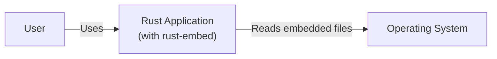
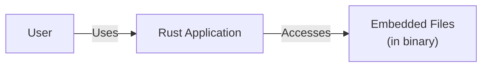
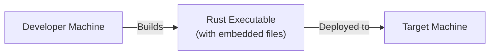
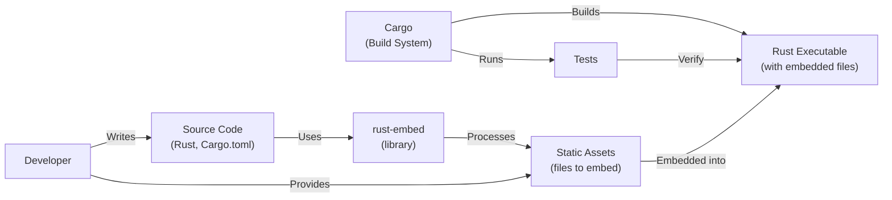

Okay, let's create a design document for the `rust-embed` project.

# BUSINESS POSTURE

Business Priorities and Goals:

*   Provide a simple, easy-to-use mechanism for embedding static assets (files) directly into Rust executables.
*   Reduce the complexity of deploying Rust applications by eliminating the need for external file dependencies.
*   Improve application startup time by avoiding file I/O for embedded assets.
*   Enhance the portability of Rust applications by creating self-contained binaries.
*   Offer a solution that integrates well with the Rust build system (Cargo).

Most Important Business Risks:

*   Incorrect implementation leading to runtime errors or unexpected behavior when accessing embedded files.
*   Security vulnerabilities introduced by mishandling of embedded file data (e.g., path traversal, buffer overflows).
*   Performance issues if the embedding process or runtime access is inefficient, especially with large files.
*   Compatibility problems with different operating systems or target architectures.
*   Lack of features or flexibility compared to alternative solutions, hindering adoption.
*   Maintenance overhead and difficulty in keeping the library up-to-date with Rust language changes and best practices.

# SECURITY POSTURE

Existing Security Controls:

*   security control: The library uses Rust's strong type system and memory safety guarantees to prevent common vulnerabilities like buffer overflows. (Implemented in the Rust language itself).
*   security control: The library appears to perform basic path sanitization to prevent directory traversal attacks. (Described in the project's README and source code).
*   security control: The library uses `include_bytes!` and `include_str!` macros, which are built-in Rust features for including file contents at compile time. These macros are generally considered safe. (Implemented in the Rust language itself).
*   security control: The library has unit tests to verify the correctness of its functionality. (Described in the project's test suite).

Accepted Risks:

*   accepted risk: The library does not currently provide built-in mechanisms for encrypting or decrypting embedded files. Users are responsible for implementing their own encryption if needed.
*   accepted risk: The library does not explicitly handle potential denial-of-service (DoS) attacks caused by embedding extremely large files, which could lead to excessive memory consumption.
*   accepted risk: The library's security relies on the security of the underlying Rust compiler and standard library. Any vulnerabilities in those components could potentially affect the library.

Recommended Security Controls:

*   security control: Integrate a fuzzer to test the library's handling of various file inputs, including malformed or malicious files.
*   security control: Conduct a security audit of the codebase to identify any potential vulnerabilities.
*   security control: Consider adding support for content security policies (CSPs) or other mechanisms to restrict the execution of embedded scripts or other potentially dangerous content.
*   security control: Provide clear documentation on security best practices for using the library, including recommendations for handling sensitive data.

Security Requirements:

*   Authentication: Not directly applicable, as the library deals with embedding static assets, not user authentication.
*   Authorization: Not directly applicable, as access control is typically handled at the application level, not within the embedded assets themselves. However, if embedded assets contain sensitive information, the application should implement appropriate authorization mechanisms to control access to that information.
*   Input Validation: The library should validate file paths to prevent directory traversal vulnerabilities. This includes ensuring that paths do not contain "..", "/", or other special characters that could be used to access files outside the intended directory.
*   Cryptography: The library itself does not require cryptographic functionality. However, if users need to embed encrypted files, they should use a separate encryption library to encrypt the files before embedding them and decrypt them after retrieval. The library should provide documentation or examples on how to do this.

# DESIGN

## C4 CONTEXT

Element Description:

*   Element:
    *   Name: User
    *   Type: Person
    *   Description: A user interacting with the Rust application.
    *   Responsibilities: Runs the Rust application.
    *   Security controls: None (handled by the application).

*   Element:
    *   Name: Rust Application (with rust-embed)
    *   Type: Software System
    *   Description: A Rust application that uses the rust-embed library to access embedded files.
    *   Responsibilities: Provides application functionality, accesses embedded files using rust-embed.
    *   Security controls: Relies on Rust's memory safety, path sanitization in rust-embed, and application-specific security measures.

*   Element:
    *   Name: Operating System
    *   Type: Software System
    *   Description: The operating system on which the Rust application runs.
    *   Responsibilities: Provides file system access, memory management, and other system services.
    *   Security controls: OS-level security controls (e.g., file permissions, ASLR).

## C4 CONTAINER

Element Description:

*   Element:
    *   Name: User
    *   Type: Person
    *   Description: A user interacting with the Rust application.
    *   Responsibilities: Runs the Rust application.
    *   Security controls: None (handled by the application).

*   Element:
    *   Name: Rust Application
    *   Type: Container (Executable)
    *   Description: The compiled Rust application, including the rust-embed library and embedded files.
    *   Responsibilities: Provides application functionality, accesses embedded files using rust-embed.
    *   Security controls: Relies on Rust's memory safety, path sanitization in rust-embed, and application-specific security measures.

*   Element:
    *   Name: Embedded Files (in binary)
    *   Type: Data
    *   Description: The static files embedded directly into the Rust executable.
    *   Responsibilities: Stores static data used by the application.
    *   Security controls: Path sanitization during embedding, potential encryption by the user before embedding.

## DEPLOYMENT

Possible Deployment Solutions:

1.  Single Executable: The most common and straightforward approach. The Rust application, along with embedded files, is compiled into a single, self-contained executable.
2.  Dynamic Linking (Less Common): While rust-embed is primarily designed for static embedding, it's theoretically possible to use dynamic linking with a separate data file. However, this defeats the purpose of the library and is not recommended.

Chosen Solution (Single Executable):

Element Description:

*   Element:
    *   Name: Developer Machine
    *   Type: Infrastructure Node
    *   Description: The machine used by the developer to build the Rust application.
    *   Responsibilities: Compiles the Rust code, embeds the files, and creates the executable.
    *   Security controls: Developer machine security best practices (e.g., secure coding environment, up-to-date software).

*   Element:
    *   Name: Target Machine
    *   Type: Infrastructure Node
    *   Description: The machine where the Rust application will be deployed and run.
    *   Responsibilities: Executes the Rust application.
    *   Security controls: OS-level security controls, application-specific security measures.

*   Element:
    *   Name: Rust Executable (with embedded files)
    *   Type: Software
    *   Description: The compiled Rust application, including the embedded files.
    *   Responsibilities: Provides application functionality.
    *   Security controls: Rust's memory safety, path sanitization in rust-embed.

## BUILD

Build Process Description:

1.  The developer writes the Rust source code and specifies the files to be embedded using the `rust-embed` macro in their code and configuration in `Cargo.toml`.
2.  The developer uses Cargo (the Rust build system) to build the project.
3.  Cargo downloads the `rust-embed` library as a dependency.
4.  During the build process, `rust-embed` processes the specified static assets. This typically involves:
    *   Reading the files from the file system.
    *   Generating Rust code that represents the file contents as byte arrays.
    *   Including this generated code in the application's source code.
5.  Cargo compiles the Rust code, including the generated code from `rust-embed`, into a single executable.
6.  Cargo runs the project's tests, which may include tests that verify the correct embedding and retrieval of files.
7.  The final output is a Rust executable with the static assets embedded directly within it.

Security Controls in Build Process:

*   security control: Dependency Management: Cargo manages dependencies, ensuring that the correct version of `rust-embed` is used.
*   security control: Code Generation: `rust-embed` generates Rust code, which is then compiled by the Rust compiler, benefiting from Rust's safety checks.
*   security control: Testing: Unit tests help ensure the correctness of the embedding and retrieval process.
*   security control: Supply Chain Security: Using a trusted package manager like `crates.io` helps mitigate the risk of using compromised dependencies. Regularly updating dependencies is crucial. Tools like `cargo-audit` can be used to check for known vulnerabilities in dependencies.
*   security control: Static Analysis: Rust's built-in compiler checks and linters (like Clippy) can help identify potential security issues in the code.

# RISK ASSESSMENT

Critical Business Processes:

*   Application Startup: Fast and reliable startup is crucial for a good user experience.
*   Asset Delivery: The application must be able to access its embedded assets correctly and efficiently.
*   Application Portability: The application should be easily deployable across different environments without requiring complex setup or external dependencies.

Data Sensitivity:

*   Embedded assets can range from non-sensitive (e.g., images, CSS) to highly sensitive (e.g., configuration files, cryptographic keys).
*   The sensitivity of the data being embedded dictates the level of security required. If sensitive data is embedded, additional measures like encryption should be considered.

# QUESTIONS & ASSUMPTIONS

Questions:

*   Are there any specific performance requirements for accessing embedded files (e.g., latency, throughput)?
*   What is the maximum expected size of the embedded files?
*   Are there any specific operating systems or target architectures that need to be supported?
*   Are there any plans to embed sensitive data (e.g., API keys, passwords)? If so, what measures will be taken to protect this data?
*   What is the expected frequency of updates to the embedded files?
*   Is there a need to support dynamic updates to the embedded files without recompiling the application?

Assumptions:

*   BUSINESS POSTURE: The primary goal is to simplify deployment and improve application portability.
*   BUSINESS POSTURE: The project has a moderate risk appetite, prioritizing ease of use and performance while still addressing basic security concerns.
*   SECURITY POSTURE: The developers are familiar with Rust's security features and best practices.
*   SECURITY POSTURE: The embedded files are generally not highly sensitive. If sensitive data is embedded, the developers will implement additional security measures (e.g., encryption).
*   DESIGN: The application will be deployed as a single executable.
*   DESIGN: The build process will use Cargo and the standard Rust toolchain.
*   DESIGN: The embedded files will be accessed relatively infrequently (i.e., not in a performance-critical loop).
*   DESIGN: The size of embedded files is within reasonable limits, not causing excessive binary size or memory consumption.