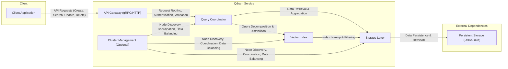

# Project Design Document: Qdrant Vector Database

**Version:** 1.1
**Date:** October 26, 2023
**Author:** AI Software Architect

## 1. Introduction

This document provides an enhanced and detailed design overview of the Qdrant vector database, an open-source vector similarity search engine. This document aims to clearly articulate the system's architecture, components, data flow, and key technologies, providing a robust foundation for subsequent threat modeling activities.

### 1.1. Purpose

The primary purpose of this document is to provide a comprehensive and refined architectural understanding of Qdrant. This enhanced understanding is crucial for identifying a wider range of potential security vulnerabilities and designing more effective mitigation strategies during the threat modeling process.

### 1.2. Scope

This document covers the core architectural components and functionalities of Qdrant as described in the provided GitHub repository, with added detail and clarification. It focuses on the logical and physical architecture, data flow, and key interactions between components. It maintains a high-level perspective, avoiding deep dives into individual code modules while providing sufficient detail for security analysis.

### 1.3. Target Audience

This document is intended for:

*   Security engineers and architects responsible for in-depth threat modeling of Qdrant.
*   Development teams requiring a thorough understanding of the system architecture for development and maintenance.
*   Operations engineers planning and managing Qdrant deployments in various environments.

## 2. System Overview

Qdrant is designed as a robust and scalable service for storing, indexing, and searching high-dimensional vectors. It offers a comprehensive API for interacting with the database and supports advanced features like filtering based on vector metadata (payloads), vector storage options, and clustering for horizontal scalability.

### 2.1. High-Level Architecture Diagram

### 2.2. Key Components

*   **API Gateway:** The externally facing entry point for all client interactions. It exposes both gRPC and HTTP APIs, providing a consistent interface for managing collections, inserting data points (vectors with payloads), and performing similarity searches. It handles initial request processing, including authentication and authorization.
*   **Query Coordinator:** The central orchestrator for query processing. It receives validated requests from the API Gateway, determines the optimal execution plan, routes sub-queries to the appropriate nodes (in a distributed setup), coordinates the search process across multiple shards, and aggregates the results before returning them.
*   **Vector Index:** The core component responsible for the efficient indexing and searching of high-dimensional vectors. It utilizes advanced indexing algorithms, such as Hierarchical Navigable Small Worlds (HNSW), to optimize similarity search performance. It also handles filtering based on vector payloads.
*   **Storage Layer:** Manages the persistent storage of vector data, associated metadata (payloads), and the index structures themselves. It interacts with the underlying persistent storage medium, which can be local disk or cloud-based object storage. It ensures data durability and provides mechanisms for efficient data retrieval.
*   **Cluster Management (Optional):**  Responsible for managing the nodes within a Qdrant cluster. This includes node discovery, membership management, data distribution (sharding), replication for fault tolerance, and load balancing across the cluster. It ensures the overall health and scalability of the distributed Qdrant deployment.

## 3. Component Details

### 3.1. API Gateway

*   **Functionality:**
    *   Receives and processes client requests via gRPC and HTTP/2 (for gRPC) and HTTP/1.1 (for HTTP).
    *   Performs authentication (e.g., API keys, OAuth 2.0) and authorization based on configured policies.
    *   Validates incoming requests against defined schemas and constraints to prevent malformed data.
    *   Routes validated requests to the appropriate instance of the Query Coordinator.
    *   Handles request and response serialization/deserialization (e.g., using Protocol Buffers for gRPC, JSON for HTTP).
    *   Manages API versioning to ensure backward compatibility.
    *   May implement rate limiting and request throttling to protect against abuse.
*   **Protocols:** gRPC, HTTP/2, HTTP/1.1.
*   **Security Considerations:**  Primary target for API-specific attacks such as injection flaws (e.g., SQL injection if interacting with a backend database for metadata), authentication and authorization bypass vulnerabilities, and denial-of-service attacks. Proper implementation of authentication, authorization, input validation, and rate limiting is critical.

### 3.2. Query Coordinator

*   **Functionality:**
    *   Receives processed and authenticated requests from the API Gateway.
    *   Analyzes the query and determines the optimal execution strategy, including identifying the relevant data shards or nodes for the query.
    *   Distributes search requests to the Vector Index instances on the appropriate nodes in a distributed setup.
    *   Coordinates the parallel execution of search operations across multiple shards.
    *   Aggregates intermediate results from different nodes.
    *   Applies filtering conditions based on vector payloads.
    *   Performs post-processing operations such as result ranking and limiting.
    *   Returns the final, aggregated results to the API Gateway.
*   **Interactions:** Communicates extensively with the Vector Index and Storage Layer on local and remote nodes. In a clustered environment, it relies heavily on the Cluster Management component for node information and coordination.
*   **Security Considerations:**  Vulnerable to denial-of-service attacks if not properly resource-managed. Logic flaws in query routing or aggregation could lead to data leaks or incorrect search results. Improper handling of inter-node communication could expose sensitive data.

### 3.3. Vector Index

*   **Functionality:**
    *   Stores and efficiently manages the vector index structures, optimized for high-dimensional similarity search.
    *   Performs fast approximate nearest neighbor (ANN) searches based on the chosen indexing algorithm (e.g., HNSW).
    *   Supports filtering of search results based on associated metadata (payload) values.
    *   Handles updates (additions, modifications, deletions) of vectors and their associated payloads, maintaining index consistency.
    *   May support different indexing algorithms and configuration options to tune performance and accuracy.
*   **Algorithms:**  Typically utilizes algorithms like HNSW, but the architecture might allow for pluggable indexing strategies.
*   **Security Considerations:**  Vulnerabilities in the implementation of the indexing algorithm could potentially lead to crashes, incorrect search results, or even information disclosure. Access control mechanisms to the index data are crucial to prevent unauthorized access or modification. Resource exhaustion attacks targeting index building or searching are also a concern.

### 3.4. Storage Layer

*   **Functionality:**
    *   Provides persistent storage for vector data, metadata (payloads), and the serialized index structures.
    *   Offers mechanisms for efficient data retrieval based on vector IDs or other identifiers.
    *   May implement caching mechanisms (e.g., in-memory caches, disk-based caches) to improve read performance.
    *   Handles data serialization and deserialization for storage and retrieval.
    *   Ensures data durability and consistency, potentially through techniques like write-ahead logging or replication.
*   **Persistence:**  Can utilize local file systems, network-attached storage (NAS), or cloud-based object storage services (e.g., AWS S3, Azure Blob Storage, Google Cloud Storage).
*   **Security Considerations:**  Data at rest encryption is paramount to protect sensitive vector data and metadata. Access control to the underlying storage medium is critical to prevent unauthorized access or modification. Vulnerabilities in data serialization/deserialization could lead to remote code execution or data corruption.

### 3.5. Cluster Management (Optional)

*   **Functionality:**
    *   Manages the lifecycle of nodes within a Qdrant cluster, including node discovery, joining, and leaving the cluster.
    *   Maintains a consistent view of the cluster topology and node health.
    *   Distributes data across nodes using sharding strategies to achieve horizontal scalability.
    *   Coordinates data replication across multiple nodes to ensure fault tolerance and high availability.
    *   Performs load balancing by distributing query load across available nodes.
    *   Monitors node health and performance, triggering alerts or recovery actions as needed.
*   **Communication:**  Relies on network communication protocols (e.g., gRPC, TCP) for inter-node communication. May utilize a consensus algorithm (e.g., Raft) for maintaining cluster state.
*   **Security Considerations:**  Secure inter-node communication is vital to prevent eavesdropping, tampering, or man-in-the-middle attacks. Robust authentication and authorization mechanisms are needed for inter-node communication. Vulnerabilities in the consensus algorithm implementation could lead to split-brain scenarios or data inconsistencies.

## 4. Data Flow

### 4.1. Data Insertion (Detailed)

1. A client application sends an insert request containing one or more vectors and their associated payloads to the **API Gateway**.
2. The **API Gateway** authenticates the client and validates the request data against predefined schemas.
3. The **API Gateway** forwards the validated request to the **Query Coordinator**.
4. The **Query Coordinator** determines the target shard(s) for the new data based on the configured sharding strategy (e.g., consistent hashing).
5. The **Query Coordinator** sends the vector data and payload to the **Vector Index** and **Storage Layer** on the designated node(s).
6. The **Vector Index** updates its index structures to include the new vectors.
7. The **Storage Layer** persists the vector data and payload to the underlying storage medium.
8. The **Query Coordinator** receives confirmation of successful insertion from the involved nodes.
9. The **Query Coordinator** sends a success response back to the **API Gateway**.
10. The **API Gateway** relays the success response to the client application.

### 4.2. Vector Search (Detailed)

1. A client application sends a search request containing a query vector and optional filters (based on payload) to the **API Gateway**.
2. The **API Gateway** authenticates the client and validates the search request.
3. The **API Gateway** forwards the validated request to the **Query Coordinator**.
4. The **Query Coordinator** identifies the relevant shards to search based on the query and configured sharding.
5. The **Query Coordinator** sends the search request to the **Vector Index** on the selected node(s).
6. The **Vector Index** performs an approximate nearest neighbor search using the query vector and applies any specified filters.
7. The **Vector Index** retrieves the IDs of the most similar vectors that match the filter criteria.
8. The **Query Coordinator** retrieves the corresponding vector data and payloads from the **Storage Layer** on the relevant node(s).
9. The **Query Coordinator** aggregates and ranks the results from different shards (if applicable).
10. The **Query Coordinator** sends the final, ranked search results to the **API Gateway**.
11. The **API Gateway** sends the search results back to the client application.

## 5. Security Considerations (Enhanced)

This section expands on the initial security considerations, providing more specific examples of potential threats and security measures.

*   **Authentication and Authorization:**
    *   **Threats:** Unauthorized access to data, modification of data by unauthorized users, impersonation of legitimate clients.
    *   **Mitigations:** Implement strong authentication mechanisms (e.g., API keys with proper rotation, OAuth 2.0 for delegated authorization), enforce granular authorization policies based on roles or permissions, use TLS/SSL for all API communication.
*   **Data Encryption:**
    *   **Threats:** Exposure of sensitive vector data and metadata if storage is compromised or network traffic is intercepted.
    *   **Mitigations:** Implement encryption at rest for the Storage Layer (e.g., using disk encryption or cloud provider encryption services), enforce TLS/SSL for all communication between components and with clients.
*   **Input Validation:**
    *   **Threats:** Injection attacks (e.g., attempts to inject malicious code or queries), denial-of-service attacks through malformed requests.
    *   **Mitigations:** Implement strict input validation at the API Gateway and within internal components, sanitize user-provided data, use parameterized queries or prepared statements if interacting with backend databases for metadata.
*   **Rate Limiting and Throttling:**
    *   **Threats:** Denial-of-service attacks by overwhelming the system with excessive requests.
    *   **Mitigations:** Implement rate limiting at the API Gateway to restrict the number of requests from a single source within a given time period, use request throttling to prevent resource exhaustion.
*   **Network Security:**
    *   **Threats:** Eavesdropping on inter-component communication, man-in-the-middle attacks, unauthorized access to internal services.
    *   **Mitigations:** Secure inter-node communication using TLS/SSL or other secure protocols, segment the network to isolate Qdrant components, use firewalls to restrict access to specific ports and services.
*   **Secrets Management:**
    *   **Threats:** Exposure of sensitive credentials (e.g., API keys, database passwords) if stored insecurely.
    *   **Mitigations:** Use a dedicated secrets management system (e.g., HashiCorp Vault, AWS Secrets Manager, Azure Key Vault) to store and manage sensitive information, avoid hardcoding secrets in configuration files or code.
*   **Access Control:**
    *   **Threats:** Unauthorized access to internal components or data.
    *   **Mitigations:** Implement role-based access control (RBAC) to restrict access to components and data based on user roles, follow the principle of least privilege.
*   **Dependency Management:**
    *   **Threats:** Vulnerabilities in third-party libraries or dependencies.
    *   **Mitigations:** Regularly scan dependencies for known vulnerabilities, keep dependencies up-to-date with security patches, use software composition analysis (SCA) tools.

## 6. Deployment Architecture (Typical Scenarios - Detailed)

*   **Single Instance Deployment:**
    *   **Characteristics:** All Qdrant components (API Gateway, Query Coordinator, Vector Index, Storage Layer) are deployed and run on a single physical or virtual machine.
    *   **Use Cases:** Suitable for development, testing, and small-scale deployments with limited data volume and query load.
    *   **Limitations:** Limited scalability and availability; single point of failure.
*   **Clustered Deployment:**
    *   **Characteristics:** Qdrant components are distributed across multiple nodes, enabling horizontal scalability and high availability. The Cluster Management component is essential in this scenario. Data is sharded across nodes, and replication is used for fault tolerance.
    *   **Use Cases:** Ideal for production environments with large datasets, high query volumes, and strict availability requirements.
    *   **Considerations:** Requires careful planning for data sharding, replication strategy, and inter-node communication security.
*   **Cloud Deployment:**
    *   **Characteristics:** Qdrant is deployed on cloud infrastructure provided by vendors like AWS, Azure, or GCP. This often involves leveraging managed services for storage (e.g., S3, Azure Blob Storage), networking, and compute (e.g., EC2, Azure VMs, Google Compute Engine). Containerization (e.g., Docker, Kubernetes) is commonly used for deployment and management.
    *   **Use Cases:** Offers scalability, elasticity, and reduced operational overhead by leveraging cloud provider services.
    *   **Considerations:** Security configuration of cloud resources is critical, including network security groups, IAM roles, and encryption settings.

## 7. Technologies Used

*   **Core Programming Language:** Rust (known for its performance and memory safety)
*   **API Protocols:** gRPC (for high-performance communication), HTTP/2 (for gRPC transport), HTTP/1.1 (for broader compatibility)
*   **Data Serialization:** Protocol Buffers (for efficient serialization in gRPC), JSON (for HTTP API)
*   **Vector Indexing Algorithms:** Hierarchical Navigable Small World (HNSW) is a primary algorithm, with potential support for others.
*   **Persistence Mechanisms:**  Configurable, typically utilizing local file systems (for single instances), network file systems, or cloud object storage services.
*   **Cluster Management (if applicable):**  Likely utilizes a distributed consensus algorithm (e.g., Raft) and inter-node communication frameworks.

## 8. Future Considerations

*   Detailed specification of authentication and authorization flows and mechanisms.
*   In-depth design of data encryption implementation, including key management strategies.
*   Comprehensive threat model document outlining potential vulnerabilities and mitigation strategies.
*   Detailed performance and scalability testing results and optimization plans.
*   Design of monitoring and logging infrastructure for operational visibility and security auditing.
*   Consideration of backup and recovery strategies.
