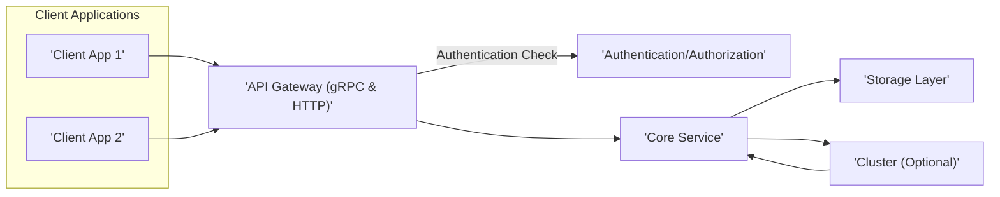
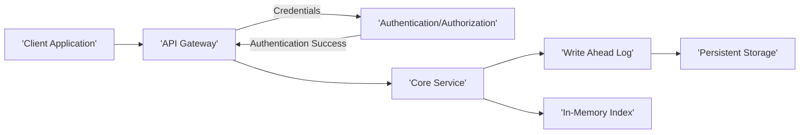
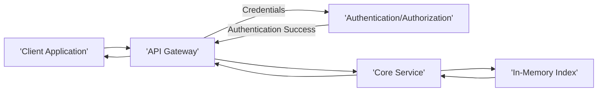

# Project Design Document: Qdrant Vector Database

**Version:** 1.1
**Date:** October 26, 2023
**Author:** Gemini (AI Language Model)

## 1. Introduction

This document provides a detailed design overview of the Qdrant vector database project, as described in the GitHub repository: [https://github.com/qdrant/qdrant](https://github.com/qdrant/qdrant). This document aims to capture the key architectural components, data flow, and deployment considerations to facilitate a comprehensive threat modeling exercise. This version includes more detail on specific functionalities and potential security considerations.

## 2. Goals and Non-Goals

**Goals:**

*   Provide a clear and detailed description of the Qdrant architecture, including specific functionalities within components.
*   Identify key components and their interactions, focusing on potential attack surfaces.
*   Outline the data flow within the system for various operations, highlighting sensitive data paths.
*   Describe different deployment scenarios and their unique security challenges.
*   Highlight potential areas of security concern with more specific examples for effective threat modeling.

**Non-Goals:**

*   Provide an exhaustive code-level analysis or reverse engineering of the Qdrant codebase.
*   Detail every single implementation choice within each component.
*   Offer a complete security audit, penetration test results, or vulnerability assessment.
*   Describe the business logic or specific use cases for Qdrant in particular applications.

## 3. High-Level Architecture

Qdrant is a vector similarity search engine. It allows storing, indexing, and querying high-dimensional vectors. The high-level architecture can be visualized as follows:

**Components:**

*   **Client Applications:** External applications that interact with Qdrant to store, search, and manage vector data. These can range from simple scripts to complex machine learning pipelines.
*   **API Gateway (gRPC & HTTP):** The primary entry point for client applications. It exposes both gRPC and HTTP APIs for interacting with Qdrant. This component is responsible for:
    *   Receiving and routing client requests.
    *   Handling protocol translation (gRPC to internal, HTTP to internal).
    *   Basic request validation and sanitization.
    *   Potentially implementing rate limiting and request throttling.
*   **Authentication/Authorization:**  A dedicated component or a set of functionalities within the API Gateway responsible for verifying the identity of clients and controlling their access to resources. This might involve:
    *   API key validation.
    *   OAuth 2.0 integration.
    *   Role-Based Access Control (RBAC) for managing permissions on collections and operations.
*   **Core Service:** The central component containing the core logic of Qdrant. Its responsibilities include:
    *   Managing collections: creation, deletion, and configuration (e.g., specifying distance metrics, indexing parameters).
    *   Handling data plane operations: vector insertion, update, and deletion.
    *   Building and maintaining vector indexes (e.g., HNSW, Annoy) optimized for similarity search.
    *   Performing similarity search queries based on vector embeddings, including filtering and scoring.
    *   Coordinating with the Storage Layer for data persistence and retrieval.
    *   Managing cluster state, data distribution, and inter-node communication (if clustering is enabled).
*   **Storage Layer:** Responsible for the durable persistence of vector data, metadata, and index structures. This layer likely comprises:
    *   **Write Ahead Log (WAL):** Ensures data durability and atomicity of write operations.
    *   **Persistent Storage:**  Disk-based storage for long-term data retention. This could involve file systems or specialized database engines.
    *   **In-Memory Storage/Cache:**  Used for performance optimization, holding frequently accessed data and index segments in memory.
*   **Cluster (Optional):** Enables horizontal scaling and high availability by distributing data and workload across multiple Qdrant nodes. Key functionalities include:
    *   Data partitioning and replication across nodes.
    *   Leader election and consensus mechanisms (e.g., Raft) for maintaining consistency.
    *   Inter-node communication for data synchronization, query routing, and cluster management.
    *   Mechanisms for handling node failures and recovery.

## 4. Component Details

### 4.1. API Gateway (gRPC & HTTP)

*   **Functionality:**
    *   Receives and parses incoming requests from client applications via gRPC and HTTP/REST APIs.
    *   Performs basic request validation (e.g., checking for required parameters, data type validation).
    *   Handles authentication and authorization, potentially delegating to a dedicated authentication service.
    *   Routes validated and authorized requests to the appropriate Core Service instance.
    *   Serializes responses from the Core Service back to the client in the requested format (gRPC or JSON).
    *   May implement rate limiting, request throttling, and API key management.
*   **Technology:** Likely built using frameworks and libraries for handling gRPC and HTTP, such as `tonic` and `axum` in the Rust ecosystem.
*   **Potential Security Concerns:**
    *   **API vulnerabilities:**  Injection attacks (e.g., SQL injection if interacting with a backend database for metadata), cross-site scripting (XSS) if rendering user-provided data in responses (less likely for a vector database API but worth considering for potential management interfaces).
    *   **Authentication and authorization bypass:**  Flaws in the authentication or authorization logic could allow unauthorized access.
    *   **Denial of Service (DoS) attacks:**  Susceptible to resource exhaustion attacks if not properly protected by rate limiting and request size limits.
    *   **Exposure of sensitive information:**  Leaking internal details or error messages that could aid attackers.
    *   **Lack of proper input validation:**  Leading to unexpected behavior or vulnerabilities in downstream components.

### 4.2. Authentication/Authorization

*   **Functionality:**
    *   Verifies the identity of clients attempting to access Qdrant.
    *   Authenticates users or applications based on credentials (e.g., API keys, tokens).
    *   Authorizes access to specific resources (e.g., collections, operations) based on roles or permissions.
    *   May involve integration with external identity providers (e.g., OAuth 2.0).
    *   Manages API key creation, rotation, and revocation.
*   **Technology:** Could be implemented using custom logic, standard authentication libraries, or integration with dedicated identity management systems.
*   **Potential Security Concerns:**
    *   **Weak authentication mechanisms:**  Using easily guessable API keys or insecure token generation.
    *   **Authorization bypass:**  Flaws in the authorization logic allowing users to access resources they shouldn't.
    *   **Credential stuffing and brute-force attacks:**  If not protected by rate limiting or account lockout policies.
    *   **Insecure storage of credentials:**  Storing API keys or other secrets in plain text or using weak encryption.
    *   **Lack of proper audit logging:**  Making it difficult to track unauthorized access attempts.

### 4.3. Core Service

*   **Functionality:**
    *   **Collection Management:** Handles the creation, deletion, and configuration of vector collections, including specifying indexing parameters and distance metrics.
    *   **Data Ingestion:** Processes requests to insert, update, and delete vector data and associated metadata.
    *   **Indexing:** Builds and maintains efficient vector indexes (e.g., HNSW) to enable fast similarity searches.
    *   **Query Processing:** Executes similarity search queries, applying filters, limits, and other query parameters.
    *   **Storage Interaction:** Communicates with the Storage Layer to persist and retrieve data and index structures.
    *   **Cluster Coordination:** In a clustered environment, manages data distribution, replica synchronization, and query routing across nodes.
*   **Technology:** Primarily implemented in Rust, leveraging its memory safety features and performance characteristics. Likely uses specialized libraries for vector indexing and similarity search.
*   **Potential Security Concerns:**
    *   **Logic vulnerabilities in indexing and search algorithms:**  Potential for denial of service or incorrect results due to crafted queries.
    *   **Memory safety issues:** While Rust mitigates many memory safety vulnerabilities, bugs can still occur.
    *   **Improper handling of user-provided data in queries or filters:**  Leading to unexpected behavior or potential exploits.
    *   **Vulnerabilities in cluster management and communication protocols:**  Allowing for node compromise or data corruption.
    *   **Resource exhaustion:**  Processing extremely large or complex queries could lead to resource exhaustion.

### 4.4. Storage Layer

*   **Functionality:**
    *   **Data Persistence:** Provides durable storage for vector embeddings, metadata, and index structures.
    *   **Write Ahead Logging (WAL):** Ensures data durability and consistency by logging all write operations before applying them.
    *   **Data Retrieval:** Efficiently retrieves vector data and index segments based on requests from the Core Service.
    *   **Data Management:** Handles tasks like data compaction, garbage collection, and potentially backups.
*   **Technology:**  Likely involves file system operations and potentially a database or specialized storage engine optimized for vector data. May utilize libraries for managing WAL and persistent storage.
*   **Potential Security Concerns:**
    *   **Unauthorized access to stored data:**  If storage files are not properly protected by file system permissions.
    *   **Data corruption or loss:**  Due to software bugs, hardware failures, or malicious attacks.
    *   **Vulnerabilities in the underlying storage engine:**  Exploiting known vulnerabilities in the file system or database used for storage.
    *   **Insufficient access controls on storage files:**  Allowing unauthorized users or processes to read or modify data files.
    *   **Insecure deletion of data:**  Data remnants potentially remaining after deletion, requiring secure erasure techniques.

### 4.5. Cluster (Optional)

*   **Functionality:**
    *   **Data Sharding and Replication:** Distributes vector data across multiple nodes and replicates it for fault tolerance.
    *   **Leader Election:**  Selects a leader node responsible for coordinating cluster operations.
    *   **Consensus Mechanisms:**  Uses protocols like Raft to ensure consistency across the cluster.
    *   **Inter-Node Communication:** Facilitates communication between nodes for data synchronization, query routing, and cluster management.
    *   **Membership Management:** Handles adding and removing nodes from the cluster.
*   **Technology:** Likely utilizes a distributed consensus protocol implementation (e.g., `raft-rs`) and inter-process communication mechanisms (e.g., gRPC).
*   **Potential Security Concerns:**
    *   **Man-in-the-middle attacks on inter-node communication:**  Compromising data exchanged between nodes if not encrypted.
    *   **Node compromise:**  An attacker gaining control of a single node could potentially disrupt the entire cluster or access sensitive data.
    *   **Vulnerabilities in the consensus protocol implementation:**  Exploiting weaknesses in the Raft or other consensus algorithms.
    *   **Spoofing or impersonation of cluster nodes:**  Unauthorized nodes joining the cluster or malicious nodes impersonating legitimate ones.
    *   **Replay attacks:**  Replaying inter-node communication messages to disrupt the cluster state.

## 5. Data Flow

### 5.1. Authenticated Vector Insertion

**Steps:**

1. The Client Application sends a request to insert a vector and associated metadata to the API Gateway, including authentication credentials.
2. The API Gateway forwards the credentials to the Authentication/Authorization component for verification.
3. The Authentication/Authorization component validates the credentials.
4. Upon successful authentication, the API Gateway forwards the insertion request to the Core Service.
5. The Core Service receives the request.
6. The vector data and metadata are written to the Write Ahead Log (WAL) for durability.
7. The data is then persisted to the Persistent Storage.
8. The Core Service updates the In-Memory Index with the new vector.

### 5.2. Authenticated Vector Search

**Steps:**

1. The Client Application sends a search query (including a query vector) to the API Gateway, including authentication credentials.
2. The API Gateway forwards the credentials to the Authentication/Authorization component for verification.
3. The Authentication/Authorization component validates the credentials.
4. Upon successful authentication, the API Gateway forwards the search query to the Core Service.
5. The Core Service receives the search query.
6. The Core Service uses the query vector to search the In-Memory Index for similar vectors.
7. The Core Service retrieves the results.
8. The Core Service sends the search results back to the API Gateway.
9. The API Gateway forwards the results to the Client Application.

## 6. Deployment Considerations

Qdrant offers flexibility in deployment, each with its own security implications:

*   **Single Node Deployment:** A single instance of the Qdrant service running on a single machine.
    *   **Security Focus:** Primarily on securing the host operating system, network access to the single instance, and protecting the storage where data is persisted.
*   **Clustered Deployment (Self-Managed):** Multiple Qdrant nodes deployed across a network, requiring manual configuration and management.
    *   **Security Focus:**  Securing inter-node communication (encryption, authentication), implementing robust access control for cluster management, and ensuring the security of each individual node.
*   **Cloud Deployments (e.g., AWS, Azure, GCP):** Leveraging cloud provider infrastructure and services.
    *   **Virtual Machines (VMs):** Deploying Qdrant on VMs requires securing the VMs themselves, the network configurations (VPCs, security groups), and access to cloud storage services.
    *   **Containers (Docker, Kubernetes):** Deploying Qdrant in containers necessitates securing the container images, the container runtime environment, and the orchestration platform (Kubernetes). This includes managing secrets, network policies, and role-based access control within the cluster.
    *   **Managed Services (Potentially Future):** If Qdrant were offered as a managed service, security responsibilities would be shared between the cloud provider and the user. Understanding this shared responsibility model is crucial.

**Deployment-Specific Security Considerations:**

*   **Network Segmentation:**  Isolating Qdrant instances within private networks or subnets to limit exposure.
*   **Firewall Rules:**  Configuring firewalls to allow only necessary traffic to and from Qdrant instances.
*   **Access Control Lists (ACLs):**  Controlling access to storage resources and other dependencies.
*   **Secrets Management:**  Using secure secrets management solutions (e.g., HashiCorp Vault, cloud provider key management services) to store and manage API keys, database credentials, and other sensitive information.
*   **TLS/SSL Encryption:**  Enforcing TLS/SSL for all communication, including client-to-API Gateway and inter-node communication in clustered deployments.
*   **Regular Security Audits and Penetration Testing:**  Identifying and addressing potential vulnerabilities in the deployed environment.
*   **Monitoring and Logging:**  Implementing comprehensive monitoring and logging to detect suspicious activity and security incidents.

## 7. Security Considerations (Detailed)

This section expands on the initial security considerations, providing more specific examples of potential threats:

*   **API Security:**
    *   **Injection Attacks:** SQL injection (if Qdrant interacts with a backend database for metadata), command injection through improperly sanitized inputs.
    *   **Broken Authentication/Authorization:**  Weak password policies, insecure token generation, lack of multi-factor authentication.
    *   **Sensitive Data Exposure:**  Leaking error messages, internal details, or unencrypted data in API responses.
    *   **Lack of Resources & Rate Limiting:**  Susceptibility to DoS attacks by overwhelming the API with requests.
    *   **Mass Assignment:**  Allowing clients to modify unintended object properties through API requests.
*   **Authentication and Authorization:**
    *   **Credential Stuffing:**  Attackers using lists of compromised credentials to gain access.
    *   **Brute-Force Attacks:**  Repeatedly trying different passwords or API keys.
    *   **Authorization Flaws:**  Users gaining access to resources or performing actions they are not authorized for.
    *   **Insecure Credential Storage:**  Storing API keys or other secrets in plain text or using weak encryption.
*   **Data Confidentiality:**
    *   **Data Breach:**  Unauthorized access to stored vector data and metadata.
    *   **Man-in-the-Middle Attacks:**  Interception of data in transit if encryption is not used.
    *   **Insider Threats:**  Malicious or negligent actions by authorized users.
*   **Data Integrity:**
    *   **Data Tampering:**  Unauthorized modification of stored data.
    *   **Data Corruption:**  Accidental or malicious corruption of data.
    *   **Replay Attacks (Clustered):**  Replaying inter-node communication to alter the cluster state.
*   **Availability:**
    *   **Denial of Service (DoS) Attacks:**  Overwhelming the service with requests, exhausting resources.
    *   **Distributed Denial of Service (DDoS) Attacks:**  DoS attacks originating from multiple sources.
    *   **Resource Exhaustion:**  Consuming excessive CPU, memory, or disk resources.
*   **Inter-Node Communication Security (Clustered):**
    *   **Man-in-the-Middle Attacks:**  Interception and potential modification of communication between cluster nodes.
    *   **Node Spoofing:**  Unauthorized nodes joining the cluster or impersonating legitimate nodes.
*   **Dependency Management:**
    *   **Vulnerabilities in Third-Party Libraries:**  Exploiting known vulnerabilities in dependencies.
    *   **Supply Chain Attacks:**  Compromising dependencies to inject malicious code.
*   **Input Validation:**
    *   **Injection Attacks:**  SQL injection, command injection, cross-site scripting (less likely but possible in management interfaces).
    *   **Buffer Overflows:**  Caused by providing excessively long inputs.
*   **Resource Limits:**
    *   **Lack of Rate Limiting:**  Allowing excessive requests that can overwhelm the system.
    *   **Unbounded Resource Consumption:**  Allowing queries or operations that consume excessive memory or CPU.

## 8. Future Considerations (Potentially Relevant for Threat Modeling)

*   **Plugins and Extensions:**  If Qdrant supports plugins or extensions, the security of these components and their potential interactions with the core system needs careful consideration. This includes validating the source and integrity of plugins and establishing secure communication channels.
*   **Integration with other systems:**  Security implications of integrating Qdrant with other services, such as authentication providers (e.g., LDAP, Active Directory), monitoring systems, and data pipelines. Consider authentication and authorization mechanisms for these integrations.
*   **Data backup and recovery:**  Security considerations related to backup and recovery processes, including the security of backup storage and the potential for data breaches during recovery.
*   **Management Interfaces:**  If Qdrant provides web-based or command-line management interfaces, these need to be secured against common web application vulnerabilities.

This improved document provides a more detailed and nuanced understanding of the Qdrant architecture, enhancing its value for threat modeling exercises. The added specifics about component functionalities and potential security concerns will enable more targeted and effective security analysis.