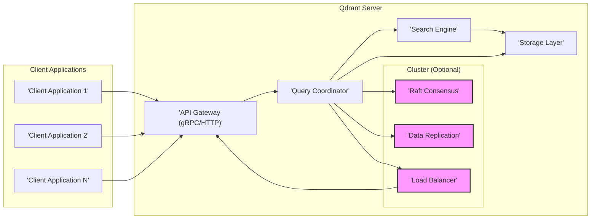

# Project Design Document: Qdrant Vector Database

**Project Name:** Qdrant Vector Database

**Project Repository:** [https://github.com/qdrant/qdrant](https://github.com/qdrant/qdrant)

**Document Version:** 1.1

**Date:** 2023-10-27

**Author:** AI Expert Assistant

## 1. Introduction

This document provides a detailed design overview of the Qdrant vector database project. It is intended to serve as a foundation for threat modeling and security analysis. This document outlines the system's architecture, key components, data flow, and deployment considerations. It is designed to be clear, comprehensive, and easily understandable for security professionals and developers involved in threat modeling and security assessments.

Qdrant is an open-source vector database and vector similarity search engine. It is designed for storing, indexing, and searching high-dimensional vectors with a focus on performance and scalability. Qdrant is particularly well-suited for applications such as:

*   Similarity search
*   Recommendation systems
*   Image and video retrieval
*   Natural Language Processing (NLP) applications
*   Anomaly detection
*   Duplication detection
*   Clustering and data analysis

Qdrant's modular architecture allows for flexible deployment options, ranging from single-node setups for development to distributed clusters for high-scale production environments.

## 2. System Architecture Overview

Qdrant's architecture is designed for scalability, performance, and reliability. The system can be deployed as a single node or in a distributed cluster. The core components interact to provide vector storage, indexing, and search capabilities. The architecture emphasizes separation of concerns, allowing for independent scaling and optimization of different components.

**Key Components:**

*   **Client Applications:** External applications that interact with Qdrant to store, search, and manage vector data. These applications communicate with Qdrant via gRPC or HTTP APIs. Client libraries are available in multiple languages to simplify integration.
*   **API Gateway (gRPC/HTTP):**  The entry point for all client requests. It handles API requests, TLS termination, authentication (if configured), request routing, and response serialization. Qdrant supports both gRPC and HTTP protocols for client communication, providing flexibility for different client types.
*   **Query Coordinator:**  Responsible for processing incoming queries. It parses queries, distributes them to the appropriate Search Engine nodes (in a cluster setup), aggregates results, and returns them to the client. In a single-node setup, it directly interacts with the Search Engine and Storage Layer. The Query Coordinator optimizes query execution and manages the overall query lifecycle.
*   **Search Engine:** The core component responsible for performing vector similarity search. It utilizes advanced indexing techniques, primarily HNSW (Hierarchical Navigable Small World graphs), to efficiently search through vector data. It supports various distance metrics like cosine, Euclidean, and dot product to cater to different similarity search requirements.
*   **Storage Layer:** Manages persistent storage of vector data, indexes, and metadata. It is responsible for data persistence, retrieval, backup, and data integrity. Qdrant uses local disk storage by default and can be configured for distributed storage solutions or cloud-based storage for enhanced scalability and durability.
*   **Cluster (Optional):** For high availability, fault tolerance, and scalability, Qdrant can be deployed as a cluster.
    *   **Raft Consensus:**  Used for cluster management, leader election, and ensuring strong data consistency across nodes. Raft ensures that all nodes in the cluster agree on the state of the data.
    *   **Data Replication:**  Data is replicated across multiple nodes for fault tolerance and data durability. Replication ensures that data is not lost in case of node failures.
    *   **Load Balancer:** Distributes client requests across multiple API Gateway instances in a clustered environment. This improves performance and availability by preventing overload on a single API Gateway.

## 3. Component Details

This section provides a more detailed description of each component within the Qdrant architecture.

### 3.1. Client Applications

*   **Functionality:**
    *   Initiate requests to Qdrant for vector operations (upsert, search, delete, update, retrieve, etc.).
    *   Receive and process responses from Qdrant, handling search results, operation statuses, and potential errors.
    *   Manage connections to Qdrant and handle API interactions.
    *   Can be written in various programming languages, utilizing Qdrant client libraries or directly interacting with the gRPC/HTTP API.
*   **Data Handled:**
    *   Vector data (input for upsert and search operations), including vector representations and associated IDs.
    *   Query parameters (search parameters, filters, limits, offsets, distance metrics, etc.).
    *   Metadata associated with vectors, used for filtering and enriching search results.
    *   Response data (search results including vector IDs, distances, scores, and retrieved metadata, operation status codes, and error messages).
*   **Technologies:**
    *   Varies depending on the client application.
    *   Qdrant provides client libraries in Python, Rust, Go, and TypeScript, simplifying integration and providing idiomatic access to Qdrant features.
    *   Clients can also use standard HTTP/gRPC libraries to interact with the API directly, offering flexibility for custom integrations and less common languages.

### 3.2. API Gateway (gRPC/HTTP)

*   **Functionality:**
    *   **API Endpoint:** Provides stable and well-defined gRPC and HTTP endpoints for client interaction, ensuring backward compatibility and ease of use.
    *   **Request Handling:** Receives, parses, and validates incoming client requests, ensuring requests are well-formed and conform to the API specification.
    *   **TLS Termination:** Handles TLS/SSL termination, ensuring secure communication between clients and Qdrant by decrypting incoming encrypted traffic.
    *   **Authentication & Authorization (Optional):** Can be configured to enforce authentication and authorization policies to control access to Qdrant, protecting sensitive data and operations. API Key authentication is currently supported.
    *   **Request Routing:** Routes validated and authenticated requests to the appropriate Query Coordinator instance for further processing.
    *   **Response Serialization:** Serializes responses in gRPC or HTTP formats (e.g., Protocol Buffers for gRPC, JSON for HTTP) and sends them back to the client in a format they can easily understand.
    *   **Rate Limiting (Potential):** Can be implemented to prevent abuse, protect against denial-of-service attacks, and ensure fair service availability for all clients.
*   **Data Handled:**
    *   Raw API requests (gRPC/HTTP) in serialized formats.
    *   Authentication credentials (e.g., API keys) when authentication is enabled.
    *   Serialized request and response data in formats like Protocol Buffers and JSON.
*   **Technologies:**
    *   Rust, leveraging its performance and safety features.
    *   Tonic framework for gRPC server implementation, providing efficient and robust gRPC handling.
    *   Actix-web framework for HTTP server implementation, offering high performance and flexibility for HTTP API endpoints.
    *   Protocol Buffers for gRPC API definition, ensuring efficient serialization and schema evolution.
    *   JSON for HTTP API request and response bodies, providing interoperability and ease of use for web clients.

### 3.3. Query Coordinator

*   **Functionality:**
    *   **Query Parsing:** Parses incoming queries, validates their syntax and semantics, and translates them into an internal representation for efficient processing.
    *   **Query Planning:** Determines the optimal execution plan for a query, considering factors like data distribution, index availability, and cluster topology, especially in a distributed cluster.
    *   **Search Distribution (Cluster):** Distributes search queries to relevant Search Engine nodes based on data partitioning (sharding) and replication strategy, maximizing parallelism and efficiency.
    *   **Result Aggregation (Cluster):** Collects intermediate search results from multiple Search Engine nodes, merges and aggregates them into a unified and coherent response, ensuring completeness and correctness.
    *   **Interaction with Storage Layer:**  Retrieves data from the Storage Layer when necessary, such as for filtering based on metadata, retrieving full vector data, or accessing configuration information.
    *   **Transaction Management (Potential):**  Manages transactions for operations that span multiple components, ensuring atomicity, consistency, isolation, and durability (ACID properties) for complex operations.
    *   **Collection Management:** Handles operations related to collections (namespaces for vectors), such as creation, deletion, and configuration updates.
*   **Data Handled:**
    *   Parsed and validated queries in an internal representation.
    *   Query execution plans, outlining the steps for query processing.
    *   Intermediate search results received from Search Engine nodes in a cluster.
    *   Aggregated and final search results ready for delivery to the client.
    *   Metadata retrieved from the Storage Layer for filtering and result enrichment.
*   **Technologies:**
    *   Rust, chosen for its performance, concurrency capabilities, and memory safety.
    *   Potentially utilizes distributed coordination mechanisms (e.g., message queues, distributed consensus) for cluster management and inter-node communication.

### 3.4. Search Engine

*   **Functionality:**
    *   **Vector Indexing:** Builds and maintains indexes (primarily HNSW - Hierarchical Navigable Small World graphs) on vector data to enable efficient and fast approximate nearest neighbor (ANN) search. Supports various index parameters for performance tuning.
    *   **Similarity Search:** Performs fast ANN search based on vector similarity metrics, supporting cosine similarity, Euclidean distance (L2), and dot product, catering to different application needs.
    *   **Filtering:** Applies pre- and post-filters to search results based on vector metadata, allowing for refined and context-aware search results.
    *   **Scoring and Ranking:** Calculates relevance scores based on similarity metrics and ranks search results, presenting the most relevant vectors to the user first.
    *   **Index Management:** Handles index creation, updates (incremental index building), and deletion, allowing for dynamic data management and index optimization.
    *   **Vector Storage (in-memory/on-disk):** Manages the storage of vector data, potentially utilizing both in-memory and on-disk storage for performance and capacity optimization.
*   **Data Handled:**
    *   Vector data, the core data being indexed and searched.
    *   Vector indexes (HNSW graphs and auxiliary data structures) optimized for fast similarity search.
    *   Search queries, including query vectors and search parameters.
    *   Search results, consisting of vector IDs, distances/scores, and potentially associated metadata pointers.
*   **Technologies:**
    *   Rust, leveraging its performance and low-level control for efficient search algorithms.
    *   Specialized libraries for vector indexing and search, such as `hnsw-rs` in Rust, optimized for ANN search.
    *   SIMD (Single Instruction, Multiple Data) instructions for optimized vector operations, accelerating distance calculations and search operations.
    *   Data structures optimized for memory efficiency and fast access, crucial for high-performance vector search.

### 3.5. Storage Layer

*   **Functionality:**
    *   **Persistent Storage:** Stores vector data, indexes, metadata, and system configuration persistently on disk, ensuring data durability across restarts and failures.
    *   **Data Retrieval:** Provides efficient and fast access to stored data for the Search Engine and Query Coordinator, minimizing latency for data access.
    *   **Data Persistence:** Ensures data durability and reliability through mechanisms like write-ahead logging (WAL) for transaction durability and data replication (in a cluster) for fault tolerance.
    *   **Backup and Restore:** Supports backup and restore operations for data protection and disaster recovery, allowing for point-in-time recovery and data migration. Backup strategies might include snapshots and incremental backups.
    *   **Data Management:** Handles data organization, compaction (reducing storage footprint and improving performance), and garbage collection (reclaiming storage space from deleted data).
    *   **Metadata Storage:** Manages metadata associated with vectors, enabling filtering and enriching search results.
*   **Data Handled:**
    *   Vector data in a serialized format for efficient storage and retrieval.
    *   Vector indexes, persisted for faster startup and index rebuilding.
    *   Metadata associated with vectors, stored in a structured format for efficient querying.
    *   System configuration parameters, defining the behavior of Qdrant.
    *   Logs and audit trails (potentially), recording system events and API access for monitoring and security auditing.
*   **Technologies:**
    *   Rust, for performance and control over storage operations.
    *   Local file system (default), providing a simple and performant storage backend for single-node deployments.
    *   Potentially supports pluggable storage backends (e.g., distributed file systems like Ceph, cloud storage services like AWS S3 or Azure Blob Storage) for scalability and cloud integration.
    *   Embedded key-value stores (e.g., RocksDB, LMDB) for efficient metadata storage and retrieval, offering fast access to metadata information.
    *   Data serialization formats (e.g., Protocol Buffers, FlatBuffers) for efficient storage and deserialization of vector data and metadata.

### 3.6. Cluster Components (Optional)

*   **3.6.1. Raft Consensus:**
    *   **Functionality:**
        *   **Leader Election:** Elects a single leader node responsible for cluster management and decision-making, ensuring only one node is in charge of cluster-wide operations.
        *   **Log Replication:** Replicates transaction logs (representing state changes) across cluster nodes to ensure data consistency and fault tolerance. Raft guarantees that all nodes have the same sequence of operations.
        *   **Membership Management:** Manages cluster membership, allowing for adding new nodes and removing failed or decommissioned nodes, maintaining a healthy cluster topology.
        *   **Configuration Management:**  Distributes configuration changes across the cluster, ensuring all nodes operate with the same settings and policies.
    *   **Data Handled:**
        *   Transaction logs, containing a sequence of operations to be applied to the cluster state.
        *   Cluster membership information, tracking the active nodes in the cluster.
        *   Cluster configuration, defining cluster-wide settings and parameters.
    *   **Technologies:**
        *   Rust, for performance and reliability in implementing the consensus algorithm.
        *   Raft consensus algorithm implementation (likely using a robust and well-tested Rust library), ensuring correctness and efficiency of consensus operations.

*   **3.6.2. Data Replication:**
    *   **Functionality:**
        *   **Data Redundancy:** Creates and maintains multiple copies (replicas) of data across different nodes in the cluster, providing redundancy and protecting against data loss.
        *   **Fault Tolerance:** Ensures data availability and service continuity even if some nodes fail, as replicas can take over in case of node outages.
        *   **Read Scalability (Potential):**  Can potentially improve read performance by allowing read operations to be distributed across replica nodes, increasing overall read throughput.
    *   **Data Handled:**
        *   Replicated vector data, ensuring multiple copies of vector information.
        *   Replicated indexes, maintaining redundant copies of search indexes for fault tolerance.
        *   Replicated metadata, ensuring metadata consistency and availability across the cluster.
    *   **Technologies:**
        *   Rust, for efficient data replication and synchronization mechanisms.
        *   Mechanisms for data synchronization and replication (likely integrated with the Storage Layer and Raft consensus), ensuring data consistency and efficient replication processes.

*   **3.6.3. Load Balancer:**
    *   **Functionality:**
        *   **Request Distribution:** Distributes incoming client requests across multiple API Gateway instances in a round-robin, least-connections, or other load balancing algorithms, preventing overload on single gateways.
        *   **High Availability:** Improves availability of the API Gateway layer by distributing load and providing redundancy. If one API Gateway fails, others can continue to serve requests.
        *   **Scalability:** Enables scaling out the API Gateway layer horizontally to handle increased client traffic by adding more API Gateway instances behind the load balancer.
        *   **Health Checks:** Performs health checks on API Gateway instances, routing traffic only to healthy instances and removing unhealthy ones from the rotation.
    *   **Data Handled:**
        *   Client requests, routing them to available API Gateway instances.
    *   **Technologies:**
        *   Standard load balancing technologies (e.g., Nginx, HAProxy, cloud load balancers from AWS ELB/ALB, Azure Load Balancer, GCP Load Balancing).
        *   Can be implemented in software or hardware, depending on the deployment environment and scale requirements.

## 4. Data Flow

This section describes the typical data flow within Qdrant for key operations.

### 4.1. Vector Upsert (Data Ingestion)

1.  **Client Application** sends an "upsert" request to the **API Gateway** (gRPC/HTTP) containing vector data, associated metadata, and collection name. The request is typically serialized using Protocol Buffers (gRPC) or JSON (HTTP).
2.  **API Gateway** receives the request, performs TLS termination, and optionally performs authentication/authorization based on configured policies (e.g., API key validation). The request is then forwarded to the **Query Coordinator**.
3.  **Query Coordinator** validates the request, checking for schema correctness, data type compatibility, and collection existence. It determines the target collection and shard (in a clustered setup) based on sharding strategy.
4.  **Query Coordinator** forwards the upsert request to the appropriate **Search Engine** and **Storage Layer** instances responsible for the target shard. In a single-node setup, these components are local.
5.  **Search Engine** receives the vector data and updates the vector index (e.g., HNSW graph) with the new vector, ensuring efficient searchability of the newly added data.
6.  **Storage Layer** persists the vector data and metadata to disk, ensuring data durability. In a cluster, data replication is initiated by the Storage Layer to replicate data to replica nodes for fault tolerance. Write-ahead logging (WAL) is used to ensure transaction durability.
7.  **Storage Layer** and **Search Engine** send confirmation back to the **Query Coordinator** upon successful completion of their respective operations.
8.  **Query Coordinator** aggregates responses from Search Engine and Storage Layer, and sends a success/failure response back to the **API Gateway**, indicating the outcome of the upsert operation.
9.  **API Gateway** serializes the response (e.g., into Protocol Buffers or JSON) and forwards the response to the **Client Application**.

### 4.2. Vector Search (Query Processing)

1.  **Client Application** sends a "search" request to the **API Gateway** (gRPC/HTTP) containing a query vector, search parameters (e.g., limit, filters, distance metric), and target collection name.
2.  **API Gateway** receives the request, performs TLS termination, and optionally performs authentication/authorization. The request is then forwarded to the **Query Coordinator**.
3.  **Query Coordinator** parses the query, validates search parameters and filters, and determines the target collection and shards. In a cluster, the query is distributed to relevant **Search Engine** instances responsible for the target shards.
4.  **Search Engine** instances receive the search request and perform a similarity search on their local vector index based on the query vector, search parameters, and specified distance metric. Filtering is applied either pre-index search or post-index search depending on filter complexity and index structure.
5.  **Search Engine** instances return a list of nearest neighbor vector IDs and distances/scores to the **Query Coordinator**. Results are typically limited by the requested `limit` parameter.
6.  **Query Coordinator** aggregates the results from all **Search Engine** instances (in a cluster), merges and ranks them based on scores, applies any necessary post-processing (e.g., global ranking, post-filtering), and retrieves metadata from the **Storage Layer** for the top-k results if requested by the client.
7.  **Query Coordinator** sends the final, aggregated, and ranked search results back to the **API Gateway**.
8.  **API Gateway** serializes the response and forwards the response to the **Client Application**.

### 4.3. Data Update and Deletion

Data update and deletion operations follow a similar flow to upsert and search, involving the **API Gateway**, **Query Coordinator**, **Search Engine**, and **Storage Layer**.  These operations will modify the vector index and persistent storage accordingly. Deletion operations will also trigger garbage collection in the Storage Layer over time. Updates might involve re-indexing vectors in the Search Engine.

## 5. Deployment Architecture

Qdrant can be deployed in various configurations depending on the requirements for scalability, availability, performance, and resource constraints.

*   **Single Node Deployment:**
    *   Simplest deployment for development, testing, and small-scale applications or edge deployments.
    *   All components (API Gateway, Query Coordinator, Search Engine, Storage Layer) run as a single process or within a single server instance.
    *   Easy to set up and manage, but limited scalability and no high availability or fault tolerance.
    *   Suitable for scenarios with low query volume and data size, or where data loss is acceptable.
*   **Clustered Deployment:**
    *   Recommended for production environments requiring high availability, scalability, fault tolerance, and handling large datasets and high query loads.
    *   Multiple Qdrant nodes are deployed, forming a cluster managed by Raft consensus.
    *   Components are distributed across nodes:
        *   Multiple API Gateway instances behind a load balancer for request distribution and high availability.
        *   Multiple Query Coordinator, Search Engine, and Storage Layer instances, distributed across shards for parallel processing and scalability.
        *   Raft consensus and data replication ensure data consistency, fault tolerance, and automatic failover.
    *   Data is sharded and replicated across nodes for horizontal scalability and resilience to node failures.
*   **Cloud Deployment:**
    *   Qdrant can be deployed on cloud platforms (AWS, Azure, GCP) using virtual machines, containers (Docker), or container orchestration services (Kubernetes).
    *   Managed Qdrant services are also available on some cloud platforms, simplifying deployment, management, scaling, and maintenance, often offering automated backups, monitoring, and upgrades.
    *   Cloud deployments can leverage cloud-native services for storage (e.g., cloud object storage), networking (e.g., VPCs, load balancers), monitoring, and security, providing a scalable and resilient infrastructure.
    *   Containerization with Docker and Kubernetes allows for easy deployment, scaling, and management in cloud environments. Kubernetes enables orchestration, auto-scaling, and self-healing of Qdrant clusters.
*   **On-Premise Deployment:**
    *   Qdrant can be deployed on-premise on physical servers or virtualized environments, providing full control over infrastructure and data.
    *   Suitable for organizations with strict data privacy requirements, compliance needs, or existing on-premise infrastructure.
    *   Requires managing infrastructure, scaling, maintenance, and security aspects in-house.

## 6. Scalability and Performance Considerations

Qdrant is designed for scalability and high performance. Key aspects contributing to this include:

*   **Horizontal Scalability:** Clustered architecture allows for horizontal scaling by adding more nodes to handle increased data volume and query load. Sharding and replication distribute data and workload across the cluster.
*   **Efficient Indexing (HNSW):** HNSW indexing provides logarithmic search complexity, enabling fast approximate nearest neighbor search even in large datasets.
*   **SIMD Optimizations:** Utilization of SIMD instructions accelerates vector operations, significantly improving search performance.
*   **Asynchronous Operations:** Asynchronous operations and non-blocking I/O are used throughout the system to maximize concurrency and throughput.
*   **Memory Management:** Efficient memory management and data structures minimize memory footprint and garbage collection overhead.
*   **Configurable Parameters:** Various configuration parameters allow for performance tuning based on specific workload characteristics, including index parameters, batch sizes, and concurrency settings.
*   **Caching:** Internal caching mechanisms are used to reduce latency and improve query performance by storing frequently accessed data in memory.

## 7. Security Considerations (Initial)

This section outlines initial security considerations for Qdrant. A more detailed threat model will be developed based on this design document.

*   **Authentication and Authorization:**
    *   **API Key Authentication:** Qdrant currently supports API key-based authentication to control access to the API. API keys should be securely generated, distributed, and managed.
    *   **Role-Based Access Control (RBAC) (Future Consideration):**  RBAC could be considered for finer-grained access control in future versions, allowing for different levels of permissions for different users or applications.
    *   **OAuth 2.0 and OpenID Connect (Future Consideration):** Integration with standard authentication protocols like OAuth 2.0 and OpenID Connect could be explored for seamless integration with existing identity providers.
    *   **Secure API Key Management:** Implement secure storage and rotation mechanisms for API keys. Avoid embedding API keys directly in client code.
*   **Data Encryption:**
    *   **Data at Rest Encryption:**  Implement encryption of data at rest in the Storage Layer to protect sensitive vector data if physical storage is compromised. Consider using AES-256 or similar strong encryption algorithms. Key management for data at rest encryption is crucial.
    *   **Data in Transit Encryption:**  Enforce TLS/SSL for all communication channels (gRPC and HTTP) to encrypt data in transit between clients and Qdrant, and between internal components within the cluster. Use strong TLS versions and cipher suites.
*   **Network Security:**
    *   **Firewall Configuration:**  Configure firewalls to restrict network access to Qdrant components, allowing only necessary ports and protocols. Follow the principle of least privilege for network access rules.
    *   **Network Segmentation:**  Segment the network to isolate Qdrant components into different security zones (e.g., DMZ for API Gateway, internal network for other components). This limits the impact of potential breaches.
    *   **Micro-segmentation (Future Consideration):** Implement micro-segmentation to further isolate individual components or services within the Qdrant cluster.
    *   **Zero Trust Network Principles (Future Consideration):**  Adopt Zero Trust principles, verifying every request and user, regardless of their location within the network.
    *   **Secure Communication Channels:**  Enforce TLS/SSL for all internal network communication within the Qdrant cluster, in addition to external API access.
*   **Input Validation:**
    *   **Robust Input Validation:**  Implement comprehensive input validation on the API Gateway and Query Coordinator to prevent injection attacks (e.g., SQL injection, command injection), cross-site scripting (XSS), and other input-related vulnerabilities.
    *   **Vector Data Validation:** Validate vector dimensions, data types, and ranges to prevent unexpected behavior and potential vulnerabilities.
    *   **Metadata Schema Validation:** Validate metadata against a defined schema to ensure data integrity and prevent injection attacks through metadata fields.
    *   **Query Parameter Validation:** Validate all query parameters (e.g., limits, offsets, filters, distance metrics) to prevent malicious or malformed queries.
*   **Dependency Management:**
    *   **Regular Dependency Audits:**  Regularly audit and update dependencies to address known vulnerabilities in third-party libraries. Use dependency scanning tools to automate vulnerability detection.
    *   **Software Bill of Materials (SBOM):** Generate and maintain an SBOM for Qdrant to track all dependencies and facilitate vulnerability management.
    *   **Automated Vulnerability Scanning:** Integrate automated vulnerability scanning into the CI/CD pipeline to detect vulnerabilities in dependencies and code changes early in the development lifecycle.
*   **Logging and Auditing:**
    *   **Comprehensive Logging:**  Implement comprehensive logging and auditing to track API access, authentication attempts, data modifications, system events, and errors. Include timestamps, user identifiers, and request details in logs.
    *   **Secure Log Storage:**  Securely store logs and audit trails, protecting them from unauthorized access and tampering. Consider using dedicated log management systems.
    *   **Log Rotation and Retention:** Implement log rotation and retention policies to manage log volume and comply with security and compliance requirements.
    *   **SIEM Integration (Future Consideration):** Integrate Qdrant logs with a Security Information and Event Management (SIEM) system for centralized security monitoring, alerting, and incident response.
*   **Resource Limits and Rate Limiting:**
    *   **Resource Quotas:**  Implement resource limits (CPU, memory, disk, network bandwidth) at the operating system and containerization level to prevent resource exhaustion and denial-of-service attacks.
    *   **Rate Limiting on API Gateway:**  Implement rate limiting on the API Gateway to prevent abuse, protect against brute-force attacks, and ensure service availability for legitimate users. Rate limiting can be applied per user, per IP address, or globally.
    *   **Connection Limits:**  Limit the number of concurrent connections to prevent connection exhaustion attacks.
*   **Security Hardening:**
    *   **Operating System Hardening:**  Follow security hardening best practices for the operating system and server environment where Qdrant is deployed. Apply security patches promptly.
    *   **Minimize Attack Surface:**  Disable unnecessary services and ports on Qdrant servers.
    *   **Principle of Least Privilege:**  Run Qdrant components with the minimum necessary privileges.
    *   **CIS Benchmarks (Future Consideration):**  Apply CIS (Center for Internet Security) benchmarks or similar security hardening guides to configure the operating system and Qdrant components securely.
*   **Regular Security Assessments:**
    *   **Penetration Testing:**  Conduct regular penetration testing to simulate real-world attacks and identify vulnerabilities in Qdrant's security posture.
    *   **Vulnerability Scanning:**  Perform regular vulnerability scanning using automated tools to identify known vulnerabilities in Qdrant software and infrastructure.
    *   **Security Code Reviews:**  Conduct security code reviews to identify potential security flaws in the codebase.
    *   **Threat Modeling (Ongoing):**  Continuously update and refine the threat model based on new features, changes in the environment, and emerging threats.

This design document provides a comprehensive overview of the Qdrant vector database architecture and initial security considerations. It will serve as a valuable resource for conducting thorough threat modeling and implementing appropriate security measures to protect the system and its data. Further threat modeling exercises will build upon this document to identify specific threats and vulnerabilities and define detailed mitigation strategies.