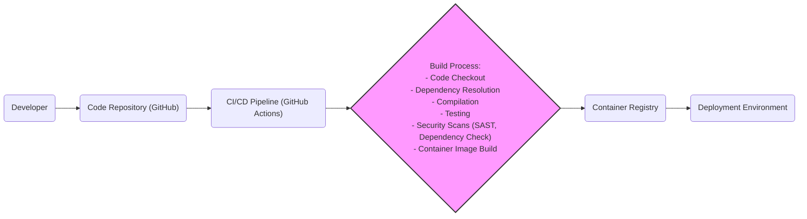

# BUSINESS POSTURE

- Business Priorities and Goals:
  - Provide a high-performance vector database solution for similarity search and vector embeddings.
  - Enable efficient storage and retrieval of high-dimensional vector data.
  - Support real-time applications requiring fast and accurate similarity search.
  - Offer a scalable and reliable vector database platform.
  - Provide an open-source solution to foster community adoption and contribution.

- Business Risks:
  - Data breaches leading to exposure of sensitive vector embeddings and associated metadata.
  - Service unavailability impacting applications relying on Qdrant for critical functions.
  - Performance degradation affecting user experience and application efficiency.
  - Data integrity issues leading to inaccurate search results and unreliable applications.
  - Supply chain vulnerabilities in dependencies and build process compromising the security of Qdrant deployments.

# SECURITY POSTURE

- Existing Security Controls:
  - security control: HTTPS for API communication (assumed, standard practice for web APIs). Implemented at: Ingress/Load Balancer level in deployment.
  - security control: Role-Based Access Control (RBAC) for API access (inferred from enterprise features and common database security practices). Implemented at: Qdrant application level.
  - security control: Input validation on API requests (inferred, standard software development practice). Implemented at: Qdrant API layer.
  - security control: Container image scanning for vulnerabilities (suggested best practice for containerized applications). Implemented at: CI/CD pipeline.
  - security control: Regular security updates and patching of dependencies (suggested best practice for open-source projects). Implemented at: Project maintainers level.

- Accepted Risks:
  - accepted risk: Potential vulnerabilities in third-party dependencies. Mitigation: Dependency scanning and regular updates.
  - accepted risk: Risk of misconfiguration leading to security weaknesses. Mitigation: Security hardening guidelines and configuration management.
  - accepted risk: Insider threats with access to the infrastructure. Mitigation: Access control and monitoring.

- Recommended Security Controls:
  - security control: Implement comprehensive audit logging for API access and data modifications.
  - security control: Integrate with external authentication providers (e.g., OAuth 2.0, OpenID Connect).
  - security control: Implement data encryption at rest and in transit.
  - security control: Conduct regular penetration testing and vulnerability assessments.
  - security control: Establish a security incident response plan.

- Security Requirements:
  - Authentication:
    - Requirement: Securely authenticate API clients to prevent unauthorized access.
    - Requirement: Support multiple authentication methods (e.g., API keys, tokens, integration with identity providers).
  - Authorization:
    - Requirement: Implement fine-grained authorization to control access to specific API endpoints and data operations based on user roles or permissions.
    - Requirement: Enforce the principle of least privilege for all users and services interacting with Qdrant.
  - Input Validation:
    - Requirement: Validate all inputs to the API to prevent injection attacks (e.g., SQL injection, command injection).
    - Requirement: Sanitize user-provided data before storing or processing it to prevent cross-site scripting (XSS) vulnerabilities if applicable (though less relevant for a database, consider metadata).
  - Cryptography:
    - Requirement: Use strong encryption algorithms for data at rest and in transit.
    - Requirement: Securely manage cryptographic keys.
    - Requirement: Protect sensitive data in memory and during processing.

# DESIGN

## C4 CONTEXT

```mermaid
flowchart LR
    subgraph "Organization"
        A("User Application")
        B("Data Ingestion System")
    end
    C("Qdrant Vector Database")
    D("Monitoring System")

    A -->> C: Similarity Search Queries
    B -->> C: Vector Data Ingestion
    C -->> D: Metrics and Logs
    style C fill:#f9f,stroke:#333,stroke-width:2px
```

- Context Diagram Elements:
  - - Name: User Application
    - Type: Software System
    - Description: Applications developed by users that leverage Qdrant for vector similarity search. These applications send queries to Qdrant to find similar vectors.
    - Responsibilities:
      - Formulate and send similarity search queries to Qdrant API.
      - Process search results returned by Qdrant.
      - Authenticate with Qdrant API if required.
    - Security controls:
      - Authentication to Qdrant API.
      - Input validation of user queries before sending to Qdrant.
      - Secure storage of API keys or credentials if used.

  - - Name: Data Ingestion System
    - Type: Software System
    - Description: Systems responsible for preparing and loading vector data into Qdrant. This could be batch processing or real-time data streams.
    - Responsibilities:
      - Extract vector embeddings from data sources.
      - Transform data into the format required by Qdrant.
      - Ingest vector data into Qdrant using the API.
      - Authenticate with Qdrant API if required.
    - Security controls:
      - Authentication to Qdrant API.
      - Secure data transfer to Qdrant.
      - Access control to data sources.

  - - Name: Qdrant Vector Database
    - Type: Software System
    - Description: The Qdrant vector database itself, responsible for storing, indexing, and searching vector embeddings. It provides an API for interaction.
    - Responsibilities:
      - Store and manage vector data and associated metadata.
      - Index vector data for efficient similarity search.
      - Process similarity search queries.
      - Provide an API for data ingestion and querying.
      - Implement access control and security features.
      - Generate metrics and logs for monitoring.
    - Security controls:
      - Authentication and authorization for API access.
      - Input validation on API requests.
      - Data encryption at rest and in transit (recommended).
      - Audit logging.
      - RBAC.

  - - Name: Monitoring System
    - Type: Software System
    - Description: External monitoring system used to collect metrics and logs from Qdrant for performance monitoring, alerting, and security analysis.
    - Responsibilities:
      - Collect metrics and logs from Qdrant.
      - Provide dashboards and visualizations of Qdrant performance.
      - Generate alerts based on predefined thresholds.
      - Store and analyze logs for security events.
    - Security controls:
      - Securely access metrics and logs endpoints of Qdrant (if applicable).
      - Secure storage of collected metrics and logs.
      - Access control to monitoring dashboards and data.

## C4 CONTAINER

```mermaid
flowchart LR
    subgraph "Qdrant Vector Database"
        A("API Server")
        B("Query Engine")
        C("Storage Engine")
        D("Cluster Coordination")
    end

    A -->> B: Search Requests, Data Ingestion
    B -->> C: Data Access, Index Operations
    C -->> D: Cluster State Management
    A -->> D: Cluster Management API
    style A fill:#f9f,stroke:#333,stroke-width:2px
    style B fill:#f9f,stroke:#333,stroke-width:2px
    style C fill:#f9f,stroke:#333,stroke-width:2px
    style D fill:#f9f,stroke:#333,stroke-width:2px
```

- Container Diagram Elements:
  - - Name: API Server
    - Type: Container/Application
    - Description: Exposes the Qdrant API (gRPC and REST) for external interaction. Handles client requests for data ingestion, search queries, and cluster management.
    - Responsibilities:
      - API endpoint management (gRPC and REST).
      - Request routing and load balancing.
      - Authentication and authorization of API requests.
      - Input validation and sanitization.
      - Communication with Query Engine and Cluster Coordination.
    - Security controls:
      - HTTPS/TLS for API endpoints.
      - API authentication and authorization mechanisms.
      - Rate limiting and request throttling.
      - Input validation and sanitization.
      - Audit logging of API access.

  - - Name: Query Engine
    - Type: Container/Application
    - Description: Responsible for processing similarity search queries. Optimizes query execution and interacts with the Storage Engine to retrieve and rank results.
    - Responsibilities:
      - Query parsing and optimization.
      - Similarity search algorithms and execution.
      - Interaction with Storage Engine for data retrieval.
      - Result ranking and filtering.
    - Security controls:
      - Secure communication with Storage Engine.
      - Resource management to prevent denial-of-service.
      - Protection against query injection vulnerabilities (if applicable).

  - - Name: Storage Engine
    - Type: Container/Application
    - Description: Manages the persistent storage of vector data and indexes. Handles data persistence, indexing, and retrieval operations.
    - Responsibilities:
      - Vector data storage and persistence.
      - Index creation and management (e.g., HNSW).
      - Data retrieval based on query requests.
      - Data backup and recovery.
      - Data encryption at rest (recommended).
    - Security controls:
      - Access control to storage volumes.
      - Data encryption at rest (recommended).
      - Data integrity checks.
      - Secure data deletion/purging.

  - - Name: Cluster Coordination
    - Type: Container/Application
    - Description: Manages cluster state, node discovery, leader election, and data distribution in a distributed Qdrant deployment.
    - Responsibilities:
      - Cluster membership management.
      - Leader election and consensus.
      - Data partitioning and replication.
      - Cluster health monitoring.
      - Configuration management for the cluster.
    - Security controls:
      - Secure inter-node communication (e.g., TLS).
      - Authentication and authorization for cluster management operations.
      - Protection against cluster state manipulation.

## DEPLOYMENT

- Deployment Options:
  - Standalone deployment (single node).
  - Clustered deployment (multiple nodes for scalability and high availability).
  - Cloud-managed service (if offered by Qdrant or cloud providers in the future).
  - Containerized deployment (Docker, Kubernetes).

- Detailed Deployment (Kubernetes Cluster):

```mermaid
flowchart LR
    subgraph "Kubernetes Cluster"
        subgraph "Nodes"
            A1("Node 1")
            A2("Node 2")
            subgraph "Pod: qdrant-api-server-pod"
                AA1("qdrant-api-server-container")
            end
            subgraph "Pod: qdrant-query-engine-pod"
                AB1("qdrant-query-engine-container")
            end
            subgraph "Pod: qdrant-storage-engine-pod"
                AC1("qdrant-storage-engine-container")
                AC2("Persistent Volume Claim")
            end
            subgraph "Pod: qdrant-cluster-coord-pod"
                AD1("qdrant-cluster-coord-container")
            end
            A1 -- AA1
            A1 -- AB1
            A1 -- AC1
            A2 -- AD1
            AC1 -- AC2
        end
        B("Load Balancer")
        C("External Client")
    end

    C -->> B: API Requests
    B -->> AA1: Route to API Server Pod
    style AA1 fill:#f9f,stroke:#333,stroke-width:2px
    style AB1 fill:#f9f,stroke:#333,stroke-width:2px
    style AC1 fill:#f9f,stroke:#333,stroke-width:2px
    style AD1 fill:#f9f,stroke:#333,stroke-width:2px
    style AC2 fill:#ccf,stroke:#333,stroke-width:2px
```

- Deployment Diagram Elements:
  - - Name: Kubernetes Cluster
    - Type: Infrastructure
    - Description: Kubernetes cluster providing the orchestration platform for deploying and managing Qdrant containers.
    - Responsibilities:
      - Container orchestration and scheduling.
      - Service discovery and load balancing within the cluster.
      - Persistent storage management.
      - Monitoring and health checks of pods and nodes.
    - Security controls:
      - Network policies to isolate namespaces and pods.
      - RBAC for Kubernetes API access.
      - Pod security policies/Pod security admission controllers.
      - Secrets management for sensitive data.
      - Regular security updates and patching of Kubernetes components.

  - - Name: Node (Node 1, Node 2)
    - Type: Infrastructure (Compute Instance)
    - Description: Worker nodes in the Kubernetes cluster where Qdrant pods are deployed.
    - Responsibilities:
      - Running container workloads.
      - Providing compute resources (CPU, memory, storage).
      - Network connectivity for pods.
    - Security controls:
      - Operating system hardening.
      - Security monitoring and intrusion detection.
      - Regular security updates and patching of the operating system and node components.
      - Network security groups/firewalls to control access to nodes.

  - - Name: Pod: qdrant-api-server-pod, qdrant-query-engine-pod, qdrant-storage-engine-pod, qdrant-cluster-coord-pod
    - Type: Container Group (Kubernetes Pod)
    - Description: Kubernetes pods encapsulating Qdrant containers (API Server, Query Engine, Storage Engine, Cluster Coordination).
    - Responsibilities:
      - Running Qdrant containers.
      - Providing network namespace and shared resources for containers within the pod.
    - Security controls:
      - Least privilege container user.
      - Resource limits and quotas.
      - Security context settings for containers.
      - Network policies to restrict pod-to-pod communication.

  - - Name: Container: qdrant-api-server-container, qdrant-query-engine-container, qdrant-storage-engine-container, qdrant-cluster-coord-container
    - Type: Software (Container Image)
    - Description: Docker containers running Qdrant components (API Server, Query Engine, Storage Engine, Cluster Coordination).
    - Responsibilities:
      - Executing Qdrant application logic.
      - Exposing Qdrant services.
    - Security controls:
      - Container image scanning for vulnerabilities.
      - Minimal container image with only necessary components.
      - Application-level security controls (as described in Container Diagram).

  - - Name: Persistent Volume Claim
    - Type: Storage
    - Description: Kubernetes Persistent Volume Claim used by the Storage Engine pod to request persistent storage for vector data.
    - Responsibilities:
      - Providing persistent storage for Qdrant data.
      - Ensuring data durability and availability.
    - Security controls:
      - Storage encryption at rest (if supported by the underlying storage provider).
      - Access control to storage volumes.
      - Data backup and recovery mechanisms.

  - - Name: Load Balancer
    - Type: Network Device
    - Description: Kubernetes Load Balancer service used to expose the Qdrant API Server pods externally.
    - Responsibilities:
      - Distributing external traffic to API Server pods.
      - Providing a single entry point for API access.
      - TLS termination (optional, can be handled by API Server).
    - Security controls:
      - HTTPS/TLS termination.
      - Network access control lists (ACLs) to restrict access to the load balancer.
      - DDoS protection.

  - - Name: External Client
    - Type: External System
    - Description: Users or applications outside the Kubernetes cluster that interact with Qdrant API.
    - Responsibilities:
      - Sending API requests to Qdrant.
    - Security controls:
      - Client-side authentication and authorization.
      - Secure communication channels (HTTPS).

## BUILD



- Build Process Elements:
  - - Name: Developer
    - Type: Person
    - Description: Software developers who write and commit code changes to the Qdrant project.
    - Responsibilities:
      - Writing and testing code.
      - Committing code changes to the repository.
      - Following secure coding practices.
    - Security controls:
      - Secure development environment.
      - Code review process.
      - Security awareness training.
      - Access control to code repository.

  - - Name: Code Repository (GitHub)
    - Type: Software Service
    - Description: GitHub repository hosting the Qdrant source code, build scripts, and configuration files.
    - Responsibilities:
      - Version control of source code.
      - Collaboration platform for developers.
      - Triggering CI/CD pipelines.
    - Security controls:
      - Access control and permissions management.
      - Branch protection rules.
      - Audit logging of repository access and changes.
      - Vulnerability scanning of repository dependencies (GitHub Dependabot).

  - - Name: CI/CD Pipeline (GitHub Actions)
    - Type: Software Service
    - Description: GitHub Actions workflows automating the build, test, security scanning, and container image creation process for Qdrant.
    - Responsibilities:
      - Automated build process.
      - Running unit and integration tests.
      - Performing security scans (SAST, dependency checks).
      - Building container images.
      - Publishing container images to the registry.
    - Security controls:
      - Secure pipeline configuration and secrets management.
      - Hardened build environment.
      - Security scanning tools integration (SAST, dependency check).
      - Code signing of build artifacts (optional).
      - Access control to CI/CD pipeline configuration and execution.

  - - Name: Build Process
    - Type: Automated Process
    - Description: Steps involved in compiling, testing, and packaging Qdrant software. Includes code checkout, dependency resolution, compilation, testing, security scans, and container image build.
    - Responsibilities:
      - Transforming source code into executable artifacts.
      - Ensuring code quality and security through testing and scanning.
      - Creating deployable container images.
    - Security controls:
      - Static Application Security Testing (SAST) to identify code vulnerabilities.
      - Dependency vulnerability scanning to detect vulnerable dependencies.
      - Container image scanning for vulnerabilities.
      - Secure build environment.
      - Provenance tracking of build artifacts.

  - - Name: Container Registry
    - Type: Software Service
    - Description: Container registry (e.g., Docker Hub, GitHub Container Registry) used to store and distribute Qdrant container images.
    - Responsibilities:
      - Storing container images.
      - Providing access to container images for deployment.
      - Image versioning and tagging.
    - Security controls:
      - Access control to container images.
      - Container image scanning for vulnerabilities (registry scanning).
      - Content trust and image signing (optional).
      - Audit logging of image access and modifications.

  - - Name: Deployment Environment
    - Type: Infrastructure
    - Description: Target environment (e.g., Kubernetes cluster, cloud VMs) where Qdrant container images are deployed and run.
    - Responsibilities:
      - Running Qdrant application.
      - Providing runtime environment and resources.
    - Security controls:
      - Infrastructure security controls (as described in Deployment section).
      - Runtime security monitoring.
      - Security configuration of the deployment environment.

# RISK ASSESSMENT

- Critical Business Processes:
  - Vector similarity search for user applications.
  - Data ingestion and updates for vector embeddings.
  - Availability and performance of the vector database service.

- Data Sensitivity:
  - Data: Vector embeddings and associated metadata.
  - Sensitivity: Potentially high, depending on the application. Vector embeddings can represent sensitive information like user preferences, financial transactions, or medical data. Metadata can include personally identifiable information (PII) or confidential business data. The sensitivity level depends heavily on the use case and the data represented by the vectors. If vectors represent user facial features or medical records, the sensitivity is very high. If vectors represent product features for recommendation engine, the sensitivity might be lower.

# QUESTIONS & ASSUMPTIONS

- Questions:
  - What is the intended use case and sensitivity of data for Qdrant in the user's specific context?
  - What are the specific compliance requirements (e.g., GDPR, HIPAA, PCI DSS) that need to be considered?
  - What are the performance and scalability requirements for Qdrant?
  - What is the existing security infrastructure and tooling available in the user's environment?
  - Are there any specific security policies or standards that need to be adhered to?

- Assumptions:
  - Qdrant is intended to be used in a production environment.
  - Security is a significant concern for the user.
  - Standard security best practices for web applications and databases are applicable.
  - Kubernetes is a likely deployment environment, but other options are possible.
  - HTTPS/TLS is used for all external API communication.
  - Basic authentication and authorization mechanisms are expected to be in place or planned.
  - Monitoring and logging are considered essential for operations and security.