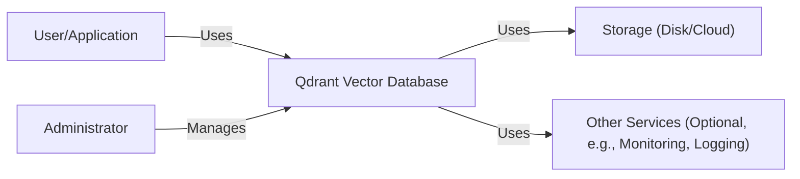
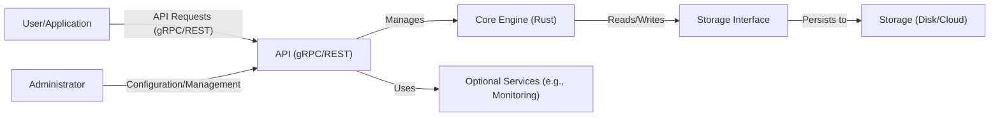
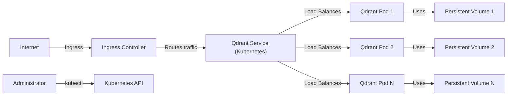
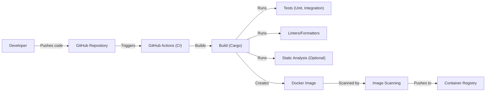

Okay, let's create a design document for the Qdrant vector database project, focusing on aspects relevant for threat modeling.

# BUSINESS POSTURE

Qdrant is a vector similarity search engine.  It's designed to store, manage, and search high-dimensional vectors, which are numerical representations of data like images, text, or audio.  The core business value lies in providing fast and accurate similarity searches for various applications.  It appears to be targeting a broad market, from startups to larger enterprises, based on its open-source nature and available cloud offering.

Business Priorities:

*   Provide a high-performance, scalable, and reliable vector search engine.
*   Offer a user-friendly API and comprehensive documentation.
*   Support various deployment options (self-hosted, cloud).
*   Maintain a strong open-source community and ecosystem.
*   Ensure data privacy and security for users.
*   Offer competitive features compared to other vector databases.

Business Goals:

*   Become a leading vector database solution.
*   Attract a large user base (both open-source and cloud).
*   Generate revenue through the cloud offering.
*   Establish partnerships with other companies in the AI/ML space.

Most Important Business Risks:

*   Data breaches or loss of customer data (especially in the cloud offering).
*   Performance degradation or service unavailability impacting user applications.
*   Vulnerabilities in the codebase leading to exploitation.
*   Competition from other vector databases eroding market share.
*   Failure to keep up with evolving needs in the AI/ML landscape.
*   Reputational damage due to security incidents or poor performance.
*   Inability to scale the cloud offering to meet demand.
*   Legal and compliance issues related to data privacy regulations.

# SECURITY POSTURE

Based on the GitHub repository and general knowledge of similar projects, here's a likely security posture assessment:

Existing Security Controls:

*   security control: Code reviews and pull requests are used for merging changes (evident from GitHub workflow).
*   security control: Static analysis tools (linters, code formatters) are likely used (presence of Makefiles and common development practices).
*   security control: Some level of testing (unit tests, integration tests) is present (visible in the repository structure).
*   security control: Containerization (Docker) is used for packaging and deployment, providing some isolation.
*   security control: API authentication is mentioned in documentation, but details need clarification.
*   security control: TLS/SSL encryption for network communication is likely supported, but needs confirmation.
*   security control: Access control mechanisms for managing data within the database are likely present, but details are needed.
*   security control: Deployment scripts and configurations are available, suggesting some level of infrastructure-as-code.

Accepted Risks:

*   accepted risk: Reliance on third-party libraries introduces potential supply chain vulnerabilities.
*   accepted risk: The complexity of the codebase (Rust) increases the risk of subtle bugs.
*   accepted risk: Open-source nature means vulnerabilities may be publicly disclosed before patches are available.
*   accepted risk: User-provided data (vectors) could potentially contain malicious content (though the impact is likely limited).
*   accepted risk: The evolving nature of the project means security features may lag behind core functionality.

Recommended Security Controls (High Priority):

*   Implement a comprehensive security vulnerability disclosure program.
*   Perform regular penetration testing and security audits.
*   Integrate dynamic application security testing (DAST) into the CI/CD pipeline.
*   Implement robust input validation and sanitization to prevent injection attacks.
*   Enforce strong authentication and authorization mechanisms, including role-based access control (RBAC).
*   Provide detailed documentation on security best practices for users.
*   Implement data encryption at rest and in transit.
*   Monitor system logs for suspicious activity.
*   Implement a robust backup and recovery strategy.
*   Use a Software Bill of Materials (SBOM) to track dependencies and vulnerabilities.

Security Requirements:

*   Authentication:
    *   Support strong authentication mechanisms (e.g., API keys, JWT, OAuth 2.0).
    *   Implement multi-factor authentication (MFA) for administrative access.
    *   Protect against brute-force attacks.
    *   Securely store and manage credentials.

*   Authorization:
    *   Implement fine-grained access control (e.g., RBAC) to restrict access to data and functionality.
    *   Enforce the principle of least privilege.
    *   Audit all access attempts and authorization decisions.

*   Input Validation:
    *   Validate all user-provided input (e.g., vector data, query parameters) against a strict schema.
    *   Sanitize input to prevent injection attacks.
    *   Handle errors gracefully and avoid disclosing sensitive information.

*   Cryptography:
    *   Use strong, industry-standard cryptographic algorithms and libraries.
    *   Encrypt data at rest and in transit.
    *   Securely manage cryptographic keys.
    *   Use TLS 1.3 or higher for all network communication.

# DESIGN

## C4 CONTEXT

Element Descriptions:

*   Element:
    *   Name: User/Application
    *   Type: External Entity (Person or System)
    *   Description: Represents a user or an application that interacts with the Qdrant database to store and search vectors.
    *   Responsibilities: Sending requests to store, search, and manage vectors.  Receiving search results.
    *   Security controls: Authentication and authorization mechanisms (e.g., API keys, JWT) to access Qdrant.

*   Element:
    *   Name: Qdrant Vector Database
    *   Type: System
    *   Description: The core Qdrant system, responsible for managing and searching vectors.
    *   Responsibilities: Storing vectors, performing similarity searches, managing collections, handling API requests.
    *   Security controls: Input validation, access control, encryption (at rest and in transit), auditing.

*   Element:
    *   Name: Storage (Disk/Cloud)
    *   Type: External System
    *   Description: The underlying storage used by Qdrant to persist data (e.g., local disk, cloud storage).
    *   Responsibilities: Providing persistent storage for vector data and metadata.
    *   Security controls: Data encryption at rest, access controls provided by the storage provider.

*   Element:
    *   Name: Other Services (Optional)
    *   Type: External System
    *   Description: Optional external services that Qdrant might interact with (e.g., monitoring, logging, metrics).
    *   Responsibilities: Providing supporting services to Qdrant.
    *   Security controls: Dependent on the specific service.

*   Element:
    *   Name: Administrator
    *   Type: External Entity (Person)
    *   Description: A person responsible for managing and configuring the Qdrant instance.
    *   Responsibilities: Deploying, configuring, monitoring, and maintaining the Qdrant database.
    *   Security controls: Strong authentication (MFA), access controls, auditing of administrative actions.

## C4 CONTAINER

Element Descriptions:

*   Element:
    *   Name: User/Application
    *   Type: External Entity
    *   Description:  Same as in the Context diagram.
    *   Responsibilities: Same as in the Context diagram.
    *   Security controls: Same as in the Context diagram.

*   Element:
    *   Name: API (gRPC/REST)
    *   Type: Container (Application)
    *   Description: Provides the interface for clients to interact with Qdrant.  Handles request parsing, authentication, and routing.
    *   Responsibilities: Receiving and processing API requests, authenticating users, validating input, forwarding requests to the core engine.
    *   Security controls: Authentication, authorization, input validation, rate limiting, TLS encryption.

*   Element:
    *   Name: Core Engine (Rust)
    *   Type: Container (Application)
    *   Description: The core logic of Qdrant, written in Rust.  Handles vector indexing, searching, and management.
    *   Responsibilities: Performing similarity searches, managing collections, interacting with the storage interface.
    *   Security controls: Access control, internal input validation, secure coding practices.

*   Element:
    *   Name: Storage Interface
    *   Type: Container (Component)
    *   Description: An abstraction layer that provides a consistent interface for interacting with different storage backends.
    *   Responsibilities: Reading and writing data to the underlying storage, handling data serialization and deserialization.
    *   Security controls: Data encryption (if applicable), access control enforcement.

*   Element:
    *   Name: Storage (Disk/Cloud)
    *   Type: External System
    *   Description: Same as in the Context diagram.
    *   Responsibilities: Same as in the Context diagram.
    *   Security controls: Same as in the Context diagram.

*   Element:
    *   Name: Administrator
    *   Type: External Entity
    *   Description: Same as in the Context diagram.
    *   Responsibilities: Same as in the Context diagram.
    *   Security controls: Same as in the Context diagram.

*   Element:
    *   Name: Optional Services
    *   Type: External System
    *   Description: Same as in the Context diagram.
    *   Responsibilities: Same as in the Context diagram.
    *   Security controls: Same as in the Context diagram.

## DEPLOYMENT

Possible Deployment Solutions:

1.  Self-hosted (Docker Compose): Suitable for development, testing, and small-scale production deployments.
2.  Self-hosted (Kubernetes): Suitable for larger-scale production deployments requiring high availability and scalability.
3.  Qdrant Cloud: A fully managed cloud service provided by the Qdrant team.  This is the easiest option for users who don't want to manage their own infrastructure.

Chosen Solution (for detailed description): Self-hosted (Kubernetes)

Element Descriptions:

*   Element:
    *   Name: Internet
    *   Type: External Entity
    *   Description: The public internet.
    *   Responsibilities: Providing network connectivity.
    *   Security controls: Firewall, DDoS protection (typically provided by the cloud provider or network infrastructure).

*   Element:
    *   Name: Ingress Controller
    *   Type: Infrastructure Node (Software)
    *   Description: A Kubernetes Ingress controller (e.g., Nginx, Traefik) that manages external access to the Qdrant service.
    *   Responsibilities: Routing incoming traffic to the appropriate service, handling TLS termination.
    *   Security controls: TLS encryption, access control rules, rate limiting.

*   Element:
    *   Name: Qdrant Service (Kubernetes)
    *   Type: Infrastructure Node (Software)
    *   Description: A Kubernetes Service that provides a stable endpoint for accessing the Qdrant pods.
    *   Responsibilities: Load balancing traffic across multiple Qdrant pods.
    *   Security controls: Network policies (Kubernetes).

*   Element:
    *   Name: Qdrant Pod 1, Qdrant Pod 2, Qdrant Pod N
    *   Type: Infrastructure Node (Software)
    *   Description: Kubernetes Pods running the Qdrant container.  Multiple pods provide high availability and scalability.
    *   Responsibilities: Running the Qdrant application.
    *   Security controls: Container security best practices, resource limits, network policies.

*   Element:
    *   Name: Persistent Volume 1, Persistent Volume 2, Persistent Volume N
    *   Type: Infrastructure Node (Storage)
    *   Description: Kubernetes Persistent Volumes that provide persistent storage for the Qdrant pods.
    *   Responsibilities: Providing durable storage for vector data.
    *   Security controls: Data encryption at rest (if supported by the storage provider), access controls (Kubernetes RBAC).

*   Element:
    *   Name: Administrator
    *   Type: External Entity
    *   Description: Same as in Context diagram.
    *   Responsibilities: Same as in Context diagram.
    *   Security controls: Same as in Context diagram.

*   Element:
    *   Name: K8s API
    *   Type: Infrastructure Node
    *   Description: Kubernetes API Server.
    *   Responsibilities: Managing Kubernetes cluster.
    *   Security controls: RBAC, TLS, Audit.

## BUILD

The Qdrant build process likely involves the following steps:

1.  Developer: A developer writes code and pushes changes to the GitHub repository.
2.  GitHub Actions (CI): GitHub Actions workflows are triggered by events (e.g., push, pull request).
3.  Build: The Rust code is compiled using `cargo`.
4.  Tests: Unit tests and integration tests are executed.
5.  Linters/Formatters: Code linters and formatters (e.g., `clippy`, `rustfmt`) are run to enforce code style and identify potential issues.
6.  Static Analysis: Static analysis tools may be used to identify potential security vulnerabilities.
7.  Containerization: A Docker image is built, containing the compiled Qdrant executable and its dependencies.
8.  Image Scanning: The Docker image is scanned for known vulnerabilities.
9.  Artifact Storage: The Docker image is pushed to a container registry (e.g., Docker Hub, GitHub Container Registry).

Security Controls in Build Process:

*   security control: Code reviews and pull requests (GitHub).
*   security control: Automated testing (unit tests, integration tests).
*   security control: Linters and formatters (enforce code style and best practices).
*   security control: Static analysis (optional, but recommended).
*   security control: Container image scanning (identify vulnerabilities in the Docker image).
*   security control: Use of a secure container registry.
*   security control: Signed commits.

# RISK ASSESSMENT

Critical Business Processes to Protect:

*   Vector search functionality: Ensuring the core search functionality is available, performant, and accurate.
*   Data management: Protecting the integrity and confidentiality of user-provided vector data.
*   API availability: Maintaining the availability of the API for client applications.
*   Cloud service uptime (for Qdrant Cloud): Ensuring the cloud service is reliable and accessible.

Data to Protect and Sensitivity:

*   Vector data: Sensitivity depends on the nature of the data represented by the vectors.  Could range from low (e.g., publicly available images) to high (e.g., sensitive personal information, biometric data).
*   Metadata: Information about collections, vectors, and users.  Sensitivity depends on the specific metadata stored.
*   API keys and credentials: Highly sensitive.  Compromise could lead to unauthorized access to data.
*   System logs: May contain sensitive information about user activity and system events.
*   Configuration files: May contain sensitive information about the deployment environment.

# QUESTIONS & ASSUMPTIONS

Questions:

*   What specific authentication mechanisms are supported (API keys, JWT, OAuth 2.0)?
*   What are the details of the access control mechanisms within Qdrant?
*   Is data encryption at rest supported, and if so, how is it implemented?
*   What are the specific storage backends supported (local disk, AWS S3, Azure Blob Storage, Google Cloud Storage)?
*   What are the monitoring and logging capabilities of Qdrant?
*   What is the disaster recovery plan for Qdrant Cloud?
*   Are there any plans for compliance certifications (e.g., SOC 2, HIPAA)?
*   Details about gRPC usage and security.

Assumptions:

*   BUSINESS POSTURE: Assumes a mix of open-source and commercial users, with a focus on performance, scalability, and reliability.
*   SECURITY POSTURE: Assumes basic security practices are in place (code reviews, testing), but more advanced controls may be lacking.
*   DESIGN: Assumes a typical microservices-based architecture, with a clear separation of concerns between the API, core engine, and storage. Assumes Kubernetes as a primary deployment target for larger deployments. Assumes GitHub Actions are used for CI/CD.