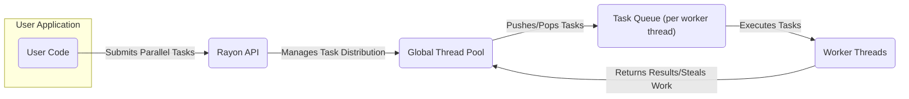

# Project Design Document: Rayon - Data Parallelism in Rust

**Version:** 1.1
**Date:** October 26, 2023
**Author:** AI Software Architect

## 1. Introduction

This document provides an enhanced design overview of the Rayon project, a powerful data parallelism library for the Rust programming language. Rayon simplifies the process of converting sequential computations into parallel equivalents, effectively utilizing multi-core processors to achieve significant performance gains. This document aims to provide a clear and detailed articulation of Rayon's architecture, core components, and data flow mechanisms, serving as a robust foundation for subsequent threat modeling activities.

## 2. Goals of this Document

*   Present a comprehensive and refined architectural overview of the Rayon library.
*   Clearly identify key components within Rayon and meticulously describe their interactions.
*   Detail the data flow within Rayon during parallel execution, highlighting critical stages.
*   Pinpoint potential areas of interest and concern for security considerations and threat modeling analysis.
*   Serve as a definitive and easily understandable reference point for comprehending the system's design and operational principles.

## 3. Project Overview

Rayon is a Rust library designed to facilitate high-level data parallelism. It empowers developers to effortlessly parallelize operations on collections and iterators without the complexities of manual thread management. At its core, Rayon employs a work-stealing thread pool, dynamically distributing and executing tasks across the available CPU cores for optimal efficiency.

**Project Repository:** [https://github.com/rayon-rs/rayon](https://github.com/rayon-rs/rayon)

## 4. High-Level Architecture

Rayon's architecture is centered around a globally accessible thread pool and the capability to parallelize operations on iterators and various data structures. Users interact with Rayon through its well-defined API, which orchestrates the distribution of computational work to the managed thread pool.

*   **User Code:** The application-level code that leverages Rayon's parallel iterators or other parallel execution constructs.
*   **Rayon API:** The public interface exposed by the Rayon library, offering methods for parallel iteration, parallel computations, and configuration of the underlying thread pool.
*   **Global Thread Pool:** A managed pool of worker threads maintained by Rayon. This pool is typically initialized once during application startup and reused throughout its lifecycle.
*   **Task Queue (per worker thread):** Each worker thread possesses its own local double-ended queue (deque) for managing tasks.
*   **Worker Threads:** The actual operating system threads responsible for performing the parallel computations. They retrieve tasks from their local queues or proactively "steal" tasks from the queues of other busy worker threads.

## 5. Key Components and Interactions

This section provides a more granular view of the significant components within Rayon and elaborates on their interactions.

*   **Parallel Iterators (`par_iter`, `par_iter_mut`, `into_par_iter`):**
    *   These serve as the primary entry points for enabling parallel operations on collections.
    *   Upon invocation, they intelligently partition the underlying data into smaller, manageable chunks and create corresponding tasks for parallel processing of these chunks.
    *   Interaction: User code invokes these methods, which subsequently interact with the global thread pool to schedule and execute the generated tasks.

*   **Task System:**
    *   Rayon employs a sophisticated work-stealing task system for efficient parallel execution.
    *   Tasks represent discrete units of work that can be executed independently and in parallel.
    *   Tasks are typically implemented as closures or function calls that operate on a specific portion of the data being processed.
    *   Interaction: Parallel iterators are responsible for creating tasks, and worker threads actively retrieve and execute these tasks.

*   **Work-Stealing Scheduler:**
    *   This is the core mechanism driving Rayon's parallelism and efficiency.
    *   Each worker thread maintains its own local deque of tasks.
    *   When a thread completes its currently assigned task, it first examines its own deque for more work. If its deque is empty, it attempts to "steal" a task from the tail of another randomly selected thread's deque.
    *   Interaction: Dynamically manages the distribution of tasks among the available worker threads, ensuring optimal load balancing and resource utilization.

*   **Thread Pool Management:**
    *   Rayon internally manages a global thread pool.
    *   The size of this thread pool is typically determined by the number of logical CPU cores available on the system, although it can be configured programmatically.
    *   Interaction: Responsible for the creation, initialization, and lifecycle management of the worker threads within the pool.

*   **Join Operations (`join`, `scope`):**
    *   These provide mechanisms for creating and synchronizing parallel tasks that might not be directly associated with iterating over a collection.
    *   `join` allows the parallel execution of two independent closures and waits for both to complete before proceeding.
    *   `scope` enables the creation of a nested parallel scope with its own defined lifetime, allowing for more complex parallel execution patterns.
    *   Interaction: User code utilizes these constructs to define and manage more intricate parallel execution flows.

*   **Configuration Options:**
    *   Rayon offers various configuration options to customize the behavior of the thread pool and other aspects of the library.
    *   Interaction: User code can set these options to fine-tune Rayon's performance characteristics and resource usage.

*   **Splitters (Internal):**
    *   Parallel iterators often rely on internal "splitter" types to efficiently divide the data into chunks suitable for parallel processing.
    *   Interaction: These splitters are used during the data partitioning phase to create independent units of work.

## 6. Data Flow

The typical data flow within a Rayon-powered application involves the following sequence of steps:

```mermaid
graph LR
    A("Input Data (Collection/Iterator)")
    B("Parallel Iterator Invocation")
    C("Data Partitioning via Splitters")
    D("Task Creation (Closures over Data Partitions)")
    E("Task Scheduling (Work-Stealing Mechanism)")
    F("Parallel Execution on Worker Threads")
    G("Result Aggregation/Combination (if applicable)")
    H("Final Result")

    A -- "Initiates Parallelism" --> B
    B -- "Divides Data" --> C
    C -- "Generates Work Units" --> D
    D -- "Assigns to Threads" --> E
    E -- "Processes Data" --> F
    F -- "Combines Partial Results" --> G
    G -- "Produces Output" --> H
```

*   **Input Data (Collection/Iterator):** The initial data structure that the user intends to process in parallel.
*   **Parallel Iterator Invocation:** The user calls a Rayon parallel iterator method (e.g., `par_iter().map(...)`).
*   **Data Partitioning via Splitters:** Rayon internally utilizes splitters to divide the input data into smaller, independent partitions. The specific partitioning strategy can vary depending on the type of iterator.
*   **Task Creation (Closures over Data Partitions):** For each data partition, a task is created. This task is typically represented by a closure that encapsulates the operation to be performed on that specific chunk of data.
*   **Task Scheduling (Work-Stealing Mechanism):** The newly created tasks are added to the local task queues of the worker threads. The work-stealing scheduler then takes over, ensuring efficient distribution and execution of these tasks across the available threads.
*   **Parallel Execution on Worker Threads:** Worker threads retrieve tasks from their queues (or steal from others) and execute them concurrently.
*   **Result Aggregation/Combination (if applicable):** For operations like `reduce` or `collect`, the intermediate results produced by the parallel tasks are combined or aggregated to produce a final, consolidated result.
*   **Final Result:** The ultimate output of the parallel computation.

## 7. Security Considerations (For Threat Modeling)

While Rayon itself operates within the memory space of a single process and doesn't inherently handle external network communication or persistent storage, several security aspects are crucial to consider when utilizing it, particularly from a threat modeling perspective:

*   **Unsafe Code within Closures:** If the closures passed to Rayon's parallel operations contain `unsafe` code blocks, this introduces potential vulnerabilities such as memory corruption, data races (even if Rust's borrow checker provides strong guarantees in safe code), and undefined behavior. Threat models should analyze the potential impact of vulnerabilities within these `unsafe` blocks.
*   **Resource Exhaustion via Task Flooding:** A malicious actor or poorly designed logic could potentially create an extremely large number of small, computationally inexpensive tasks, overwhelming the task queues and the thread pool, leading to denial of service by resource exhaustion (CPU and memory).
*   **Side Effects in Parallel Operations:** If the closures executed in parallel have unintended side effects (e.g., modifying shared mutable state without proper synchronization, interacting with external systems in an uncontrolled manner), this can lead to unpredictable behavior, data corruption, and potential security breaches. Threat models should consider the scope and impact of side effects.
*   **Vulnerabilities in Dependencies:** Although Rayon has minimal direct dependencies, any vulnerabilities present in the Rust standard library or other transitive dependencies could indirectly affect applications using Rayon. Supply chain security analysis is relevant here.
*   **Data Sensitivity in Parallel Computations:** If Rayon is used to process sensitive data, ensuring that the data is handled securely within the parallel tasks is critical. This includes preventing unintended data leakage or exposure during processing.
*   **Input Validation and Sanitization:** If user-provided input influences the data being processed in parallel, proper validation and sanitization are essential to prevent injection attacks or other forms of malicious input exploitation.
*   **Stack Overflow in Recursive Parallelism:** While less common, deeply recursive parallel operations using Rayon could potentially lead to stack overflow errors, which could be exploited in certain scenarios.

## 8. Dependencies

Rayon has a very lean dependency footprint, primarily relying on the foundational components of the Rust ecosystem. Understanding these dependencies is important for assessing potential supply chain risks.

*   `std` (Rust Standard Library): This is the core dependency, providing fundamental functionalities.

## 9. Deployment Considerations

Rayon is a library that is integrated directly into a Rust application. Its deployment characteristics are therefore closely tied to the deployment of the encompassing application. Key factors to consider include:

*   **Target Operating System and Architecture:** Rayon is designed to be cross-platform, but the underlying threading model and performance characteristics can vary across different operating systems (e.g., Linux, Windows, macOS) and CPU architectures.
*   **Number of Available CPU Cores:** The performance benefits of Rayon scale with the number of available CPU cores on the deployment environment. Applications deployed on systems with fewer cores might see less dramatic performance improvements.
*   **Resource Limits:** Deployment environments might impose resource limits (e.g., CPU time, memory) that could impact the performance and stability of Rayon-powered applications.
*   **Integration with Other Libraries:** When deploying applications that use Rayon alongside other concurrency libraries or frameworks, potential interactions and conflicts should be carefully considered.

## 10. Future Considerations

This design document reflects the current state of Rayon's architecture. Future development efforts and enhancements could introduce changes that impact the design and associated security considerations. Potential areas of future development might include:

*   **Integration with Asynchronous Programming Models:** Exploring tighter integration with Rust's `async`/`await` ecosystem.
*   **Enhanced Task Scheduling Algorithms:** Investigating more advanced work-stealing or work-sharing algorithms for specific workloads.
*   **GPU Acceleration:** Exploring opportunities to leverage GPU resources for certain types of parallel computations.

## 11. Conclusion

This improved design document provides a more detailed and nuanced understanding of the Rayon library's architecture, core components, and data flow mechanisms. The enhanced security considerations section offers a more specific and actionable basis for conducting thorough threat modeling exercises, enabling developers to proactively identify and mitigate potential security risks associated with the use of Rayon in their applications.