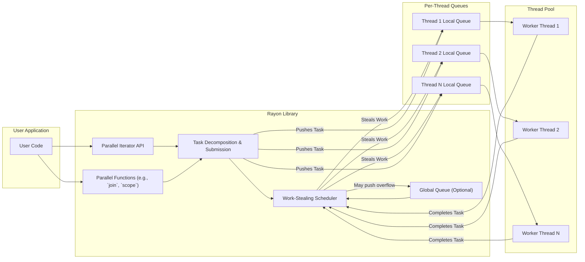
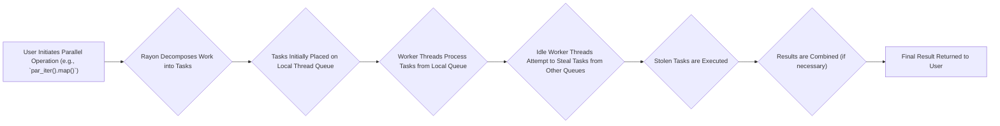

# Project Design Document: Rayon - Data Parallelism Library for Rust

**Version:** 1.1
**Date:** October 26, 2023
**Author:** AI Software Architect

## 1. Introduction

This document provides an enhanced design overview of the Rayon project, a data parallelism library for the Rust programming language. It aims to offer a more detailed understanding of Rayon's architecture, core components, and data flow, serving as a robust foundation for subsequent threat modeling activities.

Rayon simplifies the process of transforming sequential computations into parallel equivalents, effectively leveraging multi-core processors to achieve significant performance improvements. Its primary focus is on "data parallelism," where the same operation is concurrently applied to multiple elements within a collection.

## 2. Goals

* **Ease of Use:**  Maintain a simple and intuitive API that allows developers to easily parallelize common operations such as iteration and collection processing with minimal code changes.
* **Performance:**  Maximize performance gains by efficiently utilizing available CPU cores through techniques like work-stealing and minimizing synchronization overhead.
* **Safety:**  Ensure thread safety and prevent data races by leveraging Rust's strong ownership and borrowing system, while also providing mechanisms to handle potential panics gracefully.
* **Ergonomics:**  Minimize the cognitive load and development effort required to parallelize existing sequential code, making parallel programming accessible to a wider range of developers.
* **Flexibility:**  Offer a range of abstraction levels, from high-level parallel iterators to lower-level task spawning functions, to accommodate diverse use cases and fine-tune performance characteristics.

## 3. Non-Goals

* **Distributed Computing:** Rayon is explicitly designed for shared-memory parallelism within a single process. Extending its capabilities to distributed computing across multiple machines is outside its current scope.
* **Direct GPU Acceleration:** While Rayon excels at utilizing multi-core CPUs, direct integration or management of GPU acceleration is not a primary goal.
* **Implementation of Specific Parallel Algorithms:** Rayon provides the foundational tools and infrastructure for parallelism. Implementing highly specialized parallel algorithms (e.g., a specific parallel sorting algorithm implementation within Rayon itself) is not a core objective; instead, it enables users to build such algorithms on top of its primitives.

## 4. Architecture Overview

Rayon's architecture is centered around a dynamically managed thread pool and a sophisticated work-stealing scheduler. Users interact with Rayon through its well-defined API, which offers parallel iterators for common collection operations and functions for spawning and managing parallel tasks.

**Key Components:**

* **User Application:** The Rust code that leverages the Rayon library to execute computations in parallel.
* **Parallel Iterator API:** Provides a high-level, declarative way to express parallel operations on collections, offering parallel equivalents of standard Rust iterators (e.g., `par_iter`, `par_iter_mut`, `par_drain`).
* **Parallel Functions:** Functions like `join` (for executing two independent tasks in parallel) and `scope` (for creating a context where parallel tasks can borrow data) that offer more explicit control over parallel execution flow.
* **Task Decomposition & Submission:** The process of breaking down a parallel operation into smaller, independent tasks and submitting them to the scheduler. This involves determining the granularity of parallelism and how data is partitioned.
* **Work-Stealing Scheduler:** The core component responsible for efficiently distributing and managing tasks across the thread pool. It utilizes per-thread dequeues and a work-stealing mechanism where idle threads "steal" tasks from the ends of other threads' queues. An optional global queue might exist for initial task submission or overflow.
* **Global Queue (Optional):**  A shared queue where tasks might initially be placed or where tasks overflow from local queues. This is less common in typical work-stealing scenarios but can be present in certain implementations.
* **Thread Pool:** A managed pool of worker threads that concurrently execute the tasks submitted by the scheduler. The size of the thread pool is typically configured based on the number of available CPU cores.
* **Per-Thread Queues:** Each worker thread typically has its own local deque (double-ended queue) to store tasks. This minimizes contention and improves efficiency for locally submitted or generated tasks.

## 5. Component Details

### 5.1. Parallel Iterator API

* **Purpose:** To offer a user-friendly and efficient way to parallelize operations on collections without requiring explicit thread management.
* **Functionality:**
    * Provides methods like `map`, `filter`, `reduce`, `for_each`, `fold`, and `collect` that execute their operations in parallel across the elements of a collection.
    * Internally handles the splitting of the collection into chunks, the creation of tasks for each chunk, and the aggregation of results (if necessary).
    * Leverages the `split()` method on parallel iterators to divide work recursively.
* **Example:** `my_vec.par_iter().map(|x| x * 2).filter(|&x| x > 5).collect::<Vec<_>>()`

### 5.2. Parallel Functions (e.g., `join`, `scope`)

* **Purpose:** To provide mechanisms for more structured and controlled parallel execution patterns beyond simple data parallelism on collections.
* **Functionality:**
    * `join(op1, op2)`: Executes two independent closures (`op1` and `op2`) in parallel and returns their results as a tuple once both complete. This is useful for parallelizing independent computations.
    * `scope(|s| ...)`: Creates a new parallel scope. Within this scope, you can spawn parallel tasks that can borrow data from the surrounding environment. The `scope` function ensures that all spawned tasks within the scope complete before the scope returns, guaranteeing data safety.
* **Use Cases:** Implementing divide-and-conquer algorithms, orchestrating independent parallel computations, and managing the lifetime of borrowed data in parallel contexts.

### 5.3. Task Decomposition & Submission

* **Process:** When a parallel operation is initiated, Rayon decomposes the work into smaller, independent units called tasks. The strategy for decomposition depends on the type of parallel operation (e.g., chunking for parallel iterators, individual closures for `join`).
* **Task Representation:** Tasks are typically represented as closures or function pointers that encapsulate the specific unit of work to be performed.
* **Submission Mechanism:** Tasks are submitted to the work-stealing scheduler. Often, tasks are initially pushed onto the local queue of the thread that initiated the parallel operation.

### 5.4. Work-Stealing Scheduler

* **Core Mechanism:**  Each worker thread maintains its own local deque of tasks. When a thread finishes its current task, it first checks its own deque. If it's empty, it attempts to "steal" a task from the *tail* of another randomly chosen thread's deque. Stealing from the tail reduces contention.
* **Benefits:**
    * **Dynamic Load Balancing:** Automatically distributes work evenly across available threads, adapting to variations in task execution times.
    * **Reduced Contention:** Local task queues minimize contention for task access under normal circumstances. Stealing only occurs when a thread is idle.
    * **Scalability:** The decentralized nature of work-stealing allows Rayon to scale effectively with increasing numbers of cores.
* **Implementation Details:** Relies on atomic operations (e.g., compare-and-swap) for safe and efficient access to task queues during stealing.

### 5.5. Thread Pool

* **Management:** Rayon manages a pool of worker threads. The pool is typically initialized when Rayon is first used and persists for the lifetime of the program or until explicitly shut down.
* **Sizing:** The default size of the thread pool is usually set to the number of logical CPU cores available on the system. Users can customize the thread pool size through configuration options or environment variables.
* **Thread Lifecycle:** Threads in the pool are typically long-lived, reducing the overhead of thread creation and destruction for each parallel operation.

### 5.6. Per-Thread Queues

* **Structure:** Typically implemented as double-ended queues (deques), allowing tasks to be added and removed from both the head (for local task submission) and the tail (for stealing).
* **Purpose:**  To provide a local storage for tasks, reducing contention and improving the efficiency of task management, especially for tasks generated by a specific thread.

## 6. Data Flow

The typical data flow for a parallel operation in Rayon involves the following steps:

1. **User Initiates Parallel Operation:** The user calls a Rayon API function, such as a method on a parallel iterator or a parallel function like `join`.
2. **Rayon Decomposes Work into Tasks:** Rayon analyzes the requested operation and breaks it down into smaller, independent tasks. The granularity of these tasks depends on the operation and the size of the input data.
3. **Tasks Initially Placed on Local Thread Queue:**  The newly created tasks are typically added to the local task queue of the thread that initiated the parallel operation. This promotes locality and reduces contention.
4. **Worker Threads Process Tasks from Local Queue:** Worker threads in the thread pool actively retrieve and execute tasks from their own local queues. This is the primary mode of execution when a thread has work available locally.
5. **Idle Worker Threads Attempt to Steal Tasks from Other Queues:** When a worker thread's local queue becomes empty, it enters the work-stealing phase. It randomly selects another thread and attempts to "steal" a task from the tail of that thread's queue.
6. **Stolen Tasks are Executed:** If a steal is successful, the idle worker thread executes the stolen task.
7. **Results are Combined (if necessary):** For operations that produce a combined result (e.g., `reduce`, `collect`), Rayon aggregates the results from the individual tasks. This might involve combining partial results iteratively or using a dedicated combining step.
8. **Final Result Returned to User:** The final result of the parallel operation is returned to the user's application code.

## 7. Security Considerations

Rayon, while built with safety in mind due to Rust's memory safety guarantees, still presents certain security considerations:

* **Data Races (Largely Mitigated by Rust):** Rust's borrow checker effectively prevents data races in safe code. However, the use of `unsafe` blocks within parallel operations could bypass these checks and introduce data races. Careful auditing of `unsafe` code is crucial.
* **Panics in Parallel Tasks:** If a panic occurs within a parallel task, it can potentially unwind the stack and disrupt other tasks within the same Rayon context. While Rayon provides mechanisms to catch and handle panics, unhandled panics can lead to unexpected program behavior or termination. Strategies for graceful panic handling within parallel tasks are important.
* **Resource Exhaustion (Denial of Service):**  Malicious or poorly written code could submit an excessive number of tasks or tasks that consume significant resources (CPU, memory), leading to resource exhaustion and a denial-of-service condition. Implementing safeguards and resource limits might be necessary in certain applications.
* **Deadlocks (Less Common but Possible):** While Rayon's work-stealing scheduler reduces the likelihood of deadlocks compared to traditional lock-based concurrency, complex parallel patterns involving shared mutable state and synchronization primitives (outside of Rayon's core mechanisms) could still introduce deadlocks. Careful design and testing are essential.
* **Supply Chain Security:** The security of the Rayon crate itself and its dependencies is a crucial consideration. Verifying the integrity and trustworthiness of the Rayon crate and its dependencies through mechanisms like checksum verification and dependency scanning is important.
* **Side Effects and Mutable Shared State:**  Parallel operations that involve side effects or modifications to shared mutable state (even with synchronization) can introduce subtle bugs and potential vulnerabilities if not carefully managed. Emphasizing immutability and clear synchronization strategies is important.
* **Information Disclosure:** If parallel tasks operate on sensitive data, ensuring that intermediate results and data accessed by different threads are properly protected from unauthorized access is crucial.

These security considerations will be the primary focus of the subsequent threat modeling process, where specific threats and vulnerabilities will be identified and analyzed in detail.

## 8. Future Considerations

* **Enhanced Integration with Asynchronous Programming (Async/Await):** Exploring deeper integration with Rust's async/await ecosystem to enable more seamless composition of asynchronous and parallel operations.
* **More Sophisticated Scheduling Algorithms:** Investigating and potentially incorporating alternative scheduling algorithms optimized for specific workload characteristics or hardware architectures.
* **Improved Debugging and Profiling Tools:** Developing more advanced tools for debugging and profiling Rayon applications, providing insights into task execution, thread utilization, and potential bottlenecks.
* **Support for More Complex Parallel Patterns and Primitives:** Expanding the API to support more intricate parallel execution scenarios and potentially introducing new parallel primitives.
* **Exploration of SIMD and Vectorization:** Investigating opportunities to leverage SIMD (Single Instruction, Multiple Data) instructions and vectorization techniques within Rayon's implementation for further performance gains.

This revised document provides a more in-depth understanding of the Rayon project's design and architecture. It will serve as a more comprehensive and valuable resource for the upcoming threat modeling activities.
