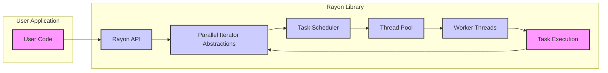

# Project Design Document: Rayon - Data Parallelism in Rust

## 1. Project Overview

*   **Project Name:** Rayon
*   **Project Repository:** [https://github.com/rayon-rs/rayon](https://github.com/rayon-rs/rayon)
*   **Project Description:** Rayon is a data-parallelism library for Rust. It simplifies the process of converting sequential computations into parallel equivalents, effectively utilizing multi-core processors to enhance performance. Rayon prioritizes high-level abstractions for parallel iteration and task parallelism, aiming for a balance between ease of use and computational efficiency.
*   **Project Goals:**
    *   Provide a straightforward and intuitive Application Programming Interface (API) for parallelizing Rust code.
    *   Achieve substantial performance gains for data-parallel workloads on multi-core processing systems.
    *   Maintain robust memory safety and freedom from data races, leveraging Rust's inherent ownership and borrowing system.
    *   Implement an efficient work-stealing scheduling mechanism for optimal utilization of system resources.
    *   Remain a lightweight library with minimal dependencies, relying primarily on the Rust standard library.
*   **Target Audience:** Rust developers seeking to parallelize computationally intensive operations, particularly those involving data manipulation and iterative processes. This includes developers of applications, library creators, and anyone aiming to boost the performance of their Rust code on multi-core hardware.

## 2. System Architecture

### 2.1. High-Level Architecture Diagram

### 2.2. Component Description

*   **"User Code"**: Represents the Rust application code developed by users that integrates and utilizes the Rayon library. This is the primary point of interaction and the consumer of Rayon's parallel processing capabilities.
*   **"Rayon API"**: This is the public facing interface of the Rayon library, providing the set of functions, traits, and structures that developers use to initiate and control parallel operations. Key aspects of the API include:
    *   Parallel iteration methods such as `par_iter()`, `par_chunks()`, and `par_bridge()` for parallelizing operations over collections and iterators.
    *   Task parallelism constructs like `join()` for executing two independent tasks concurrently and `scope()` for creating structured concurrency scopes with a defined lifetime.
    *   Configuration mechanisms, primarily through `ThreadPoolBuilder`, to customize the behavior of the thread pool, such as setting the number of threads.
*   **"Parallel Iterator Abstractions"**: Rayon offers high-level abstractions built upon the `ParallelIterator` trait. These abstractions simplify parallel iteration over various data structures (e.g., slices, vectors, ranges). They encapsulate the complexities of work division, data partitioning, and distribution across threads, allowing users to focus on the logic of their computations rather than the details of parallelization.
*   **"Task Scheduler"**: This component is responsible for the dynamic management and scheduling of tasks across available worker threads. Rayon employs a **work-stealing scheduler**, typically based on a variant of the Chase-Lev deque algorithm.
    *   **Work-Stealing Mechanism:** Each worker thread maintains its own local double-ended queue (deque) of tasks. Initially, a thread works on tasks from its own queue. When a thread's local queue becomes empty, it attempts to "steal" tasks from the tail of another randomly chosen thread's deque. This work-stealing approach dynamically balances the workload across threads, especially in scenarios with irregular or dynamically changing task sizes, leading to efficient resource utilization and reduced idle time.
*   **"Thread Pool"**: Rayon manages a thread pool, which is a managed collection of worker threads. The thread pool is typically initialized once at the start of a Rayon-using application and is reused for the duration of the application's execution, amortizing the overhead of thread creation and destruction across multiple parallel operations.
    *   The size of the thread pool is configurable, often defaulting to the number of logical CPU cores available on the system to maximize hardware utilization. Users can customize the thread pool size via `ThreadPoolBuilder` to fine-tune performance for specific workloads or environments. Rayon generally uses a fixed-size thread pool.
*   **"Worker Threads"**: These are the individual threads within the thread pool that are responsible for the actual execution of parallel tasks. Managed by the thread pool and orchestrated by the task scheduler, each worker thread:
    *   Has its own local task queue (deque) for efficient task management.
    *   Participates in the work-stealing process, both contributing tasks to its own queue and stealing tasks from other threads when necessary.
    *   Executes user-provided code (closures or functions) associated with the tasks it processes.
*   **"Task Execution"**: This represents the phase where the actual user-defined code, encapsulated within tasks, is executed by the worker threads. This is the core of the parallel computation, where the input data is processed, and results are generated in parallel. Tasks are typically represented as closures or functions provided by the user through Rayon's API, defining the work to be done in parallel.

### 2.3. Data Flow

1.  **User initiates parallel operation:** The user code invokes a Rayon API function, such as `par_iter()` on a data collection, providing a closure or function that defines the operation to be performed in parallel on each element of the collection.
2.  **Task decomposition and scheduling:** Rayon's parallel iterator abstractions and task scheduler take the user's operation and decompose it into a set of smaller, independent tasks. These tasks are then initially placed into the local task queues of worker threads, often the thread that initiated the parallel operation.
3.  **Work distribution and execution:** Worker threads retrieve tasks from their local queues. When a thread's queue is empty, the work-stealing scheduler mechanism comes into play: the idle thread attempts to steal tasks from the queues of other, potentially busy, worker threads.
4.  **Parallel computation:** Worker threads execute the user-provided code (closures/functions) associated with the tasks they have acquired. This execution happens concurrently across multiple threads, enabling parallel processing of data or independent computations.
5.  **Result aggregation (if applicable):** For parallel operations that produce results that need to be combined, such as `reduce()` or `collect()`, Rayon handles the aggregation of intermediate results from the parallel tasks. These results are combined according to the specified operation (e.g., summation in `reduce`, collection into a data structure in `collect()`) to produce a final, consolidated result.
6.  **Control flow returns to user code:** Once the entire parallel operation is completed, including task execution and result aggregation (if any), control flow is returned to the user application code, along with any computed results.

## 3. Security Considerations

### 3.1. Trust Boundaries

*   **Boundary 1: User Code / Rayon Library:** This is the primary trust boundary in the system. User code interacts with the Rayon library exclusively through its well-defined public API. Rayon must be designed to handle user inputs and operations in a safe, predictable, and secure manner, preventing malicious or erroneous user code from compromising the library's integrity or the application's security.
*   **Boundary 2: Rayon Library / Operating System (Thread Management):** Rayon relies on the underlying operating system for essential thread management functionalities, including thread creation, scheduling, and synchronization primitives. Security vulnerabilities or weaknesses in the OS's threading implementation could potentially have indirect impacts on Rayon's security and stability.
*   **Boundary 3: Internal Rayon Library Components:** While less distinct than external boundaries, internal boundaries exist between different components within the Rayon library itself, such as the task scheduler, thread pool, and worker threads. Secure and correct interactions between these internal components, including proper synchronization and data management, are crucial to prevent internal vulnerabilities and ensure the library's overall security and reliability.

### 3.2. Data Sensitivity

*   Rayon, as a data-parallelism library, does not inherently manage or store sensitive data itself. It operates on data provided to it by the user application at runtime.
*   The sensitivity of the data processed by Rayon is entirely dependent on the context of the user's application and the specific data it chooses to process in parallel using Rayon. Rayon is agnostic to the nature or sensitivity of the data it processes.
*   If user code utilizes Rayon to process sensitive data in parallel, it is the responsibility of the user application developer to implement appropriate security measures and best practices for handling sensitive data throughout the computation. This includes considerations for data confidentiality, integrity, and access control within the user's code. Rayon provides the parallel execution framework but does not enforce or manage data sensitivity policies.

### 3.3. Potential Security Risks

*   **Concurrency Bugs (Race Conditions, Deadlocks, Livelocks):** While Rust's ownership system and borrow checker significantly mitigate the risk of data races (memory unsafety due to concurrent access), logical race conditions, deadlocks, and livelocks remain potential risks in concurrent code, including code utilizing Rayon.
    *   **Race Conditions (Logical):**  Occur when the program's outcome depends on the non-deterministic order of execution of concurrent operations, leading to unexpected or incorrect results.
    *   **Deadlocks:** Situations where two or more threads are blocked indefinitely, each waiting for a resource held by another.
    *   **Livelocks:** Similar to deadlocks, but threads continuously change state in response to each other without making progress.
    Incorrectly designed or synchronized parallel algorithms using Rayon could introduce these concurrency bugs, potentially leading to application instability, incorrect computations, or even exploitable vulnerabilities in certain scenarios.
*   **Resource Exhaustion (Denial of Service - DoS):**
    *   **Unbounded Parallelism (Task/Thread Explosion):** If user code, either intentionally or due to a vulnerability, can cause Rayon to create an excessively large number of tasks or threads, it could lead to resource exhaustion, consuming excessive CPU, memory, and other system resources. This can result in a denial-of-service condition, making the application unresponsive or crashing it. Rayon's thread pool management helps to limit the number of threads, but improper API usage or malicious input could still potentially be exploited to cause resource exhaustion.
    *   **CPU Starvation:** Maliciously crafted or poorly designed parallel tasks, even within the thread pool limits, could be designed to consume disproportionate CPU resources, potentially starving other processes or critical parts of the application, leading to performance degradation or denial of service for other functionalities.
*   **Information Disclosure (Indirect Side-Channels):** While Rayon itself is unlikely to directly cause information disclosure vulnerabilities, vulnerabilities in user code executed within parallel tasks could be indirectly amplified or exposed due to concurrent execution and shared resources.
    *   **Timing Attacks:** Parallel execution might introduce or exacerbate timing variations in user algorithms, potentially making timing attacks or other side-channel attacks more feasible if sensitive information processing is involved in the parallel tasks.
    *   **Cache-Based Attacks:** Concurrent tasks running in parallel might share CPU caches, potentially creating opportunities for cache-based side-channel attacks if user code processes sensitive data and is not designed to be resistant to such attacks.
*   **Unsafe Code Usage within Rayon (Internal Vulnerabilities):** If Rayon's internal implementation relies on `unsafe` Rust code for performance optimizations or low-level operations (as is sometimes necessary in systems programming), vulnerabilities within this `unsafe` code could potentially lead to memory safety issues, such as buffer overflows, use-after-free, or other memory corruption bugs. These memory safety vulnerabilities could, in turn, be exploited for malicious purposes. However, Rayon is generally considered to be a well-audited library with a focus on minimizing and carefully reviewing any `unsafe` code.
*   **Dependency Vulnerabilities (Indirect):** Although Rayon is designed to have minimal external dependencies, primarily relying on the Rust standard library, vulnerabilities in the Rust standard library itself or in the underlying operating system's threading primitives could indirectly affect Rayon's security. If vulnerabilities are discovered in these core components, they could potentially impact the security and reliability of Rayon-based applications.

### 3.4. Security Features and Mitigations

*   **Rust's Memory Safety Guarantees:** Rayon inherently benefits from Rust's strong memory safety guarantees. Rust's ownership system, borrowing rules, and type system are fundamental security features that prevent a wide range of common memory safety vulnerabilities, including:
    *   **Buffer Overflows:** Rust's bounds checking and memory management prevent writing beyond allocated memory regions.
    *   **Use-After-Free Errors:** Rust's ownership and borrowing system ensures that memory is freed only after all references to it are gone, preventing use-after-free vulnerabilities.
    *   **Dangling Pointers:** Rust's borrow checker prevents the creation of dangling pointers, eliminating a source of memory unsafety.
    *   **Data Races (Memory Safety):** Rust's ownership and borrowing rules, combined with the `Send` and `Sync` traits, largely prevent data races that lead to memory corruption.
    These memory safety features significantly reduce the attack surface and eliminate many classes of vulnerabilities that are prevalent in languages like C and C++.
*   **Work-Stealing Scheduler for Load Balancing and Resilience:** The work-stealing scheduler employed by Rayon is not only designed for performance but also contributes to resilience and indirectly to security. By dynamically distributing workload across threads and preventing any single thread from becoming a bottleneck, the work-stealing scheduler:
    *   **Improves Load Balancing:** Ensures that all available CPU cores are effectively utilized, reducing idle time and improving overall throughput.
    *   **Enhances Resilience to Uneven Workloads:**  Handles scenarios where tasks have varying execution times more gracefully, as idle threads can steal work from busy threads, preventing some threads from being overloaded while others are underutilized.
    *   **Mitigates Certain DoS Risks:** By efficiently distributing work, the scheduler can help to prevent scenarios where a single thread or a small number of threads become overloaded and unresponsive, which could be exploited for denial-of-service attacks.
*   **Thread Pool Management for Resource Control:** Rayon's thread pool mechanism provides a degree of control over resource usage by limiting the number of threads created and managed by the library. This thread pool management:
    *   **Prevents Unbounded Thread Creation:** Limits the number of threads to a configurable or automatically determined value (often based on CPU core count), preventing runaway thread creation that could exhaust system resources.
    *   **Mitigates Resource Exhaustion Risks:** Helps to control CPU and memory usage associated with threading, reducing the risk of resource exhaustion denial-of-service attacks caused by excessive thread creation.
*   **Well-Audited and Actively Maintained Codebase (Open Source Transparency):** Rayon is a widely used, open-source library that is actively maintained by a community of developers. The open-source nature of the project and its popularity contribute to:
    *   **Community Scrutiny and Code Review:** The codebase is subject to scrutiny and review by a large community, increasing the likelihood of identifying and addressing potential bugs and vulnerabilities.
    *   **Faster Vulnerability Detection and Patching:** Active maintenance and a responsive development team facilitate quicker detection and patching of any security vulnerabilities that might be discovered.
    *   **Transparency and Trust:** Open source nature enhances transparency, allowing users to inspect the code and build trust in the library's security.
*   **Focus on Data Parallelism and High-Level Abstractions for Safer Concurrency:** Rayon's design philosophy emphasizes data parallelism and provides high-level abstractions like parallel iterators. These abstractions encourage safer and more structured concurrency patterns compared to lower-level, more error-prone threading APIs. By promoting higher-level abstractions, Rayon helps developers avoid common concurrency pitfalls and write more robust and secure parallel code.

## 4. Deployment Environment

*   **Typical Deployment Scenarios:** Rayon is primarily deployed as a library integrated within Rust applications. It is linked into the user's application during the Rust compilation process and runs as an integral part of the application's process at runtime.
*   **Dependencies:** Rayon is designed to have minimal external dependencies. Its core functionality relies primarily on the Rust standard library (`std`). This minimal dependency footprint:
    *   Reduces the attack surface by limiting the number of external components that could introduce vulnerabilities.
    *   Simplifies dependency management and reduces the risk of dependency conflicts.
*   **Runtime Environment Compatibility:** Rayon is designed to be highly portable and runs on any platform that is supported by the Rust compiler and standard library. This includes a wide range of operating systems and architectures:
    *   **Operating Systems:** Linux, Windows, macOS, and other Unix-like systems.
    *   **Architectures:** x86, x86-64, ARM (various architectures including aarch64), and others supported by Rust.
    *   Rayon leverages the operating system's native threading capabilities through the Rust standard library's threading primitives, ensuring compatibility and performance across different platforms.

## 5. Technology Stack

*   **Programming Language:** Rust (targeting stable Rust versions)
*   **Core Libraries/Frameworks:**
    *   Rust Standard Library (`std`):  Essential for threading primitives (`std::thread`), synchronization mechanisms (`std::sync`), collections (`std::collections`), atomic operations (`std::sync::atomic`), and other core functionalities. Rayon is built directly on top of and tightly integrated with the Rust standard library.

## 6. Interfaces

### 6.1. Public API (Examples - Categorized)

*   **Parallel Iteration API:**
    *   `trait ParallelIterator`: The fundamental trait that defines the interface for parallel iterators.
    *   `fn par_iter<'a, T>(&'a [T]) -> <&'a [T] as ParallelSlice<'a, T>>::Iter`: Creates a parallel iterator over a slice, enabling parallel processing of slice elements.
    *   `fn par_chunks<'a, T>(&'a [T], chunk_size: usize) -> <&'a [T] as ParallelSlice<'a, T>>::Chunks`: Creates parallel iterators over chunks of a slice, useful for processing data in larger blocks in parallel.
    *   `fn par_bridge<I: IntoIterator>(self) -> ParBridge<I::IntoIter>`: Bridges a sequential iterator into a parallel iterator, allowing existing sequential iteration logic to be parallelized.
    *   **Parallel Iterator Operations (Examples):**
        *   `fn map<R, F>(self, op: F) -> Map<Self, F>`: Applies a mapping function `op` to each element in parallel, producing a new parallel iterator.
        *   `fn reduce<OP, ID>(self, identity: ID, op: OP) -> Self::Item`: Performs a parallel reduction operation, combining elements using an associative operation `op` with an initial `identity` value.
        *   `fn for_each<F>(self, op: F)`: Executes a function `op` for each element in parallel, primarily for side-effecting operations.
        *   `fn filter
(self, predicate: P) -> Filter<Self, P>`: Filters elements based on a `predicate` function in parallel, creating a new parallel iterator with filtered elements.
        *   `fn collect<C: FromParallelIterator<Self::Item>>(self) -> C`: Collects the elements from a parallel iterator into a new collection of type `C` in parallel.
*   **Task Parallelism API:**
    *   `fn join<A, B, RA, RB>(a: A, b: B) -> (RA, RB)`: Executes two independent closures or functions `a` and `b` in parallel and returns their results as a tuple.
    *   `fn scope<'scope, F, R>(f: F) -> R`: Creates a scoped thread pool. Executes the closure `f` within this scope, allowing for spawning of parallel tasks that are guaranteed to complete before the scope ends. Useful for structured concurrency and managing task lifetimes.
*   **Thread Pool Configuration API:**
    *   `struct ThreadPoolBuilder`: Provides a builder pattern for configuring and creating custom thread pools. Allows setting parameters such as:
        *   `num_threads(usize)`: Sets the number of threads in the pool.
        *   `stack_size(usize)`: Sets the stack size for worker threads.
        *   `build() -> ThreadPool`: Constructs the configured thread pool.
    *   `fn install<F, R>(f: F) -> R`: Installs a custom thread pool for the duration of the closure `f`, allowing temporary use of a specific thread pool configuration.

### 6.2. Internal Interfaces

*   **Task Queue Interface (Scheduler - Worker Thread Communication):** Internal interfaces and data structures (likely based on deques or similar lock-free data structures) that facilitate communication and task exchange between the task scheduler and worker threads. This interface is crucial for the work-stealing mechanism, allowing worker threads to enqueue and dequeue tasks efficiently and for stealing tasks from other threads' queues.
*   **Thread Pool Management Interface (Thread Lifecycle and State):** Internal interfaces for managing the lifecycle and state of worker threads within the thread pool. This includes mechanisms for:
    *   Thread creation and initialization.
    *   Thread shutdown and cleanup.
    *   Tracking the status and availability of worker threads.
    *   Potentially, thread recycling or reuse for efficiency.
*   **Synchronization Primitives (Internal Concurrency Control):** Rayon internally utilizes synchronization primitives provided by the Rust standard library (`std::sync` and `std::sync::atomic`) for managing concurrent access to shared data structures and ensuring thread safety within the scheduler, thread pool, and other internal components. These primitives may include:
    *   Mutexes (`Mutex`) and Read-Write Locks (`RwLock`) for protecting shared mutable data.
    *   Condition Variables (`Condvar`) for thread signaling and waiting.
    *   Atomic Operations (`AtomicBool`, `AtomicUsize`, etc.) for lock-free synchronization and efficient updates to shared state.
    *   Channels (`mpsc` or `async_mpsc` if asynchronous features are used internally) for inter-thread communication in specific scenarios.

## 7. Data Storage and Handling

*   **Data Persistence:** Rayon itself is designed as a compute library and does not inherently handle data persistence to disk, databases, or any other external storage mechanisms. It operates exclusively on data that is provided in memory by the user application.
*   **Data Processing (In-Memory):** Rayon's primary function is to process data in-memory during parallel computations. Data is typically passed to parallel tasks as references or values. Rayon's parallel iterators and task parallelism mechanisms are responsible for efficiently partitioning, distributing, and processing this in-memory data across worker threads.
*   **Data Sharing and Synchronization (User Responsibility):** Data sharing between parallel tasks and synchronization of access to shared mutable data are primarily the responsibility of the user code that utilizes Rayon. Rayon provides the framework for parallel execution, but it does not dictate or enforce specific data sharing or synchronization strategies.
    *   Users typically manage data sharing through Rust's borrowing rules, ensuring that data is either immutably shared or mutably accessed in a controlled and safe manner.
    *   For scenarios requiring mutable shared state between parallel tasks, users may need to employ Rust's synchronization primitives (e.g., `Mutex`, `RwLock`, `Atomic` types) to protect shared data and prevent data races, although Rayon encourages data-parallel patterns that minimize the need for explicit shared mutable state.

## 8. Assumptions and Constraints

*   **Assumptions:**
    *   **Secure Underlying OS Threading Implementation:** Rayon assumes that the underlying operating system's threading implementation is robust and secure, free from exploitable vulnerabilities in thread scheduling, synchronization, or context switching mechanisms.
    *   **Secure and Reliable Rust Standard Library:** Rayon relies on the security and reliability of the Rust standard library, particularly its threading, synchronization, and memory management primitives. It assumes that the standard library components it uses are correctly implemented and free from critical security flaws.
    *   **Generally Well-Behaved User Code:** Rayon operates under the assumption that user code utilizing the library is generally well-behaved and does not intentionally attempt to exploit potential vulnerabilities or engage in malicious activities. While Rayon aims to be robust, it is not designed to be a sandbox for untrusted or actively malicious code.
*   **Constraints:**
    *   **Performance Overhead of Parallelism:** Parallelism inherently introduces some overhead, including task scheduling, synchronization, communication between threads, and potential context switching costs. For very small tasks or workloads with extremely fine-grained operations, or those with high synchronization requirements, the overhead of parallelism might outweigh the performance benefits, making sequential execution more efficient.
    *   **Debugging Complexity of Parallel Code:** Debugging parallel code can be significantly more challenging than debugging sequential code due to the non-deterministic nature of concurrent execution, potential race conditions (even if mitigated by Rust's safety features), deadlocks, and the increased complexity of reasoning about program state across multiple threads.
    *   **Limited Explicit Security Features (Focus on Memory Safety and Performance):** Rayon's primary focus is on providing efficient and easy-to-use data parallelism in Rust, with a strong emphasis on leveraging Rust's memory safety. It does not include explicit, high-level security features beyond those inherent in Rust's language design and the mitigations described in section 3.4. Security considerations beyond memory safety and basic concurrency robustness are largely the responsibility of the user application and the broader Rust security ecosystem.

This improved document provides a more detailed and structured design overview of the Rayon library, enhancing its suitability for threat modeling and security analysis. The added details in component descriptions, security considerations, and API examples offer a more comprehensive understanding of Rayon's architecture, functionalities, and potential security aspects.