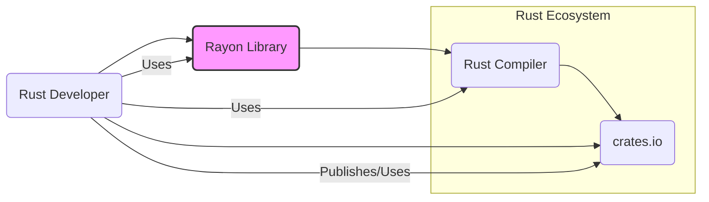
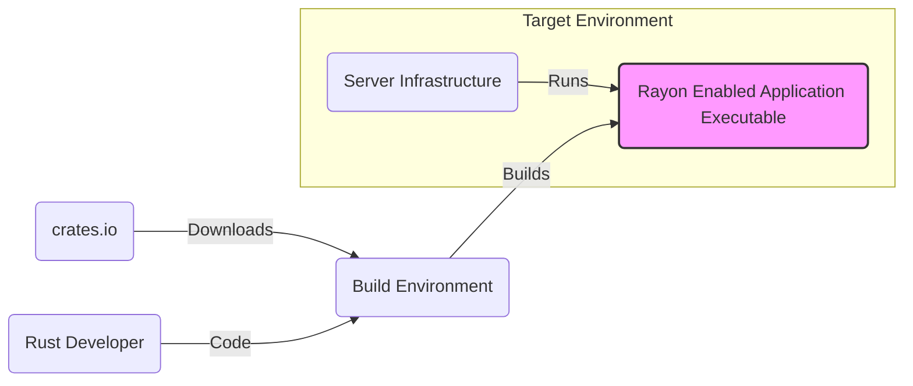

# BUSINESS POSTURE

This project, Rayon, is a data parallelism library for Rust. Its primary business priority is to enhance the Rust ecosystem by providing a robust, efficient, and easy-to-use solution for parallelizing computations. The goal is to empower Rust developers to write high-performance applications that effectively utilize multi-core processors without the complexities typically associated with concurrent programming.

Key business goals include:
- Improving the performance of Rust applications by enabling data parallelism.
- Increasing developer productivity by simplifying parallel programming in Rust.
- Contributing to the growth and adoption of the Rust programming language.
- Maintaining a high-quality, stable, and reliable library.

The most important business risks that need to be addressed are:
- Risk of introducing bugs that could lead to incorrect results or crashes in applications using Rayon.
- Risk of performance regressions in new versions of Rayon, negatively impacting user applications.
- Risk of security vulnerabilities within Rayon that could be exploited by malicious actors through user applications.
- Risk of compatibility issues with different Rust versions or other libraries in the Rust ecosystem.
- Risk of insufficient documentation or examples hindering adoption and proper usage.

# SECURITY POSTURE

Existing security controls for the Rayon project are primarily inherent to the Rust language and standard open-source development practices.

- security control: Memory safety provided by the Rust language. Rust's ownership and borrowing system prevents many common memory-related vulnerabilities such as buffer overflows and use-after-free errors. Implemented by Rust Compiler.
- security control: Type safety provided by the Rust language. Rust's strong type system helps prevent type-related errors that can lead to vulnerabilities. Implemented by Rust Compiler.
- security control: Standard code review practices within the open-source community. Contributions are reviewed by maintainers before being merged. Implemented via GitHub Pull Requests.
- security control: Automated testing. The project includes unit and integration tests to ensure the correctness and stability of the library. Implemented via GitHub Actions.
- accepted risk: Potential for logical errors in complex parallel algorithms that are not caught by standard testing.
- accepted risk: Reliance on the security of the Rust compiler and standard library.
- accepted risk: Vulnerabilities in dependencies, although Rayon has minimal dependencies.

Recommended security controls to implement:
- recommended security control: Fuzz testing, specifically targeting parallel execution paths and potential race conditions.
- recommended security control: Static analysis tools to identify potential code quality issues and security vulnerabilities.
- recommended security control: Dependency scanning to monitor for vulnerabilities in any external dependencies (though currently minimal).
- recommended security control: Secure development lifecycle practices documentation, outlining security considerations in design, development, and testing.

Security requirements for the Rayon project:

- Authentication: Not applicable. Rayon is a library and does not handle user authentication.
- Authorization: Not applicable. Rayon is a library and does not handle user authorization.
- Input Validation: While Rayon itself doesn't directly handle external user input, its APIs should be designed to prevent misuse that could lead to undefined behavior or panics. Input validation is relevant at the API boundaries of the library, ensuring that function arguments are within expected ranges and types.
- Cryptography: Not applicable. Rayon is a data parallelism library and does not require cryptographic functionality. However, if future features require cryptography, standard secure cryptographic practices and libraries should be used.

# DESIGN

## C4 CONTEXT



### Context Diagram Elements

- Name: Rust Developer
  - Type: Person
  - Description: Software developers who use the Rust programming language to build applications. They are the primary users of the Rayon library.
  - Responsibilities: Develop Rust applications, utilize libraries like Rayon to improve performance, publish and consume Rust packages on crates.io.
  - Security controls: Responsible for secure coding practices in their applications, including proper use of libraries and handling of data.

- Name: Rayon Library
  - Type: Software System
  - Description: A Rust library that provides data parallelism functionalities, allowing developers to easily parallelize computations in their Rust applications.
  - Responsibilities: Provide efficient and safe data parallelism primitives, be easy to integrate into Rust projects, maintain compatibility with different Rust versions.
  - Security controls: Memory safety through Rust language features, input validation at API boundaries, automated testing, code review.

- Name: Rust Compiler (rustc)
  - Type: Software System
  - Description: The official compiler for the Rust programming language. It compiles Rust code, including code that uses the Rayon library, into executable binaries.
  - Responsibilities: Compile Rust code, enforce Rust's safety and security features, manage dependencies.
  - Security controls: Implements Rust's memory safety and type safety features, undergoes its own security development and testing processes.

- Name: crates.io
  - Type: Software System
  - Description: The official package registry for Rust packages (crates). Rayon library is published and distributed through crates.io. Rust developers download and use Rayon from crates.io.
  - Responsibilities: Host and distribute Rust packages, manage package versions and dependencies, provide a platform for discovering and downloading Rust libraries.
  - Security controls: Package integrity checks, malware scanning, user authentication and authorization for publishing packages, secure infrastructure.

## C4 CONTAINER

```mermaid
flowchart LR
    subgraph Rust Application
        rayon_lib("Rayon Library Container")
    end

    rust_dev("Rust Developer") --> Rust Application
    Rust Application --> rustc("Rust Compiler")
    rustc --> cratesio("crates.io")
    rayon_lib -- Uses --> Rust Standard Library

    style rayon_lib fill:#f9f,stroke:#333,stroke-width:2px
```

### Container Diagram Elements

- Name: Rayon Library Container
  - Type: Library Container
  - Description: Represents the Rayon library itself, which is a collection of Rust modules and code that provides data parallelism functionalities. It is packaged as a Rust crate and distributed via crates.io.
  - Responsibilities: Implement data parallelism algorithms and abstractions, provide a public API for Rust developers to use, manage internal concurrency and synchronization.
  - Security controls: Memory safety through Rust language features, input validation at API boundaries, automated testing, code review, fuzz testing, static analysis.

- Name: Rust Standard Library
  - Type: Library Container
  - Description: The standard library for the Rust programming language, providing essential functionalities used by Rayon and Rust applications.
  - Responsibilities: Provide core functionalities like memory management, I/O, data structures, and concurrency primitives.
  - Security controls: Memory safety, type safety, rigorous testing and security reviews by the Rust team.

- Name: Rust Compiler (rustc)
  - Type: Tool
  - Description: The Rust compiler used to compile the Rust Application and the Rayon Library Container.
  - Responsibilities: Compile Rust code into machine code, perform static analysis and checks, link libraries.
  - Security controls: Enforces Rust's security features, undergoes security testing and development practices.

- Name: crates.io
  - Type: Registry
  - Description: The Rust package registry where the Rayon Library Container is published and from where Rust Developers download it.
  - Responsibilities: Host and distribute Rust crates, ensure package integrity, manage versions.
  - Security controls: Package signing, malware scanning, access control for publishing.

- Name: Rust Application
  - Type: Software System
  - Description: The application being developed by the Rust Developer that utilizes the Rayon Library Container to achieve data parallelism.
  - Responsibilities: Implement application logic, utilize Rayon API for parallelism, handle application-specific security concerns.
  - Security controls: Application-specific security controls implemented by the Rust Developer, leveraging Rayon securely.

- Name: Rust Developer
  - Type: Person
  - Description: The developer who builds the Rust Application and uses the Rayon Library Container.
  - Responsibilities: Develop secure and functional Rust applications, properly utilize libraries like Rayon, follow secure coding practices.
  - Security controls: Secure development practices, code review, testing of their applications.

## DEPLOYMENT

Rayon library itself is not "deployed" in the traditional sense of a running service. It is published to crates.io and then included as a dependency in Rust applications. The deployment context is therefore focused on how Rust applications that *use* Rayon are deployed.

Assuming a common deployment scenario for a Rust application (e.g., a command-line tool or a server application):

Deployment Architecture: Standalone Executable Deployment



### Deployment Diagram Elements

- Name: Rayon Enabled Application Executable
  - Type: Executable Artifact
  - Description: The compiled Rust application that includes and utilizes the Rayon library. This is the final deployable artifact.
  - Responsibilities: Execute the application logic, perform parallel computations using Rayon, interact with the operating system and environment.
  - Security controls: Security controls of the underlying operating system and server infrastructure, application-level security controls implemented by the developer, security features of the Rust runtime.

- Name: Server Infrastructure
  - Type: Infrastructure
  - Description: The physical or virtual server environment where the Rayon enabled application executable is deployed and run.
  - Responsibilities: Provide computing resources (CPU, memory, storage), network connectivity, operating system environment for the application.
  - Security controls: Operating system hardening, network security controls (firewalls, intrusion detection), physical security of the server, access control to the server.

- Name: Build Environment
  - Type: Environment
  - Description: The environment where the Rust application and Rayon library are compiled and linked to create the executable. This could be a developer's machine, a CI/CD pipeline, or a dedicated build server.
  - Responsibilities: Compile Rust code, download dependencies from crates.io, link libraries, create the executable artifact.
  - Security controls: Secure build pipelines, dependency vulnerability scanning, access control to the build environment, secure storage of build artifacts.

- Name: crates.io
  - Type: Package Registry
  - Description: The Rust package registry from which the Rayon library and other dependencies are downloaded during the build process.
  - Responsibilities: Host and distribute Rust crates, ensure package integrity.
  - Security controls: Package signing, malware scanning, access control for publishing.

- Name: Rust Developer
  - Type: Person
  - Description: The developer who writes the Rust code and initiates the build process.
  - Responsibilities: Write secure code, manage dependencies, configure the build process, deploy the application.
  - Security controls: Secure development practices, secure handling of credentials and deployment keys.

## BUILD

The build process for a Rust project using Rayon typically involves using the `cargo` build tool. A secure build process is crucial for ensuring the integrity and security of the final executable.

```mermaid
flowchart LR
    developer("Rust Developer") --> source_code_repo("Source Code Repository (e.g., GitHub)")
    source_code_repo --> ci_system("CI System (e.g., GitHub Actions)")
    ci_system -- cargo build --> build_artifacts("Build Artifacts")
    build_artifacts --> package_registry("Package Registry (crates.io)")

    subgraph CI System Steps
        git_checkout("Git Checkout")
        dependency_download("Dependency Download (crates.io)")
        security_checks("Security Checks (SAST, Dependency Scan, Linters)")
        cargo_build_step("cargo build")
        test_execution("Test Execution")
        build_artifact_upload("Build Artifact Upload")
    end
    ci_system --> git_checkout
    git_checkout --> dependency_download
    dependency_download --> security_checks
    security_checks --> cargo_build_step
    cargo_build_step --> test_execution
    test_execution --> build_artifact_upload
    build_artifact_upload --> build_artifacts

    style build_artifacts fill:#f9f,stroke:#333,stroke-width:2px
```



### Build Diagram Elements

- Name: Rust Developer
  - Type: Person
  - Description: The developer who writes and commits the code to the source code repository.
  - Responsibilities: Write code, commit changes, initiate build process through code pushes.
  - Security controls: Secure coding practices, secure access to source code repository.

- Name: Source Code Repository (e.g., GitHub)
  - Type: Code Repository
  - Description: A version control system (like Git hosted on GitHub) that stores the source code of the Rayon library or application.
  - Responsibilities: Store and manage source code, track changes, provide access control.
  - Security controls: Access control (authentication and authorization), audit logging, branch protection, vulnerability scanning of repository infrastructure.

- Name: CI System (e.g., GitHub Actions)
  - Type: Automation System
  - Description: A Continuous Integration system that automates the build, test, and potentially deployment process when code changes are pushed to the repository.
  - Responsibilities: Automate build process, run tests, perform security checks, create build artifacts, potentially deploy artifacts.
  - Security controls: Secure configuration of CI pipelines, secret management for credentials, isolation of build environments, audit logging of build activities.

- Name: Build Artifacts
  - Type: File System/Storage
  - Description: The output of the build process, which includes compiled binaries, libraries, and other necessary files for deployment.
  - Responsibilities: Store build artifacts, make them available for deployment or distribution.
  - Security controls: Access control to build artifacts storage, integrity checks of artifacts, secure transfer of artifacts.

- Name: Package Registry (crates.io)
  - Type: Package Repository
  - Description: In the context of Rayon library build, crates.io is used to download dependencies. If building a Rust application that uses Rayon and is being published, it would also be the destination for publishing the application package.
  - Responsibilities: Host and distribute Rust packages, ensure package integrity.
  - Security controls: Package signing, malware scanning, access control for publishing.

- Name: Git Checkout
  - Type: CI Step
  - Description: The CI system checks out the latest code from the source code repository.
  - Responsibilities: Retrieve the correct version of the source code.
  - Security controls: Secure connection to the source code repository, integrity checks of checked out code.

- Name: Dependency Download (crates.io)
  - Type: CI Step
  - Description: The CI system downloads necessary dependencies (including Rayon if building an application using Rayon) from crates.io or other configured registries.
  - Responsibilities: Download required dependencies, manage dependency versions.
  - Security controls: Verification of downloaded dependencies (checksums, signatures), secure connection to package registries.

- Name: Security Checks (SAST, Dependency Scan, Linters)
  - Type: CI Step
  - Description: Automated security checks are performed, including Static Application Security Testing (SAST), dependency vulnerability scanning, and code linters.
  - Responsibilities: Identify potential security vulnerabilities and code quality issues early in the development process.
  - Security controls: Configuration and maintenance of security scanning tools, review and remediation of identified issues.

- Name: cargo build Step
  - Type: CI Step
  - Description: The core build step using the `cargo build` command to compile the Rust code.
  - Responsibilities: Compile Rust code, link libraries, create executable binaries or libraries.
  - Security controls: Secure build environment, use of trusted build tools (Rust compiler, cargo).

- Name: Test Execution
  - Type: CI Step
  - Description: Automated tests (unit tests, integration tests) are executed to verify the functionality and stability of the code.
  - Responsibilities: Ensure code correctness, detect regressions.
  - Security controls: Secure test environment, comprehensive test suite.

- Name: Build Artifact Upload
  - Type: CI Step
  - Description: The CI system uploads the generated build artifacts to a designated storage location or package registry.
  - Responsibilities: Store and distribute build artifacts.
  - Security controls: Secure transfer of artifacts, access control to artifact storage.

# RISK ASSESSMENT

Critical business processes we are trying to protect:
- Rust developer productivity and efficiency in writing parallel applications.
- Performance and reliability of Rust applications that utilize Rayon.
- The reputation and trustworthiness of the Rayon library and the Rust ecosystem.

Data we are trying to protect and their sensitivity:
- Rayon source code: Publicly available on GitHub, but integrity and availability are important. Sensitivity: Public.
- Rayon crate on crates.io: Publicly available, but integrity and availability are crucial for users. Sensitivity: Public.
- Build artifacts: Intermediate and final build outputs. Integrity is important to ensure no malicious modifications. Sensitivity: Public (final artifacts), Internal (intermediate artifacts).
- Developer credentials and CI/CD secrets: Used for publishing and managing the project. Confidentiality is critical. Sensitivity: Highly Confidential.

# QUESTIONS & ASSUMPTIONS

Questions:
- What is the intended deployment environment for applications using Rayon? (Assumed standalone executable for example purposes).
- Are there specific regulatory compliance requirements for applications using Rayon? (Assumed general security best practices are sufficient for this design document).
- What is the risk appetite of the organization or community behind Rayon? (Assumed a moderate risk appetite, prioritizing both functionality and security).

Assumptions:
- BUSINESS POSTURE: The primary goal is to provide a valuable and secure library for the Rust ecosystem.
- SECURITY POSTURE: Standard Rust security practices are followed. Open-source development model with community review is in place. crates.io is the primary distribution channel.
- DESIGN: Rayon is primarily a library container. Deployment context focuses on applications using Rayon as standalone executables. Build process is automated using CI/CD.