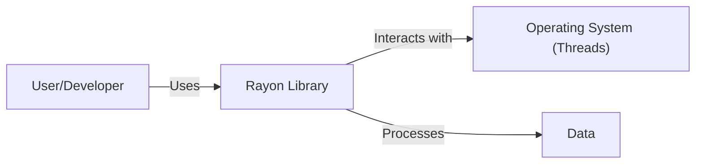
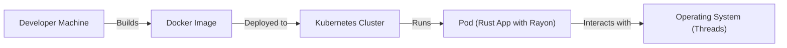
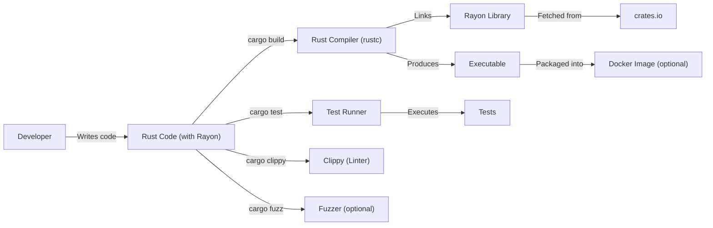

# BUSINESS POSTURE

Rayon is a data parallelism library for Rust. It allows developers to easily parallelize computations by splitting data into smaller chunks and processing them in parallel. This is particularly useful for CPU-bound tasks. The primary business goal is to improve the performance of Rust applications by making it easy to leverage multi-core processors.

Business priorities:

- Performance: Maximize CPU utilization and minimize execution time for parallelizable tasks.
- Ease of Use: Provide a simple and intuitive API for developers to parallelize their code.
- Correctness: Ensure that parallel computations produce the same results as their sequential counterparts.
- Portability: Support a wide range of platforms where Rust is supported.
- Maintainability: Keep the codebase clean, well-documented, and easy to maintain.

Business risks:

- Performance regressions: Changes to the library could inadvertently reduce performance.
- Data races and deadlocks: Incorrect use of the library or bugs in the library itself could lead to concurrency issues.
- Platform-specific bugs: The library might behave differently or have bugs on specific platforms.
- API instability: Changes to the API could break existing code that uses the library.
- Security vulnerabilities: While performance is the primary focus, security vulnerabilities in the library could be exploited. This is especially relevant if Rayon is used in security-sensitive contexts.

# SECURITY POSTURE

Existing security controls:

- security control: Code reviews: All changes to the codebase go through a code review process. (Implicit in the open-source nature of the project and standard GitHub practices).
- security control: Testing: The project has a comprehensive test suite, including unit tests and integration tests. (Visible in the repository's test directory).
- security control: Fuzzing: The project uses fuzzing to test for potential bugs and vulnerabilities. (Mentioned in the repository's documentation).
- security control: Static analysis: The project uses static analysis tools like Clippy to identify potential code quality and security issues. (Implicit in the Rust ecosystem and likely used).
- security control: Unsafe code audit: The project carefully audits unsafe code blocks. (Mentioned in the repository's documentation).

Accepted risks:

- accepted risk: Performance trade-offs: Security measures might introduce performance overhead, which may be acceptable in some cases to achieve the desired level of security.
- accepted risk: Complexity: Parallel programming is inherently complex, and there is always a risk of introducing subtle concurrency bugs.

Recommended security controls:

- security control: Regularly update dependencies: Keep dependencies up-to-date to mitigate known vulnerabilities in third-party libraries.
- security control: Dynamic analysis: Consider using dynamic analysis tools (e.g., valgrind, helgrind) to detect memory errors and data races at runtime.
- security control: Security audits: Conduct periodic security audits to identify potential vulnerabilities.

Security requirements:

- Authentication: Not directly applicable to Rayon, as it is a library, not a service or application that requires authentication.
- Authorization: Not directly applicable to Rayon.
- Input validation: Rayon itself doesn't directly handle user input. However, applications using Rayon should validate any input they process, especially if that input influences how data is split or processed in parallel.
- Cryptography: Not directly applicable to Rayon, unless it's used to parallelize cryptographic operations. In such cases, standard cryptographic best practices should be followed within the application code using Rayon.

# DESIGN

## C4 CONTEXT

Element descriptions:

- User/Developer:
  - Name: User/Developer
  - Type: Person
  - Description: A Rust developer who uses the Rayon library in their application.
  - Responsibilities: Writes code that utilizes Rayon's parallel iterators and other functionalities.
  - Security controls: Follows secure coding practices in their application code.

- Rayon Library:
  - Name: Rayon Library
  - Type: Software System
  - Description: The Rayon data parallelism library for Rust.
  - Responsibilities: Provides APIs for parallelizing computations, manages worker threads, and schedules tasks.
  - Security controls: Code reviews, testing, fuzzing, static analysis, unsafe code audit.

- Operating System (Threads):
  - Name: Operating System (Threads)
  - Type: Software System
  - Description: The underlying operating system's thread management capabilities.
  - Responsibilities: Provides the fundamental threading primitives used by Rayon.
  - Security controls: Relies on the OS's security mechanisms for thread isolation and management.

- Data:
    - Name: Data
    - Type: Data
    - Description: The data that is processed by the application using Rayon.
    - Responsibilities: N/A
    - Security controls: Data should be validated and sanitized by application using Rayon.

## C4 CONTAINER

Since Rayon is a library, the container diagram is essentially the same as the context diagram. It doesn't have separate deployable units in the traditional sense.

Element descriptions are the same as in the C4 CONTEXT section.

## DEPLOYMENT

Rayon is a library, so "deployment" in the traditional sense doesn't apply. Instead, it's integrated into other Rust applications as a dependency. The application using Rayon is then deployed. Here are a few common deployment scenarios for Rust applications:

1.  Standalone executable: The Rust application (which includes Rayon as a linked library) is compiled into a single executable file. This executable can be deployed to any compatible system.
2.  Serverless function: The Rust application can be deployed as a serverless function (e.g., AWS Lambda, Azure Functions, Google Cloud Functions).
3.  Containerized application: The Rust application can be packaged into a Docker container and deployed to a container orchestration platform (e.g., Kubernetes, Docker Swarm).
4.  WebAssembly: The Rust application can be compiled to WebAssembly and deployed to a web browser or other WebAssembly runtime.

Let's pick option 3, Containerized application, and describe it in detail:

Element descriptions:

- Developer Machine:
  - Name: Developer Machine
  - Type: Infrastructure
  - Description: The machine where the Rust application is developed and built.
  - Responsibilities: Compiling the code, running tests, building the Docker image.
  - Security controls: Standard development environment security practices.

- Docker Image:
  - Name: Docker Image
  - Type: Container Image
  - Description: A packaged version of the Rust application, including all its dependencies (including Rayon).
  - Responsibilities: Provides a consistent and isolated environment for the application.
  - Security controls: Use minimal base images, scan for vulnerabilities, follow best practices for Docker image security.

- Kubernetes Cluster:
  - Name: Kubernetes Cluster
  - Type: Infrastructure
  - Description: A cluster of machines managed by Kubernetes.
  - Responsibilities: Orchestrates the deployment and scaling of the application.
  - Security controls: Network policies, RBAC, pod security policies, regular security audits.

- Pod (Rust App with Rayon):
  - Name: Pod (Rust App with Rayon)
  - Type: Container
  - Description: A running instance of the Docker image within the Kubernetes cluster.
  - Responsibilities: Executes the Rust application logic, utilizing Rayon for parallel processing.
  - Security controls: Resource limits, security context, network policies.

- Operating System (Threads):
    - Name: Operating System (Threads)
    - Type: Software System
    - Description: The underlying operating system's thread management capabilities.
    - Responsibilities: Provides the fundamental threading primitives used by Rayon.
    - Security controls: Relies on the OS's security mechanisms for thread isolation and management.

## BUILD

The build process for a Rust application that uses Rayon typically involves the following steps:

1.  Developer writes code: The developer writes the Rust code, including the use of Rayon's parallel iterators.
2.  Cargo build: The developer uses the `cargo build` command to compile the code. This command automatically fetches and builds all dependencies, including Rayon.
3.  Testing: The developer runs tests using `cargo test`. This executes the test suite, which should include tests for the parallelized code.
4.  Static analysis: The developer may use tools like Clippy (`cargo clippy`) to perform static analysis and identify potential issues.
5.  Fuzzing (optional): The developer may use fuzzing tools like `cargo fuzz` to test for unexpected behavior.
6.  Docker image build (optional): If the application is to be deployed as a Docker container, the developer builds a Docker image using a Dockerfile. This typically involves copying the compiled executable into the image.
7.  Image publishing (optional): The Docker image is pushed to a container registry (e.g., Docker Hub, Amazon ECR).

Security controls in the build process:

- security control: Dependency management: Cargo (Rust's package manager) uses a `Cargo.lock` file to ensure reproducible builds and prevent unexpected changes in dependencies.
- security control: Static analysis: Clippy helps identify potential code quality and security issues.
- security control: Fuzzing: Fuzzing can help discover vulnerabilities that might be missed by traditional testing.
- security control: Supply chain security: Use trusted sources for dependencies (e.g., crates.io). Consider using tools to audit dependencies for known vulnerabilities.
- security control: Build environment security: Ensure the build environment is secure and free from malware.

# RISK ASSESSMENT

Critical business processes we are trying to protect:

- Efficient and correct parallel computation: The core functionality of Rayon is to provide fast and reliable parallel processing. Any disruption to this would be a critical failure.

Data we are trying to protect and their sensitivity:

- Rayon itself doesn't directly handle or store sensitive data. It operates on data provided by the application that uses it. The sensitivity of the data depends entirely on the application. If the application processes sensitive data (e.g., PII, financial data, etc.), then that data needs to be protected by the application, regardless of whether Rayon is used. Rayon's role is to process data, not to store or manage it. Therefore, the data sensitivity is determined by the application using Rayon, not by Rayon itself.

# QUESTIONS & ASSUMPTIONS

Questions:

- Are there any specific compliance requirements (e.g., PCI DSS, HIPAA) that the applications using Rayon need to adhere to? This would influence the security controls needed in those applications.
- What is the expected threat model for applications using Rayon? Are they exposed to untrusted input, or are they primarily used in trusted environments?
- What level of performance overhead is acceptable for security measures?

Assumptions:

- BUSINESS POSTURE: The primary goal is performance, but correctness and reliability are also crucial. Security is important, but it's secondary to performance.
- SECURITY POSTURE: The existing security controls (code reviews, testing, fuzzing, static analysis) are in place and effective. The development team is responsive to security issues.
- DESIGN: The library is used correctly by applications, and any input validation or data sanitization is handled by the application code, not by Rayon itself. The underlying operating system's threading mechanisms are secure.