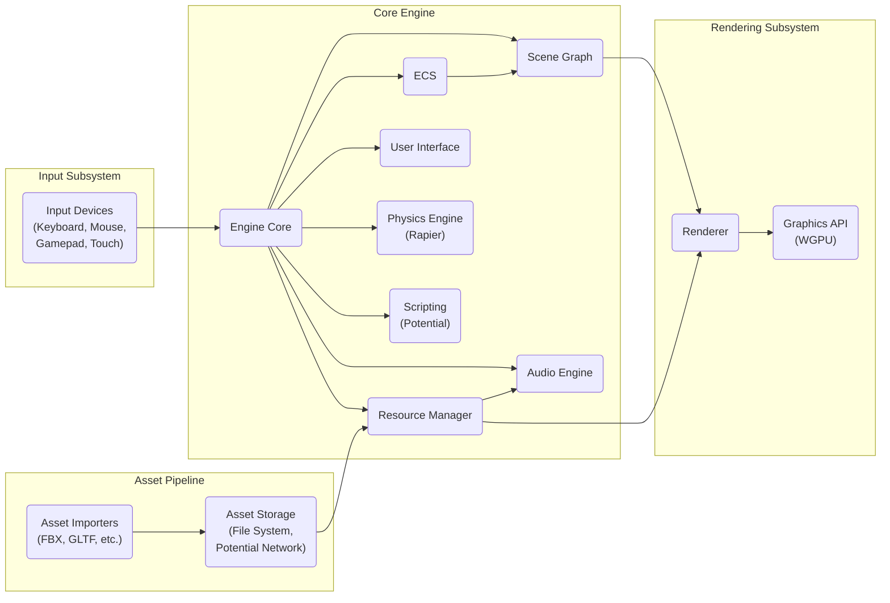
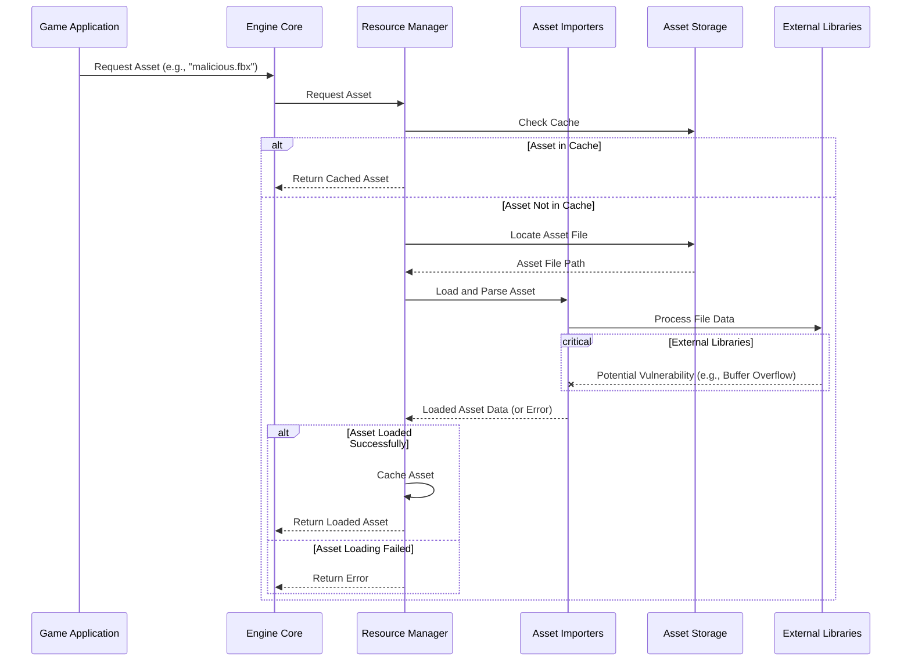

# Project Design Document: rg3d Game Engine

**Version:** 1.1
**Date:** October 26, 2023
**Author:** AI Software Architect

## 1. Introduction

This document provides a detailed architectural design of the rg3d game engine, an open-source, general-purpose 3D game engine written in Rust. This document aims to provide a clear and comprehensive understanding of the engine's structure, key components, and data flow, specifically tailored for subsequent threat modeling activities.

### 1.1. Purpose

The primary purpose of this document is to:

*   Provide a comprehensive description of the rg3d game engine's architecture.
*   Clearly identify key components, their functionalities, and interdependencies.
*   Illustrate the flow of data between these components in various scenarios.
*   Serve as a foundational resource for identifying potential security vulnerabilities, attack surfaces, and threat vectors during threat modeling exercises.

### 1.2. Scope

This document covers the core architectural elements of the rg3d engine, focusing on the major subsystems and their interactions. It delves into details relevant to security considerations, such as data handling, external interfaces, and potential points of failure. Specific implementation details within individual modules are generally outside the scope, unless directly relevant to security.

### 1.3. Target Audience

This document is intended for:

*   Security engineers and architects responsible for performing threat modeling on the rg3d engine.
*   Developers contributing to the rg3d engine who require a detailed understanding of its architecture, particularly concerning security implications.
*   Security researchers interested in analyzing the rg3d engine for potential vulnerabilities.
*   Anyone seeking a deep understanding of the design and potential security aspects of the rg3d game engine.

## 2. Overview

rg3d is a modular, data-driven game engine designed for creating 3D games and interactive applications. Its foundation in Rust emphasizes memory safety and performance. The engine employs an Entity Component System (ECS) architecture for managing game objects and their behaviors, promoting flexibility and maintainability. It encompasses features for rendering, audio processing, input management, scene organization, and asset handling.

### 2.1. Key Features

*   **Entity Component System (ECS):** A central architectural pattern for managing game entities through composable components and systems.
*   **Scene Graph:** A hierarchical structure for organizing and managing game objects within a scene, facilitating efficient spatial queries and transformations.
*   **Rendering Engine:** Responsible for generating the visual output of the game, potentially supporting multiple rendering pipelines and techniques.
*   **Asset Management:** Handles the loading, caching, and management of various game assets, including models, textures, audio files, and scenes.
*   **Input Handling:** Manages user input from diverse devices such as keyboards, mice, gamepads, and touchscreens.
*   **Audio Engine:** Provides capabilities for spatialized audio, sound effects, and music playback.
*   **User Interface (UI) System:** Enables the creation of interactive in-game and editor interfaces.
*   **Scripting (Optional):** May support integration with scripting languages for extending engine functionality and game logic.
*   **Editor (Separate Application):** A visual tool for creating, editing, and managing game scenes and assets.

## 3. Architectural Design

The rg3d engine is designed with a modular architecture, where distinct subsystems interact to provide the overall engine functionality. This modularity aids in maintainability and allows for potential isolation of security concerns.

### 3.1. High-Level Architecture Diagram



### 3.2. Component Descriptions

*   **Input Devices:** Represents the physical hardware used for user interaction.
*   **Input Subsystem:** Responsible for capturing raw input events from various devices, processing them, and making them available to the Engine Core in a standardized format.
*   **Engine Core:** The central orchestrator of the engine, managing the game loop, coordinating subsystems, and providing core functionalities.
*   **Scene Graph:** A hierarchical tree structure that organizes and manages the entities and their spatial relationships within a game scene. It facilitates efficient culling and transformation calculations.
*   **Resource Manager:** Handles the loading, caching, unloading, and management of various game assets. It aims to optimize asset usage and prevent redundant loading.
*   **ECS (Entity Component System):** The core architectural pattern for managing game entities. Entities are simple identifiers, components hold data, and systems define the logic that operates on entities based on their components.
*   **Audio Engine:** Responsible for playing and managing audio sources, applying audio effects, and handling spatialized audio based on listener positions.
*   **User Interface:** Provides the functionality to create and manage graphical user interfaces, handling user interactions with UI elements.
*   **Physics Engine (Rapier):** An optional component (likely using the Rapier physics library) responsible for simulating physical interactions between game objects, such as collisions and rigid body dynamics.
*   **Scripting (Potential):**  A potential subsystem for integrating scripting languages to allow for dynamic game logic and extensibility.
*   **Renderer:** Responsible for drawing the game scene to the screen, utilizing a graphics API. It handles rendering pipelines, material management, and various rendering techniques.
*   **Graphics API (WGPU):** A low-level, cross-platform graphics API (like WGPU) used by the Renderer to communicate with the graphics hardware.
*   **Asset Importers:** Modules responsible for parsing and converting various asset file formats (e.g., FBX, GLTF) into engine-usable data structures.
*   **Asset Storage:** Represents the storage location of game assets, typically the file system but potentially including network locations for remote assets.

### 3.3. Data Flow

The following list describes the typical data flow within the engine during a single game frame, highlighting potential security-relevant pathways:

*   **Input Capture and Processing:**
    *   Raw input events are generated by **Input Devices**.
    *   The **Input Subsystem** captures these events.
    *   The **Input Subsystem** processes and sanitizes these events (important for preventing input injection).
    *   Processed input events are passed to the **Engine Core**.
*   **Game Logic Update:**
    *   The **Engine Core** iterates through active scenes.
    *   For each scene, the **ECS** processes **Systems** that update the state of **Entities** based on input, time, and other factors. This is where game logic and potential vulnerabilities in game code reside.
    *   **Scripting** components (if present) execute their logic, potentially introducing security risks if not properly sandboxed.
    *   The **Physics Engine** performs simulations, updating entity transforms based on physical interactions.
*   **Scene Graph Update:**
    *   Changes in entity transforms and other properties are reflected in the **Scene Graph**.
*   **Rendering Preparation:**
    *   The **Renderer** traverses the **Scene Graph** to determine visible objects.
    *   The **Renderer** requests necessary resources (meshes, textures, materials) from the **Resource Manager**.
*   **Resource Loading (If Needed):**
    *   The **Resource Manager** checks its cache.
    *   If not cached, the **Resource Manager** retrieves assets from **Asset Storage** via **Asset Importers**. This is a critical point for potential malicious asset injection.
*   **Rendering Execution:**
    *   The **Renderer** prepares rendering commands.
    *   The **Renderer** issues draw calls to the **Graphics API**.
    *   The **Graphics API** interacts with the graphics hardware to render the scene.
*   **Audio Processing:**
    *   The **Audio Engine** processes audio sources based on their position and properties in the scene.
    *   The **Audio Engine** retrieves audio data from the **Resource Manager**.
    *   Audio output is sent to the audio hardware.
*   **UI Update:**
    *   The **UI** system updates the state and appearance of UI elements based on game logic and user interaction.
    *   The **Renderer** draws the UI elements.

## 4. Key Components in Detail

This section provides a more detailed examination of critical components from a security perspective, highlighting potential vulnerabilities and attack surfaces.

### 4.1. Resource Manager

*   **Responsibilities:** Loading, caching, and managing game assets. This includes validating asset integrity and potentially handling streamed assets.
*   **Data Sources:** File system, potentially network locations (e.g., for downloading assets), in-memory buffers.
*   **Security Considerations:**
    *   **Malicious Asset Injection:** A primary concern. Crafted assets (models, textures, audio) could exploit vulnerabilities in **Asset Importers** (e.g., buffer overflows, format string bugs) leading to arbitrary code execution.
    *   **Path Traversal Vulnerabilities:** Improper handling of file paths during asset loading could allow attackers to access or overwrite arbitrary files on the system.
    *   **Denial of Service (DoS):** Loading extremely large or complex assets could consume excessive resources, leading to a DoS.
    *   **Dependency Vulnerabilities:** **Asset Importers** often rely on external libraries (e.g., for image decoding). Vulnerabilities in these libraries could be exploited.
    *   **Data Integrity:** Ensuring the integrity of loaded assets is crucial. Tampered assets could lead to unexpected behavior or exploits.

### 4.2. Rendering Engine

*   **Responsibilities:**  Drawing the game scene, managing rendering pipelines, and interacting with the **Graphics API**.
*   **Data Sources:** **Scene Graph**, **Resource Manager** (for meshes, textures, materials), potentially user-provided shaders.
*   **Security Considerations:**
    *   **Shader Vulnerabilities:** If the engine allows custom shaders, malicious shaders could be injected to perform unauthorized computations on the GPU, potentially leading to crashes, information disclosure, or even system compromise in some scenarios.
    *   **Graphics API Vulnerabilities:** The engine relies on the underlying **Graphics API** (WGPU). Vulnerabilities in WGPU or its drivers could be exploited.
    *   **Denial of Service:**  Crafted scene data or rendering commands could overwhelm the rendering pipeline, leading to a DoS. This could involve excessive draw calls, overly complex geometry, or resource exhaustion.
    *   **Information Disclosure:**  Bugs in the rendering pipeline could potentially leak information about the scene or internal engine state.

### 4.3. Input Subsystem

*   **Responsibilities:** Capturing, processing, and dispatching user input events.
*   **Data Sources:** Keyboard, mouse, gamepad, touch screen, and potentially other input devices.
*   **Security Considerations:**
    *   **Input Injection:**  The engine needs to robustly handle unexpected or malicious input sequences to prevent unintended actions or exploits. This is particularly relevant for text input fields or command processing.
    *   **Buffer Overflows:**  Improper handling of input data, especially from less common input devices or through network input (if applicable), could lead to buffer overflows.
    *   **Denial of Service:**  Flooding the engine with excessive input events could potentially lead to a DoS.

### 4.4. Networking (If Applicable)**

*   **Responsibilities:** Handling network communication for multiplayer games or other network features (this is currently less prominent in the core rg3d but is a potential area for expansion).
*   **Data Sources:** Network sockets (TCP, UDP).
*   **Security Considerations:**
    *   **Standard Network Security Risks:** If networking is implemented, the engine becomes susceptible to standard network vulnerabilities like man-in-the-middle attacks, denial-of-service attacks (e.g., SYN floods), and data injection.
    *   **Serialization/Deserialization Vulnerabilities:**  Vulnerabilities in how network data is serialized and deserialized could allow attackers to inject malicious data or execute arbitrary code.
    *   **Authentication and Authorization:**  Proper mechanisms are needed to authenticate clients and authorize their actions to prevent unauthorized access and cheating.
    *   **Protocol Vulnerabilities:**  Flaws in the design or implementation of the network protocol could be exploited.

### 4.5. Scripting (If Applicable)**

*   **Responsibilities:** Executing scripts to extend engine functionality and game logic.
*   **Data Sources:** Script files, potentially network sources for dynamically loaded scripts.
*   **Security Considerations:**
    *   **Arbitrary Code Execution:**  If scripting is supported without proper sandboxing, vulnerabilities in the scripting engine or the way scripts are handled could allow attackers to execute arbitrary code on the host system.
    *   **Sandbox Escapes:**  Even with sandboxing, vulnerabilities in the sandbox implementation could allow malicious scripts to escape the sandbox and gain access to restricted resources.
    *   **Resource Exhaustion:**  Malicious scripts could be designed to consume excessive resources (CPU, memory), leading to a DoS.

## 5. Data Flow Diagrams

This section provides more detailed data flow diagrams for specific scenarios, emphasizing security-relevant aspects.

### 5.1. Asset Loading Data Flow (Detailed)



### 5.2. Rendering Data Flow (Detailed with Shader Handling)

```mermaid
sequenceDiagram
    participant Engine Core
    participant Scene Graph
    participant Renderer
    participant Resource Manager
    participant Graphics API
    participant Shader Compiler

    Engine Core->>Scene Graph: Traverse Scene
    Scene Graph->>Renderer: Provide Visible Entities and Components
    Renderer->>Resource Manager: Request Mesh Data
    Resource Manager-->>Renderer: Mesh Data
    Renderer->>Resource Manager: Request Texture Data
    Resource Manager-->>Renderer: Texture Data
    Renderer->>Resource Manager: Request Material Data (including Shaders)
    Resource Manager-->>Renderer: Material Data
    alt Custom Shader Present
        Renderer->>Shader Compiler: Compile Shader Code
        critical Shader Compiler
            Shader Compiler--xRenderer: Potential Vulnerability (e.g., Malicious Code)
        end
        Shader Compiler-->>Renderer: Compiled Shader
    end
    Renderer->>Graphics API: Issue Draw Calls (with Shader)
    Graphics API-->>: Rendered Frame to Screen
```

## 6. Security Considerations (Detailed)

Based on the architectural design, more specific security considerations include:

*   **Robust Input Validation and Sanitization:** Implement rigorous input validation and sanitization at the **Input Subsystem** level to prevent injection attacks (e.g., command injection, cross-site scripting if UI uses web technologies) and buffer overflows.
*   **Secure Asset Handling:**
    *   **Input Validation:** Thoroughly validate asset file headers and data structures before parsing.
    *   **Sandboxing:** Consider sandboxing **Asset Importers** to limit the impact of potential vulnerabilities.
    *   **Memory Safety:** Leverage Rust's memory safety features to prevent common memory-related vulnerabilities in asset loading code.
    *   **Regular Updates:** Keep external libraries used by **Asset Importers** up-to-date to patch known vulnerabilities.
*   **Shader Security:** If custom shaders are supported, implement mechanisms to validate and sanitize shader code to prevent malicious code execution on the GPU. Consider using a shader language with built-in safety features or a robust compilation process.
*   **Graphics API Security:** Stay informed about potential vulnerabilities in the chosen **Graphics API** (WGPU) and its drivers. Encourage users to keep their drivers updated.
*   **Network Security Best Practices:** If networking is implemented, adhere to standard network security best practices, including encryption (TLS/SSL), authentication, authorization, and input validation for network data.
*   **Scripting Environment Security:** If scripting is supported, implement a secure sandboxing environment with limited access to engine resources and the underlying operating system. Regularly audit the scripting engine for vulnerabilities.
*   **Error Handling and Logging:** Implement comprehensive error handling and logging to detect and respond to potential security incidents. Avoid exposing sensitive information in error messages.
*   **Principle of Least Privilege:** Design components with the principle of least privilege, granting them only the necessary permissions and access to resources.
*   **Regular Security Audits:** Conduct regular security audits and penetration testing to identify and address potential vulnerabilities.

## 7. Future Considerations

As the rg3d engine evolves, new features and functionalities might introduce new security challenges. Some potential future considerations include:

*   **Plugin System:** If a plugin system is introduced, implement strict security measures for plugin development and distribution to prevent malicious plugins from compromising the engine or user systems. This includes code signing and sandboxing.
*   **WebAssembly Support:** If the engine targets WebAssembly, carefully consider the security implications of running within a web browser environment, including browser security policies and potential vulnerabilities in the WebAssembly runtime.
*   **Advanced Networking Features:** Adding more complex networking features (e.g., peer-to-peer communication, real-time data synchronization) will require careful attention to network security and potential attack vectors.
*   **Integration with External Services:** If the engine integrates with external services (e.g., analytics, cloud storage), ensure secure communication and authentication mechanisms are in place.

## 8. Conclusion

This document provides a detailed architectural design of the rg3d game engine, specifically focusing on aspects relevant to security. It outlines the key components, their interactions, and potential security considerations. This document serves as a crucial foundation for conducting thorough threat modeling activities, enabling the identification and mitigation of potential vulnerabilities to enhance the overall security and robustness of the rg3d engine.